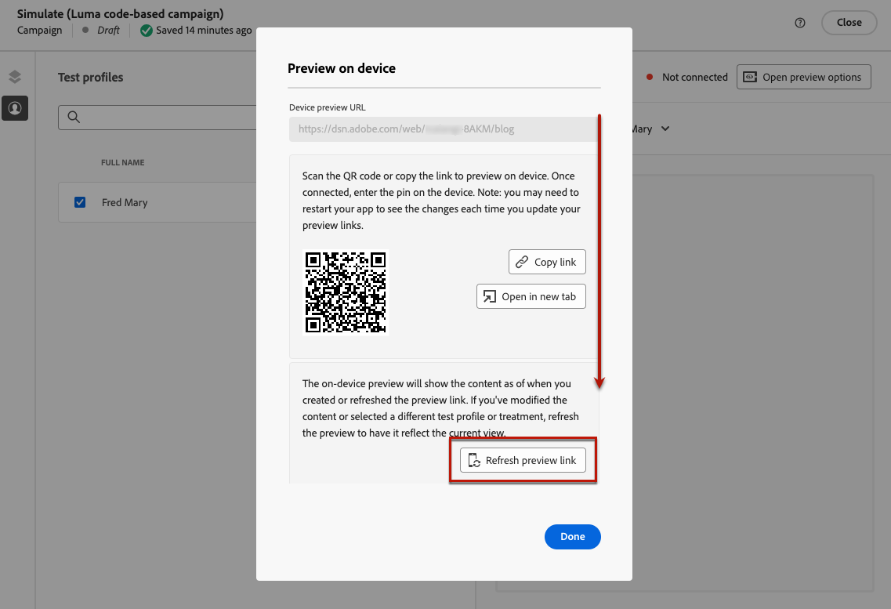

# 코드 기반 경험 테스트 {#test-code-based}

## 코드 기반 경험 미리보기 {#preview-code-based}

>[!CONTEXTUALHELP]
>id="ajo_code_based_preview"
>title="코드 기반 경험 미리보기"
>abstract="코드 기반 경험이 어떻게 시각화되는지 시뮬레이션을 수행합니다."

수정된 코드 기반 경험의 미리보기를 표시하려면 아래 단계를 따르십시오.

>[!CAUTION]
>
>게재할 오퍼를 시뮬레이션할 수 있는 테스트 프로필이 있어야 합니다. [테스트 프로필을 만드는](../audience/creating-test-profiles.md) 방법을 알아봅니다.

1. 여정 또는 캠페인의 개인화 편집기 또는 콘텐츠 편집 화면에서 **[!UICONTROL 콘텐츠 시뮬레이션]**&#x200B;을 선택합니다.

   

1. 하나 이상의 테스트 프로필을 선택하려면 **[!UICONTROL 테스트 프로필 관리]**&#x200B;를 클릭하십시오.

1. 수정된 코드 기반 경험의 미리보기가 표시됩니다.

테스트 프로필을 선택하고 콘텐츠를 미리 보는 방법에 대한 자세한 정보는 [이 섹션](../content-management/preview.md)에서 확인할 수 있습니다.

>[!NOTE]
>
>현재 [Decisioning](../experience-decisioning/gs-experience-decisioning.md)을(를) 사용하여 코드 기반 경험 캠페인이나 여정에서 사용자 인터페이스의 콘텐츠를 시뮬레이션할 수 없습니다. [이 섹션](../experience-decisioning/create-decision.md#test-and-publish)에서 해결 방법을 사용할 수 있습니다.

## 디바이스에서 미리보기 {#preview-on-device}

>[!CONTEXTUALHELP]
>id="ajo_code_based_preview_device"
>title="실제 디바이스에서 코드 기반 경험 미리보기"
>abstract="브라우저나 모바일 디바이스에서 개인화된 경험을 미리 보고 실제 디바이스에서 어떻게 보이는지 확인합니다."

>[!CONTEXTUALHELP]
>id="ajo_code_based_preview_device_web"
>title="디바이스에서 코드 기반 웹 경험 미리보기"
>abstract="QR 코드를 스캔하거나 링크를 복사하여 디바이스에서 미리 보세요."

>[!CONTEXTUALHELP]
>id="ajo_code_based_preview_device_mobile"
>title="디바이스에서 코드 기반 모바일 경험 미리보기"
>abstract="QR 코드를 스캔하거나 링크를 복사하여 디바이스에서 미리 보세요. 디바이스에 연결되면 PIN을 입력하세요. 미리보기 링크를 업데이트할 때마다 변경 사항을 확인하려면 앱을 다시 시작해야 할 수 있습니다."

>[!CONTEXTUALHELP]
>id="ajo_code_based_preview_device_refresh"
>title="현재 보기를 반영하도록 미리보기 링크 새로 고침"
>abstract="디바이스 미리보기에는 미리보기 링크를 만들거나 새로 고친 시점의 콘텐츠가 표시됩니다. 콘텐츠를 수정하거나 다른 테스트 프로필 또는 처리를 선택한 경우 미리보기를 새로 고쳐 현재 보기에 반영되도록 하십시오."

웹 페이지 또는 모바일 앱에 대한 코드 기반 경험을 작성할 때 브라우저 또는 모바일 디바이스에서 개인화된 경험을 바로 미리 보고 이러한 경험이 실제 디바이스에서 어떻게 표시되는지 확인할 수 있습니다.

>[!WARNING]
>
>[의사 결정 정책](../experience-decisioning/create-decision.md) 또는 [개인화](../personalization/personalization-build-expressions.md) 컨텍스트 특성을 사용할 때는 장치에서 미리 보기를 사용할 수 없습니다.

1. **[!UICONTROL 시뮬레이션]** 화면에서 **[!UICONTROL 미리 보기 옵션 열기]** 단추를 클릭합니다. 미리 보기 옵션은 [코드 기반 구성](code-based-configuration.md#create-code-based-configuration)에서 선택한 플랫폼에 따라 다릅니다.

1. 코드 기반 구성에서 [웹 플랫폼](code-based-configuration.md#web)을 사용하는 경우 **[!UICONTROL 장치 미리 보기 URL]** 읽기 전용 필드가 현재 채널 구성에 대해 입력한 URL로 미리 채워집니다.

   

   다음 중 하나를 수행할 수 있습니다.

   * **[!UICONTROL 링크 복사]** 단추를 선택하고 링크를 브라우저 탭에 붙여 넣습니다. 또한 팀 및 이해 당사자와 링크를 공유할 수 있으며, 변경 사항이 적용되기 전에 모든 브라우저에서 새 경험을 미리 볼 수 있습니다.

   * **[!UICONTROL 새 탭에서 열기]**&#x200B;를 클릭하여 현재 브라우저에서 링크를 엽니다.

   * 모바일 장치로 QR 코드를 스캔하여 모바일 브라우저에서 미리 보기 링크를 엽니다.

1. 코드 기반 구성에서 [모바일 플랫폼](code-based-configuration.md#mobile)(iOS/Android)을 사용하는 경우 **[!UICONTROL 딥링크]** 읽기 전용 필드가 선택한 플랫폼에 대한 채널 구성에 입력한 **[!UICONTROL 미리 보기 URL]** 값으로 미리 채워집니다.

   **[!UICONTROL iOS]** 탭과 **[!DNL Android]** 탭 간을 전환하여 선택한 플랫폼에 대한 환경을 미리 봅니다.

   

   다음 중 하나를 수행할 수 있습니다.

   * **[!UICONTROL 링크 복사]** 단추를 선택하고 링크를 팀 및 관련자와 공유하십시오. 관련자는 변경 내용이 실행되기 전에 모든 모바일 브라우저에서 새 환경을 미리 볼 수 있습니다.

   * 모바일 장치로 QR 코드를 스캔하여 모바일 애플리케이션에서 바로 미리보기 링크를 엽니다. [Assurance](https://experienceleague.adobe.com/en/docs/experience-platform/assurance/tutorials/implement-assurance){target="_blank"} 세션을 설정하려면 장치에 PIN을 입력해야 합니다.

     >[!NOTE]
     >
     >**Adobe Experience Platform Assurance**&#x200B;은(는) 모바일 앱에서 데이터를 수집하거나 경험을 제공하는 방법을 검사, 증명, 시뮬레이션 및 확인하는 데 도움이 되는 Adobe Experience Cloud의 제품입니다. [자세히 알아보기](https://experienceleague.adobe.com/ko/docs/experience-platform/assurance/home){target="_blank"}

1. 코드 기반 구성에서 [다른 플랫폼](code-based-configuration.md#other)을 사용하는 경우 드롭다운 목록에서 미리 보려는 [표면 URI](code-based-surface.md#surface-uri)을(를) 선택하십시오.

   

   * **[!UICONTROL 링크 복사]** 단추를 선택하여 링크를 브라우저 탭에 붙여넣거나 팀 및 관련자와 링크를 공유합니다.

   * 구성에 URI를 여러 개 추가한 경우(최대 10개) 미리 볼 URI를 선택할 수 있습니다.

1. 선택한 테스트 프로필에 대한 미리 보기 링크가 생성되며, 여정 또는 캠페인에서 [콘텐츠 실험](../content-management/content-experiment.md)을(를) 사용하는 경우 선택한 처리에 대해 미리 보기 링크가 생성됩니다.

   <!--If you have modified the content or selected a different treatment or test profile, scroll down to the bottom of the **[!UICONTROL Preview on device]** pop-up and click **[!UICONTROL Refresh preview link]** to reflect the current state.

   -->

   <!--When creating a content experiment, you need to select a given treatment and click the **[!UICONTROL Simulate content]** button to obtain the link corresponding to that treatment, then select another treatment, click the **[!UICONTROL Simulate content]** button to obtain a new preview link, and so on.-->

   콘텐츠를 업데이트하거나 다른 테스트 프로필 또는 처리를 선택하면 미리 보기 링크가 자동으로 새로 고쳐집니다. 링크를 다른 브라우저 탭에 복사하고 경험을 비교할 수 있습니다.
