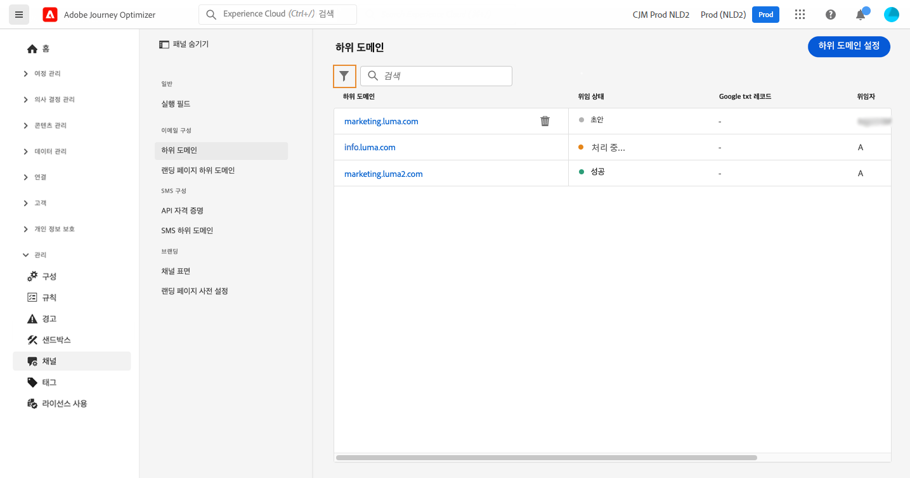

# 위임된 하위 도메인 액세스 {#access-delegated-subdomains}

위임된 모든 하위 도메인은 **[!UICONTROL Channels]** / **[!UICONTROL Subdomains]** 메뉴 아래의 제품에서 사용할 수 있습니다. 필터를 사용하여 목록을 세분화할 수 있습니다(위임 날짜, 사용자 또는 상태).

다음 **[!UICONTROL Status]** 열은 하위 도메인 위임 프로세스에 대한 정보를 제공합니다.

* **[!UICONTROL Draft]**: 하위 도메인 위임이 초안으로 저장되었습니다. 위임 프로세스를 다시 시작하려면 하위 도메인 이름을 클릭하십시오.
* **[!UICONTROL Processing]**: 하위 도메인을 사용하려면 먼저 몇 가지 구성 확인을 거쳐야 합니다.
* **[!UICONTROL Success]**: 하위 도메인이 검사를 성공적으로 통과하여 메시지를 전달하는 데 사용할 수 있습니다.
* **[!UICONTROL Failed]**: 하위 도메인 위임을 제출한 후 하나 또는 여러 번 확인하지 못했습니다.

하위 도메인에 대한 자세한 정보에 액세스하려면 목록에서 해당 하위 도메인을 엽니다. 다음을 수행할 수 있습니다.

* 위임 프로세스 중에 구성된 하위 도메인 이름(읽기 전용)과 생성된 URL(리소스, 미러 페이지, 추적 URL)을 검색합니다.

* Google 사이트 확인 TXT 레코드를 하위 도메인에 추가하여 확인되었는지 확인합니다( 참조). [하위 도메인에 Google TXT 레코드 추가](google-txt.md)).

