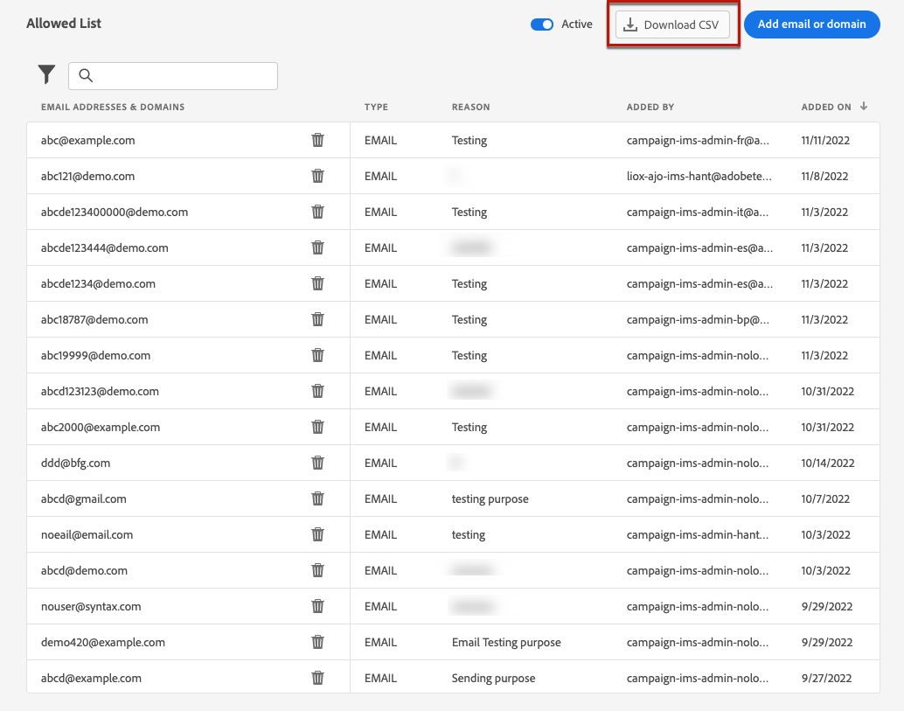

# 허용 목록 {#allow-list}

에서 특정 전송 안전 목록을 정의할 수 있습니다. [샌드박스](../administration/sandboxes.md) 레벨.

이 허용 목록을 사용하면 특정 샌드박스에서 보내는 이메일을 수신하도록 승인된 유일한 수신자 또는 도메인이 될 개별 이메일 주소 또는 도메인을 지정할 수 있습니다.

>[!NOTE]
>
>이 기능은 프로덕션 및 비프로덕션 샌드박스에서 사용할 수 있습니다.

예를 들어 실수가 발생할 수 있는 비프로덕션 인스턴스에서 허용 목록을 사용하면 원치 않는 메시지를 실제 고객 주소로 전송할 위험이 없으므로 테스트 목적으로 안전한 환경을 제공합니다.

또한 허용 목록이 활성 상태이지만 비어 있는 경우 메일이 발송되지 않습니다. 따라서 중요한 문제가 발생하면 이 기능을 사용하여 모든 발신 커뮤니케이션을 중지할 수 있습니다. [!DNL Journey Optimizer] 문제를 해결할 때까지. 에 대해 자세히 알아보기 [허용 목록 논리](#logic).

>[!CAUTION]
>
>이 기능은 이메일 채널에만 적용됩니다.

## 허용 목록 액세스 {#access-allowed-list}

허용된 이메일 주소 및 도메인의 세부 목록에 액세스하려면 다음 위치로 이동하십시오. **[!UICONTROL 관리]** > **[!UICONTROL 채널]** > **[!UICONTROL 이메일 구성]**, 및 선택 **[!UICONTROL 허용 목록]**.


>[!CAUTION]
>
>허용 목록 보기, 내보내기 및 관리 권한은 [여정 관리자](../administration/ootb-product-profiles.md#journey-administrator). 관리에 대해 자세히 알아보기 [!DNL Journey Optimizer] 의 사용자 액세스 권한 [이 섹션](../administration/permissions-overview.md).

허용 목록을 CSV 파일로 내보내려면 **[!UICONTROL CSV 다운로드]** 단추를 클릭합니다.

사용 **[!UICONTROL 삭제]** 단추를 클릭하여 항목을 영구적으로 제거합니다.

이메일 주소 또는 도메인을 검색하고 다음을 필터링할 수 있습니다. **[!UICONTROL 주소 유형]**. 선택하면 목록 위에 표시된 필터를 지울 수 있습니다.


## 허용 목록 활성화 {#enable-allow-list}

허용 목록을 활성화하려면 아래 단계를 수행합니다.

1. 액세스  **[!UICONTROL 채널]** > **[!UICONTROL 이메일 구성]** > **[!UICONTROL 허용 목록]** 메뉴 아래의 제품에서 사용할 수 있습니다.

1. 토글 버튼을 선택합니다.

   

1. 선택 **[!UICONTROL 허용 목록 활성화]**. 이제 허용 목록이 활성 상태입니다.

   

   >[!NOTE]
   >
   >허용 목록을 활성화하면 여정 및 캠페인에서 5분의 지연이 적용됩니다.

허용 목록 논리는 기능이 활성 상태일 때 적용됩니다. 자세한 내용은 [이 섹션](#logic)을 참조하십시오.

>[!NOTE]
>
>활성화되면 허용 목록을 실행할 때뿐만 아니라 를 사용하여 메시지를 테스트할 때도 여정 기능이 부여됩니다 [증명](../email/preview.md#send-proofs) 및 를 사용하여 여정 테스트 [테스트 모드](../building-journeys/testing-the-journey.md).

## 허용 목록 비활성화 {#deactivate-allow-list}

허용 목록을 비활성화하려면 아래 단계를 따르십시오.

1. 액세스  **[!UICONTROL 채널]** > **[!UICONTROL 이메일 구성]** > **[!UICONTROL 허용 목록]** 메뉴 아래의 제품에서 사용할 수 있습니다.

1. 토글 버튼을 선택합니다.

   

1. 선택 **[!UICONTROL 허용 목록 비활성화]**. 허용 목록이 더 이상 활성화되지 않습니다.

   

   >[!NOTE]
   >
   >허용 목록을 비활성화하면 여정 및 캠페인에 적용되는 데 5분 지연이 있습니다.

기능이 비활성화되면 허용 목록 논리가 적용되지 않습니다. 자세한 내용은 [이 섹션](#logic)을 참조하십시오.

## 허용 목록에 엔티티 추가 {#add-entities}

특정 샌드박스의 허용 목록에 새 이메일 주소 또는 도메인을 추가하려면 다음 중 하나를 수행할 수 있습니다 [수동으로 목록 채우기](#manually-populate-list)또는 [API 호출](#api-call-allowed-list).

>[!NOTE]
>
>허용 목록은 최대 1,000개의 항목을 포함할 수 있습니다.

### 수동으로 허용 목록 채우기 {#manually-populate-list}

>[!CONTEXTUALHELP]
>id="ajo_admin_allowed_list_add_header"
>title="허용 목록에 주소 또는 도메인 추가"
>abstract="새 이메일 주소 또는 도메인을 하나씩 선택하여 허용 목록에 수동으로 추가할 수 있습니다."

>[!CONTEXTUALHELP]
>id="ajo_admin_allowed_list_add"
>title="허용 목록에 주소 또는 도메인 추가"
>abstract="새 이메일 주소 또는 도메인을 하나씩 선택하여 허용 목록에 수동으로 추가할 수 있습니다."

다음을 수동으로 채울 수 있습니다. [!DNL Journey Optimizer] 사용자 인터페이스를 통해 이메일 주소 또는 도메인을 추가하여 허용 목록.

>[!NOTE]
>
>한 번에 하나의 이메일 주소 또는 도메인만 추가할 수 있습니다.

이렇게 하려면 아래 단계를 수행합니다.

1. 다음 항목 선택 **[!UICONTROL 이메일 또는 도메인 추가]** 단추를 클릭합니다.

   

1. 주소 유형을 선택합니다. **[!UICONTROL 이메일 주소]** 또는 **[!UICONTROL 도메인 주소]**.

1. 이메일을 보낼 이메일 주소 또는 도메인을 입력합니다.

   >[!NOTE]
   >
   >유효한 이메일 주소(예: abc@company.com) 또는 도메인(예: abc.company.com)을 입력했는지 확인합니다.

1. 필요한 경우 이유를 지정합니다.

   

   >[!NOTE]
   >
   >32에서 126 사이의 모든 ASCII 문자는 **[!UICONTROL 이유]** 필드. 전체 목록은 [이 페이지](https://en.wikipedia.org/wiki/Wikipedia:ASCII#ASCII_printable_characters){target="_blank"}에서 확인할 수 있습니다.

1. **[!UICONTROL 제출을 클릭합니다]**.

### API 호출을 사용하여 엔티티 추가 {#api-call-allowed-list}

허용 목록을 채우기 위해 다음을 사용하여 제외 API를 호출할 수도 있습니다. `ALLOWED` 값: `listType` 특성. 예:


다음을 수행할 수 있습니다. **추가**, **삭제** 및 **Get** 작업.

에서 API 호출을 수행하는 방법에 대해 자세히 알아보기 [ADOBE EXPERIENCE PLATFORM API](https://experienceleague.adobe.com/docs/experience-platform/landing/platform-apis/api-guide.html){target="_blank"} 참조 설명서입니다.

## 허용 목록 다운로드 {#download-allowed-list}

허용 목록을 CSV 파일로 내보내려면 아래 단계를 수행합니다.

1. 다음 항목 선택 **[!UICONTROL CSV 다운로드]** 단추를 클릭합니다.

   

1. 파일이 생성될 때까지 기다립니다.

   

   >[!NOTE]
   >
   >다운로드 시간은 파일 크기에 따라 다릅니다. 즉, 허용 목록에 있는 주소 수를 의미합니다.
   >
   >주어진 샌드박스에 대해 한 번에 하나의 다운로드 요청을 처리할 수 있습니다.

1. 파일이 생성되면 알림을 받습니다. 화면 오른쪽 상단에 있는 벨 아이콘을 클릭하여 표시합니다.

1. 알림 자체를 클릭하여 파일을 다운로드합니다.

   

   >[!NOTE]
   >
   >링크는 24시간 동안 유효합니다.

## 허용 목록 논리 {#logic}

>[!CONTEXTUALHELP]
>id="ajo_admin_allowed_list_logic"
>title="허용 목록 관리"
>abstract="허용 목록이 활성화되면 허용 목록에 포함된 수신자만이 이 샌드박스에서 이메일 메시지를 수신합니다. 비활성화되면 모든 수신자가 이메일을 수신합니다."

허용 목록 시기 [활성](#enable-allow-list), 다음 논리가 적용됩니다.

* 허용 목록이 **비어 있음**, 이메일이 발송되지 않습니다.

* 엔티티가 **허용 목록**&#x200B;비표시 목록이 아닌 경우 이메일이 해당 수신자에게 전송됩니다. 그러나 엔티티가 에도 있는 경우 [비표시 목록](../reports/suppression-list.md), 해당 수신자는 이메일을 수신하지 않습니다. 이유: **[!UICONTROL 억제됨]**.

* 엔티티가 **허용 목록에 없음** (제외 목록에 없음), 해당 수신자는 이메일을 받지 못하며, 그 이유는 다음과 같습니다. **[!UICONTROL 허용되지 않음]**.

>[!NOTE]
>
>이 있는 프로필 **[!UICONTROL 허용되지 않음]** 메시지 전송 프로세스 중에는 상태가 제외됩니다. 따라서 **여정 보고서** 은 이 프로필이 여정([대상자 읽기](../building-journeys/read-audience.md) 및 [메시지 활동](../building-journeys/journeys-message.md)), **이메일 보고서** 에는 포함되지 않습니다. **[!UICONTROL 전송됨]** 지표는 이메일을 보내기 전에 필터링됩니다.
>
>에 대해 자세히 알아보기 [라이브 보고서](../reports/live-report.md) 및 [글로벌 보고서](../reports/global-report.md).

허용 목록 시기 [비활성화됨](#deactivate-allow-list), 현재 샌드박스에서 보내는 모든 이메일은 실제 고객 주소를 포함하여 모든 수신자(제외 목록에 없는 경우)에게 전송됩니다.

## 제외 보고 {#reporting}

허용 목록이 활성화되면 허용 목록에 있지 않아 전송에서 제외된 이메일 주소 또는 도메인을 검색할 수 있습니다. 이렇게 하려면 다음을 사용할 수 있습니다 [Adobe Experience Platform 쿼리 서비스](https://experienceleague.adobe.com/docs/experience-platform/query/api/getting-started.html){target="_blank"} 를 입력하여 아래 API를 호출합니다.

을(를) 가져오려면 **이메일 수** 수신자가 허용 목록에 없어서 전송되지 않은 경우, 다음 쿼리를 사용하십시오.

```sql
SELECT count(distinct _id) from cjm_message_feedback_event_dataset WHERE
_experience.customerJourneyManagement.messageExecution.messageExecutionID = '<MESSAGE_EXECUTION_ID>' AND
_experience.customerJourneyManagement.messageDeliveryfeedback.feedbackStatus = 'exclude' AND
_experience.customerJourneyManagement.messageDeliveryfeedback.messageExclusion.reason = 'EmailNotAllowed'
```

을(를) 가져오려면 **이메일 주소 목록** 수신자가 허용 목록에 없어서 전송되지 않은 경우, 다음 쿼리를 사용하십시오.

```sql
SELECT distinct(_experience.customerJourneyManagement.emailChannelContext.address) from cjm_message_feedback_event_dataset WHERE
_experience.customerJourneyManagement.messageExecution.messageExecutionID IS NOT NULL AND
_experience.customerJourneyManagement.messageDeliveryfeedback.feedbackStatus = 'exclude' AND
_experience.customerJourneyManagement.messageDeliveryfeedback.messageExclusion.reason = 'EmailNotAllowed'
```
