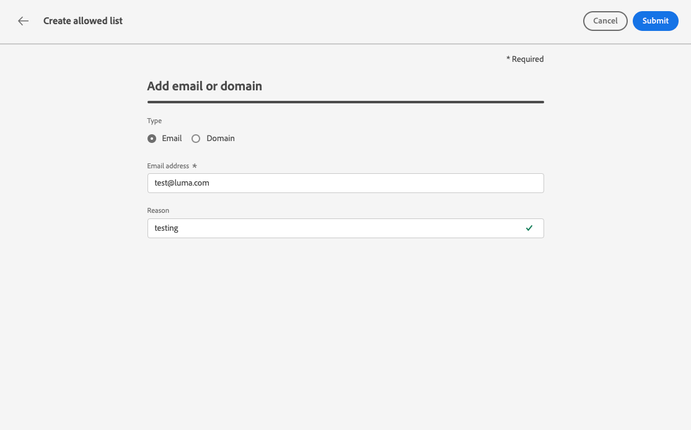

# 허용 목록 {#allow-list}

[샌드박스](../administration/sandboxes.md) 수준에서 특정 전송 안전 목록을 정의할 수 있습니다.

이 허용 목록을 사용하면 특정 샌드박스에서 보내는 이메일을 수신하도록 승인된 유일한 수신자 또는 도메인이 될 개별 이메일 주소 또는 도메인을 지정할 수 있습니다.

>[!CAUTION]
>
>이 기능은 이메일 채널에만 적용됩니다. 이 샌드박스는 프로덕션 및 비프로덕션 샌드박스에서 사용할 수 있습니다.

예를 들어 실수가 발생할 수 있는 비프로덕션 인스턴스 목록에서 허용 목록은 원치 않는 메시지를 실제 고객 주소로 보낼 위험이 없도록 하므로 테스트 목적으로 안전한 환경을 제공합니다.

또한 허용 목록이 활성 상태이지만 비어 있으면 메일이 발송되지 않습니다. 따라서 중요한 문제가 발생하면 이 기능을 사용하여 문제 해결할 때까지 모든 발신 통신 [!DNL Journey Optimizer] 을 중지할 수 있습니다. 허용 목록 논리[&#128279;](#logic)에 대해 자세히 알아보세요.

또한 Journey Optimizer **Suppression REST API**&#x200B;를 활용하면 제외 및 허용 목록을 통해 보내는 메시지를 제어할 수 있습니다. [Suppression REST API 사용 방법 알아보기](https://developer.adobe.com/journey-optimizer-apis/references/suppression/){target="_blank"}

## 허용 목록 액세스 {#access-allowed-list}

허용된 전자 메일 주소 및 도메인의 세부 목록에 액세스하려면 **[!UICONTROL 관리]** > **[!UICONTROL 채널]** > **[!UICONTROL 전자 메일 설정]**&#x200B;으로 이동한 다음 **[!UICONTROL 허용 목록]**&#x200B;을 선택하세요.


>[!CAUTION]
>
>허용 목록을 보고 내보내고 관리할 수 있는 권한이 [여정 관리자](../administration/ootb-product-profiles.md#journey-administrator)(으)로 제한됩니다. [이 섹션](../administration/permissions-overview.md)에서 [!DNL Journey Optimizer] 사용자의 액세스 권한 관리에 대해 자세히 알아보세요.

허용 목록을 CSV 파일로 내보내려면 CSV **다운로드 버튼을 선택합니다**.

**[!UICONTROL 항목을 영구적으로 제거하려면 삭제]** 버튼을 사용합니다.

전자 메일 주소 또는 도메인을 검색하고 **[!UICONTROL 주소 형식]**&#x200B;을(를) 필터링할 수 있습니다. 선택하면 목록 위에 표시된 필터를 지울 수 있습니다.


## 허용 목록 활성화 {#enable-allow-list}

허용 목록을 활성화하려면 아래 단계를 수행합니다.

1. **[!UICONTROL 채널]** > **[!UICONTROL 전자 메일 구성]** > **[!UICONTROL 허용 목록]** 메뉴에 액세스합니다.

1. 토글 버튼을 선택합니다.

   

1. **[!UICONTROL 허용 목록 활성화]**&#x200B;를 선택합니다. 이제 허용 목록이 활성 상태입니다.

   

   >[!NOTE]
   >
   >허용 목록을 활성화한 후 여정 및 캠페인에서 적용되기까지 10분이 소요됩니다. 마찬가지로 허용 목록 및 제외 목록에 대한 업데이트는 반영하는 데 최대 10분이 걸릴 수 있습니다.

허용 목록 논리는 기능이 활성 상태일 때 적용됩니다. 자세한 내용은 [이 섹션](#logic)을 참조하십시오.

>[!NOTE]
>
>활성화하면 여정을 실행할 때, [증명](../content-management/proofs.md)을 사용하여 메시지를 테스트하고 [테스트 모드](../building-journeys/testing-the-journey.md)를 사용하여 여정을 테스트할 때도 허용 목록 기능이 적용됩니다.

## 허용 목록 비활성화 {#deactivate-allow-list}

허용 목록을 비활성화하려면 아래 단계를 팔로우 하십시오.

1. 이메일 구성> 채널&#x200B;**>**&#x200B;[!UICONTROL &#x200B;허용 목록&#x200B;]&#x200B;**메뉴에**&#x200B;액세스합니다. **&#x200B;**

1. 토글 버튼 선택

   

1. 허용 목록&#x200B;**비활성화를 선택합니다**. 허용 목록이 더 이상 활성화되지 않습니다.

   

   >[!NOTE]
   >
   >허용 목록을 비활성화하면 여정 및 캠페인에 적용되기까지 10분이 소요됩니다. 마찬가지로 허용 목록 및 제외 목록에 대한 업데이트는 반영하는 데 최대 10분이 걸릴 수 있습니다.

기능이 비활성화되면 허용 목록 논리가 적용되지 않습니다. 자세한 내용은 [이 섹션](#logic)을 참조하십시오.

## 허용 목록에 엔터티 추가 {#add-entities}

특정 샌드박스의 허용 목록에 새 이메일 주소 또는 도메인을 추가하려면 목록을[&#128279;](#manually-populate-list) 수동으로 채우거나 API 호출[&#128279;](#api-call-allowed-list)을 사용할 수 있습니다.

>[!NOTE]
>
>허용 목록은 최대 1,000개의 항목을 포함할 수 있습니다.

### 수동으로 허용 목록 채우기 {#manually-populate-list}

>[!CONTEXTUALHELP]
>id="ajo_admin_allowed_list_add_header"
>title="허용 목록에 주소 또는 도메인 추가"
>abstract="새 이메일 주소 또는 도메인을 하나씩 선택하여 허용 목록에 수동으로 추가할 수 있습니다."

>[!CONTEXTUALHELP]
>id="ajo_admin_allowed_list_add"
>title="허용 목록에 주소 또는 도메인 추가"
>abstract="새 이메일 주소 또는 도메인을 하나씩 선택하여 허용 목록에 수동으로 추가할 수 있습니다."

사용자 인터페이스를 통해 이메일 주소 또는 도메인을 추가하여 허용 목록을 수동으로 채울 [!DNL Journey Optimizer] 수 있습니다.

>[!NOTE]
>
>이메일 주소 또는 도메인은 한 번에 하나씩만 추가할 수 있습니다.

이렇게 하려면 아래 단계를 수행합니다.

1. **[!UICONTROL 전자 메일 또는 도메인]** 추가 버튼 을 선택합니다.

   

1. 주소 유형을 선택합니다. **[!UICONTROL 이메일 주소]** 또는 **[!UICONTROL 도메인 주소]**.

1. 이메일을 보낼 이메일 주소 또는 도메인을 입력합니다.

   >[!NOTE]
   >
   >유효한 이메일 주소(예: abc@company.com) 또는 도메인(예: abc.company.com)을 입력했는지 확인합니다.

1. 필요한 경우 이유를 지정합니다.

   

   >[!NOTE]
   >
   >**[!UICONTROL Reason]** 필드에는 32에서 126 사이의 모든 ASCII 문자가 허용됩니다. 예를 들어 [이 페이지](https://en.wikipedia.org/wiki/ASCII#Printable_characters){target="_blank"}에서 전체 목록을 찾을 수 있습니다.

1. **[!UICONTROL 제출을 클릭합니다]**.

### API 호출을 사용하여 엔티티 추가 {#api-call-allowed-list}

허용 목록을 채우려면 `listType` 특성에 대한 `ALLOWED` 값으로 비표시 API를 호출할 수도 있습니다. 예:


**추가**, **삭제** 및 **가져오기** 작업을 수행할 수 있습니다.

[Adobe Experience Platform API](https://experienceleague.adobe.com/docs/experience-platform/landing/platform-apis/api-guide.html?lang=ko){target="_blank"} 참조 설명서에서 API 호출에 대해 자세히 알아보세요.

## 허용 목록 다운로드 {#download-allowed-list}

허용 목록을 CSV 파일로 내보내려면 아래 단계를 수행합니다.

1. **[!UICONTROL CSV 다운로드]** 단추를 선택합니다.

   

1. 파일이 생성될 때까지 기다립니다.

   

   >[!NOTE]
   >
   >다운로드 시간은 파일 크기에 따라 다릅니다. 즉, 허용 목록에 있는 주소 수를 의미합니다.
   >
   >주어진 샌드박스에 대해 한 번에 하나의 다운로드 요청을 처리할 수 있습니다.

1. 파일이 생성되면 알림을 받습니다. 화면 오른쪽 상단의 벨 아이콘을 클릭하여 표시합니다.

1. 알림 자체를 클릭하여 파일을 다운로드합니다.

   

   >[!NOTE]
   >
   >링크 유효 시간은 24시간입니다.

## 허용 목록 논리 {#logic}

>[!CONTEXTUALHELP]
>id="ajo_admin_allowed_list_logic"
>title="허용 목록 관리"
>abstract="허용 목록이 활성화되면 허용 목록에 포함된 수신자만 이 샌드박스에서 이메일 메시지를 수신합니다. 비활성화되면 모든 수신자가 이메일을 수신합니다."

허용 목록이 [활성](#enable-allow-list)인 경우 다음 논리가 적용됩니다.

* 허용 목록이 **empty**&#x200B;이면 전자 메일이 전송되지 않습니다.

* 엔터티가 **허용 목록**&#x200B;에 있고 비표시 목록에 없는 경우 해당 받는 사람에게 전자 메일이 전송됩니다. 그러나 엔터티가 금지 목록(../reports/suppression-list.md)에도 있는 [경우 해당 수신자는 이메일을 받지 못하며, 그 이유는 Suppressed ]&#x200B;**입니다**.

* 엔터티 **가 허용 목록에** 없는 경우(및 금지 목록에 없는 경우) 해당 수신자는 이메일을 받지 못하며, 그 이유는 **[!UICONTROL 허용되지]** 않습니다.

>[!NOTE]
>
>메시지 전송 프로세스 중에 **[!UICONTROL 허용되지 않음]** 상태의 프로필이 제외됩니다. 따라서 **여정 보고서**&#x200B;에는 이러한 프로필이 여정([대상자 읽기](../building-journeys/read-audience.md) 및 [메시지 활동](../building-journeys/journeys-message.md))을 통해 이동한 것으로 표시되지만, 전자 메일을 보내기 전에 필터링되므로 **전자 메일 보고서**&#x200B;에는 이러한 프로필이 **[!UICONTROL 전송됨]** 지표에 포함되지 않습니다.
>
>[실시간 보고서](../reports/live-report.md) 및 [Customer Journey Analytics 보고서](../reports/report-gs-cja.md)에 대해 자세히 알아보세요.

허용 목록이 [비활성화됨](#deactivate-allow-list)일 때 현재 샌드박스에서 보내는 모든 전자 메일은 실제 고객 주소를 포함하여 모든 수신자(제외 목록에 없는 경우)에게 전송됩니다.

## 제외 보고 {#reporting}

허용 목록이 활성화되면 허용 목록에 있지 않아 전송에서 제외된 이메일 주소 또는 도메인을 검색할 수 있습니다. 이렇게 하려면 [Adobe Experience Platform 쿼리 서비스](https://experienceleague.adobe.com/docs/experience-platform/query/api/getting-started.html?lang=ko){target="_blank"}를 사용하여 아래 API를 호출할 수 있습니다.

수신자가 허용 목록에 없어서 전송되지 않은 **이메일 개수**&#x200B;를 가져오려면 다음 쿼리를 사용하십시오.

```sql
SELECT count(distinct _id) from cjm_message_feedback_event_dataset WHERE
_experience.customerJourneyManagement.messageExecution.messageExecutionID = '<MESSAGE_EXECUTION_ID>' AND
_experience.customerJourneyManagement.messageDeliveryfeedback.feedbackStatus = 'exclude' AND
_experience.customerJourneyManagement.messageDeliveryfeedback.messageExclusion.reason = 'EmailNotAllowed'
```

수신자가 허용 목록에 없어서 전송되지 않은 **전자 메일 주소 목록**&#x200B;을 가져오려면 다음 쿼리를 사용하십시오.

```sql
SELECT distinct(_experience.customerJourneyManagement.emailChannelContext.address) from cjm_message_feedback_event_dataset WHERE
_experience.customerJourneyManagement.messageExecution.messageExecutionID IS NOT NULL AND
_experience.customerJourneyManagement.messageDeliveryfeedback.feedbackStatus = 'exclude' AND
_experience.customerJourneyManagement.messageDeliveryfeedback.messageExclusion.reason = 'EmailNotAllowed'
```
