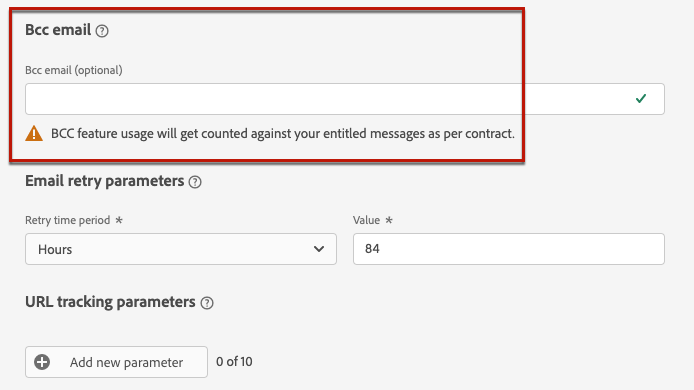
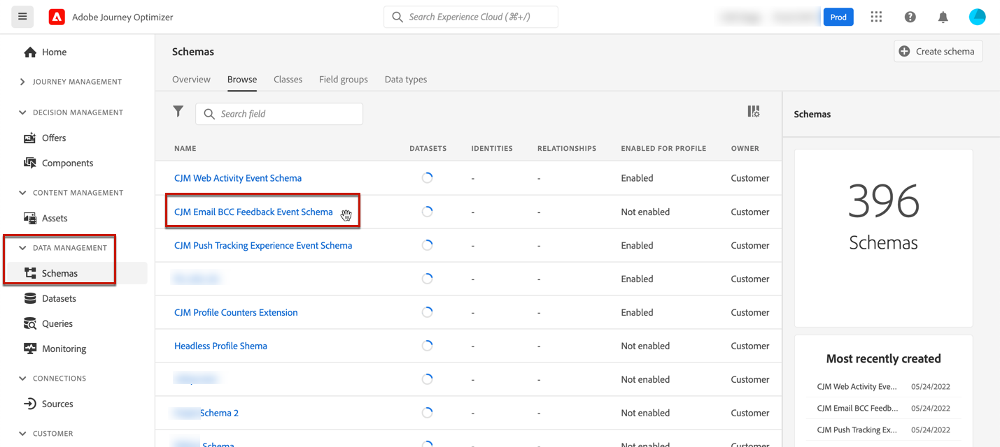

# 아카이브 지원 {#archiving-support}

## 메시지 보관 방법 {#about-archiving}

HIPAA와 같은 규정에서는 [!DNL Journey Optimizer]이(가) 개인에게 보낸 메시지를 보관할 방법을 제공해야 합니다. 실제로 고객이 클레임을 제기할 경우 확인용으로 보낸 메시지의 사본을 받을 수 있어야 합니다.

* 전자 메일 채널의 경우 [!DNL Journey Optimizer]에서 기본 제공 BCC 전자 메일 기능을 제공합니다. [자세히 알아보기](#bcc-email)

* 또한 모든 채널에 대해 **엔터티 데이터 집합**&#x200B;의 &#39;템플릿&#39; 필드를 사용할 수 있습니다. 여기에는 개인화되지 않은 메시지 템플릿에 대한 세부 정보가 포함됩니다. 메시지를 보낸 사람, 보낸 사람 및 날짜와 같은 메타데이터를 저장하려면 이 필드로 데이터 세트를 내보냅니다. 개인화된 데이터는 내보내지지 않으며 템플릿(메시지의 형식 및 구조)만 고려됩니다. [자세히 알아보기](../data/datasets-query-examples.md#entity-dataset)

>[!NOTE]
>
>[!DNL Journey Optimizer]은(는) SMS 보관 요구 사항에 대한 지원을 소유하고 있지 않습니다. 전용 아카이브 지원이 필요하면 SMS 공급업체(Sinch, Infobip 또는 Twilio)와 협력하십시오.

## 이메일용 BCC 사용 방법 {#bcc-email}

>[!CONTEXTUALHELP]
>id="ajo_admin_preset_bcc"
>title="BCC 이메일 주소 정의"
>abstract="보낸 이메일을 BCC 받은 편지함으로 전송하여 사본을 보관할 수 있습니다. 전송된 모든 이메일이 이 BCC 주소로 숨은 참조될 수 있도록 선택한 이메일 주소를 입력합니다. BCC 주소 도메인은 Adobe에 위임된 모든 하위 도메인과 동일하지 않아야 한다는 점을 참고하십시오. 이 기능은 선택 사항입니다."

[!DNL Journey Optimizer]이(가) 보낸 전자 메일의 숨은 참조(BCC)를 전용 BCC 주소로 보낼 수 있습니다. 이 옵션 기능을 사용하면 규정 준수 및/또는 보관 목적으로 사용자에게 전송하는 이메일 통신 복사본을 유지할 수 있습니다. BCC 주소는 메시지의 다른 수신자에게 보이지 않습니다.

### BCC 이메일 활성화 {#enable-bcc}

**[!UICONTROL BCC 이메일]** 옵션을 활성화하려면 [채널 구성](channel-surfaces.md)의 전용 필드(즉, 메시지 사전 설정)에 원하는 이메일 주소를 입력하십시오. Adobe으로 위임된 하위 도메인에 정의된 이메일 주소를 제외한 모든 외부 주소를 올바른 형식으로 지정할 수 있습니다. 예를 들어 *marketing.luma.com* 하위 도메인을 Adobe에 위임한 경우 *abc@marketing.luma.com*&#x200B;과(와) 같은 주소는 사용할 수 없습니다.

>[!CAUTION]
>
>BCC 이메일 주소는 하나만 정의할 수 있습니다. BCC 주소에 현재 채널 구성을 사용하여 전송된 모든 이메일을 저장할 수 있는 충분한 수신 용량이 있는지 확인하십시오.
>
>더 많은 권장 사항이 [이 섹션](#bcc-recommendations-limitations)에 나열됩니다.

>[!NOTE]
>
>Healthcare Shield 추가 기능 서비스를 구입한 경우 BCC 주소의 ISP가 TLS 1.2 프로토콜을 지원하는지 확인해야 합니다.



구성이 완료되면 이 구성을 기반으로 하는 모든 이메일 메시지는 입력한 BCC 이메일 주소에 블라인드 복사됩니다. 여기에서 외부 시스템을 사용하여 메시지를 처리하고 보관할 수 있습니다.

>[!CAUTION]
>
>BCC 기능 사용은 라이선스가 부여된 메시지 수에 따라 계산됩니다. 따라서 보관하려는 중요한 통신에 사용되는 구성에서만 사용하도록 설정합니다. 사용 허가된 볼륨에 대한 계약을 확인하십시오.

BCC 이메일 주소 설정은 구성 수준에서 즉시 저장되고 처리됩니다. 이 구성을 사용하여 새 메시지를 만들면 BCC 이메일 주소가 자동으로 표시됩니다.


그러나 [여기](../email/email-settings.md)에 설명된 논리에 따라 통신을 보내기 위해 BCC 주소가 선택됩니다.

### Recommendations 및 제한 사항 {#bcc-recommendations-limitations}

* 개인 정보 보호 규정을 준수하려면 BCC 이메일을 PII(개인 식별 정보)를 안전하게 저장할 수 있는 보관 시스템에서 처리해야 합니다.

* 메시지에는 PII(개인 식별 정보)와 같은 중요한 데이터나 개인 데이터가 포함될 수 있으므로 BCC 주소가 올바른지 확인하고 메시지에 대한 액세스 권한을 보호하십시오.

* BCC에 사용되는 받은 편지함은 공간 및 게재에 적절하게 관리되어야 합니다. 받은 편지함이 반송되면 일부 이메일이 수신되지 않을 수 있으므로 보관되지 않습니다.

* 메시지는 대상 수신자 이전에 BCC 이메일 주소로 전달될 수 있습니다. 원본 메시지에 [반송](../reports/suppression-list.md#delivery-failures)이 있더라도 BCC 메시지를 보낼 수 있습니다.

  <!--OR: Only successfully sent emails are taken in account. [Bounces](../reports/suppression-list.md#delivery-failures) are not. TO CHECK -->

* BCC 주소로 전송된 전자 메일을 열거나 클릭하지 마십시오. 전송 분석의 총 열기와 클릭수로 계산되면 [보고서](../reports/global-report.md)에서 계산 착오가 발생할 수 있습니다.

* BCC 받은 편지함에서 메시지를 스팸으로 표시하지 마십시오. 스팸은 이 주소로 전송되는 다른 모든 이메일에 영향을 미칩니다.

>[!CAUTION]
>
>해당 수신자의 구독을 즉시 취소하므로 BCC 주소로 전송된 이메일의 구독 취소 링크를 클릭하지 마십시오.

### GDPR 준수 {#gdpr-compliance}

GDPR과 같은 규정에서는 데이터 주체가 언제든지 동의를 수정할 수 있어야 한다고 명시합니다. Journey Optimizer으로 보내는 BCC 이메일에는 PII(개인 식별 정보)가 포함되어 있으므로 GDPR 및 유사한 규정을 준수하여 PII를 관리하려면 **[!UICONTROL CJM 이메일 BCC 피드백 이벤트 스키마]**&#x200B;를 편집해야 합니다.

이렇게 하려면 아래 단계를 수행합니다.

1. **[!UICONTROL 데이터 관리]** > **[!UICONTROL 스키마]** > **[!UICONTROL 찾아보기]**&#x200B;로 이동하고 **[!UICONTROL CJM 전자 메일 BCC 피드백 이벤트 스키마]**&#x200B;를 선택합니다.

   

1. **[!UICONTROL _experience]**, **[!UICONTROL customerJourneyManagement]**, **[!UICONTROL secondaryRecipientDetail]**&#x200B;을(를) 확장하려면 클릭하세요.

1. **[!UICONTROL originalRecipientAddress]**&#x200B;을 선택합니다.

1. 오른쪽의 **[!UICONTROL 필드 속성]**&#x200B;에서 **[!UICONTROL ID]** 확인란까지 아래로 스크롤합니다.

1. 선택하고 **[!UICONTROL 기본 ID]**&#x200B;도 선택하십시오.

1. 드롭다운 목록에서 네임스페이스를 선택합니다.

   

1. **[!UICONTROL 적용]**&#x200B;을 클릭합니다.

>[!NOTE]
>
>개인 정보 관리에 대한 자세한 내용 및 해당 규정은 [Experience Platform 설명서](https://experienceleague.adobe.com/docs/experience-platform/privacy/home.html?lang=ko-KR){target="_blank"}를 참조하세요.

### BCC 보고 데이터 {#bcc-reporting}

BCC에 대한 보고는 여정 및 메시지 보고서에서 사용할 수 없습니다. 그러나 정보는 **[!UICONTROL AJO BCC 피드백 이벤트 데이터 세트]**&#x200B;라는 시스템 데이터 세트에 저장됩니다. 이 데이터 세트에 대해 쿼리를 실행하여 디버깅 목적에 유용한 정보(예: )를 찾을 수 있습니다.

사용자 인터페이스를 통해 이 데이터 세트에 액세스하려면 **[!UICONTROL 데이터 관리]** > **[!UICONTROL 데이터 세트]** > **[!UICONTROL 찾아보기]**&#x200B;를 선택하십시오. [이 섹션](../data/get-started-datasets.md#access-datasets)의 데이터 세트에 액세스하는 방법에 대해 자세히 알아보세요.

<!---->

이 데이터 세트에 대해 쿼리를 실행하려면 [Adobe Experience Platform 쿼리 서비스](https://experienceleague.adobe.com/docs/experience-platform/query/api/getting-started.html){target="_blank"}에서 제공하는 쿼리 편집기를 사용할 수 있습니다. 액세스하려면 **[!UICONTROL 데이터 관리]** > **[!UICONTROL 쿼리]**&#x200B;를 선택하고 **[!UICONTROL 쿼리 만들기]**&#x200B;를 클릭하십시오. [자세히 알아보기](../data/get-started-queries.md)


찾고 있는 정보에 따라 다음 쿼리를 실행할 수 있습니다.

1. 아래의 다른 모든 쿼리의 경우 여정 작업 ID가 필요합니다. 이 쿼리를 실행하여 지난 2일 이내에 특정 여정 버전 ID와 연결된 모든 작업 ID를 가져옵니다.

   ```
   SELECT
   DISTINCT
   CAST(TIMESTAMP AS DATE) AS EventTime,
   _experience.journeyOrchestration.stepEvents.journeyVersionID,
   _experience.journeyOrchestration.stepEvents.actionName, 
   _experience.journeyOrchestration.stepEvents.actionID 
   FROM journey_step_events 
   WHERE 
   _experience.journeyOrchestration.stepEvents.journeyVersionID = '<journey version id>' AND 
   _experience.journeyOrchestration.stepEvents.actionID is not NULL AND 
   TIMESTAMP > NOW() - INTERVAL '2' DAY 
   ORDER BY EventTime DESC;
   ```

   >[!NOTE]
   >
   >`<journey version id>`매개 변수를 가져오려면 **[!UICONTROL 여정 관리]** > **[!UICONTROL 여정]** 메뉴에서 해당 [여정 버전](../building-journeys/journey.md#journey-versions)을(를) 선택하십시오. 여정 버전 ID는 웹 브라우저에 표시된 URL의 끝에 표시됩니다.
   >
   >

1. 이 쿼리를 실행하여 지난 2일 내에 특정 사용자를 타겟팅한 특정 메시지에 대해 생성된 모든 메시지 피드백 이벤트(특히 피드백 상태)를 가져옵니다.

   ```
   SELECT  
   _experience.customerJourneyManagement.messageExecution.journeyVersionID AS JourneyVersionID, 
   _experience.customerJourneyManagement.messageExecution.journeyActionID AS JourneyActionID, 
   timestamp AS EventTime, 
   _experience.customerJourneyManagement.emailChannelContext.address AS RecipientAddress, 
   _experience.customerjourneymanagement.messagedeliveryfeedback.feedbackStatus AS FeedbackStatus,
   CASE _experience.customerjourneymanagement.messagedeliveryfeedback.feedbackStatus
       WHEN 'sent' THEN 'Sent'
       WHEN 'delay' THEN 'Retry'
       WHEN 'out_of_band' THEN 'Bounce' 
       WHEN 'bounce' THEN 'Bounce'
   END AS FeedbackStatusCategory
   FROM cjm_message_feedback_event_dataset 
   WHERE  
       timestamp > now() - INTERVAL '2' day  AND
       _experience.customerJourneyManagement.messageExecution.journeyVersionID = '<journey version id>' AND 
       _experience.customerJourneyManagement.messageExecution.journeyActionID = '<journey action id>' AND  
       _experience.customerJourneyManagement.emailChannelContext.address = '<recipient email address>'
       ORDER BY EventTime DESC;
   ```

   >[!NOTE]
   >
   >`<journey action id>` 매개 변수를 가져오려면 여정 버전 ID를 사용하여 위에서 설명한 첫 번째 쿼리를 실행하십시오. `<recipient email address>` 매개 변수는 대상 또는 실제 받는 사람의 전자 메일 주소입니다.

1. 이 쿼리를 실행하여 지난 2일 내에 특정 사용자를 타겟팅한 특정 메시지에 대해 생성된 모든 BCC 메시지 피드백 이벤트를 가져옵니다.

   ```
   SELECT   
   _experience.customerJourneyManagement.messageExecution.journeyVersionID AS JourneyVersionID, 
   _experience.customerJourneyManagement.messageExecution.journeyActionID AS JourneyActionID, 
   _experience.customerJourneyManagement.emailChannelContext.address AS BccEmailAddress,
   timestamp AS EventTime, 
   _experience.customerJourneyManagement.secondaryRecipientDetail.originalRecipientAddress AS RecipientAddress, 
   _experience.customerjourneymanagement.messagedeliveryfeedback.feedbackStatus AS FeedbackStatus,
   CASE _experience.customerjourneymanagement.messagedeliveryfeedback.feedbackStatus
               WHEN 'sent' THEN 'Sent'
               WHEN 'delay' THEN 'Retry'
               WHEN 'out_of_band' THEN 'Bounce' 
               WHEN 'bounce' THEN 'Bounce'
           END AS FeedbackStatusCategory 
   FROM ajo_bcc_feedback_event_dataset  
   WHERE  
   timestamp > now() - INTERVAL '2' day  AND
   _experience.customerJourneyManagement.messageExecution.journeyVersionID = '<journey version id>' AND 
   _experience.customerJourneyManagement.messageExecution.journeyActionID = '<journeyaction id>' AND 
   _experience.customerJourneyManagement.secondaryRecipientDetail.originalRecipientAddress = '<recipient email address>'
   ORDER BY EventTime DESC;
   ```

1. 지난 30일 내에 해당 BCC 항목이 존재하지만 메시지를 받지 못한 모든 수신자 주소를 가져오려면 이 쿼리를 실행하십시오.

   ```
    SELECT
        DISTINCT 
    bcc._experience.customerJourneyManagement.secondaryRecipientDetail.originalRecipientAddress AS RecipientAddressesNotRecievedMessage
    FROM ajo_bcc_feedback_event_dataset bcc
    LEFT JOIN cjm_message_feedback_event_dataset mfe
    ON 
   bcc._experience.customerJourneyManagement.messageExecution.journeyVersionID =
            mfe._experience.customerJourneyManagement.messageExecution.journeyVersionID AND    bcc._experience.customerJourneyManagement.messageExecution.journeyActionID = mfe._experience.customerJourneyManagement.messageExecution.journeyActionID AND 
   bcc._experience.customerJourneyManagement.secondaryRecipientDetail.originalRecipientAddress = mfe._experience.customerJourneyManagement.emailChannelContext.address AND
   mfe._experience.customerJourneyManagement.messageExecution.journeyVersionID = '<journey version id>' AND 
   mfe._experience.customerJourneyManagement.messageExecution.journeyActionID = '<journey action id>' AND
   mfe.timestamp > now() - INTERVAL '30' DAY AND
   mfe._experience.customerjourneymanagement.messagedeliveryfeedback.feedbackstatus IN ('bounce', 'out_of_band') 
    WHERE bcc.timestamp > now() - INTERVAL '30' DAY;
   ```

### 메시지 헤더를 사용하여 BCC 사본 및 전송된 이메일 정보 조정 {#bcc-header}

예를 들어 이메일 BCC 복사본이 외부 시스템에 보관된 경우 메시지에 포함된 헤더를 사용하여 해당 전송된 이메일에 대한 정보를 검색할 수 있습니다.

이제 모든 전자 메일 메시지에 `x-message-profile-id`(이)라는 헤더가 포함됩니다. 이 헤더의 값은 각 프로필에 대해 다릅니다. 전송된 각 이메일과 해당 BCC 이메일 사본에 대해 고유합니다.

`x-message-profile-id` 헤더도 시스템 데이터 세트 [AJO 메시지 피드백 이벤트 데이터 세트](../data/datasets-query-examples.md#message-feedback-event-dataset)(보낸 이메일) 및 [AJO BCC 피드백 이벤트 데이터 세트](#bcc-reporting)(BCC 복사본)에 저장됩니다. 이러한 데이터 세트를 쿼리하여 BCC 사본과 해당 실제 이메일을 조정할 수 있습니다.

* 사용자 인터페이스를 통해 이러한 데이터 세트에 액세스하려면 **[!UICONTROL 데이터 관리]** > **[!UICONTROL 데이터 세트]** > **[!UICONTROL 찾아보기]**&#x200B;를 선택하십시오. [이 섹션](../data/get-started-datasets.md#access-datasets)의 데이터 세트에 액세스하는 방법에 대해 자세히 알아보세요.

* [Adobe Experience Platform 쿼리 서비스](https://experienceleague.adobe.com/docs/experience-platform/query/api/getting-started.html){target="_blank"}에서 제공하는 쿼리 편집기를 사용하십시오. 액세스하려면 **[!UICONTROL 데이터 관리]** > **[!UICONTROL 쿼리]**&#x200B;를 선택하고 **[!UICONTROL 쿼리 만들기]**&#x200B;를 클릭하십시오. [자세히 알아보기](../data/get-started-queries.md)

다음은 BCC 사본에 해당하는 정보를 검색하기 위해 실행할 수 있는 몇 가지 샘플 쿼리입니다.

**쿼리 1**

BCC 이벤트를 캠페인 작업 세부 정보가 있는 실제 이메일에 대한 해당 피드백 이벤트와 연결하려면 다음을 수행하십시오.

```
SELECT
  mfe.timestamp as OriginalRecipientFeedbackEventTime,
  mfe._experience.customerJourneyManagement.emailChannelContext.address AS OriginalRecipientEmailAddress,
  mfe._experience.customerjourneymanagement.messagedeliveryfeedback.feedbackstatus AS OriginalRecipientMessageFeedbackStatus,
  mfe._experience.customerJourneyManagement.messageExecution.campaignID AS CampaignID,
  mfe._experience.customerJourneyManagement.messageExecution.campaignActionID AS CampaignActionID,
  mfe._experience.customerJourneyManagement.messageExecution.batchInstanceID AS BatchInstanceID,
  mfe._experience.customerJourneyManagement.messageExecution.messageID AS MessageID AS MessageID
FROM ajo_bcc_feedback_event_dataset bcc
LEFT JOIN cjm_message_feedback_event_dataset mfe
ON bcc._experience.customerJourneyManagement.messageProfile.messageProfileID =
    mfe._experience.customerJourneyManagement.messageProfile.messageProfileID AND 
    mfe.timestamp > now() - INTERVAL '30' day
WHERE 
  bcc.timestamp > now() - INTERVAL '30' DAY AND 
  bcc._experience.customerJourneyManagement.messageProfile.messageProfileID = 'x-message-profile-id'
ORDER BY timestamp DESC;
```

**쿼리 2**

여정 작업 세부 사항이 있는 실제 이메일에 대한 해당 피드백 이벤트와 BCC 이벤트를 결합하는 방법:

```
SELECT
  mfe.timestamp as OriginalRecipientFeedbackEventTime,
  mfe._experience.customerJourneyManagement.emailChannelContext.address AS OriginalRecipientEmailAddress,
  mfe._experience.customerjourneymanagement.messagedeliveryfeedback.feedbackstatus AS OriginalRecipientMessageFeedbackStatus,
  mfe._experience.customerJourneyManagement.messageExecution.journeyVersionID AS JourneyVersionID,
  mfe._experience.customerJourneyManagement.messageExecution.journeyVersionInstanceID AS JourneyVersionInstanceID,
  mfe._experience.customerJourneyManagement.messageExecution.batchInstanceID AS BatchInstanceID,
  mfe._experience.customerJourneyManagement.messageExecution.messageID AS MessageID AS MessageID
FROM ajo_bcc_feedback_event_dataset bcc
LEFT JOIN cjm_message_feedback_event_dataset mfe
ON bcc._experience.customerJourneyManagement.messageProfile.messageProfileID =
    mfe._experience.customerJourneyManagement.messageProfile.messageProfileID AND 
    mfe.timestamp > now() - INTERVAL '30' day
WHERE 
  bcc.timestamp > now() - INTERVAL '30' DAY AND 
  bcc._experience.customerJourneyManagement.messageProfile.messageProfileID = 'x-message-profile-id'
ORDER BY timestamp DESC;
```
