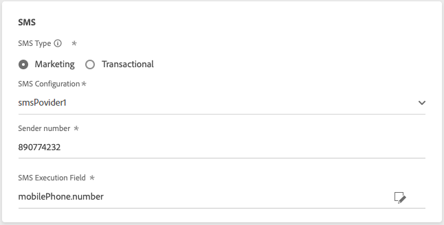
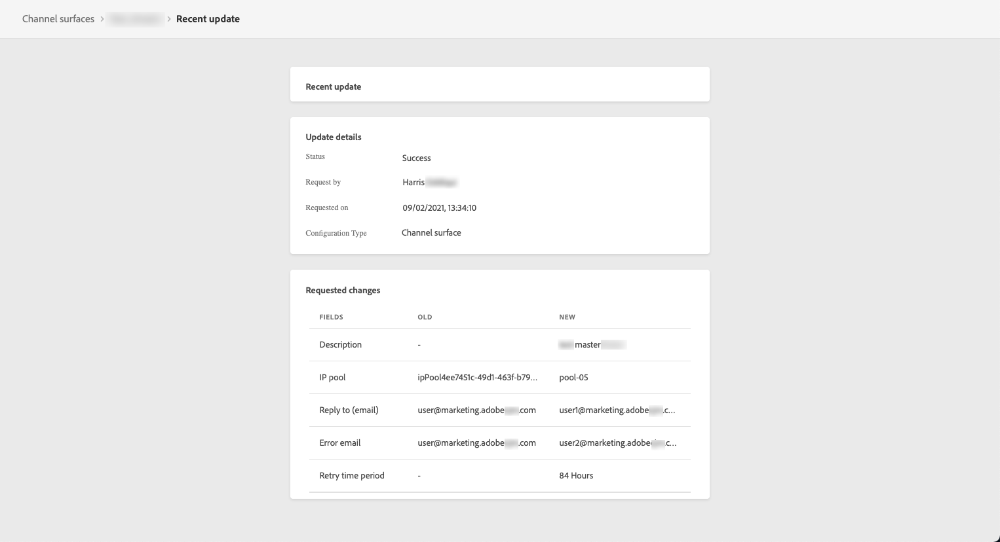
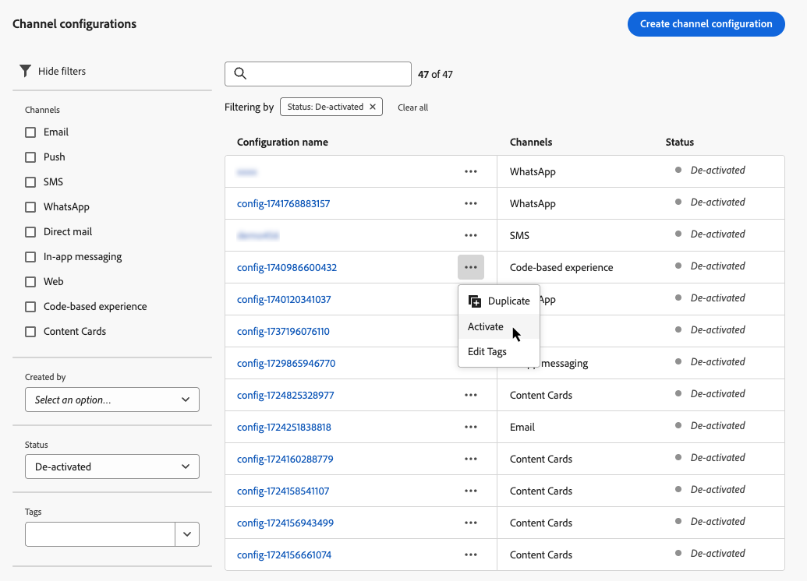

# 채널 표면 설정 {#set-up-channel-surfaces}

>[!CONTEXTUALHELP]
>id="ajo_admin_channel_surfaces"
>title="서피스"
>abstract="표면은 시스템 관리자에 의해 정의된 구성입니다. 여기에는 헤더 매개 변수, 하위 도메인, 모바일 앱 등과 같이 메시지를 전송하기 위한 모든 기술 매개 변수가 포함되어 있습니다."

사용 [!DNL Journey Optimizer]를 설정하고 메시지에 필요한 모든 기술 매개 변수를 정의하는 채널 서피스(즉, 메시지 사전 설정)를 설정할 수 있습니다. 이메일 유형, 발신자 이메일 및 이름, 모바일 앱, SMS 구성 등

>[!CAUTION]
>
> * 채널 서피스를 생성, 편집 및 삭제하려면 [채널 서피스 관리](../administration/high-low-permissions.md#manage-channel-surface) 권한.
>
> * 다음을 수행해야 합니다 [이메일 구성](../email/get-started-email-config.md), [푸시 구성](../push/push-configuration.md) 및 [SMS 구성](../sms/sms-configuration.md) 채널 서피스를 생성하기 전 단계.

여정 또는 캠페인에서 메시지를 만들 때 채널 서피스를 구성하고 나면 선택할 수 있습니다.

<!--
➡️ [Learn how to create and use email surfaces in this video](#video-presets)
-->

## 채널 서피스 생성 {#create-channel-surface}

>[!CONTEXTUALHELP]
>id="ajo_admin_message_presets_header"
>title="채널 서피스 설정"
>abstract="채널 표면을 설정할 때 적용되는 채널을 선택하고 이메일 유형, 발신자 이름, 모바일 앱, SMS 구성 등과 같이 전송에 필요한 모든 기술 매개 변수를 정의합니다."

>[!CONTEXTUALHELP]
>id="ajo_admin_message_presets"
>title="채널 서피스 설정"
>abstract="여정 또는 캠페인의 이메일과 같은 작업을 만들려면 먼저 메시지에 필요한 모든 기술 설정을 정의하는 채널 표면을 만들어야 합니다. 채널 서피스를 생성, 편집 및 삭제하려면 채널 서피스 관리 권한이 있어야 합니다."

채널 서피스를 생성하려면 다음 단계를 수행합니다.

1. 액세스 권한 **[!UICONTROL 채널]** > **[!UICONTROL 브랜딩]** > **[!UICONTROL 채널 서피스]** 메뉴를 클릭한 다음 **[!UICONTROL 채널 서피스 생성]**.

   

1. 서피스의 이름과 설명(선택 사항)을 입력한 다음 구성할 채널을 선택합니다.

   

   >[!NOTE]
   >
   > 이름은 문자(A-Z)로 시작해야 합니다. 영숫자만 포함할 수 있습니다. 밑줄을 사용할 수도 있습니다 `_`, 점`.` 및 하이픈 `-` 자.

1. 을(를) 선택한 경우 **[!UICONTROL 이메일]** 채널에서 다음에 설명된 대로 설정을 구성합니다. [이 섹션](../email/email-settings.md).

   

1. 대상 **[!UICONTROL 푸시 알림]** 채널, 하나 이상의 플랫폼 선택 -  **iOS** 및/또는 **Android** - 및 각 플랫폼에 사용할 모바일 애플리케이션입니다.

   

   >[!NOTE]
   >
   >푸시 알림을 전송하도록 환경을 구성하는 방법에 대한 자세한 내용은 [이 섹션](../push/push-gs.md).

1. 대상 **[!UICONTROL SMS]** 채널에서 설정을 세부 사항에 따라 정의합니다. [이 섹션](../sms/sms-configuration.md#message-preset-sms).

   

   >[!NOTE]
   >
   >SMS 메시지를 전송하도록 환경을 구성하는 방법에 대한 자세한 내용은 [이 섹션](../sms/sms-configuration.md).

1. 모든 매개 변수가 구성되면 **[!UICONTROL 제출]** 확인합니다. 채널 서피스를 구안으로 저장하고 나중에 구성을 다시 시작할 수도 있습니다.

   

   >[!NOTE]
   >
   >선택한 IP 풀이 아래에 있는 동안에는 서피스 생성을 계속할 수 없습니다 [에디션](ip-pools.md#edit-ip-pool) (**[!UICONTROL 처리 중]** 상태)로 설정되고, 선택된 하위 도메인과 연결되어 있지 않습니다. [자세히 알아보기](#subdomains-and-ip-pools)
   >
   >서피스를 초안으로 저장하고 IP 풀이 **[!UICONTROL 성공]** 서피스 생성을 재개할 상태

1. 채널 서피스가 생성되면 목록에 과 함께 표시됩니다. **[!UICONTROL 처리 중]** 상태.

   이 단계에서는 구성이 올바른지 확인하기 위해 몇 가지 확인이 수행됩니다. <!--The processing time is around **48h-72h**, and can take up to **7-10 business days**.-->

   >[!NOTE]
   >주어진 하위 도메인에 대한 첫 번째 이메일 면을 만들 때 처리 시간이 걸릴 수 있습니다 **10분~10일**. 선택한 하위 도메인이 다른 이메일 면에서 이미 사용된 경우 최대 3시간만 소요됩니다.

   이러한 검사에는 Adobe 팀이 수행하는 구성 및 기술 테스트가 포함됩니다.

   * SPF 유효성 검사
   * DKIM 유효성 검사
   * MX 레코드 유효성 검사
   * IP 차단 목록에 추가 확인
   * 헬로 호스트 확인
   * IP 풀 확인
   * A/PTR 레코드, t/m/res 하위 도메인 확인
   * FBL 등록(이 확인은 지정된 하위 도메인에 대해 이메일 면을 처음 만들 때만 수행됩니다.)

   >[!NOTE]
   >
   >검사가 실패하면 의 가능한 실패 이유에 대해 자세히 알아보십시오 [이 섹션](#monitor-channel-surfaces).

1. 확인이 성공하면 채널 서피스가 **[!UICONTROL 활성]** 상태. 메시지를 전달하는 데 사용할 준비가 되었습니다.

   

## 채널 서피스 모니터링 {#monitor-channel-surfaces}

모든 채널 서피스가 **[!UICONTROL 채널]** > **[!UICONTROL 채널 서피스]** 메뉴 아래의 제품에서 사용할 수 있습니다. 필터를 사용하여 목록(채널, 사용자, 상태)을 탐색할 수 있습니다.

만들어진 채널 서피스는 다음과 같은 상태를 가질 수 있습니다.

* **[!UICONTROL 초안]**: 채널 서피스가 초안으로 저장되었으며 아직 제출되지 않았습니다. 구성을 다시 시작하려면 엽니다.
* **[!UICONTROL 처리 중]**: 채널 서피스가 제출되었으며 몇 가지 확인 단계를 수행하고 있습니다.
* **[!UICONTROL 활성]**: 채널 표면을 확인했으며 메시지를 만들기 위해 선택할 수 있습니다.
* **[!UICONTROL 실패]**: 채널 서피스 확인 중에 하나 또는 여러 개의 검사가 실패했습니다.
* **[!UICONTROL 비활성화됨]**: 채널 서피스가 비활성화되었습니다. 새 메시지를 만드는 데 사용할 수 없습니다.

채널 서피스 생성이 실패하는 경우 가능한 각 실패 이유에 대한 세부 사항이 아래에 설명되어 있습니다.

이러한 오류 중 하나가 발생하면 [고객 지원 Adobe](https://helpx.adobe.com/kr/enterprise/admin-guide.html/enterprise/using/support-for-experience-cloud.ug.html){target="_blank"} 도움을 받기 위해

* **SPF 유효성 검사 실패**: SPF(Sender Policy Framework)는 지정된 하위 도메인에서 전자 메일을 보낼 수 있는 인증된 IP를 지정할 수 있는 전자 메일 인증 프로토콜입니다. SPF 유효성 검사 실패가 SPF 레코드의 IP 주소가 사서함 공급자에게 전자 메일을 보내는 데 사용되는 IP 주소와 일치하지 않음을 의미합니다.

* **DKIM 유효성 검사 실패**: DKIM(DomainKeys Identified Mail)을 사용하면 수신자 서버가 수신한 메시지가 연관된 도메인의 실제 발신자에 의해 전송되었고 원래 메시지의 컨텐츠가 도중에 변경되지 않았는지 확인할 수 있습니다. DKIM 유효성 검사 오류는 수신 메일 서버가 메시지 컨텐츠의 진위 여부 및 전송 도메인과의 연결을 확인할 수 없음을 의미합니다.

* **MX 레코드 유효성 검사 실패**: MX(Mail eXchange) 레코드 유효성 검사 실패 는 주어진 하위 도메인을 대신하여 인바운드 전자 메일을 수락하는 메일 서버가 올바르게 구성되지 않음을 의미합니다.

* **게재 기능 구성이 실패했습니다.**: 다음 이유 중 하나로 인해 게재 기능 구성 오류가 발생할 수 있습니다.
   * 할당된 IP의 차단 목록에 추가
   * 유효하지 않습니다 `helo` 이름
   * 해당 서피스의 IP 풀에 지정된 이메일이 아닌 IP에서 전송되는 이메일
   * 주요 ISP의 받은 편지함으로 이메일을 전달할 수 없습니다.

## 채널 서피스 편집 {#edit-channel-surface}

채널 서피스를 편집하려면 아래 단계를 따르십시오.

>[!NOTE]
>
>는 편집할 수 없습니다 **[!UICONTROL 푸시 알림 설정]**. 채널 서피스가 푸시 알림 채널에 대해서만 구성된 경우 편집할 수 없습니다.

1. 목록에서 채널 서피스 이름을 클릭하여 엽니다.

   

1. 원하는 대로 속성을 편집합니다.

   >[!NOTE]
   >
   >채널 서피스에 **[!UICONTROL 활성]** 상태, **[!UICONTROL 이름]**, **[!UICONTROL 채널 선택]** 및 **[!UICONTROL 하위 도메인]** 필드가 회색으로 표시되어 편집할 수 없습니다.

1. 클릭 **[!UICONTROL 제출]** 를 클릭하여 변경 사항을 확인합니다.

   >[!NOTE]
   >
   >채널 서피스를 구안으로 저장하고 나중에 업데이트를 다시 시작할 수도 있습니다.

변경 사항이 제출되면 채널 서피스는 다음과 유사한 유효성 검사 주기를 거칩니다. [채널 서피스 생성](#create-channel-surface). 편집 처리 시간은 최대 시간이 소요될 수 있습니다 **3시간**.

>[!NOTE]
>
>를 편집할 때만 **[!UICONTROL 설명]**, **[!UICONTROL 이메일 유형]** 및/또는 **[!UICONTROL 전자 메일 다시 시도 매개 변수]** 필드, 업데이트는 즉시 수행됩니다.

### 업데이트 세부 사항 {#update-details}

가 있는 채널 서피스의 경우 **[!UICONTROL 활성]** 상태, 업데이트 세부 사항을 확인할 수 있습니다. 방법은 다음과 같습니다.

을(를) 클릭합니다. **[!UICONTROL 최근 업데이트]** 활성 서피스 이름 옆에 표시되는 아이콘입니다.

<!--You can also access the update details from an active channel surface while update is in progress.-->

설정 **[!UICONTROL 최근 업데이트]** 화면에서 업데이트 상태 및 요청한 변경 사항 목록 등의 정보를 볼 수 있습니다.

<!---->

### 상태 업데이트 {#update-statuses}

채널 서피스 업데이트에는 다음 상태가 있을 수 있습니다.

* **[!UICONTROL 처리 중]**: 채널 서피스 업데이트가 제출되었으며 몇 가지 확인 단계를 수행하고 있습니다.
* **[!UICONTROL 성공]**: 업데이트된 채널 면이 확인되었으며 메시지를 생성하도록 선택할 수 있습니다.
* **[!UICONTROL 실패]**: 채널 서피스 업데이트 확인 중에 하나 또는 여러 개의 검사가 실패했습니다.

각 상태는 아래에 자세히 설명되어 있습니다.

#### 처리 중 {#surface-processing}

서피스가 제대로 업데이트되었는지 확인하기 위해 몇 가지 게재 기능 검사가 수행됩니다.

>[!NOTE]
>
>를 편집할 때만 **[!UICONTROL 설명]**, **[!UICONTROL 이메일 유형]** 및/또는 **[!UICONTROL 전자 메일 다시 시도 매개 변수]** 필드, 업데이트는 즉시 수행됩니다.

처리 시간은 최대 시간이 소요될 수 있습니다 **3시간**. 에서 유효성 검사 주기 동안 수행한 검사에 대해 자세히 알아보십시오 [이 섹션](#create-channel-surface).

이미 활성 상태인 서피스를 편집하는 경우

* 상태 유지 **[!UICONTROL 활성]** 유효성 검사 프로세스가 진행되는 동안

* 다음 **[!UICONTROL 최근 업데이트]** 채널 서피스 목록에서 서피스 이름 옆에 아이콘이 표시됩니다.

* 검증 프로세스 동안 이 서피스를 사용하여 구성된 메시지는 이전 버전의 서피스를 사용합니다.

>[!NOTE]
>
>업데이트가 진행되는 동안에는 채널 서피스를 수정할 수 없습니다. 여전히 해당 이름을 클릭할 수 있지만, 모든 필드가 회색으로 표시됩니다. 업데이트가 완료될 때까지 변경 사항이 반영되지 않습니다.

#### 성공 {#success}

검증 프로세스가 성공하면 이 서피스를 사용하는 모든 메시지에 새 버전의 서피스가 자동으로 사용됩니다. 그러나 다음을 기다려야 할 수 있습니다.
* 몇 분 전에 한 가지 메세지에 의해
* 배치 메시지에서 서피스가 유효한 다음 배치까지.

#### 실패 {#failed}

검증 프로세스가 실패하면 이전 버전의 서피스가 계속 사용됩니다.

에서 가능한 실패 이유에 대해 자세히 알아보십시오 [이 섹션](#monitor-channel-surfaces).

업데이트가 실패하면 서피스가 다시 편집할 수 있게 됩니다. 해당 이름을 클릭하고 수정해야 하는 설정을 업데이트할 수 있습니다.

## 채널 서피스 비활성화 {#deactivate-a-surface}

을(를) 만들려면 **[!UICONTROL 활성]** 새 메시지를 만들 수 없는 채널 서피스는 비활성화할 수 있습니다. 그러나 현재 이 표면을 사용하는 여정 메시지는 영향을 받지 않으며 계속 작동합니다.

>[!NOTE]
>
>업데이트가 처리되는 동안에는 채널 서피스를 비활성화할 수 없습니다. 업데이트가 성공하거나 실패할 때까지 기다려야 합니다. 추가 정보 [채널 서피스 편집](#edit-channel-surface) 그리고 [상태 업데이트](#update-statuses).

1. 채널 서피스 목록에 액세스합니다.

1. 선택한 활성 서피스에 대해 **[!UICONTROL 추가 작업]** 버튼을 클릭합니다.

1. 선택 **[!UICONTROL 비활성화]**.

   

>[!NOTE]
>
>비활성화된 채널 서피스는 이러한 서피스를 사용하여 메시지를 보내는 여정에서 문제를 방지하기 위해 삭제할 수 없습니다.

비활성화된 채널 서피스를 직접 편집할 수는 없습니다. 그러나 복제하고 복사본을 편집하여 새 메시지를 만드는 데 사용할 새 버전을 만들 수 있습니다. 다시 활성화할 수도 있으며, 업데이트가 성공적으로 편집될 때까지 기다립니다.

<!--
## How-to video{#video-presets}

Learn how to create channel surfaces, how to use them and how to delegate a subdomain and create an IP pool.

>[!VIDEO](https://video.tv.adobe.com/v/334343?quality=12)
-->
