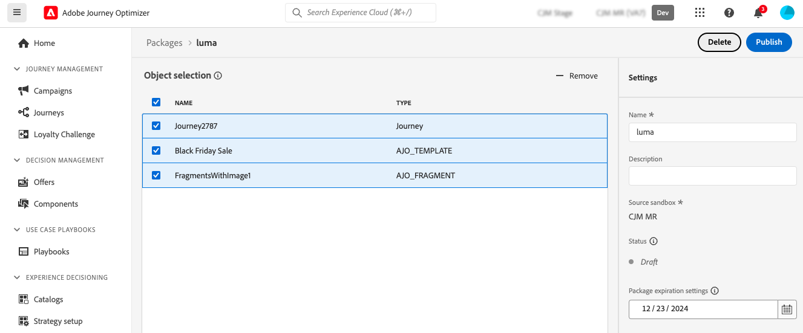

# 다른 샌드박스로 개체 내보내기 {#copy-to-sandbox}

패키지 내보내기 및 가져오기 기능을 사용하여 여러 샌드박스에서 여정, 콘텐츠 템플릿 또는 조각과 같은 개체를 복사할 수 있습니다. 패키지는 단일 개체 또는 여러 개체로 구성될 수 있습니다. 패키지에 포함되는 모든 개체는 동일한 샌드박스에서 가져온 개체여야 합니다.

이 페이지에서는 Journey Optimizer 컨텍스트에서 샌드박스 도구 사용 사례를 설명합니다. 기능 자체에 대한 자세한 내용은 [Experience Platform 설명서](https://experienceleague.adobe.com/docs/experience-platform/sandbox/ui/sandbox-tooling.html)를 참조하세요.

>[!NOTE]
>
>이 기능을 사용하려면 **샌드박스 관리** 기능의 사용 권한이 필요합니다. 샌드박스 관리(또는 샌드박스 보기) 및 패키지 관리. [자세히 알아보기](../administration/ootb-permissions.md)

복사 프로세스는 소스 샌드박스와 대상 샌드박스 간에 패키지 내보내기 및 가져오기를 통해 수행됩니다. 다음은 한 샌드박스에서 다른 샌드박스로 여정을 복사하는 일반적인 단계입니다.

1. 소스 샌드박스에서 패키지로 내보낼 개체를 추가합니다.
1. 패키지를 대상 샌드박스로 내보냅니다.

## 내보낸 오브젝트 및 모범 사례 {#objects}

Journey Optimizer을 사용하면 여정, 콘텐츠 템플릿 및 조각을 다른 샌드박스로 내보낼 수 있습니다. 다음 섹션에서는 각 객체 유형에 대한 정보와 모범 사례를 제공합니다.

### 일반 모범 사례 {#global}

* 개체를 복사할 때 종속성(예: 중첩된 조각, 여정 대상 또는 작업)이 상위 개체에서 올바르게 업데이트되므로 대상 샌드박스에서 적절한 매핑이 보장됩니다.

* 내보낸 오브젝트에 프로필 개인화가 포함된 경우 개인화 문제를 방지하기 위해 Target 샌드박스에 적절한 스키마가 존재하는지 확인하십시오.

### 여정 {#journeys}

* 여정을 내보낼 때 여정 자체 외에도 Journey Optimizer은 여정이 의존하는 대부분의 개체(대상, 스키마, 이벤트 및 작업)도 복사합니다. 복사된 개체에 대한 자세한 내용은 이 [섹션](https://experienceleague.adobe.com/docs/experience-platform/sandbox/ui/sandbox-tooling.html#abobe-journey-optimizer-objects)을(를) 참조하세요.

* 연결된 모든 요소가 대상 샌드박스에 복사된다고 보장하지는 않습니다. 예를 들어 여정을 게시하기 전에 철저한 검사를 수행하는 것이 좋습니다. 이를 통해 잠재적인 누락된 오브젝트를 식별할 수 있습니다.

* Target 샌드박스에서 복사되는 객체는 고유하며, 기존 요소를 덮어쓸 위험이 없습니다. 여정과 여정 내의 모든 메시지는 초안 모드에서 가져옵니다. 이렇게 하면 Target 샌드박스에서 게시하기 전에 전체 유효성 검사를 수행할 수 있습니다.

* 복사 프로세스는 여정 및 해당 여정의 객체에 대한 메타데이터에만 복사합니다. 이 프로세스의 일부로 프로필 또는 데이터 세트 데이터가 복사되지 않습니다.

### 캠페인(#campaigns)

캠페인은 프로필, 대상자, 스키마, 인라인 메시지 및 종속 오브젝트와 관련된 모든 항목과 함께 복사됩니다.

그러나 다음 항목은 **복사되지 않습니다**.

* 다국어 변형 및 언어 설정
* 실험 변형
* 의사 결정 정책 및 의사 결정 항목
* 비즈니스 규칙
* 태그
* 데이터 사용 레이블 및 적용(DULE) 레이블

캠페인이 복사되면 채널 구성을 수동으로 선택해야 합니다.

### 콘텐츠 템플릿 {#content-templates}

* 콘텐츠 템플릿을 내보낼 때 중첩된 조각도 모두 함께 복사됩니다.

* 콘텐츠 템플릿을 내보내면 경우에 따라 조각이 중복될 수 있습니다. 예를 들어 두 템플릿이 동일한 조각을 공유하고 별도의 패키지에 복사된 경우 두 템플릿 모두 대상 샌드박스에서 동일한 조각을 재사용해야 합니다. 중복을 방지하려면 가져오기 프로세스 중에 &quot;기존 사용&quot; 옵션을 선택합니다. [패키지 가져오기 방법 알아보기](#import)

* 중복을 방지하려면 컨텐츠 템플릿을 단일 패키지로 내보내는 것이 좋습니다. 이를 통해 시스템에서 중복 제거를 효율적으로 관리할 수 있습니다.

### 조각 {#fragments}

* 조각에는 라이브, 초안 및 진행 중인 초안과 함께 라이브 등 여러 상태가 있을 수 있습니다. 조각을 내보낼 때 최신 초안 상태가 대상 샌드박스에 복사됩니다.

* 조각을 내보낼 때 중첩된 조각도 모두 함께 복사됩니다.

## 개체를 패키지로 추가{#export}

오브젝트를 다른 샌드박스로 복사하려면 먼저 소스 샌드박스에서 오브젝트를 패키지로 추가해야 합니다. 다음 단계를 수행하십시오.

1. 여정 목록과 같이 복사할 첫 번째 객체가 저장된 인벤토리로 이동합니다. **추가 작업** 아이콘(개체 이름 옆에 있는 세 점)을 클릭하고 **패키지에 추가**&#x200B;를 클릭합니다.

   

1. **패키지에 추가** 창에서 기존 패키지에 개체를 추가하거나 새 패키지를 만들 것인지 선택합니다.

   

   * **기존 패키지**: 드롭다운 메뉴에서 패키지를 선택합니다.
   * **새 패키지를 만듭니다**: 패키지 이름을 입력하십시오. 설명을 추가할 수도 있습니다.

1. 이 단계를 반복하여 패키지와 함께 내보낼 모든 개체를 추가합니다.

>[!NOTE]
>
>여정 내보내기의 경우 여정 자체 외에도 Journey Optimizer은 여정이 의존하는 대부분의 개체(대상, 스키마, 이벤트 및 작업)도 복사합니다. 여정 내보내기에 대한 자세한 내용은 [이 섹션](../building-journeys/copy-to-sandbox.md)을 참조하세요.

## 내보낼 패키지 게시 {#publish}

패키지를 내보낼 준비가 되면 다음 단계에 따라 게시합니다.

1. **[!UICONTROL 관리]** > **[!UICONTROL 샌드박스]** 메뉴로 이동하여 **패키지** 탭을 선택합니다.

1. 내보낼 패키지를 열고 내보낼 개체를 선택한 다음 **게시**&#x200B;를 클릭합니다.

   이 예제에서는 여정, 콘텐츠 템플릿 및 조각을 내보내려고 합니다.

   

1. **[!UICONTROL 작업]** 탭에서 패키지 게시의 상태를 추적합니다. 작업에 대한 자세한 내용을 보려면 목록에서 해당 작업을 선택하고 **[!UICONTROL 가져오기 세부 정보 보기]** 단추를 클릭하십시오.

   

## Target 샌드박스에서 패키지 가져오기 {#import}

패키지가 게시되면 대상 샌드박스로 가져와야 합니다. 다음 단계를 수행하십시오.

1. **[!UICONTROL 샌드박스]** 메뉴로 이동하여 **[!UICONTROL 찾아보기]** 탭을 선택합니다.

1. 패키지를 가져올 샌드박스를 검색한 다음 이름 옆에 있는 + 아이콘을 클릭합니다.

   

   >[!NOTE]
   >
   >조직 내 샌드박스만 사용할 수 있습니다.

1. **대상 샌드박스** 필드에서 올바른 대상 샌드박스가 선택되었는지 확인하고 **[!UICONTROL 패키지 이름]** 드롭다운 목록에서 가져올 패키지를 선택합니다. **다음**&#x200B;을 클릭합니다.

   

1. 패키지 개체 및 종속성을 검토합니다. 여정이 종속된 다른 개체(예: 대상, 스키마, 이벤트 또는 작업)와 함께 패키지에 추가된 개체 목록입니다.

   각 개체에 대해 새 개체를 만들거나 대상 샌드박스에서 기존 개체를 사용하도록 선택할 수 있습니다. 예를 들어 일반 조각을 사용하여 콘텐츠 템플릿을 가져올 때 발생할 수 있는 조각 중복을 방지할 수 있습니다.

   

1. 오른쪽 상단의 **완료** 단추를 클릭하여 대상 샌드박스에 패키지 복사를 시작합니다. 복사 프로세스는 객체의 복잡성과 복사해야 하는 객체 수에 따라 다릅니다.

1. 가져오기 작업을 클릭하여 복사 결과를 검토합니다.

   * **가져온 개체 보기** 단추를 클릭하여 복사된 각 개별 개체를 표시합니다.
   * **가져오기 세부 정보 보기** 단추를 클릭하여 각 개체에 대한 가져오기 결과를 확인합니다.

   

1. 대상 샌드박스에 액세스하여 복사된 모든 객체를 철저히 검사합니다.
