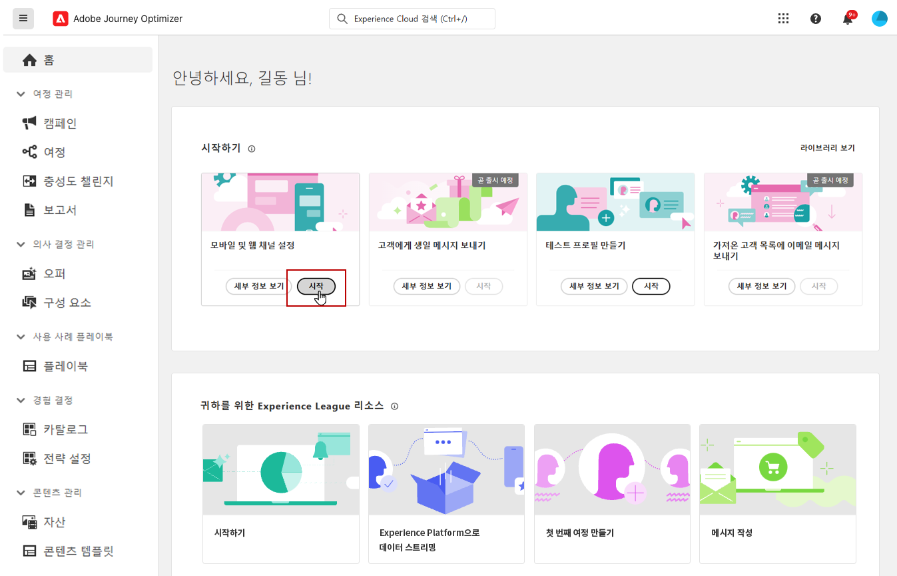
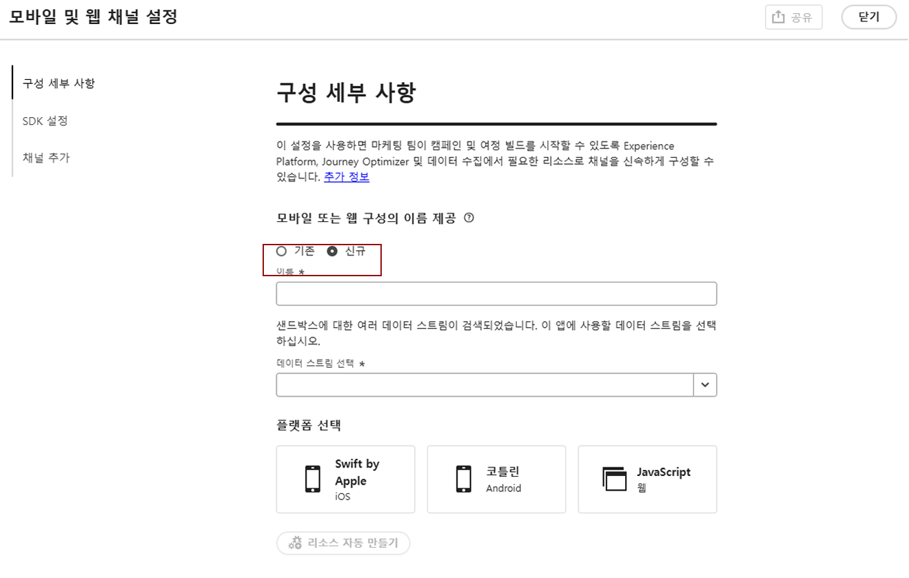
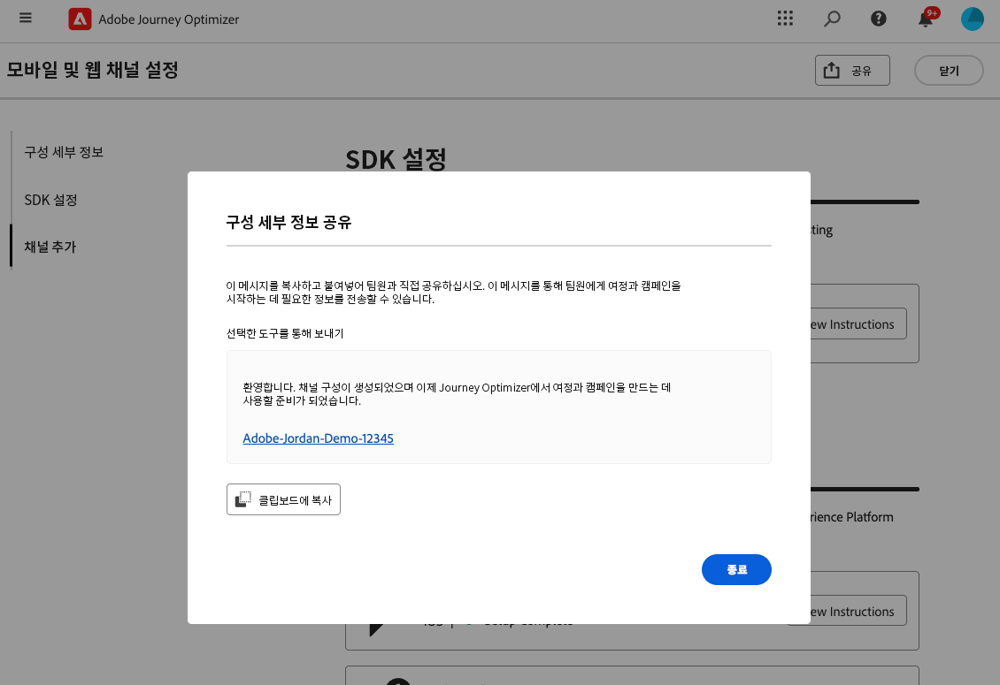
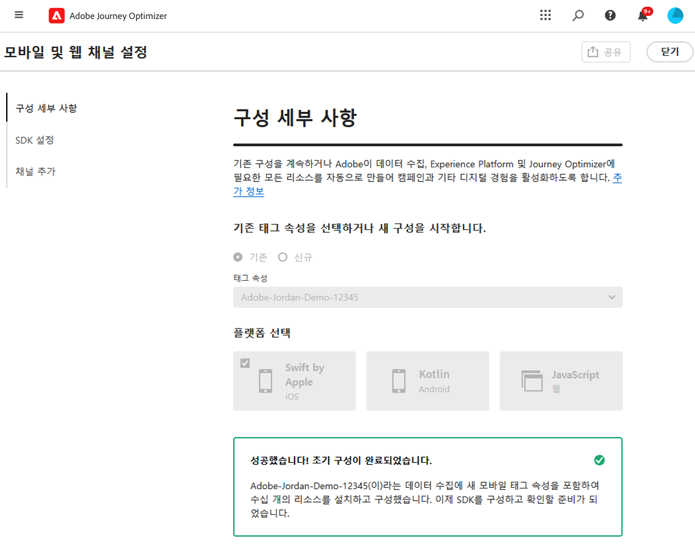
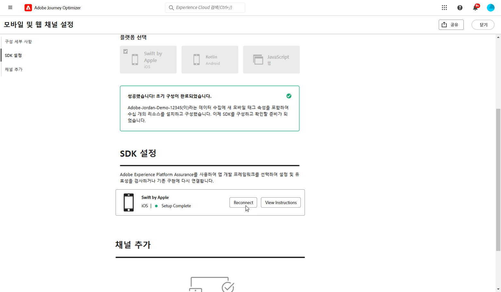
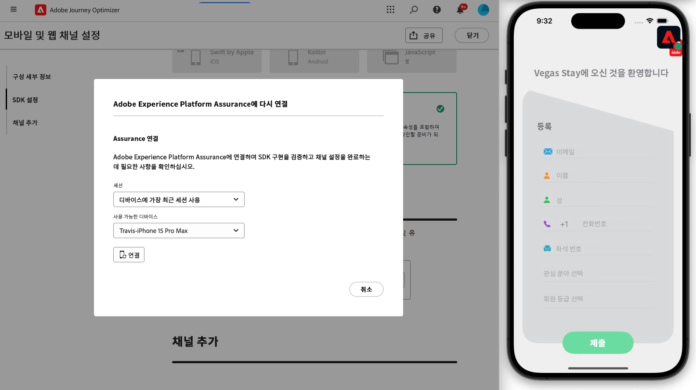

# 채널 설정 만들기 {#set-mobile-ios}

>[!CONTEXTUALHELP]
>id="ajo_mobile_web_setup_javascript_code"
>title="Javascript 코드"
>abstract="헤드 태그에는 웹 페이지의 기본 콘텐츠 전에 로드되는 필수 메타데이터와 리소스가 포함되어 있습니다. 이 섹션에 코드를 삽입하면 조기에 제대로 초기화되고 실행되므로 웹 페이지를 효율적으로 로드하고 사용할 수 있습니다. head 섹션에 코드를 추가하면 사이트의 구조, 성능 및 전반적인 사용자 경험을 향상시킬 수 있습니다."

>[!CONTEXTUALHELP]
>id="ajo_mobile_web_setup_push_token"
>title="장치 토큰 검색"
>abstract="장치의 푸시 토큰이 Adobe Experience Platform 프로필과 제대로 동기화되도록 하려면 다음 코드를 애플리케이션에 통합해야 합니다. 이러한 통합은 최신 통신 기능을 유지하고 원활한 사용자 경험을 보장하기 위해 필수적입니다."

>[!CONTEXTUALHELP]
>id="ajo_mobile_web_setup_push_xcode"
>title="Xcode에서 응용 프로그램 실행"
>abstract="푸시 토큰을 얻으려면 먼저 Xcode를 사용하여 애플리케이션을 시작합니다. 응용 프로그램이 시작된 후 응용 프로그램을 다시 시작하여 유효성 검사 프로세스가 완료되었는지 확인합니다. 그런 다음 Adobe은 유효성 검사 결과의 일부로 푸시 토큰을 제공합니다. 이 토큰은 푸시 알림을 활성화하는 데 필수적이며 설정의 유효성을 검사하면 표시됩니다."

>[!CONTEXTUALHELP]
>id="ajo_mobile_web_push_certificate_fcm"
>title="푸시 인증서 제공"
>abstract=".json 개인 키 파일을 끌어서 놓습니다. 이 파일에는 응용 프로그램과 서버 간의 보안 통합 및 통신에 필요한 인증 정보가 들어 있습니다."

>[!CONTEXTUALHELP]
>id="ajo_mobile_web_setup_push_certificate"
>title="푸시 인증서 제공"
>abstract=".p8 키 파일에는 보안 푸시 알림을 위해 Apple 서버를 사용하여 앱을 인증하는 데 사용되는 개인 키가 포함되어 있습니다. 개발자 계정의 인증서, 식별자 및 프로필 페이지에서 이 키를 가져올 수 있습니다."

>[!CONTEXTUALHELP]
>id="ajo_mobile_web_setup_push_key_id"
>title="키 ID"
>abstract="키 ID는 p8 인증 키를 만드는 동안 할당된 10자 문자열로서, 개발자 계정의 인증서, 식별자 및 프로필 페이지의 **키** 탭에서 찾을 수 있습니다."

>[!CONTEXTUALHELP]
>id="ajo_mobile_web_setup_push_team_id"
>title="팀 ID"
>abstract="팀을 식별하는 데 사용되는 문자열 값인 팀 ID는 개발자 계정의 **구성원** 탭에서 찾을 수 있습니다."

이 설정을 사용하면 마케팅 채널의 빠른 구성이 간소화되어 Experience Platform, Journey Optimizer 및 데이터 수집 앱에서 모든 필수 리소스를 쉽게 사용할 수 있습니다. 이렇게 하면 마케팅 팀이 캠페인 및 여정 만들기를 빠르게 시작할 수 있습니다.

1. Journey Optimizer 홈페이지에서 **[!UICONTROL 모바일 및 웹 채널 설정]** 카드에서 **[!UICONTROL 시작]**&#x200B;을 클릭합니다.

   

1. **[!UICONTROL 새]** 구성을 만듭니다.

   기존 구성이 있는 경우 하나를 선택하거나 새 구성을 만들 수 있습니다.

   

1. 새 구성에 대한 **[!UICONTROL 이름]**&#x200B;을(를) 입력하고 **[!UICONTROL 데이터 스트림]**&#x200B;을(를) 선택하거나 만드세요. 이 **[!UICONTROL 이름]**&#x200B;은(는) 자동으로 만든 모든 리소스에 사용됩니다.

1. 조직에 여러 데이터 스트림이 있는 경우 기존 옵션 중에서 하나를 선택하십시오. 데이터 스트림이 없는 경우 자동으로 만들어집니다.

1. 플랫폼을 선택하고 **[!UICONTROL 리소스 자동 만들기]**&#x200B;를 클릭합니다.

1. 설치 프로세스를 간소화하기 위해 시작하는 데 도움이 되는 필수 리소스가 자동으로 생성됩니다. 여기에는 새 **[!UICONTROL Mobile 태그 속성]**&#x200B;을 만들고 확장을 설치하는 작업이 포함됩니다.

   [자동 생성된 리소스에 대해 자세히 알아보기](set-mobile-config.md#auto-create-resources)

1. 리소스 생성이 완료되면 사용자 인터페이스의 지침에 따라 SDK 및 채널을 설정하고 확인합니다.

1. 구성을 완료한 후 자동 생성된 **[!UICONTROL 채널 구성]**&#x200B;을(를) 여정 및 캠페인 생성을 담당하는 팀원과 공유합니다.

   {zoomable="yes"}

1. 이제 캠페인 또는 여정 인터페이스에서 **[!UICONTROL 채널 구성]**&#x200B;을(를) 참조할 수 있으므로 설정과 타깃팅된 여정 및 캠페인의 실행 간에 원활한 연결이 가능합니다.

## 모바일 기존 구성 수정 {#reconnect}

구성을 만든 후 언제든지 쉽게 다시 방문하여 채널을 추가하거나 필요에 따라 추가 조정할 수 있습니다

1. Journey Optimizer 홈페이지에서 **[!UICONTROL 모바일 및 웹 채널 설정]** 카드에서 **[!UICONTROL 시작]**&#x200B;을 클릭합니다.

   

1. **[!UICONTROL 기존]**&#x200B;을(를) 선택하고 드롭다운에서 기존 **[!UICONTROL Tag 속성]**&#x200B;을(를) 선택합니다.

   

1. 기존 구성에 액세스할 때 Adobe Assurance과 다시 연결해야 합니다. SDK 설정 메뉴에서 **[!UICONTROL 다시 연결]**&#x200B;을 클릭합니다.

   

1. **[!UICONTROL 사용 가능한 장치]** 드롭다운에서 장치를 선택하고 **[!UICONTROL 연결]**&#x200B;을 클릭합니다.

   {zoomable="yes"}

1. 이제 필요에 따라 구성을 업데이트할 수 있습니다.
