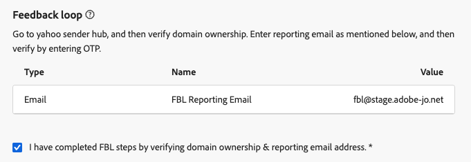

# 이메일 하위 도메인을 CNAME에서 사용자 지정 위임으로 마이그레이션 {#migrate-cname-to-custom}

>[!AVAILABILITY]
>
>이 기능은 제한적으로 이용할 수 있습니다. 액세스 권한을 얻으려면 Adobe 담당자에게 문의하십시오.

하위 도메인이 현재 [CNAME](about-subdomain-delegation.md#cname-subdomain-setup)(으)로 설정된 경우 회사의 보안 정책을 충족하도록 **[!UICONTROL 사용자 지정 위임]** 메서드로 마이그레이션할 수 있습니다. 이를 통해 [!DNL Journey Optimizer] 내의 하위 도메인 및 인증서에 대한 완전한 소유권과 제어 권한을 얻을 수 있습니다. [사용자 지정 하위 도메인에 대해 자세히 알아보기](delegate-custom-subdomain.md)

이 프로세스의 일부로 다음을 수행해야 합니다.

* 호스팅 솔루션에서 [기존 DNS 레코드 삭제](#delete-dns)
* 인증 기관에서 가져온 [SSL 인증서 업로드](#upload-ssl-certificate)
* 도메인 소유권 및 보고 전자 메일 주소를 확인하여 [피드백 루프 단계](#feedback-loop)를 완료하십시오.
* Adobe에서 호스팅 플랫폼으로 생성한 [새 DNS 레코드 집합 만들기](#create-dns-records)

하위 도메인을 마이그레이션하려면 아래 단계를 따르십시오.

## 시작하기에 앞서 {#before-you-begin}

마이그레이션 프로세스를 시작하기 전에 아래의 중요 정보를 검토하십시오.

>[!IMPORTANT]
>
>[CNAME 메서드](delegate-subdomain.md#cname-subdomain-setup)(으)로 설정된 하위 도메인만 마이그레이션할 수 있습니다.

* 조직에 대해 **사용자 지정 위임 메서드가 활성화되어 있는지**&#x200B;확인합니다(이 기능은 현재 제한된 가용성의 상태입니다. 액세스 권한을 얻으려면 Adobe 담당자에게 문의하십시오). [자세히 알아보기](delegate-custom-subdomain.md)
* 이 하위 도메인을 사용하는 활성 채널 구성이 없는지 확인합니다. 마이그레이션 프로세스는 해당 기능을 중단합니다.

  >[!NOTE]
  >
  >마이그레이션을 시작하기 전에 채널 구성을 비활성화하면 마이그레이션 작업 과정이 완료된 후 다시 활성 상태로 변경할 수 있습니다.

* 이 하위 여정에 연결된 채널 구성을 사용하면 게재 중단이 발생할 수 있으므로 활성 캠페인이나 도메인이 없는지 확인합니다.
* 마이그레이션 흐름에 들어가는 즉시 다운타임이 시작됩니다. 하위 도메인이 프로세스 중에 **[!UICONTROL 초안]**(으)로 이동하며 설정이 완료될 때까지 사용할 수 없습니다.
* 따라서 SSL 인증서를 준비하고 가동 중단을 줄이기 위해 **마이그레이션 프로세스를 시작하기 전에 마이그레이션 전 단계를 수행**&#x200B;하는 것이 좋습니다. [자세히 알아보기](#start-migration)

## 마이그레이션 시작 {#start-migration}

주어진 하위 도메인 마이그레이션을 시작하려면 아래 단계를 따르십시오.

1. **[!UICONTROL 관리]** > **[!UICONTROL 채널]** > **[!UICONTROL 전자 메일 설정]** > **[!UICONTROL 하위 도메인]**(으)로 이동합니다.

1. CNAME으로 설정된 하위 도메인을 선택하고 엽니다.

1. **[!UICONTROL 마이그레이션 전 CSR 생성]** 섹션을 사용하여 인증 기관에 전송할 CSR을 생성하고 마이그레이션 프로세스가 시작될 때 SSL 인증서를 준비할 수 있습니다. [방법 알아보기](#send-csr-to-ca)

   >[!IMPORTANT]
   >
   >마이그레이션 전 단계는 이 단계에서 선택 사항이지만 적극 권장합니다. 마이그레이션을 시작하기 전에 **이전**&#x200B;을(를) 완료하면 가동 중지 시간이 줄어들고 원활한 전환이 가능합니다.

   {width="70%"}

1. 전용 섹션에서 **[!UICONTROL 지금 마이그레이션]**&#x200B;을 선택합니다.

   <!--{width=90%}-->

1. [표시된 정보](#before-you-begin)를 검토하십시오.

   >[!WARNING]
   >
   >마이그레이션 흐름에 들어가는 즉시 다운타임이 시작되므로 활성 캠페인 및 여정에 영향을 주지 않도록 하십시오.

1. **[!UICONTROL 예]**&#x200B;를 클릭합니다. 하위 도메인이 **[!UICONTROL 초안]** 상태로 이동하며 설정이 완료될 때까지 사용할 수 없습니다.

## CSR을 생성하여 인증 기관으로 전송 {#send-csr-to-ca}

마이그레이션을 완료하려면 인증 기관(CA)에서 발급한 SSL 인증서가 필요합니다. 이 SSL 인증서를 받으려면 먼저 CSR(인증서 서명 요청)을 생성하여 CA로 보내야 합니다.

마이그레이션 프로세스를 이미 시작했는지 여부에 관계없이 아래 단계에 따라 새 CSR을 생성하고 전송하십시오.

1. **[!UICONTROL CSR 다시 생성]**&#x200B;을 클릭합니다.

1. 표시되는 양식을 채우고 CSR(인증서 서명 요청)을 다시 생성합니다.

   {width="60%"}

   >[!NOTE]
   >
   >키 길이는 2048비트 또는 4096비트만 가능합니다. 하위 도메인이 제출된 후에는 변경할 수 없습니다.

1. **[!UICONTROL CSR 다운로드]**&#x200B;를 클릭하고 양식을 로컬 컴퓨터에 저장합니다.

1. SSL 인증서를 받으려면 인증 기관(CA)에 보냅니다. 서명을 위해 이 CSR을 CA에 제출하기 전에 고려해야 할 몇 가지 중요한 사항이 있습니다.

   * 3단계에서 다운로드한 CSR은 data.subdomain.com에만 해당됩니다.

   * 그러나 이 인증서는 단일 인증서 내에서 SAN(주체 대체 이름) 항목으로 data.subdomain.com 및 cdn.subdomain.com 를 모두 포함해야 합니다. 예를 들어, example.adobe.com을 위임하는 경우 data.subdomain.com은 data.example.adobe.com에 해당하고 cdn.subdomain.com은 cdn.example.adobe.com에 해당합니다.

   * 데이터(data.example.adobe.com)와 CDN(cdn.example.adobe.com) 하위 도메인은 동일한 인증서의 피어 항목으로 추가해야 합니다. 이 인증서에는 추가 하위 도메인을 추가해서는 안 됩니다.

   * 대부분의 CA를 사용하면 서명 프로세스 중에 CDN 하위 도메인과 같은 SAN을 추가할 수 있습니다

      * CA 포털을 통해(가능한 경우 권장) 또는
      * 포털 옵션을 사용할 수 없는 경우 지원 팀에 수동으로 요청하십시오.

   * 서명되면 CA는 데이터 도메인과 CDN 하위 도메인을 모두 포함하는 단일 인증서를 발행합니다.

## 기존 DNS 레코드 삭제 {#delete-dns}

마이그레이션 프로세스를 시작한 후에는 호스팅 솔루션에서 기존 DNS 레코드를 삭제해야 합니다. 아래 단계를 수행합니다.

1. 현재 DNS 서버에 구성된 레코드 목록이 표시됩니다.

1. 도메인 호스팅 솔루션으로 이동하여 DNS 호스팅에서 기존 CNAME 항목을 삭제합니다.

1. 모든 DNS 레코드가 삭제되었는지 확인합니다. 완료되면 &quot;호스팅 사이트에서 필수 레코드를 삭제했음을 확인합니다.&quot; 상자를 선택합니다.

   {width="75%"}

## SSL 인증서 업로드 {#upload-ssl-certificate}

**[!UICONTROL SSL 인증서]** 섹션에서 새 SSL 인증서를 [!DNL Journey Optimizer]에 업로드해야 합니다.

그 전에 다음을 확인하십시오.

* [마이그레이션 전 단계](#start-migration)의 일부로 CSR을 인증 기관에 이미 보낸 경우 SSL 인증서를 받았는지 확인하십시오.

* 아직 수행하지 않았다면 [CSR을 생성하고 다운로드하고 보내기](#send-csr-to-ca)하는 단계를 따르십시오.

<!--
    * Click **[!UICONTROL Regenerate CSR]** and fill the form to generate the Certificate Signing Request.

    * Click **[!UICONTROL Download CSR]** to save the form to your local computer.

    * Send the CSR to the Certificate Authority to get your SSL certificate.
-->

1. SSL 인증서를 검색한 후 **[!UICONTROL 인증서 업로드]**&#x200B;를 클릭합니다.

   {width="75%"}

1. 전체 인증서 체인을 사용하여 SSL 인증서를 .pem 형식으로 [!DNL Journey Optimizer]에 업로드합니다. 다음은 .pem 파일 형식의 샘플입니다.

   ```
   -----BEGIN CERTIFICATE-----
   MIIDXTCCAkWgAwIBAgIJALc3... (base64 encoded data)
   -----END CERTIFICATE-----
   ```

1. &quot;SSL 인증서를 업로드했음을 확인합니다.&quot; 상자를 선택합니다.

## 전체 피드백 루프 {#feedback-loop}

그런 다음 피드백 루프 단계를 완료하여 도메인 소유권 및 보고 이메일 주소를 확인합니다.

{width="75%"}

이 프로세스는 새 사용자 정의 하위 도메인을 설정할 때와 동일합니다. [사용자 지정 하위 도메인 설정](delegate-custom-subdomain.md#feedback-loop-steps) 페이지에 설명된 단계를 따릅니다.


## 새 DNS 레코드 집합 만들기 {#create-dns-records}

마이그레이션 프로세스를 완료하려면 호스팅 플랫폼에서 Adobe이 생성한 새 DNS 레코드 집합을 만드십시오.

1. 피드백 루프 단계를 완료한 후 화면 오른쪽 상단의 **[!UICONTROL 계속]** 단추를 클릭합니다.

   이 단계에서는 이전 레코드가 삭제되고 SSL 인증서가 올바르게 업로드되었는지 확인합니다. 오류가 발생하면 [문제 해결 검사 목록](#troubleshooting)을 참조하세요.

1. 모든 유효성 검사가 성공하면 **[!UICONTROL 만들 레코드]** 섹션이 표시됩니다.

   {width="100%"}

1. 호스팅 플랫폼에서 모든 필수 레코드를 만듭니다.

1. 모든 레코드가 만들어지면 **[!UICONTROL 제출]**&#x200B;을 클릭합니다.

   >[!NOTE]
   >
   >나열된 모든 레코드가 생성되지 않으면 오류가 표시됩니다. 모든 필수 레코드를 만들어야 합니다.

제출 후 Adobe에서 필요한 검사를 수행할 때까지 기다려야 하며 최대 3시간이 걸릴 수 있습니다. [자세히 알아보기](delegate-subdomain.md#submit-subdomain)

하위 도메인이 다시 활성화되면 해당 도메인을 사용하는 기존 채널 구성을 변경할 필요가 없습니다. 이전처럼 계속 작동합니다.

## 문제 해결 체크리스트 {#troubleshooting}

사용자 지정 하위 도메인을 제출하려는 동안 오류가 발생하면 아래 나열된 문제 해결 작업을 수행하십시오.

* _리소스를 확인할 수 없습니다. DNS가 아직 있으므로 삭제해야 합니다._ — 호스팅 솔루션에서 모든 레코드를 삭제해야 합니다. [방법 알아보기](#delete-dns)
* _리소스를 확인할 수 없습니다. SSL 인증서를 업로드하고 다시 시도하십시오._ — SSL 인증서가 업로드되지 않았습니다. 업로드해야 합니다. [방법 알아보기](#upload-ssl-certificate)
* _인증서의 SAN(주체 대체 이름)에 예기치 않은 도메인이 있습니다._ — 올바른 SSL 인증서를 업로드해야 합니다. [방법 알아보기](#upload-ssl-certificate)
* _인증서에 SAN(주체 대체 이름)에 필요한 다음 도메인이 없습니다._ — 올바른 SSL 인증서를 업로드해야 합니다. [방법 알아보기](#upload-ssl-certificate)

**참조**

* [사용자 정의 하위 도메인 설정](delegate-custom-subdomain.md)
* [하위 도메인 위임 방법](about-subdomain-delegation.md#subdomain-delegation-methods)
