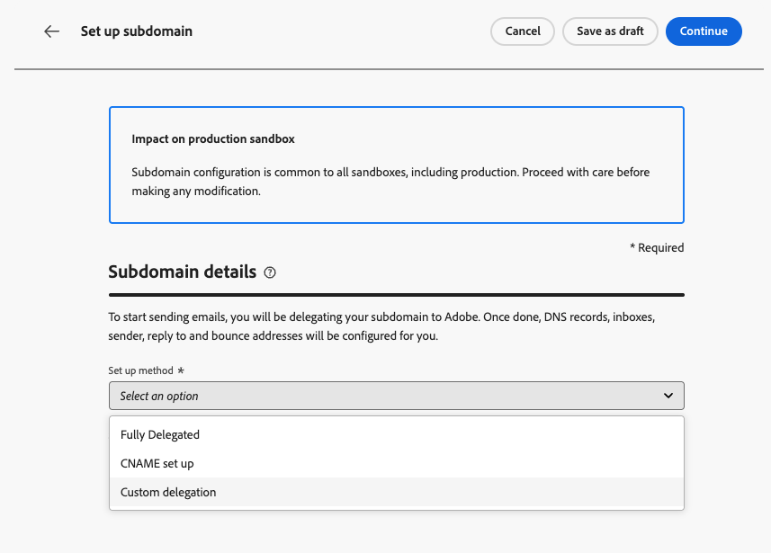

# 사용자 정의 하위 도메인 설정 {#delegate-custom-subdomain}

>[!AVAILABILITY]
>
>이 기능은 제한적으로 이용할 수 있습니다. 액세스 권한을 얻으려면 Adobe 담당자에게 문의하세요.

[완전히 위임됨](about-subdomain-delegation.md#full-subdomain-delegation) 및 [CNAME 설정](about-subdomain-delegation.md#cname-subdomain-delegation) 메서드를 사용하지 않는 대신 **사용자 지정 위임** 메서드를 사용하면 Journey Optimizer ans 내에서 하위 도메인의 소유권을 가져와 생성된 인증서를 완전히 제어할 수 있습니다.

이 프로세스의 일부로 Adobe은 DNS가 메시지 게재, 렌더링 및 추적을 위해 적절하게 구성되어 있는지 확인해야 합니다. 따라서 인증 기관에서 받은 SSL 인증서를 [업로드](#upload-ssl-certificate)하고 도메인 소유권을 확인하고 전자 메일 주소를 보고하여 [피드백 루프 단계](#feedback-loop-steps)를 완료해야 합니다.

사용자 정의 하위 도메인을 설정하려면 아래 단계를 따르십시오.

1. **[!UICONTROL 관리]** > **[!UICONTROL 채널]** > **[!UICONTROL 전자 메일 설정]** > **[!UICONTROL 하위 도메인]** 메뉴에 액세스합니다.

1. **[!UICONTROL 하위 도메인 설정]**&#x200B;을 클릭합니다.

1. **[!UICONTROL 메서드 설정]** 섹션에서 **[!UICONTROL 사용자 지정 위임]**&#x200B;을 선택합니다.

   {width=90%}

1. 위임할 하위 도메인의 이름을 지정합니다.

   >[!CAUTION]
   >
   >동일한 발신 도메인을 사용하여 [!DNL Adobe Journey Optimizer] 및 다른 제품(예: [!DNL Adobe Campaign] 또는 [!DNL Adobe Marketo Engage])에서 메시지를 보낼 수 없습니다.

## DNS 레코드 만들기 {#create-dns-records}

>[!CONTEXTUALHELP]
>id="ajo_admin_subdomain_custom_dns"
>title="일치하는 DNS 레코드 생성"
>abstract="사용자 정의 하위 도메인을 Adobe에 위임하려면 Journey Optimizer 인터페이스에 표시된 이름 서버 정보를 복사한 다음 도메인 호스팅 솔루션에 붙여넣어 일치하는 DNS 레코드를 생성해야 합니다."

1. DNS 서버에 배치할 레코드 목록이 표시됩니다. 이러한 레코드를 하나씩 복사하거나 CSV 파일을 다운로드하여 복사합니다.

1. 일치하는 DNS 레코드를 생성하려면 도메인 호스팅 솔루션으로 이동합니다.

1. 모든 DNS 레코드가 도메인 호스팅 솔루션에 생성되었는지 확인합니다.

1. 모든 항목이 올바르게 구성된 경우 &quot;I confirm...&quot; 상자를 선택합니다.

   {width="75%"}

## SSL 인증서 업로드 {#upload-ssl-certificate}

>[!CONTEXTUALHELP]
>id="ajo_admin_subdomain_custom-ssl"
>title="인증서 서명 요청 생성"
>abstract="새로운 사용자 정의 하위 도메인을 설정할 때 인증서 서명 요청(CSR)을 생성하고, 이를 작성한 후 인증 기관으로 보내 Journey Optimizer에 업로드하는 데 필요한 SSL 인증서를 받아야 합니다."

>[!CONTEXTUALHELP]
>id="ajo_admin_subdomain_key_length"
>title="키 길이 선택"
>abstract="키 길이는 2048비트 또는 4096비트만 가능합니다. 하위 도메인이 제출된 후에는 변경할 수 없습니다."

1. **[!UICONTROL SSL 인증서]** 섹션에서 **[!UICONTROL CSR 생성]**&#x200B;을 클릭합니다.

   {width="85%"}

   >[!NOTE]
   >
   >SSL 인증서 만료 날짜가 표시됩니다. 날짜가 되면 새 인증서를 업로드해야 합니다.

1. 표시되는 양식을 작성하고 CSR(인증서 서명 요청)을 생성합니다.

   {width="70%"}

   >[!NOTE]
   >
   >키 길이는 2048비트 또는 4096비트만 가능합니다. 하위 도메인이 제출된 후에는 변경할 수 없습니다.

1. **[!UICONTROL CSR 다운로드]**&#x200B;를 클릭하고 양식을 로컬 컴퓨터에 저장합니다.

1. SSL 인증서를 받으려면 인증 기관(CA)에 보냅니다. 서명을 위해 이 CSR을 CA에 제출하기 전에 고려해야 할 몇 가지 중요한 사항이 있습니다.

   * 3단계에서 다운로드한 CSR은 data.subdomain.com에만 해당됩니다.

   * 그러나 이 인증서는 단일 인증서 내에서 SAN(주체 대체 이름) 항목으로 data.subdomain.com 및 cdn.subdomain.com 를 모두 포함해야 합니다. 예를 들어, example.adobe.com을 위임하는 경우 data.subdomain.com은 data.example.adobe.com에 해당하고 cdn.subdomain.com은 cdn.example.adobe.com에 해당합니다.

   * 데이터(data.example.adobe.com)와 CDN(cdn.example.adobe.com) 하위 도메인은 동일한 인증서의 피어 항목으로 추가해야 합니다.

   * 대부분의 CA를 사용하면 서명 프로세스 중에 CDN 하위 도메인과 같은 SAN을 추가할 수 있습니다

      * CA 포털을 통해(가능한 경우 권장) 또는
      * 포털 옵션을 사용할 수 없는 경우 지원 팀에 수동으로 요청하십시오.

   * 서명되면 CA는 데이터 도메인과 CDN 하위 도메인을 모두 포함하는 단일 인증서를 발행합니다.

1. 검색된 후에는 **[!UICONTROL SSL 인증서 업로드]**&#x200B;를 클릭하고 전체 인증서 체인을 사용하여 .pem 형식으로 인증서를 [!DNL Journey Optimizer]에 업로드하십시오. 다음은 .pem 파일 형식의 샘플입니다.

   ```
   -----BEGIN CERTIFICATE-----
   MIIDXTCCAkWgAwIBAgIJALc3... (base64 encoded data)
   -----END CERTIFICATE-----
   ```

<!--
>[!CAUTION]
>
>Both Data and CDN subdomains must be included in the same certificate.
-->

## 피드백 루프 단계 완료 {#feedback-loop-steps}

>[!CONTEXTUALHELP]
>id="ajo_admin_subdomain_feedback-loop"
>title="피드백 루프 단계 완료"
>abstract="Yahoo!로 이동 Sender Hub에서 양식을 작성하여 도메인 소유권을 확인합니다. 아래 나열된 FBL 보고 이메일 주소를 입력하고, Yahoo!에서 소유권을 확인하기 위해 수신된 OTP를 사용합니다. Sender Hub."

1. [Yahoo!로 이동 보낸 사람 허브 ](https://senders.yahooinc.com/) 웹 사이트에서 도메인 소유권을 확인하는 데 필요한 양식을 입력하십시오.

1. 도메인 소유권을 확인하려면 Yahoo! Sender Hub에서는 이메일 주소를 제공해야 합니다. **[!UICONTROL 값]**&#x200B;에 나열된 FBL 보고 전자 메일 주소를 입력하십시오. Adobe 소유 이메일 주소입니다.

1. Yahoo! Sender Hub는 OTP(일회용 암호)를 생성하므로 이 Adobe 주소로 전송됩니다.

1. 이 OTP를 제공할 Adobe 게재 팀에 문의하세요. <!--Specify how to reach out + any information that customer should share in the request to deliverability team to get access to the right OTP-->

   >[!CAUTION]
   >
   >OTP는 24시간 동안만 유효하므로 OTP가 생성되는 즉시 Adobe에 연락하십시오. <!--TBC?-->
   >
   >OTP 요청은 평일에만 수행할 수 있습니다. 주말에는 지원이 없습니다. <!--Add times + timezone-->

1. Yahoo!에서 OTP 입력 Sender Hub.

1. 피드백 루프 단계를 모두 완료했는지 확인합니다.

1. 모든 항목이 올바르게 구성된 경우 &quot;I has completed...&quot; 상자를 선택합니다.

   {width="85%"}

1. **[!UICONTROL 계속]**&#x200B;을 클릭하고 Adobe에서 호스팅 솔루션에 오류 없이 레코드가 생성되는지 확인할 때까지 기다립니다. 이 프로세스는 최대 2분 정도 소요될 수 있습니다.

   >[!NOTE]
   >
   >계속하기 전에 모든 레코드가 올바르게 생성되었는지 확인하십시오.

1. Adobe은 SSL CDN URL 유효성 검사 레코드를 생성합니다. 이 유효성 검사 레코드를 호스팅 플랫폼에 복사합니다. 호스팅 솔루션에서 이 레코드를 올바르게 만든 경우 &quot;확인...&quot; 상자를 선택합니다.

1. Adobe에서 필요한 검사를 수행하도록 하려면 **[!UICONTROL 제출]**&#x200B;을 클릭합니다. [자세히 알아보기](delegate-subdomain.md#submit-subdomain)

## 문제 해결 확인 목록 {#check-list}

사용자 지정 하위 도메인을 제출하려는 동안 오류가 발생하면 아래 나열된 문제 해결 작업을 수행하십시오.

* 모든 DNS 레코드가 DNS 조회 도구를 사용하여 올바르게 전파되었는지 확인합니다.

* 업로드하기 전에 인증서가 모든 기술 요구 사항을 충족하는지 확인하십시오.

* 인증서가 올바른 형식으로 업로드되었는지 확인하십시오.
