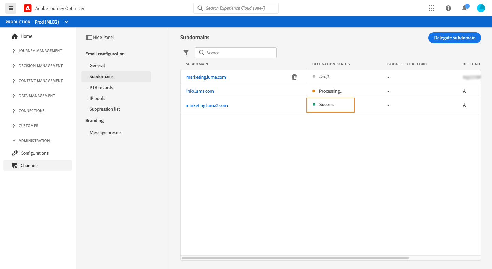

# 하위 도메인 위임

도메인 이름 위임은 도메인 이름의 소유자를 허용하는 메서드입니다(기술적으로 DNS 영역)에서 하위 집합을 위임(기술적 의미상: 하위 영역이라고 할 수 있는 DNS 영역을 다른 엔터티에 추가합니다. 기본적으로 고객이 &quot;example.com&quot; 영역을 처리하는 경우 하위 영역 &quot;marketing.example.com&quot;을 Adobe에 위임할 수 있습니다.

[!DNL Journey Optimizer]에서 사용할 하위 도메인을 위임하면 클라이언트는 Adobe을 이용하여 전자 메일 마케팅 전송 도메인에 대한 업계 표준 게재 능력 요구 사항을 충족하는 데 필요한 DNS 인프라를 유지 관리하는 동시에 내부 전자 메일 도메인에 대한 DNS를 유지 및 제어할 수 있습니다.

[!DNL Journey Optimizer] 제품 인터페이스에서 직접 Adobe에 하위 도메인을 완전히 위임할 수 있습니다. 이렇게 하면 Adobe은 이메일 캠페인 게재, 렌더링 및 추적에 필요한 DNS의 모든 측면을 제어하고 유지 관리하는 방식으로 메시지를 관리 서비스로 제공할 수 있습니다.

>[!NOTE]
>
>기본적으로 [!DNL Journey Optimizer] 사용권 계약을 사용하면 최대 10개의 하위 도메인을 위임할 수 있습니다. 이 제한을 늘리려면 Adobe 담당자에게 문의하십시오.
>
>Journey Optimizer에서는 하위 도메인 위임에 CNAME을 사용하는 것을 현재 지원하지 않습니다.

새 하위 도메인을 위임하려면 아래 단계를 따르십시오.

1. **[!UICONTROL Channels]** / **[!UICONTROL Subdomains]** 메뉴에 액세스한 다음 **[!UICONTROL Delegate subdomain]** 를 클릭합니다.

   

1. 위임할 하위 도메인의 이름을 지정합니다.

   

   >[!CAUTION]
   >
   >marketing.company.com과 같은 유효한 하위 도메인을 입력했는지 확인합니다. 잘못된 하위 도메인을 Adobe으로 위임하는 것은 허용되지 않습니다.

1. DNS 서버에 배치할 레코드 목록이 표시됩니다. 이러한 레코드를 하나씩 복사하거나 CSV 파일을 다운로드하여 복사한 다음 도메인 호스팅 솔루션으로 이동하여 일치하는 DNS 레코드를 생성합니다.

   모든 DNS 레코드가 도메인 호스팅 솔루션에 생성되었는지 확인합니다. 모든 것이 제대로 구성된 경우 &quot;I confirm..&quot; 상자를 선택한 후 **[!UICONTROL Submit]** 을 클릭합니다.

   

   >[!NOTE]
   >
   >레코드를 만들고 나중에 **[!UICONTROL Save as draft]** 버튼을 사용하여 하위 도메인 구성을 제출할 수 있습니다. 그런 다음 하위 도메인 목록에서 하위 도메인 위임을 열어 하위 도메인 위임을 다시 시작할 수 있습니다.

1. 하위 도메인 위임이 제출되면 하위 도메인이 **[!UICONTROL Processing]** 상태로 목록에 표시됩니다. 하위 도메인 상태에 대한 자세한 내용은 [이 섹션](access-subdomains.md)을 참조하십시오.

   아래 확인과 작업은 하위 도메인이 확인될 때까지 수행되며 메시지를 보내는 데 사용할 수 있습니다.

   이 단계는 Adobe에 의해 수행되며 최대 3시간이 걸릴 수 있습니다.

   1. 하위 도메인이 Adobe DNS(NS 레코드, SOA 레코드, 영역 설정, 소유권 레코드)에 위임되었는지 확인합니다.
   1. 도메인의 DNS 구성,
   1. 추적 및 미러 URL 만들기,
   1. CDN Cloud 전면 프로비저닝,
   1. CDN SSL 인증서 만들기, 유효성 검사 및 첨부
   1. Forward DNS 만들기,
   1. PTR 레코드를 만듭니다.

   

1. 확인이 성공하면 하위 도메인이 **[!UICONTROL Success]** 상태를 가져옵니다. 메시지를 전달하는 데 사용할 준비가 되었습니다.

   <!-- later on, users will be notified in Pulse -->

   

