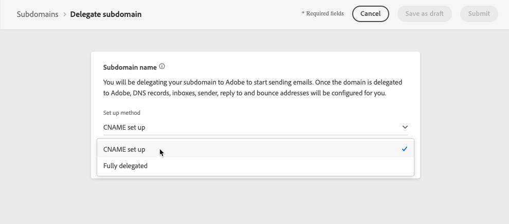

# 하위 도메인 위임 {#delegate-subdomain}

>[!CONTEXTUALHELP]
>id="ajo_admin_subdomainname"
>title="하위 도메인 위임 기본 정보"
>abstract="Journey Optimizer을 사용하면 하위 도메인을 Adobe에 완전히 위임할 수 있습니다. Adobe은 DNS의 모든 측면을 제어하고 유지 관리하여 메시지를 관리 서비스로 제공할 수 있습니다."

도메인 이름 위임은 도메인 이름의 소유자를 허용하는 메서드입니다(기술적으로 DNS 영역)에서 하위 집합을 위임(기술적 의미상: 하위 영역이라고 할 수 있는 DNS 영역을 다른 엔터티에 추가합니다. 기본적으로 고객으로서 &quot;example.com&quot; 영역을 처리하는 경우 하위 영역 &quot;marketing.example.com&quot;을 Adobe에 위임할 수 있습니다.

에 사용할 하위 도메인을 위임하여 [!DNL Journey Optimizer]를 사용하는 경우 클라이언트는 Adobe을 사용하여 전자 메일 마케팅 전송 도메인에 대한 업계 표준 게재 기능 요구 사항을 충족하는 데 필요한 DNS 인프라를 유지하고 내부 전자 메일 도메인에 대한 DNS를 계속 유지 관리할 수 있습니다.

## 전체 하위 도메인 위임 {#full-subdomain-delegation}

[!DNL Journey Optimizer] 제품 인터페이스에서 직접 Adobe에 하위 도메인을 완전히 위임할 수 있습니다. 이렇게 하면 Adobe은 이메일 캠페인 게재, 렌더링 및 추적에 필요한 DNS의 모든 측면을 제어하고 유지 관리하는 방식으로 메시지를 관리 서비스로 제공할 수 있습니다.

>[!NOTE]
>
>기본적으로 [!DNL Journey Optimizer] 사용권 계약을 사용하면 최대 10개의 하위 도메인을 위임할 수 있습니다. 이 제한을 늘리려면 Adobe 담당자에게 문의하십시오.

새 하위 도메인을 위임하려면 아래 단계를 따르십시오.

1. 액세스 권한 **[!UICONTROL Administration]** > **[!UICONTROL Channels]** > **[!UICONTROL Subdomains]** 메뉴를 클릭한 다음 **[!UICONTROL Set up subdomain]**.

   

1. 선택 **[!UICONTROL Fully delegated]** 에서 **[!UICONTROL Set up method]** 섹션을 참조하십시오.

   

1. 위임할 하위 도메인의 이름을 지정합니다.

   

   >[!CAUTION]
   >
   >잘못된 하위 도메인을 Adobe으로 위임하는 것은 허용되지 않습니다. marketing.yourcompany.com과 같이 조직이 소유한 유효한 하위 도메인을 입력해야 합니다.
   >
   >email.marketing.yourcompany.com과 같은 다중 수준 하위 도메인은 현재 지원되지 않습니다.

1. DNS 서버에 배치할 레코드 목록이 표시됩니다. 이러한 레코드를 하나씩 복사하거나 CSV 파일을 다운로드하여 복사한 다음 도메인 호스팅 솔루션으로 이동하여 일치하는 DNS 레코드를 생성합니다.

1. 모든 DNS 레코드가 도메인 호스팅 솔루션에 생성되었는지 확인합니다. 모든 것이 제대로 구성된 경우 &quot;확인...&quot; 상자를 선택한 다음 를 클릭합니다. **[!UICONTROL Submit]**.

   

   >[!NOTE]
   >
   >레코드를 만들고 을 사용하여 나중에 하위 도메인 구성을 제출할 수 있습니다. **[!UICONTROL Save as draft]** 버튼을 클릭합니다. 그런 다음 하위 도메인 목록에서 하위 도메인 위임을 열어 하위 도메인 위임을 다시 시작할 수 있습니다.

1. 전체 하위 도메인 위임이 제출되면 하위 도메인이 와 함께 목록에 표시됩니다. **[!UICONTROL Processing]** 상태. 하위 도메인 상태에 대한 자세한 내용은 [이 섹션](access-subdomains.md).

   

   해당 하위 도메인을 사용하여 메시지를 보내려면 Adobe이 필요한 검사를 수행할 때까지 기다려야 하며, 이 작업은 최대 3시간이 걸릴 수 있습니다. 추가 정보 [이 섹션](#subdomain-validation).

   >[!NOTE]
   >
   >누락된 레코드(즉, 호스팅 솔루션에서 아직 생성되지 않은 레코드가 나열됩니다.

1. 확인이 성공하면 하위 도메인이 **[!UICONTROL Success]** 상태. 메시지를 전달하는 데 사용할 준비가 되었습니다.

   >[!NOTE]
   >
   >하위 도메인은 로 표시됩니다 **[!UICONTROL Failed]** 호스팅 솔루션에 대한 유효성 검사 레코드를 만들지 못한 경우.

   <!-- later on, users will be notified in Pulse -->

하위 도메인이 의 Adobe에 위임되면 [!DNL Journey Optimizer]인 경우 PTR 레코드가 자동으로 만들어지고 이 하위 도메인과 연결됩니다. [자세히 알아보기](ptr-records.md)

>[!CAUTION]
>
>하위 도메인의 병렬 실행은 현재 지원되지 않습니다. [!DNL Journey Optimizer]. 다른 도메인이 **[!UICONTROL Processing]** 상태, 오류 메시지가 표시됩니다.

## CNAME 하위 도메인 위임 {#cname-subdomain-delegation}

도메인별 제한 정책이 있고 Adobe이 DNS를 부분적 제어만 갖도록 하려는 경우 모든 DNS 관련 활동을 사용자 측에서 수행하도록 선택할 수 있습니다.

CNAME 하위 도메인을 위임하면 하위 도메인을 만들고 CNAME을 사용하여 Adobe 특정 레코드를 가리키도록 설정할 수 있습니다. 이 구성을 사용하면 사용자와 Adobe가 이메일을 보내고 렌더링 및 추적하기 위한 환경을 설정하기 위한 DNS 유지 관리를 공동으로 수행합니다.

>[!CAUTION]
>
>조직의 정책이 전체 하위 도메인 위임 방법을 제한하는 경우 이 방법을 사용하는 것이 좋습니다. 이 접근 방식을 사용하려면 DNS 레코드를 직접 유지 관리하고 관리해야 합니다. Adobe은 CNAME 방법을 통해 구성된 하위 도메인에 대한 DNS의 변경, 유지 관리 또는 관리를 지원할 수 없습니다.

CNAME을 사용하여 하위 도메인을 위임하려면 아래 단계를 따르십시오.

1. 액세스 권한 **[!UICONTROL Administration]** > **[!UICONTROL Channels]** > **[!UICONTROL Subdomains]** 메뉴를 클릭한 다음 **[!UICONTROL Set up subdomain]**.

1. 을(를) 선택합니다 **[!UICONTROL CNAME set up]** 메서드를 사용합니다.

   

   <!--The steps to specify the name of the subdomain to delegate and to generate the DNS records into your domain hosting solution are the same as for full subdomain delegation. See **steps 3 to 5** of the [Full subdomain delegation](#full-subdomain-delegation) section.)-->

1. 위임할 하위 도메인의 이름을 지정합니다.

   >[!CAUTION]
   >
   >잘못된 하위 도메인을 Adobe으로 위임하는 것은 허용되지 않습니다. marketing.yourcompany.com과 같이 조직이 소유한 유효한 하위 도메인을 입력해야 합니다.
   >
   >email.marketing.yourcompany.com과 같은 다중 수준 하위 도메인은 현재 지원되지 않습니다.

1. DNS 서버에 배치할 레코드 목록이 표시됩니다. 이러한 레코드를 하나씩 복사하거나 CSV 파일을 다운로드하여 복사한 다음 도메인 호스팅 솔루션으로 이동하여 일치하는 DNS 레코드를 생성합니다.

1. 모든 DNS 레코드가 도메인 호스팅 솔루션에 생성되었는지 확인합니다. 모든 것이 제대로 구성된 경우 &quot;확인...&quot; 상자를 선택합니다.

   

   >[!NOTE]
   >
   >을 사용하여 나중에 레코드를 만들 수 있습니다 **[!UICONTROL Save as draft]** 버튼을 클릭합니다. 그런 다음 하위 도메인 목록에서 하위 도메인 위임을 열어 이 단계에서 하위 도메인 위임을 다시 시작할 수 있습니다.

1. Adobe이 이러한 레코드가 호스팅 솔루션에 대한 오류 없이 생성되는지 확인할 때까지 기다립니다. 이 프로세스는 최대 2분이 걸릴 수 있습니다.

   >[!NOTE]
   >
   >누락된 레코드(즉, 호스팅 솔루션에서 아직 생성되지 않은 레코드가 나열됩니다.

1. Adobe은 SSL CDN URL 유효성 검사 레코드를 생성합니다. 이 유효성 검사 레코드를 호스팅 플랫폼에 복사합니다. 호스팅 솔루션에서 이 레코드를 올바르게 만든 경우, &quot;확인...&quot; 상자를 선택한 다음 를 클릭합니다. **[!UICONTROL Submit]**.

   

   >[!NOTE]
   >
   >유효성 검사 레코드를 만들고 나중에 를 사용하여 하위 도메인 구성을 제출할 수도 있습니다. **[!UICONTROL Save as draft]** 버튼을 클릭합니다. 그런 다음 하위 도메인 목록에서 하위 도메인 위임을 열어 하위 도메인 위임을 다시 시작할 수 있습니다.

1. CNAME 하위 도메인 위임이 제출되면 하위 도메인이 와 함께 목록에 표시됩니다. **[!UICONTROL Processing]** 상태. 하위 도메인 상태에 대한 자세한 내용은 [이 섹션](access-subdomains.md).

   해당 하위 도메인을 사용하여 메시지를 보내려면 Adobe이 필요한 검사를 수행할 때까지 기다려야 합니다. 이 경우 일반적으로 2~3시간이 소요됩니다. 추가 정보 [이 섹션](#subdomain-validation).

1. 확인이 성공하면<!--i.e Adobe validates the record you created and installs it-->로 지정하는 경우 하위 도메인이 **[!UICONTROL Success]** 상태. 메시지를 전달하는 데 사용할 준비가 되었습니다.

   >[!NOTE]
   >
   >하위 도메인은 로 표시됩니다 **[!UICONTROL Failed]** 호스팅 솔루션에 대한 유효성 검사 레코드를 만들지 못한 경우.

레코드를 확인하고 인증서를 설치하면 Adobe이 CNAME 하위 도메인에 대한 PTR 레코드를 자동으로 만듭니다. [자세히 알아보기](ptr-records.md)

>[!CAUTION]
>
>하위 도메인의 병렬 실행은 현재 지원되지 않습니다. [!DNL Journey Optimizer]. 다른 도메인이 **[!UICONTROL Processing]** 상태, 오류 메시지가 표시됩니다.

## 하위 도메인 유효성 검사 {#subdomain-validation}

아래 확인과 작업은 하위 도메인이 확인될 때까지 수행되며 메시지를 보내는 데 사용할 수 있습니다.

>[!NOTE]
>
>이러한 단계는 Adobe에 의해 수행되며 최대 3시간이 걸릴 수 있습니다.

1. **사전 유효성 검사**: Adobe은 하위 도메인이 DNS(NS 레코드, SOA 레코드, 영역 설정, 소유권 레코드)에 위임되었는지 확인합니다. 사전 유효성 검사 단계가 실패하면 해당 사유와 함께 오류가 반환되고, 그렇지 않으면 Adobe이 다음 단계로 진행합니다.

1. **도메인의 DNS 구성**:

   * **MX 레코드**: 메일 eXchange 레코드 - 하위 도메인으로 전송된 인바운드 전자 메일을 처리하는 메일 서버 레코드입니다.
   * **SPF 레코드**: 보낸 사람 정책 프레임워크 레코드 - 하위 도메인에서 전자 메일을 보낼 수 있는 메일 서버의 IP를 나열합니다.
   * **DKIM 레코드**: DomainKeys Identified Mail 표준 레코드 - 공용 개인 키 암호화를 사용하여 스푸핑을 방지하기 위해 메시지를 인증합니다.
   * **A**: 기본 IP 매핑.
   * **CNAME**: 정식 이름 또는 CNAME 레코드는 별칭 이름을 true 또는 정식 도메인 이름에 매핑하는 DNS 레코드 유형입니다.

1. **추적 및 미러 URL 만들기**: 도메인이 email.example.com이면 tracking/mirror 도메인은 data.email.example.com이 됩니다. SSL 인증서를 설치하여 보안을 설정합니다.

1. **CDN CloudFront 프로비저닝**: CDN이 아직 설정되지 않은 경우 Adobe이 가져오기에 대해 프로비전합니다.

1. **CDN 도메인 만들기**: 도메인이 email.example.com이면 CDN 도메인은 cdn.email.example.com이 됩니다.

1. **CDN SSL 인증서 만들기 및 첨부**: Adobe은 CDN 도메인에 대한 CDN 인증서를 만들고 해당 인증서를 CDN 도메인에 첨부합니다.

1. **전달 DNS 만들기**: 위임하는 첫 번째 하위 도메인인 경우, Adobe은 각 IP에 대해 하나씩 PTR 레코드를 만드는 데 필요한 정방향 DNS를 만듭니다.

1. **PTR 레코드 만들기**: ISP가 전자 메일을 스팸으로 표시하지 않도록 하려면 역방향 DNS 레코드라고도 하는 PTR 레코드가 필요합니다. Gmail은 각 IP에 대해 PTR 레코드를 포함하는 것을 권장합니다. Adobe은 해당 하위 도메인을 가리키는 각 IP에 대해 하나씩, 처음으로 하위 도메인을 위임하는 경우에만 PTR 레코드를 만듭니다. 예를 들어, IP가 *192.1.2.1* 하위 도메인은 *email.example.com*&#x200B;로 지정하는 경우 PTR 레코드는 다음과 같습니다. *192.1.2.1 PTR r1.email.example.com*. 나중에 새 위임된 도메인을 가리키도록 PTR 레코드를 업데이트할 수 있습니다. [PTR 레코드에 대한 자세한 정보](ptr-records.md)
