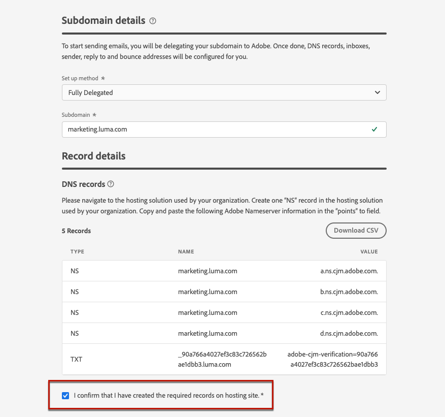
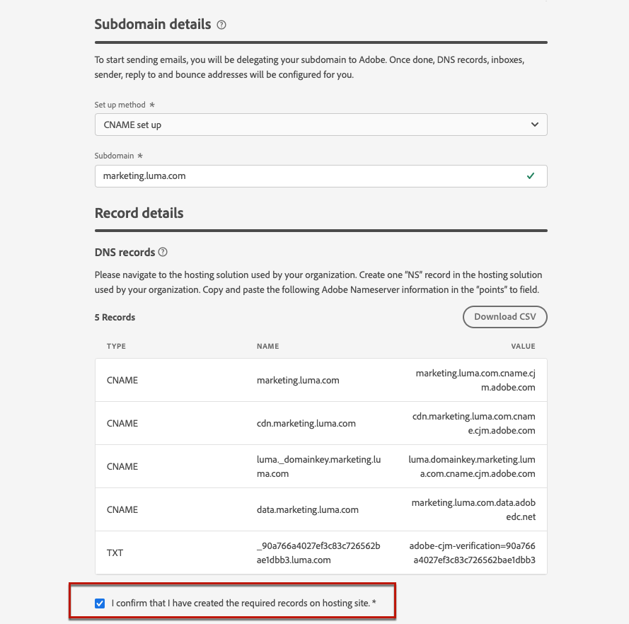

# 하위 도메인 위임 {#delegate-subdomain}

>[!CONTEXTUALHELP]
>id="ajo_admin_subdomainname"
>title="하위 도메인 위임"
>abstract="Journey Optimizer를 통해 하위 도메인을 Adobe에 위임할 수 있습니다. 하위 도메인을 Adobe에 완전히 위임할 수 있으며 이는 권장 메서드입니다. Adobe의 특정 레코드를 가리키도록 CNAME을 사용하여 하위 도메인을 만들 수도 있지만 이 접근 방식을 사용하려면 DNS 레코드를 직접 유지하고 관리해야 합니다."
>additional-url="https://experienceleague.adobe.com/ko/docs/journey-optimizer/using/configuration/delegate-subdomains/about-subdomain-delegation#subdomain-delegation-methods" text="하위 도메인 구성 메서드"

>[!CONTEXTUALHELP]
>id="ajo_admin_subdomainname_header"
>title="하위 도메인 위임"
>abstract="이메일 전송을 시작하려면 하위 도메인을 Adobe에 위임해야 합니다. 이 과정이 완료되면 DNS 레코드, 받은 편지함, 발신자, 주소 회신과 바운스 주소가 구성됩니다."

도메인 이름 위임은 도메인 이름(기술적으로 DNS 영역)의 소유자가 그 하위 분할(기술적으로 하위 영역이라고 할 수 있는 하위 DNS 영역)을 다른 엔티티에 위임할 수 있는 방법입니다. 기본적으로 고객은 &quot;example.com&quot; 영역을 처리하는 경우 하위 영역 &quot;marketing.example.com&quot;을 Adobe에 위임할 수 있습니다. [하위 도메인 위임](about-subdomain-delegation.md)에 대해 자세히 알아보기

>[!NOTE]
>
>기본적으로 [!DNL Journey Optimizer]에서는 최대 10개의 하위 도메인을 위임할 수 있습니다. 그러나 라이선스 계약에 따라 최대 100개의 하위 도메인을 위임할 수 있습니다. 부여된 하위 도메인 수에 대해 자세히 알아보려면 Adobe 담당자에게 문의하십시오.

하위 도메인을 완전히 위임하거나 CNAME을 사용하여 하위 도메인을 만들어 Adobe 관련 레코드를 가리키도록 할 수 있습니다.

>[!CAUTION]
>
>전체 하위 도메인 위임은 권장되는 방법입니다. [하위 도메인 구성 메서드](about-subdomain-delegation.md#subdomain-delegation-methods) 간의 차이점에 대해 자세히 알아보세요.
>
>하위 도메인 구성은 모든 환경에 공통됩니다. 따라서 하위 도메인을 수정하면 프로덕션 샌드박스에도 영향을 줍니다.

## 전체 하위 도메인 위임 {#full-subdomain-delegation}

>[!CONTEXTUALHELP]
>id="ajo_admin_subdomain_dns"
>title="일치하는 DNS 레코드 생성"
>abstract="새 하위 도메인을 Adobe에 완전히 위임하려면 Journey Optimizer 인터페이스에 표시된 Adobe 이름 서버 정보를 복사한 다음 도메인 호스팅 솔루션에 붙여넣어 일치하는 DNS 레코드를 생성해야 합니다. CNAME을 사용하여 하위 도메인을 위임하려면 SSL CDN URL 인증 레코드도 복사하여 붙여넣어야 합니다. 확인이 완료되면 메시지 게재에 하위 도메인을 사용할 준비가 되었습니다."
>additional-url="https://experienceleague.adobe.com/ko/docs/journey-optimizer/using/configuration/delegate-subdomains/delegate-subdomain#cname-subdomain-delegation" text="CNAME 하위 도메인 위임"

[!DNL Journey Optimizer]을(를) 사용하면 제품 인터페이스에서 직접 Adobe에 하위 도메인을 완전히 위임할 수 있습니다. 이렇게 하면 Adobe은 이메일 캠페인 게재, 렌더링 및 추적에 필요한 DNS의 모든 측면을 제어하고 유지 관리하여 메시지를 관리 서비스로 전달할 수 있습니다.

Adobe을 사용하여 이메일 마케팅 전송 도메인에 대한 업계 표준 전달성 요구 사항을 충족하는 데 필요한 DNS 인프라를 유지 관리하는 동시에 내부 이메일 도메인에 대한 DNS를 계속 유지 및 제어할 수 있습니다.

새 하위 도메인을 Adobe에 완전히 위임하려면 아래 단계를 따르십시오.

1. **[!UICONTROL 관리]** > **[!UICONTROL 채널]** > **[!UICONTROL 하위 도메인]** 메뉴에 액세스한 다음 **[!UICONTROL 하위 도메인 설정]**&#x200B;을 클릭합니다.

   

1. **[!UICONTROL 메서드 설정]** 섹션에서 **[!UICONTROL 완전히 위임됨]**&#x200B;을(를) 선택합니다.

   

1. 위임할 하위 도메인의 이름을 지정합니다.

   

   >[!CAUTION]
   >
   >잘못된 하위 도메인을 Adobe으로 위임할 수 없습니다. marketing.yourcompany.com과 같이 조직에서 소유한 올바른 하위 도메인을 입력해야 합니다.

   <!--Capital letters are not allowed in subdomains. TBC by PM-->

1. DNS 서버에 배치할 레코드 목록이 표시됩니다. 이러한 레코드를 하나씩 복사하거나 CSV 파일을 다운로드하여 복사한 다음 도메인 호스팅 솔루션으로 이동하여 일치하는 DNS 레코드를 생성합니다.

1. 모든 DNS 레코드가 도메인 호스팅 솔루션에 생성되었는지 확인합니다. 모든 항목이 올바르게 구성된 경우 &quot;I confirm...&quot; 상자를 선택합니다.

   

1. DMARC 레코드를 설정합니다. 하위 도메인에 기존 DMARC 레코드가 있고 [!DNL Journey Optimizer]에서 가져오는 경우 동일한 값을 사용하거나 필요에 따라 변경할 수 있습니다. 값을 추가하지 않으면 기본값이 사용됩니다. [자세히 알아보기](dmarc-record.md)

   

1. **[!UICONTROL 제출을 클릭합니다]**.

   >[!NOTE]
   >
   >나중에 **[!UICONTROL 초안으로 저장]** 단추를 사용하여 레코드를 만들고 하위 도메인 구성을 제출할 수 있습니다. 그런 다음 하위 도메인 목록에서 하위 도메인 위임을 열어 하위 도메인 위임을 다시 시작할 수 있습니다.

1. 하위 도메인이 목록에 **[!UICONTROL 처리 중]** 상태로 표시됩니다. 하위 도메인 상태에 대한 자세한 내용은 [이 섹션](about-subdomain-delegation.md#access-delegated-subdomains)을 참조하세요.

   

   해당 하위 도메인을 사용하여 메시지를 보내려면 먼저 Adobe이 필요한 검사를 수행할 때까지 기다려야 하며 최대 3시간이 걸릴 수 있습니다. 자세한 내용은 [이 섹션](#subdomain-validation)을 참조하십시오.

   >[!NOTE]
   >
   >누락된 모든 레코드, 즉 호스팅 솔루션에서 아직 만들어지지 않은 레코드가 나열됩니다.

1. 확인이 성공하면 하위 도메인이 **[!UICONTROL 성공]** 상태를 가져옵니다. 메시지를 전달하는 데 사용할 준비가 되었습니다.

   >[!NOTE]
   >
   >호스팅 솔루션에서 유효성 검사 레코드를 만들지 못하면 하위 도메인이 **[!UICONTROL 실패]**(으)로 표시됩니다.

하위 도메인이 [!DNL Journey Optimizer]의 Adobe에 위임되면 PTR 레코드가 자동으로 생성되고 이 하위 도메인과 연결됩니다. [자세히 알아보기](ptr-records.md)

>[!CAUTION]
>
>하위 도메인의 병렬 실행은 현재 [!DNL Journey Optimizer]에서 지원되지 않습니다. 다른 하위 도메인이 **[!UICONTROL 처리 중]** 상태일 때 위임할 하위 도메인을 제출하려고 하면 오류 메시지가 표시됩니다.

## CNAME 하위 도메인 설정 {#cname-subdomain-delegation}

>[!CONTEXTUALHELP]
>id="ajo_admin_subdomain_dns_cname"
>title="일치하는 DNS 및 인증 레코드 생성"
>abstract="CNAME을 사용하여 하위 도메인을 위임하려면 Journey Optimizer 인터페이스에 표시된 Adobe 이름 서버 정보와 SSL CDN URL 인증 레코드를 복사한 다음 호스팅 플랫폼에 붙여넣어야 합니다. 확인이 완료되면 메시지 게재에 하위 도메인을 사용할 준비가 되었습니다."

>[!CONTEXTUALHELP]
>id="ajo_admin_subdomain_cdn_cname"
>title="인증 레코드 복사"
>abstract="Adobe는 인증 레코드를 생성합니다. 호스팅 플랫폼에서 CDN URL로 인증하려면 해당 레코드를 생성해야 합니다."

도메인별 제한 정책이 있고 Adobe이 DNS에 대한 부분적인 제어만 하도록 하려면 사용자 측에서 모든 DNS 관련 활동을 수행하도록 선택할 수 있습니다.

CNAME 하위 도메인 설정을 사용하면 하위 도메인을 만들고 CNAME을 사용하여 Adobe 관련 레코드를 지정할 수 있습니다. 이 구성을 사용하면 사용자와 Adobe가 이메일을 보내고 렌더링 및 추적하기 위한 환경을 설정하기 위한 DNS 유지 관리를 공동으로 수행합니다.

>[!CAUTION]
>
>조직의 정책이 전체 하위 도메인 위임 방법을 제한하는 경우 CNAME 방법을 사용하는 것이 좋습니다. 이 접근 방식을 사용하려면 DNS 레코드를 직접 유지 및 관리해야 합니다. Adobe은 CNAME 메서드를 통해 구성된 하위 도메인의 DNS 변경, 유지 관리 또는 관리를 지원할 수 없습니다.

➡️[이 비디오에서 Adobe 관련 레코드를 가리키도록 CNAME을 사용하여 하위 도메인을 만드는 방법을 알아봅니다](#video)

CNAME을 사용하여 하위 도메인을 설정하려면 아래 단계를 따르십시오.

1. **[!UICONTROL 관리]** > **[!UICONTROL 채널]** > **[!UICONTROL 하위 도메인]** 메뉴에 액세스한 다음 **[!UICONTROL 하위 도메인 설정]**&#x200B;을 클릭합니다.

1. **[!UICONTROL CNAME 설정]** 메서드를 선택하십시오.

   

1. 위임할 하위 도메인의 이름을 지정합니다.

   >[!CAUTION]
   >
   >잘못된 하위 도메인을 Adobe으로 위임할 수 없습니다. marketing.yourcompany.com과 같이 조직에서 소유한 올바른 하위 도메인을 입력해야 합니다.

   <!--Capital letters are not allowed in subdomains. TBC by PM-->

1. DNS 서버에 배치할 레코드 목록이 표시됩니다. 이러한 레코드를 하나씩 복사하거나 CSV 파일을 다운로드하여 복사한 다음 도메인 호스팅 솔루션으로 이동하여 일치하는 DNS 레코드를 생성합니다.

1. 모든 DNS 레코드가 도메인 호스팅 솔루션에 생성되었는지 확인합니다. 모든 항목이 올바르게 구성된 경우 &quot;I confirm...&quot; 상자를 선택합니다.

   

1. DMARC 레코드를 설정합니다. 하위 도메인에 기존 DMARC 레코드가 있고 [!DNL Journey Optimizer]에서 가져오는 경우 동일한 값을 사용하거나 필요에 따라 변경할 수 있습니다. 값을 추가하지 않으면 기본값이 사용됩니다. [자세히 알아보기](dmarc-record.md)

   

1. **[!UICONTROL 계속을 클릭합니다]**.

   >[!NOTE]
   >
   >나중에 **[!UICONTROL 초안으로 저장]** 단추를 사용하여 레코드를 만들 수 있습니다. 그런 다음 하위 도메인 목록에서 하위 도메인 위임을 열어 이 단계에서 하위 도메인 위임을 다시 시작할 수 있습니다.

1. Adobe이 호스팅 솔루션에서 레코드가 오류 없이 생성되는지 확인할 때까지 기다립니다. 이 프로세스는 최대 2분 정도 소요될 수 있습니다.

   >[!NOTE]
   >
   >누락된 모든 레코드, 즉 호스팅 솔루션에서 아직 만들어지지 않은 레코드가 나열됩니다.

1. Adobe은 SSL CDN URL 유효성 검사 레코드를 생성합니다. 이 유효성 검사 레코드를 호스팅 플랫폼에 복사합니다. 호스팅 솔루션에서 이 레코드를 올바르게 만들었다면 &quot;확인...&quot; 상자를 선택한 다음 **[!UICONTROL 제출]**&#x200B;을 클릭합니다.

   <!---->

1. CNAME 하위 도메인 위임이 제출되면 하위 도메인이 **[!UICONTROL 처리 중]** 상태로 목록에 표시됩니다. 하위 도메인 상태에 대한 자세한 내용은 [이 섹션](about-subdomain-delegation.md#access-delegated-subdomains)을 참조하세요.

   

   해당 하위 도메인을 사용하여 메시지를 보내려면 먼저 Adobe이 필요한 검사를 수행할 때까지 기다려야 하며, 일반적으로 2~3시간이 소요됩니다. 자세한 내용은 [이 섹션](#subdomain-validation)을 참조하십시오.

1. 검사가 성공하면<!--i.e Adobe validates the record you created and installs it--> 하위 도메인이 **[!UICONTROL 성공]** 상태를 가져옵니다. 메시지를 전달하는 데 사용할 준비가 되었습니다.

   >[!NOTE]
   >
   >호스팅 솔루션에서 유효성 검사 레코드를 만들지 못하면 하위 도메인이 **[!UICONTROL 실패]**(으)로 표시됩니다.

레코드의 유효성을 확인하고 인증서를 설치하면 Adobe은 CNAME 하위 도메인에 대한 PTR 레코드를 자동으로 만듭니다. [자세히 알아보기](ptr-records.md)

>[!CAUTION]
>
>하위 도메인의 병렬 실행은 현재 [!DNL Journey Optimizer]에서 지원되지 않습니다. 다른 하위 도메인이 **[!UICONTROL 처리 중]** 상태일 때 위임할 하위 도메인을 제출하려고 하면 오류 메시지가 표시됩니다.

## 하위 도메인 유효성 검사 {#subdomain-validation}

아래 확인 및 작업은 하위 도메인이 확인되고 메시지를 보내는 데 사용할 수 있을 때까지 수행됩니다.

>[!NOTE]
>
>이러한 단계는 Adobe 별로 수행되며 최대 3시간이 소요될 수 있습니다.

1. **사전 유효성 검사**: Adobe이 하위 도메인이 Adobe DNS(NS 레코드, SOA 레코드, 영역 설정, 소유권 레코드)에 위임되었는지 확인합니다. 사전 유효성 검사 단계가 실패하면 해당 사유와 함께 오류가 반환되고 그렇지 않으면 Adobe이 다음 단계로 진행됩니다.

1. **도메인에 대한 DNS 구성**:

   * **MX 레코드**: 메일 Exchange 레코드 - 하위 도메인으로 보내는 인바운드 전자 메일을 처리하는 메일 서버 레코드입니다.
   * **SPF 레코드**: 보낸 사람 정책 프레임워크 레코드 - 하위 도메인에서 전자 메일을 보낼 수 있는 메일 서버의 IP를 나열합니다.
   * **DKIM 레코드**: DomainKeys Identified Mail 표준 레코드 - 공용-개인 키 암호화를 사용하여 메시지를 인증하여 스푸핑을 방지합니다.
   * **A**: 기본 IP 매핑입니다.
   * **CNAME**: 정식 이름 또는 CNAME 레코드는 별칭 이름을 실제 또는 정식 도메인 이름에 매핑하는 DNS 레코드 유형입니다.

1. **추적 및 미러 URL 만들기**: 도메인이 email.example.com이면 추적/미러 도메인은 data.email.example.com이 됩니다. SSL 인증서를 설치하여 보안을 유지합니다.

1. **CDN CloudFront 프로비저닝**: CDN이 아직 설정되지 않은 경우 Adobe이 조직의 ID에 대해 프로비저닝합니다.

1. **CDN 도메인을 만듭니다**: 도메인이 email.example.com이면 CDN 도메인은 cdn.email.example.com이 됩니다.

1. **CDN SSL 인증서 만들기 및 첨부**: Adobe은 CDN 도메인에 대한 CDN 인증서를 만들고 인증서를 CDN 도메인에 연결합니다.

1. **순방향 DNS 만들기**: 위임하는 첫 번째 하위 도메인인 경우 Adobe은 PTR 레코드를 만드는 데 필요한 순방향 DNS를 각 IP에 대해 하나씩 만듭니다.

1. **PTR 레코드 만들기**: 이메일을 스팸으로 표시하지 않도록 ISP에서 PTR 레코드(역방향 DNS 레코드라고도 함)가 필요합니다. 또한 Gmail에서는 각 IP에 대해 PTR 레코드를 사용할 것을 권장합니다. Adobe은 각 IP에 대해 하나씩, 하위 도메인을 가리키는 모든 IP에 대해 처음으로 하위 도메인을 위임할 때만 PTR 레코드를 생성합니다. 예를 들어 IP가 *192.1.2.1*&#x200B;이고 하위 도메인이 *email.example.com*&#x200B;인 경우 PTR 레코드는 *192.1.2.1 PTR r1.email.example.com*&#x200B;이 됩니다. 이후 PTR 레코드를 업데이트하여 새 위임된 도메인을 가리킬 수 있습니다. [PTR 레코드에 대한 자세한 정보](ptr-records.md)

## 방법 비디오{#video}

CNAME을 사용하여 Adobe 관련 레코드를 가리키도록 하위 도메인을 만드는 방법을 알아봅니다.

>[!VIDEO](https://video.tv.adobe.com/v/339484?quality=12)
