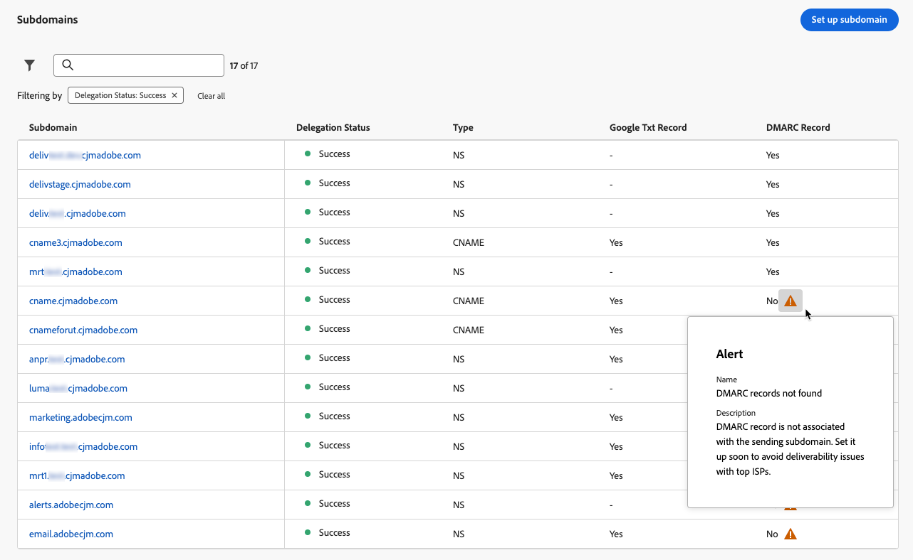
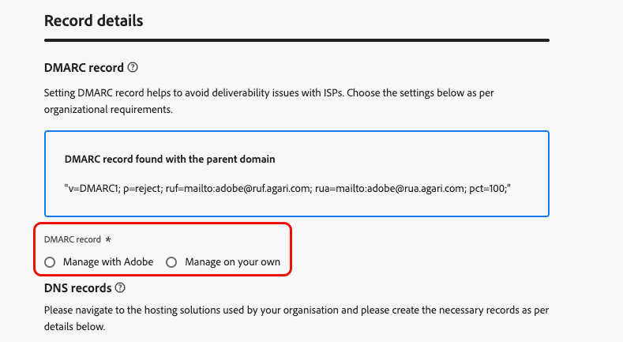

# DMARC 레코드 {#dmarc-record}

>[!CONTEXTUALHELP]
>id="ajo_admin_dmarc_record"
>title="DMARC 레코드 설정"
>abstract="DMARC는 도메인 소유자가 자신의 도메인이 무단으로 사용되지 않도록 보호하고 사서함 서비스 제공업체와의 전달성 문제를 방지할 수 있는 이메일 인증 방법입니다. 시행 중인 업계 모범 사례의 일부인 Google 및 Yahoo! 이메일을 보내는 데 사용하는 모든 도메인에 DMARC 레코드를 요구합니다."

## DMARC란? {#what-is-dmarc}

도메인 기반 메시지 인증, 보고 및 적합성(DMARC)은 도메인 소유자가 도메인을 무단 사용으로부터 보호할 수 있는 이메일 인증 방법입니다. 이메일 공급자 및 인터넷 서비스 공급자(ISP)에게 명확한 정책을 제공함으로써 악의적인 행위자가 도메인에서 온 것이라고 주장하는 이메일을 보내지 못하게 하는 데 도움이 됩니다. DMARC를 구현하면 합법적인 이메일이 스팸으로 표시되거나 거부될 위험이 줄어들고 이메일 전달성이 향상됩니다.

DMARC에서는 DMARC 유효성 검사를 통과하지 않은 이메일 처리에 대한 제어와 함께 인증에 실패한 메시지에 대한 보고도 제공합니다. 구현된 [DMARC 정책](#dmarc-policies)에 따라 이러한 전자 메일을 모니터링, 격리 또는 거부할 수 있습니다. 이러한 기능을 통해 잠재적 오류를 완화하고 해결하기 위한 조치를 취할 수 있습니다.

인증에 실패한 메일을 제어하는 동안 게재 문제를 방지하기 위해 [!DNL Journey Optimizer]에서 이제 관리 인터페이스에서 직접 DMARC 기술을 지원하고 있습니다. [자세히 알아보기](#implement-dmarc)

### DMARC은 어떻게 작동합니까? {#how-dmarc-works}

SPF와 DKIM은 모두 이메일을 도메인과 연결하고 이메일을 인증하기 위해 함께 작동하는 데 사용됩니다. DMARC은 이 단계를 한 단계 더 발전시켰으며 DKIM 및 SPF로 확인된 도메인을 일치시켜 스푸핑을 방지하는 데 도움이 됩니다.

>[!NOTE]
>
>Journey Optimizer에서는 SPF와 DKIM이 자동으로 구성됩니다.

DMARC을 전달하려면 메시지가 SPF 또는 DKIM을 전달해야 합니다.

* SPF(Sender Policy Framework)를 사용하면 도메인에 대해 권한이 부여된 IP 주소 목록과 비교하여 전송 서버의 IP 주소를 확인하여 권한이 부여된 소스에서 이메일 메시지가 전송되는지 확인할 수 있습니다.
* DKIM(DomainKeys Identified Mail)은 이메일 메시지에 디지털 서명을 추가하여 수신자가 메시지의 무결성과 신뢰성을 확인할 수 있도록 합니다.

둘 다 또는 둘 중 하나가 인증에 실패하면 DMARC이 실패하고 선택한 DMARC 정책에 따라 이메일이 전달됩니다.

<!--DMARC requires alignment between the 'From" and 'Return-Path' address.-->

### DMARC 정책 {#dmarc-policies}

이메일이 DMARC 인증에 실패하면 해당 메시지에 적용할 작업을 결정할 수 있습니다. DMARC에는 세 가지 정책 옵션이 있습니다.

* Monitor (p=none): 사서함 공급자/ISP가 메시지에 대해 일반적으로 수행하는 작업을 수행하도록 지시합니다.
* 격리(p=격리): 사서함 공급자/ISP에 DMARC을 전달하지 않는 메일을 수신자의 스팸 또는 정크 폴더로 배달하도록 지시합니다.
* 거부(p=reject): 사서함 공급자/ISP가 DMARC을 전달하지 않아 바운스가 발생하는 메일을 차단하도록 지시합니다.

>[!NOTE]
>
>[이 섹션](#set-up-dmarc)에서 [!DNL Journey Optimizer]을(를) 사용하여 DMARC 정책을 설정하는 방법에 대해 알아봅니다.

## DMARC 요구 사항 업데이트 {#dmarc-update}

시행 중인 업계 모범 사례의 일부인 Google 및 Yahoo! 전자 메일을 보내는 데 사용하는 모든 도메인에 대해 **DMARC 레코드**&#x200B;가 있어야 합니다. 이 새 요구 사항은 **2024년 2월 1일**&#x200B;부터 적용됩니다.

>[!CAUTION]
>
>Gmail 및 Yahoo!의 새로운 요구 사항을 준수하지 못하면 이메일이 스팸 폴더에 포함되거나 차단될 수 있습니다.

따라서 Adobe에서는 다음 작업을 수행할 것을 강력히 권장합니다.

* [!DNL Journey Optimizer]에서 DMARC에 **이미 위임한 모든 하위 도메인**&#x200B;에 대해 **Adobe 레코드**&#x200B;를 설정해야 합니다. [방법 알아보기](#check-subdomains-for-dmarc)

* **새 하위 도메인을 Adobe에 위임**&#x200B;할 때 [!DNL Journey Optimizer] 관리 인터페이스에서 **DMARC을 직접 설정**&#x200B;할 수 있습니다&#x200B;**&#x200B;**. [방법 알아보기](#implement-dmarc)

## [!DNL Journey Optimizer]에서 DMARC 구현 {#implement-dmarc}

[!DNL Journey Optimizer] 관리 인터페이스를 사용하면 이미 Adobe에 위임했거나 위임하고 있는 모든 하위 도메인에 대해 DMARC 레코드를 설정할 수 있습니다. 자세한 단계는 아래에 설명되어 있습니다.

### DMARC에 대한 기존 하위 도메인 확인 {#check-subdomains-for-dmarc}

[!DNL Journey Optimizer]에서 위임한 모든 하위 도메인에 대해 DMARC 레코드를 설정했는지 확인하려면 아래 단계를 수행하십시오.

1. **[!UICONTROL 관리]** > **[!UICONTROL 채널]** > **[!UICONTROL 전자 메일 설정]** > **[!UICONTROL 하위 도메인]** 메뉴에 액세스한 다음 **[!UICONTROL 하위 도메인 설정]**&#x200B;을 클릭하세요.

1. 위임된 각 하위 도메인에 대해 **[!UICONTROL DMARC 레코드]** 열을 확인하십시오. 주어진 하위 도메인에 대한 레코드가 없으면 경고가 표시됩니다.

   

   >[!CAUTION]
   >
   >Gmail 및 Yahoo!의 새 요구 사항을 준수하고 상위 ISP의 게재 문제를 방지하려면 위임된 모든 하위 도메인에 대해 DMARC 레코드를 설정하는 것이 좋습니다. [자세히 알아보기](dmarc-record-update.md)

1. 연결된 DMARC 레코드가 없는 하위 도메인을 선택하고 조직의 필요에 따라 **[!UICONTROL DMARC 레코드]** 섹션을 채우십시오. DMARC 레코드 필드를 채우는 단계는 [이 섹션](#implement-dmarc)에 자세히 설명되어 있습니다.

   <!---->

   >[!NOTE]
   >
   >상위 도메인과 함께 DMARC 레코드가 검색되는지 여부에 따라 상위 도메인의 값을 사용하도록 선택하거나 Adobe에서 DMARC 레코드를 관리하도록 선택할 수 있습니다. [자세히 알아보기](#implement-dmarc)

1. 하위 도메인을 편집하는 경우:

   * [Adobe에 완전히 위임됨](delegate-subdomain.md#full-subdomain-delegation). 추가 작업이 필요하지 않습니다.

   * [CNAME](delegate-subdomain.md#cname-subdomain-delegation)(으)로 설정합니다. 일치하는 DNS 레코드를 생성하려면 DMARC의 DNS 레코드를 호스팅 솔루션에 복사해야 합니다.

     

     DNS 레코드가 도메인 호스팅 솔루션에 생성되었는지 확인하고 &quot;I confirm...&quot; 상자를 선택합니다.

1. 변경 내용을 저장합니다.

### 새 하위 도메인용 DMARC 설정 {#set-up-dmarc}

[!DNL Journey Optimizer]에서 새 하위 도메인을 Adobe으로 위임하면 도메인의 DNS에 DMARC 레코드가 만들어집니다. DMARC을 구현하려면 아래 단계를 따르십시오.

>[!CAUTION]
>
>Gmail 및 Yahoo!의 새 요구 사항을 준수하고 상위 ISP의 게재 문제를 방지하려면 위임된 모든 하위 도메인에 대해 DMARC 레코드를 설정하는 것이 좋습니다. [자세히 알아보기](dmarc-record-update.md)

<!--If you fail to comply with the new requirement from Gmail and Yahoo! to have DMARC record for all sending domains, your emails are expected to land into the spam folder or to get blocked.-->

1. 새 하위 도메인을 설정합니다. [방법 알아보기](delegate-subdomain.md)

1. **[!UICONTROL DMARC 레코드]** 섹션으로 이동합니다.

1. 하위 도메인과 연관된 상위 도메인에서 DMARC 레코드를 사용할 수 있는 경우, 다음 두 가지 옵션이 표시됩니다.

   

   * **[!UICONTROL Adobe으로 관리]**: Adobe에서 하위 도메인의 DMARC 레코드를 관리하도록 할 수 있습니다. [이 섹션](#manage-dmarc-with-adobe)에 자세히 설명된 단계를 따르십시오.

   * **[!UICONTROL 직접 관리]**: <!--This option is selected by default.-->이 옵션을 사용하면 부모 도메인의 값을 사용하여 [!DNL Journey Optimizer] 외부에서 DMARC 레코드를 관리할 수 있습니다. 이러한 값은 인터페이스에 표시되지만 편집할 수는 없습니다.

     {width="80%"}

1. 상위 도메인에 DMARC 레코드가 없으면 **[!UICONTROL Adobe으로 관리]** 옵션만 사용할 수 있습니다. [아래](#manage-dmarc-with-adobe) 단계에 따라 하위 도메인에 대한 DMARC 레코드를 설정하십시오.

   {width="80%"}

### Adobe을 사용하여 DMARC 레코드 관리 {#manage-dmarc-with-adobe}

Adobe에서 DMARC 레코드를 관리하도록 하려면 **[!UICONTROL Adobe으로 관리]** 옵션을 선택하고 아래 단계를 따르십시오.

>[!NOTE]
>
>[!DNL Journey Optimizer]에서 가져오는 경우 인터페이스에서 강조 표시된 것과 동일한 값을 사용하거나 필요에 따라 변경할 수 있습니다.

{width="80%"}

>[!NOTE]
>
>값을 추가하지 않으면 미리 채워진 기본값이 사용됩니다.

1. DMARC이 실패할 경우 수신자 서버가 수행할 작업을 정의합니다. 적용하려는 [DMARC 정책](#dmarc-policies)에 따라 다음 세 가지 옵션 중 하나를 선택하십시오.

   * **[!UICONTROL 없음]**(기본값): 받는 사람에게 DMARC 인증에 실패하지만 보낸 사람에게 전자 메일 보고서를 보내는 메시지에 대해 아무 작업도 수행하지 않도록 알립니다.
   * **[!UICONTROL 격리]**: 받는 전자 메일 서버에 DMARC 인증에 실패한 전자 메일을 격리하도록 지시합니다. 이는 일반적으로 받는 사람의 스팸 또는 정크 폴더에 해당 메시지를 넣는 것을 의미합니다.
   * **[!UICONTROL 거부]**: 받는 사람에게 인증에 실패한 도메인에 대한 모든 전자 메일을 완전히 거부(반송)하도록 지시합니다. 이 정책이 활성화되면 도메인에서 100% 인증된 것으로 확인된 이메일에만 받은 편지함 배치 기회가 생깁니다.

   >[!NOTE]
   >
   >DMARC의 잠재적인 영향을 이해하면 DMARC 정책을 **없음**, **격리**, **거부**(으)로 승격하여 DMARC 구현을 천천히 배포하는 것이 좋습니다.

1. 필요한 경우, 조직 내에서 [인증 실패](#how-dmarc-works)가 적용되는 전자 메일에서 **DMARC 보고서**&#x200B;의 위치를 나타내도록 선택한 전자 메일 주소를 하나 이상 추가합니다. 각 보고서에 대해 최대 5개의 주소를 추가할 수 있습니다.

   >[!NOTE]
   >
   >이러한 보고서를 받을 수 있는 실제 받은 편지함(Adobe 아님)이 컨트롤에 있는지 확인하십시오.

   보낸 사람이 DMARC 정책에서 RUA/RUF 태그를 통해 받을 수 있는 ISP에서 생성한 보고서에는 두 가지가 있습니다.

   * **집계 보고서**(RUA): 여기에는 GDPR에 민감할 수 있는 PII(개인 식별 정보)가 포함되어 있지 않습니다.
   * **포렌식 오류 보고서**(RUF): GDPR 구분 전자 메일 주소가 들어 있습니다. 사용하기 전에 GDPR 준수가 필요한 정보를 처리하는 방법을 내부적으로 확인하십시오.

   >[!NOTE]
   >
   >이러한 고도의 기술 보고서는 스푸핑이 시도되는 이메일의 개요를 제공합니다. 타사 도구를 통해 가장 잘 요약됩니다.

1. DMARC 이메일의 **적용 가능한 백분율**&#x200B;을(를) 선택하십시오.

   이 비율은 이메일 인프라에 대한 신뢰도와 긍정 오류(합법적인 이메일이 사기성으로 표시됨)에 대한 허용 한도에 따라 다릅니다. 조직은 일반적으로 DMARC 정책을 **없음**(으)로 설정하여 시작하고, DMARC 정책 비율을 점차 늘리며, 올바른 이메일 게재에 미치는 영향을 면밀히 모니터링합니다.

   >[!NOTE]
   >
   >이메일 인증 방법에 대한 신뢰도를 높이면서 이메일 관리자 및 IT 팀과 협력하여 비율을 점차적으로 높이십시오.

   가장 좋은 방법은 DMARC 준수율이 100%에 가까운 높은 수준을 목표로 하여 긍정 오류(false positive)의 위험을 최소화하면서 보안 이점을 극대화하는 것입니다.

1. 24시간에서 168시간 사이의 **보고 간격**&#x200B;을 선택하세요. 도메인 소유자는 이메일 인증 결과에 대한 정기적인 업데이트를 받고 이메일 보안을 개선하기 위해 필요한 조치를 취할 수 있습니다.

<!--The DMARC reporting interval is specified in the DMARC policy published in the DNS (Domain Name System) records for a domain. The reporting interval can be set to daily, weekly, or another specified frequency, depending on the domain owner's preferences.

The default value (24 hours) is generally the email providers' expectation.

**********

Setting up a DMARC record involves adding a DNS TXT record to your domain's DNS settings. This record specifies your DMARC policy, such as whether to quarantine or reject messages that fail authentication. Implementing DMARC is a proactive step towards enhancing email security and protecting both your organization and your recipients from email-based threats.

DMARC helps prevent malicious actors from sending emails that appear to come from your domain. By setting up DMARC, you can specify how email providers should handle messages that fail authentication checks, reducing the likelihood that phishing emails will reach recipients.

DMARC helps improve email deliverability by providing a clear policy for email providers to follow when encountering messages claiming to be from your domain. This can reduce the chances of legitimate emails being marked as spam or rejected.

DMARC helps protect against email spoofing, phishing, and other fraudulent activities.

It allows you to decide how a mailbox provider should handle emails that fail SPF and DKIM checks, providing a way to authenticate the sender's domain and prevent unauthorized use of the domain for malicious purposes.

## What are the benefits of DMARC? {#dmarc-benefits}

The key benefits or DMARC are as folllows:

* DMARC allows email receivers to easily identify the authentication of emails, which could potentially improve delivery.

* It offers reporting on which messages fail SPF and/or DKIM, enabling senders to gain visibility.

* This increased visibility allows for steps to be taken to mitigate further errors. It gives senders a degree of control over what happens with mail that does not pass either of these authentication methods.

-->
