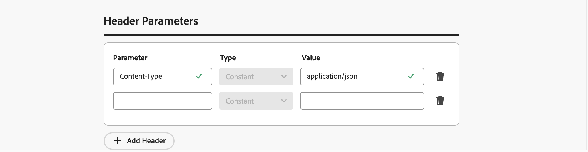

# API 트리거 캠페인에 대한 피드백 웹후크 만들기 {#webhooks}

피드백 웹후크를 사용하면 트랜잭션 API 트리거 캠페인을 통해 전송된 메시지에 대한 실시간 상태 업데이트를 받을 수 있습니다. Webhook을 구성하면 게재 결과를 시스템에 직접 자동으로 수신하여 모니터링, 로깅 및 자동화된 처리를 가능하게 할 수 있습니다.

**[!UICONTROL 관리]** / **[!UICONTROL 채널]** / **[!UICONTROL 피드백 웹후크 설정]** 메뉴에서 웹후크 구성을 관리할 수 있습니다.


>[!NOTE]
>**조직 + 샌드박스** 조합당 하나의 웹후크 구성만 허용됩니다.

## 피드백 웹후크 만들기

웹후크를 만들려면 다음 단계를 수행합니다.

1. **[!UICONTROL 관리]** / **[!UICONTROL 채널]** / **[!UICONTROL 피드백 웹후크 설정]**(으)로 이동합니다.

1. **피드백 웹후크 만들기**&#x200B;를 클릭합니다.

1. **[!UICONTROL 기본 구성]** 섹션에서 다음 세부 정보를 제공합니다.

   

   * **Webhook 이름** - Webhook를 식별하는 수사적 이름을 입력합니다.
   * **채널** - 이 웹후크에서 피드백(전자 메일 및/또는 SMS)을 받을 채널을 선택합니다.
   * **Webhook URL** - 피드백 이벤트를 전달해야 하는 HTTPS 끝점을 제공합니다.

1. **[!UICONTROL 인증]** 섹션에서 인증 방법을 선택합니다.

   

   * **인증 없음** - 추가된 인증 헤더가 없습니다.
   * **JWT 인증** - 끝점에 JWT 인증이 필요한 경우 필요한 세부 정보를 제공합니다.

1. **[!UICONTROL 헤더 매개 변수]** 섹션에서 각 웹후크 요청과 함께 전송할 추가 사용자 지정 헤더를 구성합니다.

   

1. 구성을 저장하려면 **[!UICONTROL 제출]**&#x200B;을 클릭하세요.

>[!NOTE]
>
>언제든지 웹후크를 편집할 수 있습니다. 이렇게 하려면 인벤토리에서 연 다음 **[!UICONTROL 편집]** 단추를 클릭하십시오.

## Webhook 페이로드 구조

메시지를 실행한 후 **[!DNL Journey Optimizer]**&#x200B;에서 구성된 끝점에 다음 페이로드를 보냅니다.

```
{
  "requestId": "8NoByJneShCdCGRnrGS1t1m3CdA73dhR",
  "imsOrg": "myImsOrg",
  "sandbox": {
    "id": "068abf40-575e-11ea-8512-9b1bfdb82603",
    "name": "prod"
  },
  "channel": "email",
  "eventType": "message.feedback",
  "messageExecution": {
    "messageExecutionID": "HUMA-26362805",
    "messageType": "transactional",
    "campaignID": "16f24a15-7e21-477c-848a-d5695ca7f137",
    "campaignVersionID": "2ca10c10-56dd-4505-87cd-fa5da84e7a5d"
  },
  "messageDeliveryFeedback": {
    "feedbackStatus": {
      "value": "bounce"
    },
    "offers": null,
    "messageExclusion": null,
    "messageFailure": {
      "category": "sync",
      "type": "Ignored",
      "code": "25",
      "reason": "Admin Failure"
    },
    "retryCount": 0
  },
  "identityMap": {
    "email": [
      {
        "id": "john.doe@luma.com",
        "primary": true
      }
    ]
  }
}
```

웹후크는 다음 이벤트를 캡처할 수 있습니다.

* 보냄
* 게재됨
* 바운스(위 예 참조)
* 오류

들어오는 모든 요청에는 Webhook으로 다시 전송되는 고유한 requestId도 포함됩니다.

## 다음 단계 {#next}

피드백 웹후크가 만들어지면 **트랜잭션 API 트리거 캠페인** 대상자를 구성할 때 활성화할 수 있습니다. 이 섹션에서 자세히 알아보기: [웹후크 사용](../campaigns/api-triggered-campaign-audience.md#webhook)
