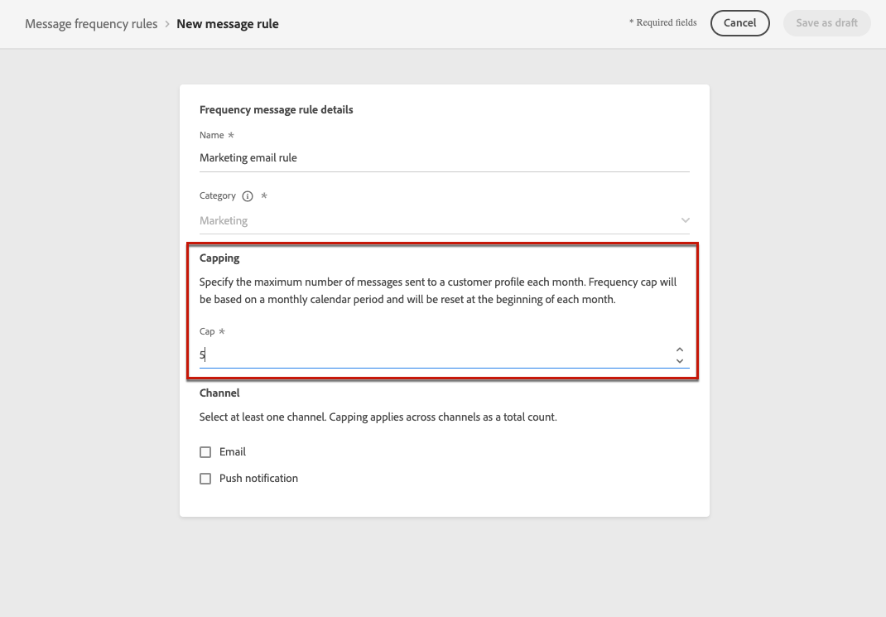
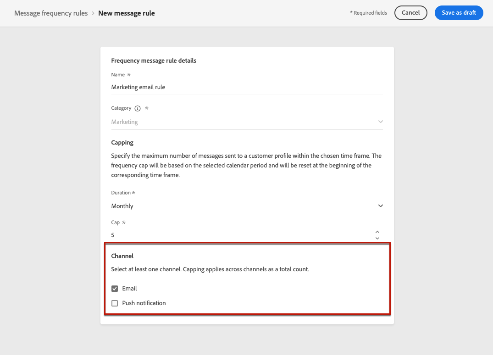
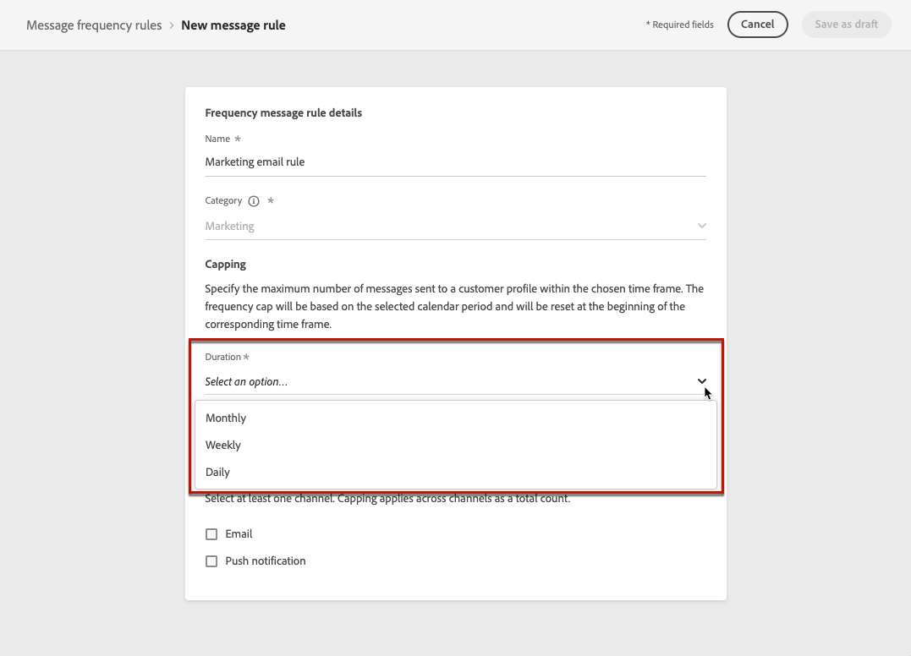
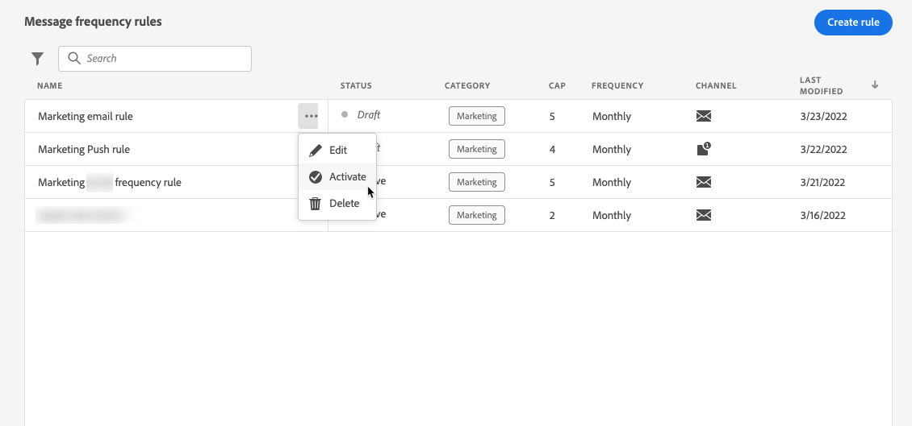

# 비즈니스 규칙 구성 {#frequency-rules}

>[!CONTEXTUALHELP]
>id="ajo_business_rules_message_frequency_rules"
>title="비즈니스 규칙"
>abstract="메시지 빈도 규칙은 사용자가 메시지를 수신하거나 하나 또는 여러 채널에서 여정에 참여하는 횟수를 제한하는 비즈니스 규칙 유형입니다. 이러한 크로스 채널 규칙은 메시지와 작업에서 과도하게 요청된 프로필을 자동으로 제외합니다."

[!DNL Journey Optimizer]을(를) 통해 사용자가 메시지를 받거나 하나 또는 여러 채널에서 여정을 입력하는 빈도를 제어할 수 있습니다. 메시지 및 작업에서 과도하게 요청된 프로필을 자동으로 제외하는 메시지 빈도 규칙입니다.

예를 들어 브랜드의 경우 고객에게 매월 4개 이상의 마케팅 메시지를 보내지 않는 것이 규칙일 수 있습니다. 이렇게 하려면 월별 캘린더 기간 동안 하나 이상의 채널을 기반으로 전송된 메시지 수를 제한하는 비즈니스 규칙을 사용할 수 있습니다.

>[!NOTE]
>
>비즈니스 규칙은 사용자가 브랜드로부터 커뮤니케이션 수신을 취소할 수 있는 옵트아웃 관리와는 다릅니다. [자세히 알아보기](../privacy/opt-out.md#opt-out-management)

➡️ [비디오에서 이 기능 살펴보기](#video)

## 비즈니스 규칙 액세스 {#access-rules}

비즈니스 규칙은 **[!UICONTROL 관리]** > **[!UICONTROL 비즈니스 규칙]** 메뉴에서 사용할 수 있습니다. 모든 규칙이 나열되며 수정 날짜별로 정렬됩니다. 필터 아이콘을 사용하여 카테고리, 상태 및/또는 채널을 필터링합니다. 메시지 레이블을 검색할 수도 있습니다.

### 권한{#permissions-frequency-rules}

비즈니스 규칙에 액세스, 만들기, 편집 또는 삭제하려면 **[!UICONTROL 빈도 규칙 관리]** 권한이 있어야 합니다.

**[!UICONTROL 빈도 규칙 보기]** 권한이 있는 사용자는 규칙을 볼 수 있지만 수정하거나 삭제할 수는 없습니다.

[이 섹션](../administration/high-low-permissions.md)에서 권한에 대해 자세히 알아보십시오.

## 비즈니스 규칙 만들기 {#create-new-rule}

>[!CONTEXTUALHELP]
>id="ajo_rules_category"
>title="메시지 규칙 카테고리 선택"
>abstract="활성화되어 메시지에 적용되면 선택한 카테고리와 일치하는 모든 비즈니스 규칙은 이 메시지에 자동으로 적용됩니다. 현재 마케팅 카테고리만 사용할 수 있습니다."

>[!CONTEXTUALHELP]
>id="ajo_rules_capping"
>title="비즈니스 규칙의 상한 설정"
>abstract="선택한 시간대 내에 고객 프로필로 전송되는 최대 메시지 수를 지정합니다. 빈도 캡은 선택된 캘린더 기간에 기반하고 대응하는 시간대가 시작될 때 재설정됩니다."

>[!CONTEXTUALHELP]
>id="ajo_rules_channel"
>title="비즈니스 규칙이 적용되는 채널 정의"
>abstract="하나 이상의 채널을 선택합니다. 상한 설정은 채널에서 총 횟수로 적용됩니다."

새 비즈니스 규칙을 만들려면 아래 단계를 수행하십시오.

1. **[!UICONTROL 비즈니스 규칙]** 목록에 액세스한 다음 **[!UICONTROL 규칙 만들기]**&#x200B;를 클릭합니다.

   

1. 규칙 이름을 정의하고 메시지 규칙 범주를 선택합니다.

   >[!NOTE]
   >
   >**[!UICONTROL 마케팅]** 범주만 사용할 수 있습니다.

   

1. **[!UICONTROL 기간]** 드롭다운 목록에서 캡핑을 적용할 시간대를 선택합니다. [자세히 알아보기](#frequency-cap)

1. 규칙의 상한을 설정합니다. 즉, 위의 선택에 따라 매월 또는 <!--or day-->주마다 개별 사용자 프로필에 보낼 수 있는 최대 메시지 수를 설정합니다.

   <!---->

1. 이 규칙에 사용할 채널을 선택하십시오. **[!UICONTROL 전자 메일]**, **[!UICONTROL 푸시 알림]**, **[!UICONTROL SMS]** 또는 **[!UICONTROL DM]**.

   

   >[!NOTE]
   >
   >규칙을 만들려면 채널을 하나 이상 선택해야 합니다.

1. 선택한 모든 채널에 캡핑을 총 카운트로 적용하려면 여러 채널을 선택하십시오.

   예를 들어 최대 가용량 을 15로 설정하고 이메일 채널과 푸시 채널을 모두 선택합니다. 프로필이 선택한 기간 동안 이미 마케팅 이메일 10개와 마케팅 푸시 알림 5개를 받은 경우 이 프로필은 마케팅 이메일 또는 푸시 알림의 다음 게재에서 제외됩니다.

1. **[!UICONTROL 초안으로 저장]**&#x200B;을 클릭하여 규칙 만들기를 확인합니다. 메시지가 **[!UICONTROL 초안]** 상태로 규칙 목록에 추가됩니다.

   

### 빈도 상한 설정 {#frequency-cap}

**[!UICONTROL 기간]** 드롭다운 목록에서 캡핑을 월별 또는 주별로 적용하려면 선택하십시오.

>[!NOTE]
>
>필요에 따라 일일 빈도 상한도 이용하실 수 있습니다. [자세히 알아보기](#daily-frequency-cap)

빈도 상한은 선택한 달력 기간을 기반으로 합니다. 해당 시간대의 시작 부분에서 재설정됩니다.

기간별 사용기간 종료일은 다음 각 호와 같다.

* **[!UICONTROL 월별]**: 빈도 상한은 23:59:59 UTC로 해당 월의 마지막 날까지 유효합니다. 예를 들어 1월의 월별 만료일은 01~31 23:59:59 UTC입니다.

* **[!UICONTROL 주별]**: 일정 주가 일요일에 시작되기 때문에 빈도 상한은 해당 주의 토요일 23:59:59 UTC까지 유효합니다. 만료는 규칙 생성과 무관합니다. 예를 들어, 규칙이 목요일에 만들어지면 이 규칙은 토요일 23:59:59까지 유효합니다.

### 일일 빈도 상한 {#daily-frequency-cap}

월별 및 주별 외에도 일일 빈도 상한은 온디맨드로 제공됩니다. 자세한 내용은 Adobe 담당자에게 문의하십시오.

일별 빈도 상한은 23:59:59 UTC까지 해당 일에 대해 유효하며 다음 날 시작 시 0으로 재설정됩니다.

>[!NOTE]
>
>일일 빈도 제한 규칙의 정확도를 보장하려면 [스트리밍 세분화](https://experienceleague.adobe.com/docs/experience-platform/segmentation/ui/streaming-segmentation.html?lang=ko){target="_blank"}를 사용하는 것이 좋습니다. [이 섹션](../audience/about-audiences.md#evaluation-method-in-journey-optimizer)에서 대상 평가 방법에 대해 자세히 알아보세요.

## 비즈니스 규칙 활성화 {#activate-rule}

비즈니스 규칙을 만들 때 **[!UICONTROL 초안]** 상태가 되며 아직 메시지에 영향을 주지 않습니다. 활성화하려면 규칙 옆에 있는 줄임표를 클릭하고 **[!UICONTROL 활성화]**&#x200B;를 선택합니다.

규칙을 활성화하면 규칙이 적용되는 모든 메시지가 다음 실행에 영향을 줍니다. [메시지에 비즈니스 규칙을 적용하는 방법](#apply-frequency-rule)을 알아보세요.

>[!NOTE]
>
>규칙이 완전히 활성화되려면 최대 10분이 걸릴 수 있습니다. 규칙을 적용하려면 메시지를 수정하거나 여정을 다시 게시할 필요가 없습니다.

비즈니스 규칙을 비활성화하려면 규칙 옆에 있는 줄임표를 클릭하고 **[!UICONTROL 비활성화]**&#x200B;를 선택합니다.

규칙의 상태가 **[!UICONTROL 비활성]**(으)로 변경되며 향후 메시지 실행에 규칙이 적용되지 않습니다. 현재 실행 중인 모든 메시지는 영향을 받지 않습니다.

>[!NOTE]
>
>규칙을 비활성화해도 개별 프로필의 카운트에는 영향을 주지 않으며 재설정되지도 않습니다.

## 메시지에 비즈니스 규칙 적용 {#apply-frequency-rule}

메시지에 비즈니스 규칙을 적용하려면 아래 단계를 수행합니다.

1. [여정](../building-journeys/journey-gs.md)을(를) 만들 때 규칙에 대해 정의한 채널 중 하나를 선택하여 메시지를 추가합니다.

1. 만든 [규칙](#create-new-rule)에 대해 정의한 범주를 선택하십시오.

   

   >[!NOTE]
   >
   >현재 **[!UICONTROL 마케팅]** 카테고리만 비즈니스 규칙에 사용할 수 있습니다.

1. **[!UICONTROL 빈도 규칙]** 링크를 클릭하여 새 탭에서 빈도 규칙 화면을 볼 수 있습니다. [자세히 알아보기](#access-rules)

   선택한 범주 및 채널과 일치하는 모든 규칙이 이 메시지에 자동으로 적용됩니다.

   >[!NOTE]
   >
   >선택한 범주가 **[!UICONTROL 트랜잭션]**&#x200B;인 메시지는 빈도 규칙에 대해 평가되지 않습니다.

1. [Customer Journey Analytics 보고서](../reports/report-gs-cja.md)와 [실시간 보고서](../reports/live-report.md)에서 배달에서 제외된 프로필 수를 볼 수 있습니다. 여기에서 비즈니스 규칙은 배달에서 제외된 사용자에 대한 가능한 이유로 나열됩니다.

>[!NOTE]
>
>동일한 채널에 여러 규칙을 적용할 수 있지만 하위 상한에 도달하면 프로필이 다음 게재에서 제외됩니다.

## 예: 여러 규칙 결합 {#frequency-rule-example}

아래 예제에 설명된 것과 같은 여러 비즈니스 규칙을 결합할 수 있습니다.

1. [비즈니스 규칙 만들기](#create-new-rule) 호출됨: *전체 마케팅 한도*:

   * 모든 채널을 선택합니다.
   * 캡핑을 매월 12로 설정합니다.

   

1. 사용자가 전송되는 마케팅 기반 푸시 알림의 수를 추가로 제한하려면 *푸시 마케팅 상한*&#x200B;이라는 두 번째 규칙을 만듭니다.

   * 푸시 채널을 선택합니다.
   * 캡핑을 매월 4로 설정합니다.

   

1. 규칙을 저장하고 [활성화](#activate-rule).

1. 통신하려는 모든 채널에 대해 [메시지를 만들고](../building-journeys/journeys-message.md) 각 메시지에 대해 **[!UICONTROL 마케팅]** 범주를 선택합니다. [비즈니스 규칙을 적용하는 방법 알아보기](#apply-frequency-rule)

   

<!--
Learn how to create a message for the different channels in the following sections:
* [Create an email](../email/create-email.md)
* [Create a push notification](../push/create-push.md)
* [Create an SMS](../sms/create-sms.md)
* [Create a direct mail](../direct-mail/create-direct-mail.md)

Create an email and select the **[!UICONTROL Marketing]** category for that message. [Learn more](../email/create-email.md)

Create a push notification and select the **[!UICONTROL Marketing]** category for that message. [Learn more](../push/create-push.md)

Create an SMS and select the **[!UICONTROL Marketing]** category for that message. [Learn more](../sms/create-sms.md)

Create a direct mail and select the **[!UICONTROL Marketing]** category for that message. [Learn more](../direct-mail/create-direct-mail.md)
-->

이 시나리오에서는 개별 프로필이
* 은(는) 매월 최대 12개의 마케팅 메시지를 받을 수 있습니다.
* 하지만 4개의 푸시 알림을 받은 후 마케팅 푸시 알림에서 제외됩니다.

>[!NOTE]
>
>비즈니스 규칙을 테스트할 때는 새로 만든 [테스트 프로필](../audience/creating-test-profiles.md)을 사용하는 것이 좋습니다. 프로필의 빈도 상한에 도달하면 다음 달까지 카운터를 재설정할 방법이 없기 때문입니다. 규칙을 비활성화하면 캡핑된 프로필에서 메시지를 받을 수 있지만 카운터 증분은 제거되거나 삭제되지 않습니다.

## 사용 방법 비디오 {#video}

비즈니스 규칙을 만들고, 활성화하고, 테스트하고, 보고하는 방법을 알아봅니다.

>[!VIDEO](https://video.tv.adobe.com/v/344451?quality=12)
