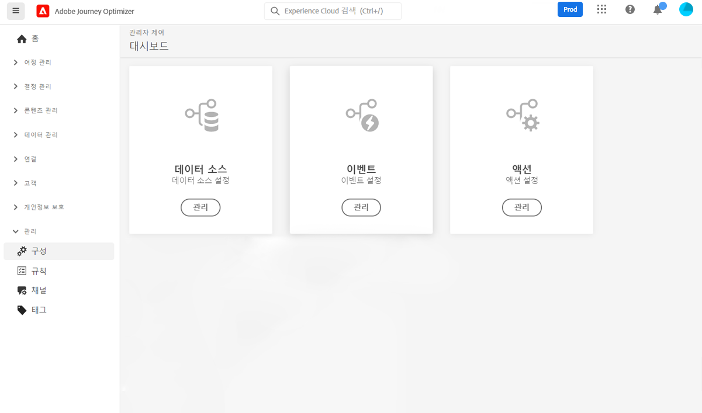

# 시작하기 [!DNL Journey Optimizer] 구성 {#start-optimizer-configuration}

액세스 시 [!DNL Journey Optimizer] 처음으로 프로덕션 샌드박스를 프로비저닝하고 계약에 따라 특정 수의 IP를 할당하게 됩니다.

여정을 만들고 메시지를 전송하려면 아래 구성 단계를 수행해야 합니다.

## 메시지 및 채널 구성

1. 메시지를 만들고 전송하려면 채널에 따라 특정 구성을 수행해야 합니다.

   * 대상 **이메일** channel 을 통해 하위 도메인을 Adobe에 위임하고 IP 풀을 만들어 IP 주소를 함께 그룹화해야 합니다. [추가 정보](../email/get-started-email-config.md)

   * 대상 **푸시** 채널에서는 두 가지 모두에서 푸시 알림 설정을 정의해야 합니다 [!DNL Adobe Experience Platform] 및 [!DNL Adobe Experience Platform Launch]. [추가 정보](../push/push-configuration.md)

   * 대상 **SMS** 채널에서 공급자 설정을 과 통합하는 등 SMS를 전송하도록 인스턴스를 구성해야 합니다 [!DNL Journey Optimizer]. [추가 정보](../sms/sms-configuration.md)

1. 완료되면 다음을 만들어야 합니다 **채널 서피스** 메시지를 전달하는 데 필요한 모든 기술 매개 변수를 구성하려면 다음을 수행하십시오. [추가 정보](channel-surfaces.md)

1. 다음을 수행할 수도 있습니다.

   * 전자 메일 주소를 제외 목록으로 보내기 전에 다시 시도를 수행하는 일 수를 관리합니다. [추가 정보](manage-suppression-list.md)

   * 를 활성화합니다 **BBC 이메일 옵션** 개인 사용자에게 전송되는 메시지 사본을 보관하기 위해 [추가 정보](archiving-support.md#enable-bcc)

   * 구성 **빈도 규칙** 받는 사람을 지나치게 배려하지 않기 위해. [추가 정보](frequency-rules.md)

   * Adobe Experience Platform에서 여러 주소/번호를 사용할 수 있는 경우 수신자의 우선 순위에 사용할 이메일 주소 및/또는 전화 번호를 결정합니다. [추가 정보](primary-email-addresses.md)

<!--* Understand the push notification flow. [Learn more](../push/push-gs.md)-->

>[!NOTE]
>
>이러한 단계는 [Adobe Journey Optimizer 시스템 관리자](../start/path/administrator.md).

## 여정 구성

여정을 구축하려면 다음을 구성해야 합니다 **[!UICONTROL Data Sources]**, **[!UICONTROL Events]** 및 **[!UICONTROL Actions]**. [추가 정보](about-data-sources-events-actions.md)

* 다음 **데이터 소스** 구성을 사용하면 여정에서 사용할 추가 정보를 검색할 시스템에 대한 연결을 정의할 수 있습니다. [추가 정보](../datasource/about-data-sources.md)

* **이벤트** 여정을 통해 여정으로 유입되는 개별 고객에게 실시간으로 메시지를 보낼 수 있습니다. 이벤트 구성에서는 여정에서 예상되는 이벤트를 구성합니다. 수신되는 이벤트 데이터는 Adobe Experience 데이터 모델(XDM)에 따라 표준화됩니다. 이벤트는 인증된 이벤트 및 인증되지 않은 이벤트(예: Adobe Mobile SDK 이벤트)에 대한 스트리밍 수집 API에서 가져옵니다. [추가 정보](../event/about-events.md)

* [!DNL Journey Optimizer] 에는 콘텐츠를 디자인하고 전송할 수 있는 기본 제공 메시지 기능이 포함되어 있습니다. 서드파티 시스템을 사용하여 메시지를 전송하는 경우 **사용자 지정 작업**. [추가 정보](../action/action.md)