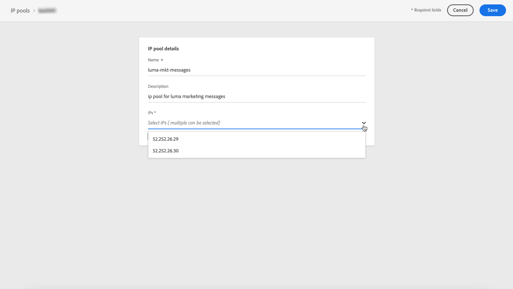

# IP 풀 만들기

## IP 풀 기본 정보 {#about-ip-pools}

Journey Optimizer을 사용하여 하위 도메인의 IP 주소를 함께 그룹화하는 IP 풀을 만들 수 있습니다.

이메일 게재 기능을 위해서는 IP 풀을 만드는 것이 좋습니다. 이렇게 하면 하위 도메인의 평판을 다른 하위 도메인에 영향을 주지 않을 수 있습니다.

예를 들어, 마케팅 메시지를 위한 IP 풀과 트랜잭션 메시지를 위한 IP 풀이 있는 것이 좋습니다. 이 방법으로 마케팅 메시지 중 하나가 제대로 수행되지 않고 고객이 스팸으로 선언할 경우 이는 트랜잭션 메시지(구매 확인, 암호 복구 메시지 등)를 계속 수신할 이 고객에게 보내는 트랜잭션 메시지에 영향을 주지 않습니다.

## IP 풀 만들기 {#create-ip-pool}

IP 풀을 생성하려면 다음 단계를 수행합니다.

1. **[!UICONTROL Channels]** / **[!UICONTROL IP pools]** 메뉴에 액세스한 다음 **[!UICONTROL Create IP Pool]** 를 클릭합니다.

   

1. IP 풀의 이름과 설명(선택 사항)을 제공합니다.

   >[!NOTE]
   >
   >하위 도메인의 이름은 문자(A-Z)로 시작하고 영숫자 또는 특수 문자( _, ., - )만 포함해야 합니다.

1. 드롭다운 목록에서 풀에 포함할 IP 주소를 선택한 다음 **[!UICONTROL Submit]** 을 클릭합니다.

   

   >[!NOTE]
   >
   >인스턴스와 함께 제공된 모든 IP 주소를 목록에서 사용할 수 있습니다.

이제 IP 풀이 생성되고 목록에 표시됩니다. 속성을 선택하여 해당 속성에 액세스하고 관련 메시지 사전 설정을 표시할 수 있습니다. 메시지 사전 설정을 IP 풀과 연결하는 방법에 대한 자세한 내용은 [이 섹션](message-presets.md))을 참조하십시오.

## IP 풀 편집 {#edit-ip-pool}

IP 풀을 편집하려면

1. 목록에서 IP 풀 이름을 클릭하여 엽니다.

   

1. 원하는 대로 속성을 편집합니다. 설명을 수정하고 IP 주소를 추가하거나 제거할 수 있습니다.

   

   >[!CAUTION]
   >
   >IP 삭제를 고려할 때 추가 로드를 다른 IP에 할당하고 게재 능력에 심각한 영향을 줄 수 있으므로 추가 주의가 필요합니다. 확실하지 않은 경우 게재 가능성 전문가에게 문의하십시오.

1. 변경 내용을 저장합니다.

>[!NOTE]
>
>IP 풀 이름을 편집할 수 없습니다. 수정하려면 IP 풀을 삭제하고 선택한 이름을 가진 다른 풀을 만들어야 합니다.

업데이트는 [메시지 사전 설정](message-presets.md)에 연결되어 있는 IP 풀에 따라 즉시 또는 비동기적으로 유효합니다.

* IP 풀이 메시지 사전 설정에서&#x200B;**이 선택되지 않은**&#x200B;이면 업데이트가 즉시(**[!UICONTROL Success]** 상태)됩니다.
* IP 풀 **이(가) 메시지 사전 설정에서**&#x200B;인 경우 업데이트는 최대 7~10일(**[!UICONTROL Processing]** 상태)이 소요될 수 있습니다.

<!--If a message preset has been associated with the IP pool, you first need to remove it before editing the IP pool. Once the your modifications have been done, you can associate the message preset again.-->

IP 풀 업데이트 상태를 확인하려면 **[!UICONTROL More actions]** 버튼을 클릭하고 **[!UICONTROL Recent updates]** 을 선택합니다.

>[!NOTE]
>
>IP 풀이 성공적으로 업데이트되면 다음을 기다려야 할 수 있습니다.
>* 몇 분 전에 한 가지 메세지에 의해
>* 배치 메시지에서 IP 풀이 유효할 때까지.

**[!UICONTROL Delete]** 버튼을 사용하여 IP 풀을 삭제할 수도 있습니다. 메시지 사전 설정에 연결된 IP 풀은 삭제할 수 없습니다.

