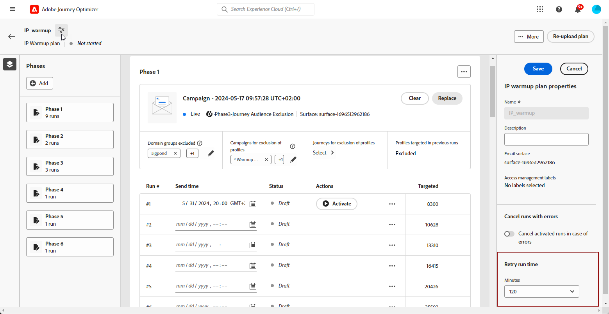
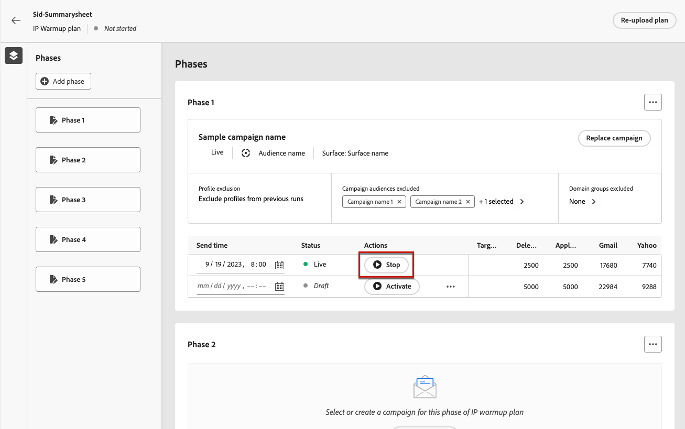
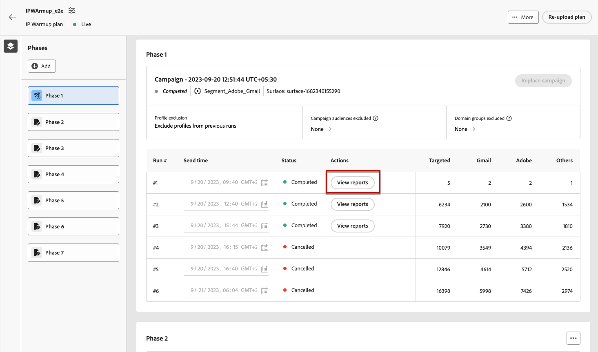

# IP 준비 계획 실행 {#ip-warmup-running}

>[!BEGINSHADEBOX]

이 설명서의 내용:

* [IP 준비 시작](ip-warmup-gs.md)
* [IP 준비 캠페인 만들기](ip-warmup-campaign.md)
* [IP 준비 계획 만들기](ip-warmup-plan.md)
* **[IP 준비 계획 실행](ip-warmup-execution.md)**

>[!ENDSHADEBOX]

다음 작업을 완료하면 [ip 준비 계획을 만들었습니다.](ip-warmup-plan.md) 게재 컨설턴트와 함께 준비한 파일을 업로드하면 플랜에서 단계 및 실행을 정의할 수 있습니다.

각 단계는 단일 캠페인을 할당할 수 있는 여러 실행으로 구성됩니다.

## 단계 정의 {#define-phases}

>[!CONTEXTUALHELP]
>id="ajo_admin_ip_warmup_campaigns_excluded"
>title="캠페인 대상자 제외"
>abstract="현재 단계에서 제외하려는 다른 캠페인에서 대상을 선택합니다. 다른 단계 또는 다른 IP 준비 계획에서 이전에 연락한 프로필이 다시 타겟팅되지 않도록 하기 위한 것입니다."

>[!CONTEXTUALHELP]
>id="ajo_admin_ip_warmup_domains_excluded"
>title="도메인 그룹 제외"
>abstract="현재 단계에서 제외할 도메인을 선택합니다. 도메인 제외에는 실행되지 않는 단계가 필요하므로 제외를 추가하려면 실행 단계를 분할해야 할 수 있습니다."
>additional-url="https://experienceleague.adobe.com/docs/journey-optimizer/using/configuration/implement-ip-warmup-plan/ip-warmup-execution.html#split-phase" text="단계 분할"

<!--You need to associate the campaign and audience at phase level and turns on some settings as needed for all runs associated with a single creative/campaign

At phase level, system ensures that previously targeted + new profiles are picked up AND at iteration level, system ensures that each run is having unique profiles and the count matches what is stated in plan-->

<!---->

1. 각 단계에 대해 이 IP 준비 계획 단계와 연결할 캠페인을 선택합니다.

   

   다음 사항을 참고하십시오.

   * 이 포함된 캠페인만 **[!UICONTROL IP 준비 계획 활성화]** 옵션 활성화됨 <!--and live?--> 선택할 수 있습니다. [자세히 알아보기](#create-ip-warmup-campaign)

   * 현재 IP 준비 계획에 대해 선택한 것과 동일한 표면을 사용하는 캠페인을 선택해야 합니다.

   * 다른 IP 준비 캠페인에서 이미 사용 중인 캠페인은 선택할 수 없습니다.

1. 다음에서 **[!UICONTROL 프로필 제외]** 섹션에서 해당 단계의 이전 실행의 프로필이 항상 제외되어 있음을 확인할 수 있습니다. 예를 들어 실행 시 타겟팅되#1 처음 4800명에서 프로필이 포함된 경우 시스템은 동일한 프로필이 실행 시 이메일을 수신하지 않도록 자동으로 #2.

1. 다음에서 **[!UICONTROL 캠페인 대상자 제외됨]** 섹션, 다른 항목에서 대상 선택 <!--executed/live?-->현재 단계에서 제외하려는 캠페인.

   

   예를 들어 1단계를 실행하는 동안 [분할하기](#split-phase) 어떤 이유에서든. 따라서 1단계에서 사용된 캠페인을 제외하여 1단계에서 이전에 연락한 프로필이 2단계에 포함되지 않도록 할 수 있습니다. 다른 IP 준비 계획에서 캠페인을 제외할 수도 있습니다.

1. 다음에서 **[!UICONTROL 도메인 그룹 제외됨]** 섹션에서 해당 단계에서 제외할 도메인을 선택합니다.

   >[!NOTE]
   >
   >도메인 제외에는 실행되지 않는 단계가 필요하므로 다음을 수행해야 할 수 있습니다. [실행 단계 분할](#split-phase) 제외를 추가합니다.

   

   예를 들어 며칠 동안 IP 웜업을 실행한 후에는 도메인(예: Adobe)에 대한 ISP 평판이 좋지 않음을 깨닫고 IP 웜업 계획을 중지하지 않고 이를 해결하려고 합니다. 이러한 경우 Adobe 도메인 그룹을 제외할 수 있습니다.

   >[!NOTE]
   >
   >도메인이 기본 제공 도메인 그룹이 아닌 경우 전달성 컨설턴트와 함께 이 도메인을 및에 추가해야 합니다. [IP 준비 계획 파일](ip-warmup-plan.md#prepare-file) 및 [다시 업로드](#re-upload-plan) 를 입력하여 해당 도메인을 제외할 수 있습니다.

1. 필요한 경우 단계를 추가할 수 있습니다. 마지막 현재 단계 이후에 추가됩니다.

   

1. 사용 **[!UICONTROL 단계 삭제]** 단추를 클릭하여 원하지 않는 단계를 제거합니다.

   

   >[!CAUTION]
   >
   >실행을 취소할 수 없습니다. **[!UICONTROL 삭제]** 작업.
   >
   >IP 준비 계획에서 모든 단계를 삭제하는 경우 계획을 다시 업로드하는 것이 좋습니다. [자세히 알아보기](#re-upload-plan)

## 실행 정의 {#define-runs}

1. 각 실행에 대한 일정을 선택합니다.

   

1. 선택적으로, 세분화 작업이 지연되는 경우 IP 웜업 캠페인을 실행할 수 있는 시간 창을 정의할 수 있습니다. 이렇게 하려면 계획 이름 옆에 있는 왼쪽 상단의 등록 정보 아이콘을 누르고 **[!UICONTROL 재시도 실행 시간]** 드롭다운 목록에서 지속 시간을 선택합니다(최대 240분(4시간)).

   

   예를 들어 지정된 일에 전송 시간을 오후 9시로 설정하고 120분을 다시 시도 실행 시간으로 선택하면 세분화 작업을 실행하는 데 2시간의 기회 창이 허용됩니다.

   >[!NOTE]
   >
   >시간 창을 지정하지 않으면 전송 시 실행이 시도되며 세분화 작업이 완료되지 않으면 실패합니다.

1. 필요한 경우 다음을 선택합니다 **[!UICONTROL 실행 편집]** 추가 작업 아이콘에서 참조할 수 있습니다. 여기에서 각 열의 주소 수를 업데이트할 수 있습니다. 다음을 업데이트할 수도 있습니다. **[!UICONTROL 마지막 참여]** 지난 20일 동안의 브랜드와 관련된 사용자만 타겟팅하는 필드.

   

1. 다음 항목 선택 **[!UICONTROL 오류 발생 시 일시 중지]** 오류가 발생하는 경우 실행을 일시 중지하려면 옵션을 선택합니다.<!--can't see the Paused status for runs? Is it failed?-->

   

   예를 들어, 세분화 작업이 실행된 후 타겟팅된 프로필 수가 예상보다 적으면 실행이 취소됩니다.

1. **[!UICONTROL 활성화]** 달리기. 세분화 작업을 실행할 시간을 충분히 예약했는지 확인하십시오.

   

   >[!CAUTION]
   >
   >각 실행은 실제 전송 시간보다 최소 12시간 전에 활성화되어야 합니다. 그렇지 않으면 세그먼테이션이 완료되지 않을 수 있습니다. <!--How do you know when segmentation is complete? Is there a way to prevent user from scheduling less than 12 hours before the segmentation job?-->

   <!--Sart to execute on every day basis by simply clicking the play button > for each run? do you have to come back every day to activate each run? or can you schedule them one after the other?)-->

   <!--Upon activation, when the segment evaluation happens, more segments will be created by the IP warmup service and will be leveraged in an audience composition and a new audience will be created for each run splitted into the different selected domains.-->

1. 이 실행의 상태가 (으)로 변경됩니다. **[!UICONTROL 라이브]**. 다양한 실행 상태가 다음에 나열됩니다. [이 섹션](#monitor-plan). 캠페인 실행이 시작되지 않은 경우 라이브 실행을 중단할 수 있습니다.<!--why?-->

   

   >[!NOTE]
   >
   >캠페인 실행이 시작되면 **[!UICONTROL 중지]** 버튼을 사용할 수 없게 됩니다.

1. 실행을 추가하려면 다음을 선택합니다. **[!UICONTROL 아래에 실행 추가]** 점 세 개 아이콘에서

   

## 플랜 관리 {#manage-plan}

어느 시점에서 IP 준비 계획이 예상대로 수행되지 않으면 아래 작업을 수행할 수 있습니다.

### 단계 분할 {#split-phase}

특정 실행에서 시작하는 새 단계를 추가하려면 다음을 선택합니다. **[!UICONTROL 새 단계로 분할 옵션]** 점 세 개 아이콘에서

현재 단계의 나머지 실행에 대해 새 단계가 생성됩니다.

예를 들어 실행 목록에 대해 이 옵션#4 선택하면 #8 실행 #4가 새 단계로 이동됩니다.

다음 단계 [위](#define-phases) 새 단계를 정의합니다.

* 다음을 사용할 수 있습니다. **[!UICONTROL 캠페인 바꾸기]** 새로운 단계에 대한 옵션입니다.

* 이전 캠페인이나 성과가 좋지 않은 도메인을 제외할 수도 있습니다. 에서 방법 알아보기 [이 섹션](#define-phases).

<!--
You don't have to decide the campaign upfront. You can do a split later. It's a work in progress plan: you activate one run at a time with a campaign and you always have the flexibility to modify it while working on it.

But need to explain in which case you want to modify campaigns, provide examples
-->

### 계획을 완료됨으로 표시 {#mark-as-completed}

플랜이 제대로 수행되지 않거나 다른 플랜을 만들기 위해 드롭하려는 경우 완료된 플랜으로 표시할 수 있습니다.

이렇게 하려면 **[!UICONTROL 자세히]** IP 웜업 계획의 오른쪽 상단에 있는 단추이며 **[!UICONTROL 완료로 표시]**.

이 옵션은 플랜의 모든 실행이 포함된 경우에만 사용할 수 있습니다. **[!UICONTROL 완료됨]** 또는 **[!UICONTROL 초안]** 상태. 실행 시 **[!UICONTROL 라이브]**&#x200B;을 지정하면 옵션이 회색으로 표시됩니다.

다양한 실행 상태가 다음에 나열됩니다. [이 섹션](#monitor-plan).

### IP 준비 계획 다시 업로드 {#re-upload-plan}

IP 준비 계획이 예상대로 수행되지 않는 경우(예: 일부 ISP에서 메시지를 스팸으로 표시하는 경우) 전달성 전문가에게 다른 IP 준비 계획 파일을 설정하고 해당 버튼을 사용하여 다시 업로드하도록 요청할 수 있습니다.

이전에 실행한 모든 실행이 완료된 것으로 표시됩니다. 새 계획은 첫 번째 계획 아래에 표시됩니다.

다음 단계 [위](#define-phases) 을 눌러 새 계획에서 단계를 정의합니다.

>[!NOTE]
>
>IP 준비 계획 세부 사항은 새로 업로드한 파일에 따라 변경됩니다. 라이브 및 완료된 실행은 영향을 받지 않습니다.

## 플랜 모니터링 {#monitor-plan}

플랜의 영향을 측정하기 위해 다음을 사용하여 IP 준비 캠페인의 성과를 확인할 수 있습니다. [!DNL Journey Optimizer] 캠페인 보고서. 이렇게 하려면 완료된 각 실행에 대해 **[!UICONTROL 보고서 보기]** 단추를 클릭합니다. Campaign 이메일에 대해 자세히 알아보기 [라이브 보고서](../reports/campaign-live-report.md#email-live) 및 [글로벌 보고서](../reports/campaign-global-report.md##email-global).

IP 워밍업 계획 자체가 한 곳에서 통합 보고서 역할도 한다. 의 수와 같은 요소를 확인할 수 있습니다. **[!UICONTROL 라이브]** 또는 **[!UICONTROL 완료됨]** 는 각 단계에 대해 실행되며 IP 웜업 계획이 어떻게 진행되고 있는지 확인합니다.

실행은 다음과 같은 상태를 가질 수 있습니다.

* **[!UICONTROL 초안]** : 실행이 생성될 때마다 [새 계획 생성](ip-warmup-plan.md) 또는 [실행 추가](#define-runs) 사용자 인터페이스에서 **[!UICONTROL 초안]** 상태.
* **[!UICONTROL 라이브]**: 실행을 활성화할 때마다 **[!UICONTROL 라이브]** 상태.
* **[!UICONTROL 완료됨]**<!--TBC-->: 이 실행에 대한 캠페인 실행이 완료되었습니다. <!--i.e. campaign execution has started, no error happened and emails have reached users? to check with Sid-->
* **[!UICONTROL 취소됨]**: a **[!UICONTROL 라이브]** 을(를) 사용하여 실행이 취소되었습니다. **[!UICONTROL 중지]** 단추를 클릭합니다. 이 버튼은 캠페인 실행이 시작되지 않은 경우에만 사용할 수 있습니다. [자세히 알아보기](#define-runs)
* **[!UICONTROL 실패]**: 시스템에서 오류가 발생하거나 현재 단계에 사용되는 캠페인이 중지되었습니다<!--what should the user do in that case?-->.
