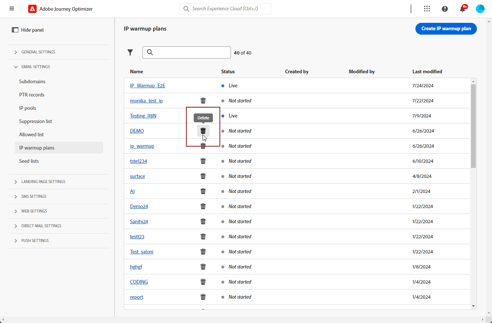

# IP 워밍업 플랜 만들기 {#ip-warmup}

전용 구성과 해당 옵션이 활성화된 하나 이상의 [IP 준비 캠페인](ip-warmup-campaign.md)을(를) 만들면 IP 준비 계획을 만들 수 있습니다.

IP 준비 계획에 액세스, 만들기, 편집 및 삭제하려면 **[!UICONTROL 게재 가능성 컨설턴트]** 역할 또는 IP 준비 계획 관련 권한이 있어야 합니다.

+++게재 가능성 컨설턴트 역할 또는 IP 웜업 계획 관련 권한을 할당하는 방법을 알아봅니다.

객체 수준 액세스 제어를 사용하면 데이터를 보호하고 특정 액세스 권한을 부여하여 계획을 보고 관리할 수 있습니다. IP 준비 계획에 레이블이 할당되지 않은 경우 모든 사용자가 보고 편집할 수 있도록 열립니다.

**[!UICONTROL IP 준비 계획 보기]** 권한을 부여하면 액세스 권한이 보기 및 게시로만 제한됩니다. 반면 **[!UICONTROL IP 준비 계획 관리]** 권한을 할당하면 사용자가 계획을 보고 편집할 수 있습니다.

특정 **[!UICONTROL 역할]**&#x200B;에 해당 권한을 할당하려면 다음을 수행하십시오.

1. [!DNL Permissions] 제품에서 **[!UICONTROL 역할]** 메뉴로 이동한 다음 새 **[!UICONTROL IP 준비 구성]** 권한으로 업데이트할 역할을 선택합니다.

1. **[!UICONTROL 역할]** 대시보드에서 **[!UICONTROL 편집]**&#x200B;을(를) 클릭합니다.

   

1. 권한을 할당하려면 **[!UICONTROL IP 준비 구성]** 리소스를 끌어서 놓으십시오.

1. **[!UICONTROL IP 준비 구성]** 리소스 드롭다운에서 사용자에게 필요한 권한을 선택합니다. **[!UICONTROL IP 준비 계획 보기]**, **[!UICONTROL IP 준비 계획 관리]** 및/또는 **[!UICONTROL IP 준비 보고서 보기]**. 필요한 경우 한 번에 모두 선택할 수 있습니다.

   

1. **[!UICONTROL 저장]**&#x200B;을 클릭합니다.

**[!UICONTROL 사용자]**&#x200B;에게 해당 역할을 할당하려면 다음을 수행하십시오.

1. [!DNL Permissions] 제품에서 **[!UICONTROL 역할]** 메뉴로 이동하여 **[!UICONTROL 게재 가능성 컨설턴트]** 기본 제공 역할을 선택하십시오.

1. **[!UICONTROL 역할]** 대시보드에서 **[!UICONTROL 사용자]** 탭에 액세스합니다.

   

1. **[!UICONTROL 사용자 추가]**&#x200B;를 클릭하여 **[!UICONTROL 게재 가능성 컨설턴트]** 기본 제공 역할을 할당합니다.

   

1. **[!UICONTROL 사용자]**&#x200B;를 선택하고 **[!UICONTROL 저장]**&#x200B;을 클릭합니다.

   

+++

## IP 워밍업 플랜 파일 준비 {#prepare-file}

IP 웜업은 합법적인 발신자로서의 평판을 확립하기 위해 IP 및 도메인에서 주요 인터넷 서비스 공급자(ISP)로 나가는 이메일 양을 점차적으로 늘리는 작업입니다.

이 활동은 일반적으로 업계 도메인, 사용 사례, 지역, ISP 및 다양한 기타 요인을 기반으로 잘 설계된 계획을 준비하는 데 도움을 주는 전달성 전문가의 도움을 받아 수행됩니다.

<!--When working with the [!DNL Journey Optimizer] IP warmup feature, this plan takes the form of an Excel file that must contain a number of predefined columns.-->

[!DNL Journey Optimizer] 인터페이스에서 IP 준비 계획을 만들려면 먼저 계획을 채울 모든 데이터를 Excel 템플릿에 입력해야 합니다.

* 사용자 인터페이스에서 빈 Excel [IP 준비 계획 템플릿](assets/IPWarmupPlan-Template.xlsx)을(를) 다운로드하여 채울 수 있습니다.

* 예제로 사용할 수 있는 일부 데이터로 이미 채워진 [샘플 IP 준비 계획](assets/IPWarmupPlan-Sample.xlsx)을 다운로드할 수도 있습니다.

<!--
* From the user interface you can download the blank Excel IP warmup plan template to fill in.

* You can also download a sample IP warmup plan already filled in with some data you can use as an example.
-->

>[!CAUTION]
>
>게재 컨설턴트와 협력하여 IP 준비 계획 파일이 올바르게 설정되었는지 확인합니다.
>
>템플릿에 제공된 형식을 사용해야 합니다.

다음은 IP 웜업 플랜이 포함된 파일의 예입니다.

### 준비 계획 탭 {#ip-warmup-plan-tab}

IP 준비 계획을 만들려면 첫 번째 탭에 계획을 제공하는 데 필요한 데이터를 채우십시오.

* 위의 예에서는 17일 이상(&#39;**실행**&#39;이라고 함)에 걸쳐 100만 개 이상의 프로필이 있는 대상 볼륨에 도달하도록 계획을 준비했습니다.

* 이 계획은 여섯 개의 **단계**&#x200B;를 통해 실행되며, 각 단계에는 하나 이상의 실행이 포함됩니다.

* 최대 6개의 열이 있을 수 있습니다(도메인 그룹의 경우 4개 열, **기타** 열 및 **참여 일수** 열의 경우 1개). 이 예에서 플랜은 6개의 열로 나뉩니다.

   * 이 중 3개가 플랜에서 사용할 **기본 제공 도메인 그룹**&#x200B;에 해당합니다(Gmail, Yahoo 및 Microsoft). 기본 도메인 그룹은 [OOTB 도메인 그룹](#ootb-domain-groups-tab) 탭에 모두 나열됩니다.
   * 하나의 열이 사용자 정의 도메인 그룹에 해당합니다([사용자 정의 도메인 그룹](#custom-domain-group-tab) 탭을 사용하여 추가해야 함).
   * 다섯 번째 열인 **기타**&#x200B;에는 계획에 명시적으로 포함되지 않은 다른 도메인의 나머지 주소가 모두 포함되어 있습니다. 이 열은 선택 사항입니다. 생략하면 이메일이 지정된 도메인으로만 이동합니다.
   * 마지막 열인 **참여 일**&#x200B;을(를) 사용하면 참여를 추적하거나 평가할 일수를 지정할 수 있습니다.

이 아이디어는 각 실행에서 타깃팅된 주소의 수를 점진적으로 늘리면서 각 단계에 대한 실행 수를 줄이는 것입니다.

### 사용자 정의 도메인 그룹 탭 {#custom-domain-group-tab}

사용자 정의 도메인 그룹을 포함하여 플랜에 열을 더 추가할 수도 있습니다.

**[!UICONTROL 사용자 지정 도메인 그룹]** 탭을 사용하여 새 도메인 그룹을 정의합니다. 각 도메인에 대해 포함되는 모든 하위 도메인을 추가할 수 있습니다.

>[!IMPORTANT]
>
>각 도메인이 해당 도메인 그룹에 고유하고 다른 도메인 그룹 또는 [기본 도메인 그룹](#ootb-domain-groups-tab)과 겹치지 않는지 확인하십시오.

예를 들어, 사용자 정의 도메인 Roadrunner를 추가하는 경우 아래 예와 같이 roadrunner.com, nc.rr.com, tampabay.rr.com, rochester.rr.com 등의 하위 도메인을 포함하려고 합니다.

>[!NOTE]
>
>사용자 정의 도메인이 필요하지 않으면 **[!UICONTROL 사용자 정의 도메인 그룹]** 탭을 비워 둡니다.

### OOTB 도메인 그룹 탭 {#ootb-domain-groups-tab}

IP 준비 계획 템플릿의 **OOTB 도메인 그룹** 탭에는 계획에 추가할 수 있는 기본 도메인 그룹이 모두 포함되어 있습니다.

>[!NOTE]
>
>도메인 그룹이 이 탭에 나열되지 않으면 해당 탭에서 사용자 정의 도메인 그룹을 만들어야 합니다. [자세히 알아보기](#custom-domain-group-tab)

기본 제공 기본 도메인 그룹은 다음과 같습니다.

+++ Gmail
gmail.com;google.com;googlemail.com;googlemail.co.uk
+++

+++Microsoft
hotmail.com.tr;live.de;live.ru;live.nl;windowslive.com;live.jp;mts.net;xbox.com;hotmail.fr;hotmail.cl;hotmail.jp;live.cl;live.at;live.com.au;hotmail.co.th;live.hk;hotmail.com.au;hotmail.com;live.com.my;hotmail.co.kr;live.ie;outlook.com.br;hotmail.dk;hotmail.co.il;live.co.kr;live.co.uk;outlook.ie;live.cn;live.com.mx;hotmail.co.uk;hotmail.es;live.fr;live.no;live.dk;hotmail.it;live.com.sg;live.be;msn.com;hotmail.co.jp;live.in;hotmail.se;live.co.za;hotmail.ch;live.com.pt;outlook.com;hotmail.gr;live.it;live.com;live.com.ar;hotmail.com.br hotmail.com.ar;live.ca;live.ca;hotmail.de
+++

+++야후
aol.fi;games.com;cs.com;yahoo.com.in;y7mail.com;yahoo.co.uk;yahoo.hu;yahoo.co.hu;yahoo.cn;yahoogroups.com.sg;yahoogroups.com.au;aol.pl;aolpoland.pl;aolnorge.no;yahoo.com.au;yahoo.fi;yahoo.com.vn;aol.co.nz;yahoo.com.br;yahoo.hr;aol.cz;yahoo.ee;aol.be;aoolcom.tr;yahoo.si;yahoo.ne.jp;aol.it;ymail.com;yahoo.es;yahoo.dk;yahoohoogroups.ca;netscape.com;aol.kr;aol.jp;yahoo.com.pe;yaol.lt;yahoo.co.id;aol.nl;yahoo.bg;citlink.net;aol.se;필수 구성;wmconnect.com;aol.cl;yahoo.com.jp;yahoo.no;yahoo.com.hk;aol.com.br;yahoo.cz;yahoo.co.kr;yahoo.sk;yahoo.com.ar;yahoogroups.de;yahoo.gr;ygm.com;yahoo.ro;yahoo.co.nz;aol.com;yahoo.at;goowy.com;rocketmail.com;aol.fr;aol.de;frontiernet.net;aim.com;yahoogroups.co.in;netscape.net;luckymail.com;yahoo.co.jp;yahoo.com.kr;yahoo.se;myaol.jp;yahoo.co.za;yahoo.pt;verizon.net;aol.com.ve;aol.com.ar;yahoogrupper.dk;yahoo.fr;aol.com.co;eoph.pl;wild4music.com;eol.ch;yahoo.it;yahoogroups.com.cn;yahoo.com.co;wow.com;저장소;yahoogruppi.it;yahoo.cl;yahoo.com;ehoo.be ol.tw;yahooxtra.co.nz;yahoo.com.mx;yahoo.com.ph;sky.com;aol.com.mx;aol.com.au;aolchina.com;yahoo.com.net;yahoo.com.tw;talk21.com;aol.ru;compuserve.com;yahoo.com.sg yahoogroups.com.tw frontier.com yahoo.co.in yahoo.co.il verizon.net.in yahoo.com.tr yahoogroups.com.hk yahoogroups.co.uk yahoo.com.biz yahoo.com.hr aol.co.uk ybb.ne.jp yahoogroups.co.kr yahoo.com.my rogers.com gte.net yahoogroups.com yahoo.co.th yahoo.com.cn love.com bellatlantic.net yahoo.com.ve yahoo.com.ua;yahoo.lv;aolpolska.pl;aol.at;yahoo.pl
+++

+++Apple
mac.com;icloud.com;apple.com;me.com
+++

+++컴캐스트
comcast.net
+++

+++주황색
voila.com;francetelecom.com;orange.com;orange.fr;wanadoo.fr;voila.fr
+++

+++라 포스트
laposte.net
+++

+++이탈리아 온라인
inwind.it;blu.it;virgilio.it;giallo.it;iol.it;libero.it
+++

+++WP
wp.pl;o2.pl
+++

+++유나이티드 인터넷
gmx.de;1and1.com;gmx.fr;mail.com;1und1.de;gmx.com;gmx.net;gmx.at;web.de;gmx.ch
+++

+++비그폰드
bigpond.com;bigpond.com.au;bigpond.net;telstra.com;bigpond.net.au
+++

+++도코모
docomo.ne.jp
+++

+++소프트뱅크
c.vodafone.ne.jp;jp-h.ne.jp;k.vodafone.ne.jp;jp-d.ne.jp;jp-c.ne.jp;t.vodafone.ne.jp;h.vodafone.ne.jp;r.vodafone.ne.jp;q.vodafone.ne.jp;jp-t.ne.jp;jp-q.ne.jp;s.vodafone.ne.jp;jp-s.ne.jp;jp-r.ne.jp;jp-k.ne.jp;n.vodafone.ne.jp;d.vodafone.ne.jp;softbank.ne.jp;jp-n.ne.jp;;;;;;;;;;;;;;;
+++

+++KDI
au.com;ezweb.ne.jp;uqmobile.jp
+++

### 예 {#example}

두 개의 사용자 정의 도메인 그룹을 원한다고 가정해 보겠습니다.

* Hotmail 도메인에만 사용할 수 있습니다.
* 도메인 그룹 Microsoft의 다른 모든 도메인에 대한 것입니다(따라서 모든 Hotmail 도메인 제외).

Hotmail 외부 도메인과 도메인 그룹 Microsoft의 도메인은 **[!UICONTROL 기타]** 열에 수집됩니다.

1. **[!UICONTROL 사용자 지정 도메인 그룹]** 탭에서 **Hotmail** 도메인 그룹을 만듭니다.

1. 동일한 행에 모든 Hotmail 도메인을 추가합니다.

   [OOTB 도메인 그룹 탭](#ootb-domain-groups-tab) 섹션에 나열된 모든 Hotmail 도메인을 [복사 및 붙여넣기](#copy-paste)할 수 있습니다.

1. 다른 행을 추가합니다.

1. **Microsoft_X** 도메인 그룹을 만듭니다.

1. Hotmail이 아닌 모든 Microsoft 도메인을 같은 행에 추가합니다. 마찬가지로 위의 목록에서 [복사하여 붙여넣기](#copy-paste)할 수 있습니다.

1. **[!UICONTROL IP 준비 계획]** 탭으로 돌아갑니다.

1. **Hotmail**&#x200B;용 열, **Microsoft_X**&#x200B;용 열 및 **기타**&#x200B;용 열을 만듭니다.

1. 필요에 따라 열을 입력합니다.

<!--Only the domain groups listed in the **[!UICONTROL IP Warmup Plan]** tab will be taken into account.-->

### 기본 도메인 복사-붙여넣기 {#copy-paste}

예를 들어 모든 Hotmail 도메인을 포함하는 사용자 정의 도메인 그룹을 만들려면 [IP 준비 계획 템플릿](assets/IPWarmupPlan-Template.xlsx)의 **OOTB 도메인 그룹** 탭이나 [위](#ip-warmup-plan-tab)에 제공된 목록에서 도메인을 복사하여 붙여 넣을 수 있습니다.

그런 다음 Excel 변환 도구를 사용하여 텍스트를 열로 변환합니다.

1. **[!UICONTROL 데이터]** > **[!UICONTROL 열에 텍스트 추가...]**&#x200B;를 선택하고 **[!UICONTROL 구분]**&#x200B;을 선택한 후 **[!UICONTROL 다음]**&#x200B;을 선택합니다.

1. **[!UICONTROL 세미콜론]**&#x200B;을 선택하고 **[!UICONTROL 다음]** 및 **[!UICONTROL 마침]**&#x200B;을 클릭하세요.

이제 각 도메인이 동일한 행의 다른 열에 표시됩니다.

## IP 준비 계획 액세스 및 관리 {#manage-ip-warmup-plans}

1. **[!UICONTROL 관리]** > **[!UICONTROL 채널]** > **[!UICONTROL 전자 메일 설정]** > **[!UICONTROL IP 준비 계획]** 메뉴에 액세스합니다. 지금까지 만든 모든 IP 준비 계획이 표시됩니다.

   

1. 상태를 필터링할 수 있습니다. 다양한 상태는 다음과 같습니다.

   * **시작되지 않음**: 실행이 아직 활성화되지 않았습니다. [자세히 알아보기](ip-warmup-execution.md#define-runs)
   * **Live**: 첫 번째 단계의 첫 번째 실행이 활성화되는 즉시 계획이 이 상태로 변경됩니다. [자세히 알아보기](ip-warmup-execution.md#define-runs)
   * **완료**: 플랜이 완료된 것으로 표시되었습니다. <!--This option is only available if all the runs in the plan are in **[!UICONTROL Completed]** or **[!UICONTROL Draft]** status (no run can be **[!UICONTROL Live]**).--> [자세히 알아보기](ip-warmup-execution.md#mark-as-completed)
     <!--* **Paused**: to check (user action)-->

1. IP 준비 계획을 삭제하려면 계획 이름 옆에 있는 **[!UICONTROL 삭제]** 아이콘을 선택하고 삭제를 확인합니다.

   >[!NOTE]
   >
   >**시작되지 않음** 상태의 계획만 삭제할 수 있습니다.

   

   >[!CAUTION]
   >
   >선택한 IP 준비 계획이 영구적으로 삭제됩니다.

## IP 워밍업 플랜 만들기 {#create-ip-warmup-plan}

>[!CONTEXTUALHELP]
>id="ajo_admin_ip_warmup_upload"
>title="IP 워밍업 플랜 지정"
>abstract="IP 워밍업 단계, 목표 프로필 수와 같이 플랜에 필요한 모든 데이터를 입력하여 Excel 템플릿을 작성하고 여기에 업로드합니다."
>additional-url="https://experienceleague.adobe.com/docs/journey-optimizer/using/configuration/implement-ip-warmup-plan/ip-warmup-plan.html#prepare-file" text="IP 워밍업 플랜 파일 준비"

>[!CONTEXTUALHELP]
>id="ajo_admin_ip_warmup_surface"
>title="마케팅 구성 선택"
>abstract="IP 워밍업 플랜과 연결하려는 캠페인에서 선택한 것과 동일한 구성을 선택해야 합니다."
>additional-url="https://experienceleague.adobe.com/docs/journey-optimizer/using/configuration/channel-surfaces.html" text="채널 구성 설정"
>additional-url="https://experienceleague.adobe.com/docs/journey-optimizer/using/configuration/channel-surfaces.html" text="IP 워밍업 캠페인 만들기"

IP 준비 계획을 만들려면 아래 단계를 수행합니다.

1. **[!UICONTROL 관리]** > **[!UICONTROL 채널]** > **[!UICONTROL 전자 메일 설정]**> **[!UICONTROL IP 준비 계획]** 메뉴에 액세스한 다음 **[!UICONTROL IP 준비 계획 만들기]**&#x200B;를 클릭합니다.

   

1. IP 준비 계획 세부 사항을 입력합니다. 이름과 설명을 입력합니다.

   

1. 준비 중인 [구성](channel-surfaces.md)을(를) 선택하십시오. 마케팅 구성만 선택할 수 있습니다. [전자 메일 유형에 대해 자세히 알아보기](../email/email-settings.md#email-type)

   >[!NOTE]
   >
   >IP 준비 계획과 연결할 캠페인은 동일한 구성을 사용해야 합니다. [IP 준비 캠페인을 만드는 방법을 알아봅니다](ip-warmup-campaign.md)

1. IP 준비 계획이 포함된 Excel 파일을 업로드합니다. [자세히 알아보기](#prepare-file)

   <!--
    You can also download the Excel template from the [!DNL Journey Optimizer] user interface and upload it after filling it with the IP warmup details.-->

   

   >[!NOTE]
   >
   >업로드가 실패할 경우 올바른 형식 및 파일 형식(.xls 또는 .xlsx)을 사용하고 있는지 확인하십시오. Adobe에서 제공한 [템플릿](assets/IPWarmupPlan-Template.xlsx)을(를) 사용하십시오.

1. Click **[!UICONTROL Create]**. 업로드한 파일에 정의된 모든 단계, 실행, 열 및 내용이 [!DNL Journey Optimizer] 인터페이스에 자동으로 표시됩니다.

   

   >[!NOTE]
   >
   >**[!UICONTROL Targeted]** 열은 각 실행에 대해 타깃팅된 모든 프로필의 합계를 표시합니다. 즉, **Others** 열이 있는 경우 해당 열을 포함하여 정의한 각 도메인 그룹의 모든 프로필을 의미합니다.

이제 IP 준비 계획을 실행할 준비가 되었습니다. [자세히 알아보기](ip-warmup-execution.md)
