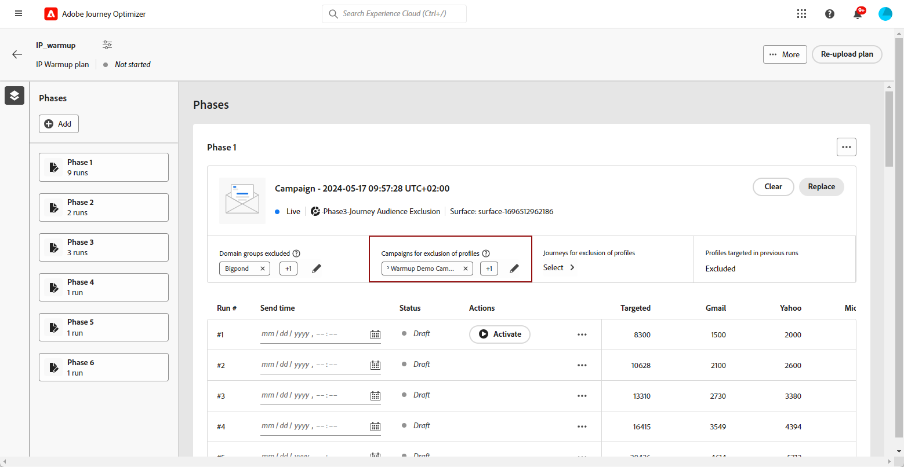

# IP 준비 계획 실행 {#ip-warmup-running}

>[!BEGINSHADEBOX]

이 설명서의 내용:

* [IP 준비 시작](ip-warmup-gs.md)
* [IP 준비 캠페인 만들기](ip-warmup-campaign.md)
* [IP 준비 계획 만들기](ip-warmup-plan.md)
* **[IP 준비 계획 실행](ip-warmup-running.md)**

>[!ENDSHADEBOX]

## 단계 정의 {#define-phases}

>[!CONTEXTUALHELP]
>id="ajo_admin_ip_warmup_campaigns_excluded"
>title="제외할 캠페인 대상 선택"
>abstract="현재 단계에서 제외하려는 다른 캠페인에서 대상을 선택합니다."

>[!CONTEXTUALHELP]
>id="ajo_admin_ip_warmup_domains_excluded"
>title="제외할 도메인 그룹 선택"
>abstract="현재 단계에서 제외할 도메인을 선택합니다."

단계 수준에서 캠페인과 대상자를 연결하고 단일 Creative/Campaign과 연결된 모든 실행에 대해 필요에 따라 일부 설정을 켜야 합니다

단계 수준에서 시스템은 이전에 타기팅한 + 새 프로필을 선택하며 반복 수준에서 시스템은 각 실행에 고유한 프로필이 있으며 카운트는 계획에 명시된 것과 일치하는지 확인합니다

1. 각 단계에 대해 이 IP 준비 계획 단계와 연결할 캠페인을 선택합니다.

   

   다음 사항을 참고하십시오.

   * 이 포함된 캠페인만 **[!UICONTROL IP 준비 계획 활성화]** 옵션 활성화됨 <!--and live?--> 선택할 수 있습니다. [자세히 알아보기](#create-ip-warmup-campaign)

   * 현재 IP 준비 계획에 대해 선택한 것과 동일한 표면을 사용하는 캠페인을 선택해야 합니다.

   * 다른 IP 준비 캠페인에서 이미 사용 중인 캠페인은 선택할 수 없습니다.

1. 다음에서 **[!UICONTROL 프로필 제외]** 섹션에서 해당 단계의 이전 실행의 프로필이 항상 제외되어 있음을 확인할 수 있습니다. 예를 들어 실행 시 타겟팅되#1 처음 4800명에서 프로필이 포함된 경우 시스템은 동일한 프로필이 실행 시 이메일을 수신하지 않도록 자동으로 #2.

1. 다음에서 **[!UICONTROL 캠페인 대상자 제외됨]** 섹션, 다른 항목에서 대상 선택 <!--executed/live?-->현재 단계에서 제외하려는 캠페인.

   

   예를 들어 1단계를 실행하는 동안 [분할하기](#split-phase) 어떤 이유에서든. 따라서 1단계에서 사용된 캠페인을 제외하여 1단계에서 이전에 연락한 프로필이 2단계에 포함되지 않도록 할 수 있습니다. 다른 IP 준비 계획에서 캠페인을 제외할 수도 있습니다.

1. 다음에서 **[!UICONTROL 도메인 그룹 제외됨]** 섹션에서 해당 단계에서 제외할 도메인을 선택합니다.

   

   예를 들어 며칠 동안 IP 웜업을 실행한 후에는 도메인(즉, Adobe)의 ISP 평판이 좋지 않음을 깨닫고 IP 웜업 계획을 중지하지 않고 이를 해결하려고 합니다. 이러한 경우 Adobe 도메인 그룹을 제외할 수 있습니다.

   >[!NOTE]
   >
   >도메인 제외에는 실행되지 않는 단계가 필요하므로 제외를 추가하려면 실행 단계를 분할해야 할 수 있습니다. 마찬가지로 도메인 그룹이 OOTB 도메인 그룹이 아닌 경우 이 도메인 그룹을 Excel 파일에 추가하고 업로드한 다음 도메인을 제외해야 합니다.

   

1. 필요한 경우 단계를 추가할 수 있습니다. 마지막 현재 단계 이후에 추가됩니다.

1. 사용 **[!UICONTROL 단계 삭제]** 단추를 클릭하여 원하지 않는 단계를 제거합니다.

   

   >[!CAUTION]
   >
   >실행을 취소할 수 없습니다. **[!UICONTROL 삭제]** 작업.
   >
   >IP 준비 계획에서 모든 단계를 삭제하는 경우 계획을 다시 업로드하는 것이 좋습니다.

## 실행 정의 {#define-runs}

1. 각 실행에 대한 일정을 선택합니다. <!--which is actually a window of opportunity. meaning? how many hours? shall we specify that to clarify?-->

   

1. 대상자 세분화 작업 실행이 지연되는 경우 IP 웜업 캠페인을 실행할 수 있는 창을 정의하는 종료 시간을 선택합니다. 종료 시간을 지정하지 않으면 시작 시간에 실행이 시도되며 세그먼테이션이 완료되지 않으면 실패합니다.

1. 각 실행을 활성화합니다. 세분화 작업을 실행할 수 있도록 시간을 충분히 일찍 예약하십시오. <!--explain how you can evaluate a proper time-->

   >[!CAUTION]
   >
   >각 실행은 실제 전송 시간보다 최소 12시간 전에 활성화되어야 합니다. 그렇지 않으면 세그먼테이션이 완료되지 않을 수 있습니다. <!--How do you know when segmentation is complete? Is there a way to prevent user from scheduling less than 12 hours before the segmentation job?-->

   <!--Sart to execute on every day basis by simply clicking the play button > for each run? do you have to come back every day to activate each run? or can you schedule them one after the other?)-->

1. 캠페인 실행이 시작되지 않은 경우 실행을 중단할 수 있습니다.<!--why?-->

   >[!NOTE]
   >
   >캠페인 실행이 시작되면 **[!UICONTROL 중지]** 버튼을 사용할 수 없게 됩니다. <!--TBC in UI-->

   

1. 실행을 추가하려면 다음을 선택합니다. **[!UICONTROL 아래에 실행 추가]** 점 세 개 아이콘에서

   

## 단계 분할 {#split-phase}

언제든지 특정 실행에서 시작하는 다른 캠페인을 사용하려면 다음을 선택합니다. **[!UICONTROL 새 단계로 분할 옵션]** 점 세 개 아이콘에서

현재 단계의 나머지 실행에 대해 새 단계가 생성됩니다. 다음 단계 [위](#define-phases) 새 단계를 정의합니다.

예를 들어 실행 목록에 대해 이 옵션#4 선택하면 #8 실행 #4가 새 단계로 이동됩니다.

<!--
You don't have to decide the campaign upfront. You can do a split later. It's a work in progress plan: you activate one run at a time with a campaign and you always have the flexibility to modify it while working on it.

But need to explain in which case you want to modify campaigns, provide examples
-->

## 플랜 모니터링

실행은 다음과 같은 상태를 가질 수 있습니다<!--TBC with Medha-->:

* **[!UICONTROL 완료됨]**:
* **[!UICONTROL 실패]**:
* **[!UICONTROL 취소됨]**: 캠페인 실행이 시작되기 전에 실행을 중지했습니다.

이점 :

* 보고서는 오늘날과 유사한 기능으로 캠페인 수준에서 계속 표시됩니다. 그러나 IP 웜업 계획은 얼마나 많은 실행이 수행되었는지 등을 한 곳에서 통합적으로 보고하는 역할도 합니다.

* IP 온보딩의 진행 상황을 한 곳에서 관리하고 확인할 수 있습니다.

* 크리에이티브/캠페인 수준에서 모든 단계가 실행되는 통합 보고서