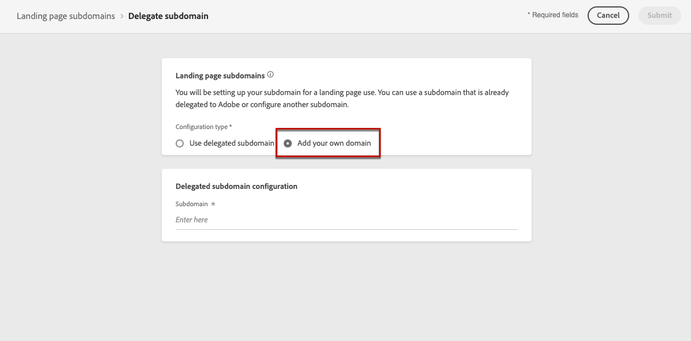
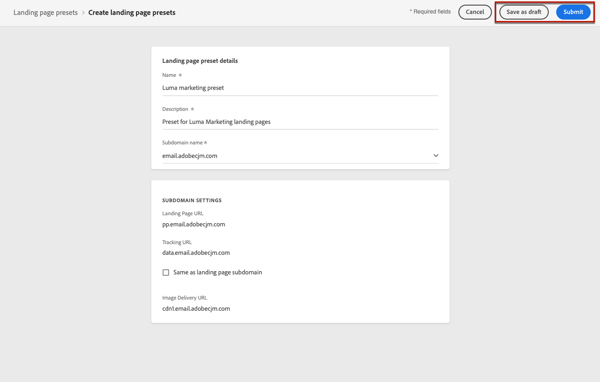
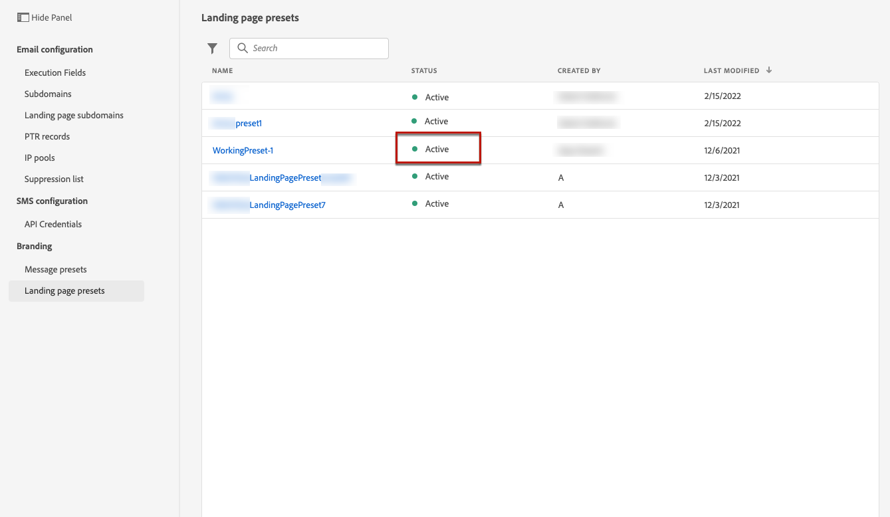

# 랜딩 페이지 구성 {#lp-configuration}

## 랜딩 페이지 하위 도메인 구성 {#lp-subdomains}

>[!CONTEXTUALHELP]
>id="ajo_admin_configure_subdomain"
>title="랜딩 페이지 하위 도메인 설정"
>abstract="하위 도메인을 선택하려면 이전에 하나 이상의 랜딩 페이지 하위 도메인을 구성했는지 확인합니다."

다음을 수행할 수 있습니다. [랜딩 페이지 사전 설정 만들기](#lp-create-preset)를 채울 경우 랜딩 페이지에 사용할 하위 도메인을 설정해야 합니다.

이미 Adobe에 위임된 하위 도메인을 사용하거나 다른 하위 도메인을 구성할 수 있습니다. 하위 도메인을 에서 도메인으로 위임하는 방법에 대해 자세히 알아보십시오 [이 섹션](delegate-subdomain.md).

### 기존 하위 도메인 사용 {#lp-use-existing-subdomain}

이미 Adobe에 위임된 하위 도메인을 사용하려면 아래 단계를 따르십시오.

1. 액세스 권한 **[!UICONTROL Administration]** > **[!UICONTROL Channels]** 메뉴를 선택한 다음 **[!UICONTROL Email configuration]** > **[!UICONTROL Landing page subdomains]**.

   

1. **[!UICONTROL Set up subdomain]**&#x200B;을(를) 클릭합니다.

   

1. 선택 **[!UICONTROL Use delegated domain]** 에서 **[!UICONTROL Configuration type]** 섹션을 참조하십시오.

   

1. 랜딩 페이지 URL에 표시할 접두사를 입력합니다.

   >[!NOTE]
   >
   >영숫자 문자와 하이픈만 사용할 수 있습니다.

1. 목록에서 위임된 하위 도메인을 선택합니다.

   >[!NOTE]
   >
   >이미 랜딩 페이지 하위 도메인으로 사용되는 하위 도메인은 선택할 수 없습니다.

   

   >[!CAUTION]
   >
   >을 사용하여 Adobe에 위임된 도메인을 선택하는 경우 [CNAME 메서드](delegate-subdomain.md#cname-subdomain-delegation)를 채울 때는 호스팅 플랫폼에 DNS 레코드를 만들어야 합니다. DNS 레코드를 생성하기 위해 프로세스는 새 랜딩 페이지 하위 도메인을 구성할 때와 동일합니다. 방법 알아보기 [이 섹션](#lp-configure-new-subdomain).

1. **[!UICONTROL Submit]**&#x200B;을(를) 클릭합니다.

1. 제출되면 하위 도메인이 와 함께 목록에 표시됩니다 **[!UICONTROL Processing]** 상태. 하위 도메인 상태에 대한 자세한 내용은 [이 섹션](access-subdomains.md).<!--Same statuses?-->

   

   >[!NOTE]
   >
   >해당 하위 도메인을 사용하여 메시지를 보내려면 Adobe이 필요한 검사를 수행할 때까지 기다려야 하며, 이 작업은 최대 4시간이 걸릴 수 있습니다.<!--Learn more in [this section](delegate-subdomain.md#subdomain-validation).-->

1. 확인이 성공하면 하위 도메인이 **[!UICONTROL Success]** 상태. 랜딩 페이지 사전 설정을 만드는 데 사용할 준비가 되었습니다.

### 새 하위 도메인 구성 {#lp-configure-new-subdomain}

새 하위 도메인을 구성하려면 아래 단계를 따르십시오.

1. 액세스 권한 **[!UICONTROL Administration]** > **[!UICONTROL Channels]** 메뉴를 선택한 다음 **[!UICONTROL Email configuration]** > **[!UICONTROL Landing page subdomains]**.

1. **[!UICONTROL Set up subdomain]**&#x200B;을(를) 클릭합니다.

1. 선택 **[!UICONTROL Add your own domain]** 에서 **[!UICONTROL Configuration type]** 섹션을 참조하십시오.

   

1. 위임할 하위 도메인을 지정합니다.

   >[!CAUTION]
   >
   >기존 랜딩 페이지 하위 도메인은 사용할 수 없습니다.

   잘못된 하위 도메인을 Adobe으로 위임하는 것은 허용되지 않습니다. marketing.yourcompany.com과 같이 조직이 소유한 유효한 하위 도메인을 입력해야 합니다.

   &#39;email.marketing.yourcompany.com&#39;과 같은 다중 수준 하위 도메인은 현재 지원되지 않습니다.

1. DNS 서버에 배치할 레코드가 표시됩니다. 이 레코드를 복사하거나 CSV 파일을 다운로드한 다음 도메인 호스팅 솔루션으로 이동하여 일치하는 DNS 레코드를 생성합니다.

1. DNS 레코드가 도메인 호스팅 솔루션에 생성되었는지 확인합니다. 모든 것이 제대로 구성된 경우 &quot;확인...&quot; 상자를 선택한 다음 를 클릭합니다. **[!UICONTROL Submit]**.

   

   >[!NOTE]
   >
   >새 랜딩 페이지 하위 도메인을 구성할 때 항상 CNAME 레코드를 가리킵니다.

1. 하위 도메인 위임이 제출되면 하위 도메인이 와 함께 목록에 표시됩니다. **[!UICONTROL Processing]** 상태. 하위 도메인 상태에 대한 자세한 내용은 [이 섹션](access-subdomains.md).<!--Same statuses?-->

   >[!NOTE]
   >
   >해당 하위 도메인을 사용하여 메시지를 보내려면 Adobe이 필요한 검사를 수행할 때까지 기다려야 하며, 이 작업은 최대 4시간이 걸릴 수 있습니다.<!--Learn more in [this section](#subdomain-validation).-->

1. 확인이 성공하면 하위 도메인이 **[!UICONTROL Success]** 상태. 랜딩 페이지 사전 설정을 만드는 데 사용할 준비가 되었습니다.

   하위 도메인은 로 표시됩니다 **[!UICONTROL Failed]** 호스팅 솔루션에 대한 유효성 검사 레코드를 만들지 못한 경우.

## 랜딩 페이지 사전 설정 정의 {#lp-define-preset}

When [랜딩 페이지 만들기](../landing-pages/create-lp.md#create-a-lp)를 채울 수 있도록 랜딩 페이지를 만들고 이를 통해 활용할 수 있도록 랜딩 페이지 사전 설정을 선택해야 합니다 **[!DNL Journey Optimizer]**.

### 랜딩 페이지 사전 설정에 액세스 {#lp-presets}

랜딩 페이지 사전 설정에 액세스하려면 아래 단계를 따르십시오.

1. 액세스 권한 **[!UICONTROL Administration]** > **[!UICONTROL Channels]** 메뉴 아래의 제품에서 사용할 수 있습니다.

1. 선택 **[!UICONTROL Branding]** > **[!UICONTROL Landing page presets]**.

   

1. 사전 설정 레이블을 클릭하여 랜딩 페이지 사전 설정 세부 정보에 액세스합니다.

   

### 랜딩 페이지 사전 설정 만들기 {#lp-create-preset}

랜딩 페이지 사전 설정을 만들려면 아래 단계를 수행하십시오.

>[!NOTE]
>
>사전 설정을 만들려면 이전에 하나 이상의 랜딩 페이지 하위 도메인을 구성했는지 확인하십시오. [방법 알아보기](#lp-subdomains)

1. 액세스 권한 **[!UICONTROL Administration]** > **[!UICONTROL Channels]** 메뉴를 선택한 다음 **[!UICONTROL Branding]** > **[!UICONTROL Landing page presets]**.

1. **[!UICONTROL Create landing page preset]**&#x200B;를 선택합니다.

   

1. 사전 설정의 이름과 설명을 입력합니다.

   >[!NOTE]
   >
   > 이름은 문자(A-Z)로 시작해야 합니다. 영숫자만 포함할 수 있습니다. 밑줄을 사용할 수도 있습니다 `_`, 점`.` 및 하이픈 `-` 자.

1. 드롭다운 목록에서 랜딩 페이지 하위 도메인을 선택합니다.

   

   >[!NOTE]
   >
   >하위 도메인을 선택하려면 이전에 하나 이상의 랜딩 페이지 하위 도메인을 구성했는지 확인합니다. [방법 알아보기](#lp-subdomains)

   선택한 하위 도메인에 해당하는 설정이 표시됩니다.

1. 랜딩 페이지 하위 도메인을 추적 URL로 선택하려면 을(를) 선택합니다 **[!UICONTROL Same as landing page subdomain]** 선택 사항입니다. [추적에 대해 자세히 알아보기](../messages/message-tracking.md)

   

   예를 들어 랜딩 페이지 URL이 &#39;pages.mail.luma.com&#39;이고 추적 URL이 &#39;data.mail.luma.com&#39;인 경우 추적 하위 도메인으로 사용할 &#39;pages.mail.luma.com&#39;을 선택할 수 있습니다.

1. 클릭 **[!UICONTROL Submit]** 랜딩 페이지 사전 설정 생성을 확인하려면. 사전 설정을 초안으로 저장하고 나중에 해당 구성을 다시 시작할 수도 있습니다.

   

1. 랜딩 페이지 사전 설정이 만들어지면 와 함께 목록에 표시됩니다 **[!UICONTROL Active]** 상태. 랜딩 페이지에 사용할 준비가 되었습니다.

   

이제 준비가 되었습니다. [랜딩 페이지 만들기](../landing-pages/create-lp.md) in [!DNL Journey Optimizer].

>[!NOTE]
>
>에서 푸시 알림 및 이메일에 대한 메시지 사전 설정을 만드는 방법을 알아봅니다. [이 섹션](message-presets.md).

**관련 항목**:

* [랜딩 페이지 시작](../landing-pages/get-started-lp.md)
* [랜딩 페이지 만들기](../landing-pages/create-lp.md#create-a-lp)
