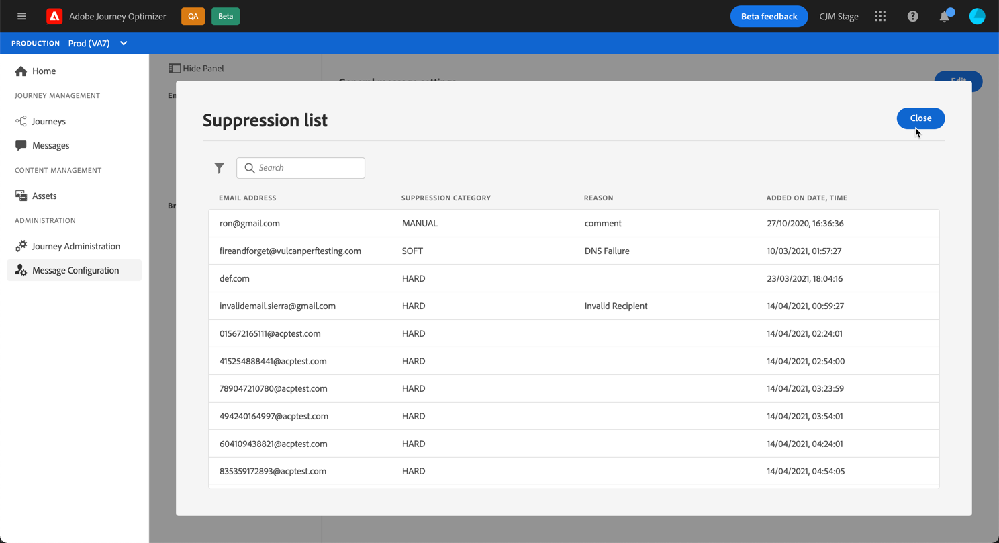
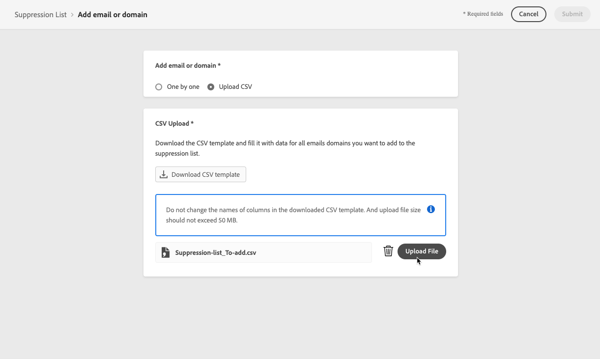

# 제외 목록 관리 {#manage-suppression-list}

사용 [!DNL Journey Optimizer]과 같이 여정에서 전송에서 자동으로 제외되는 모든 이메일 주소를 모니터링할 수 있습니다.

* 잘못된 주소(하드 바운스).
* 게재를 계속 포함하는 경우 일관되게 소프트 바운스, 그리고 이메일 평판에 부정적인 영향을 줄 수 있는 주소를 제공합니다.
* 이메일 메시지 중 하나에 대해 일종의 스팸 불만 사항을 발행한 수신자입니다.

이러한 이메일 주소는 Journey Optimizer에 자동으로 수집됩니다 **제외 목록**. 에서 억제 목록 개념 및 사용에 대해 자세히 알아보십시오 [이 섹션](../messages/suppression-list.md).

## 제외 목록에 액세스합니다 {#access-suppression-list}

제외된 이메일 주소의 세부 목록에 액세스하려면 다음 위치로 이동하십시오. **[!UICONTROL Administration]** > **[!UICONTROL Channels]** > **[!UICONTROL Email configuration]**, 을(를) 선택하고 을(를) 선택합니다. **[!UICONTROL Suppression list]**.

>[!CAUTION]
>
>제외 목록을 보고, 내보내고 관리할 수 있는 권한은 다음으로 제한됩니다 [여정 관리자](../administration/ootb-product-profiles.md#journey-administrator). 관리에 대해 자세히 알아보기 [!DNL Journey Optimizer] 사용자 액세스 권한 [이 섹션](../administration/permissions-overview.md).


필터를 사용하여 목록을 탐색할 수 있습니다.


을(를) **[!UICONTROL Suppression category]**, **[!UICONTROL Address type]**, 또는 **[!UICONTROL Reason]**. 각 기준에 대해 선택한 옵션을 선택합니다. 선택하면 각 필터 또는 목록 맨 위에 표시된 모든 필터를 지울 수 있습니다.


실수로 이메일 주소 또는 도메인을 수동으로 추가하는 경우 **[!UICONTROL Delete]** 버튼을 사용하면 해당 항목을 제거할 수 있습니다.

>[!CAUTION]
>
>사용 안 함 **[!UICONTROL Delete]** 표시되지 않습니다.


제외 목록에서 이메일 주소 또는 도메인을 삭제하면 이 주소 또는 도메인으로 다시 배달됩니다. 따라서 게재 능력과 IP 평판에 심각한 영향을 줄 수 있으므로 IP 주소 또는 전송 도메인이 차단될 수 있습니다. 에서 제외 목록 유지 관리의 중요도에 대해 자세히 알아보십시오. [이 섹션](../messages/suppression-list.md).

>[!NOTE]
>
>이메일 주소 또는 도메인 삭제를 고려할 때 추가 주의가 필요합니다. 확실하지 않은 경우 게재 가능성 전문가에게 문의하십시오.

에서 **[!UICONTROL Suppression list]** 보기, 억제 규칙을 편집할 수도 있습니다. [자세히 알아보기](retries.md)

제외 목록을 CSV 파일로 내보내려면 **[!UICONTROL Download CSV]** 버튼을 클릭합니다.


## 제외 카테고리 및 이유 {#suppression-categories-and-reasons}

메시지가 이메일 주소로 배달되지 않으면 [!DNL Journey Optimizer] 게재가 실패한 이유를 확인하고 **[!UICONTROL Suppression category]**.

억제 카테고리는 다음과 같습니다.

* **하드**: 이메일 주소가 즉시 제외 목록으로 전송됩니다.

   >[!NOTE]
   >
   >스팸메일 신고로 인한 오류일 경우 스팸메일 신고도 해당된다 **하드** 카테고리. 불만을 발행한 수신자의 이메일 주소가 즉시 억제 목록으로 전송됩니다.

* **소프트**: 소프트 오류의 경우 오류 카운터가 제한 임계값에 도달하면 제외 목록에 주소를 보냅니다. [다시 시도하는 방법에 대해 자세히 알아보기](retries.md)

* **수동**: 이메일 주소 또는 도메인을 수동으로 제외 목록에 추가할 수도 있습니다. [자세히 알아보기](#add-addresses-and-domains)

>[!NOTE]
>
>에서 소프트 바운스 및 하드 바운스에 대해 자세히 알아보십시오 [게재 실패 유형](../messages/suppression-list.md#delivery-failures) 섹션을 참조하십시오.

나열된 각 이메일 주소에 대해 다음을 확인할 수도 있습니다 **[!UICONTROL Type]** (이메일 또는 도메인), **[!UICONTROL Reason]** 제외하기 위해 추가한 사람과 제외 목록에 추가한 날짜/시간입니다.



게재 실패 이유는 다음과 같습니다.

| 이유 | 설명 | 제외 카테고리 |
| --- | --- | --- |
| **[!UICONTROL Invalid Recipient]** | 수신자가 잘못되었거나 없습니다. | 하드 |
| **[!UICONTROL Soft Bounce]** | 메시지가 소프트 바운스되어, ISP에서 권장하는 허용 비율을 전송할 때와 같이 이 표에 나열된 소프트 오류 이외의 다른 이유로 바운스됩니다. | 소프트 |
| **[!UICONTROL DNS Failure]** | DNS 오류로 인해 메시지가 반송되었습니다. | 소프트 |
| **[!UICONTROL Mailbox Full]** | 받는 사람의 사서함이 가득 차서 더 이상의 메시지를 받을 수 없어서 메시지가 반송되었습니다. | 소프트 |
| **[!UICONTROL Relaying Denied]** | 릴레이가 허용되지 않아 수신자가 메시지를 차단했습니다. | 소프트 |
| **[!UICONTROL Challenge-Response]** | 이 메시지는 Challenge-Response Probe입니다. | 소프트 |
| **[!UICONTROL Spam Complaint]** | 받는 사람이 스팸으로 표시했기 때문에 메시지가 차단되었습니다. | 하드 |

>[!NOTE]
>
>구독하지 않은 사용자가 보낸 이메일을 받지 않습니다. [!DNL Journey Optimizer]따라서 해당 이메일 주소를 제외 목록으로 보낼 수 없습니다. 선택 사항은 Experience Platform 수준에서 처리됩니다. [옵트아웃에 대해 자세히 알아보기](../messages/consent.md)

## 수동으로 주소 및 도메인 추가 {#add-addresses-and-domains}

메시지를 전자 메일 주소에 배달하지 못하면 이 주소가 정의된 제외 규칙 또는 바운스 수를 기반으로 하여 제외 목록에 자동으로 추가됩니다.

그러나 수동으로 [!DNL Journey Optimizer] 전송에서 특정 이메일 주소 및/또는 도메인을 제외하는 제외 목록입니다.

이메일 주소 또는 도메인을 추가할 수 있습니다 [한 번에 하나씩](#add-one-address-or-domain), 또는 [일괄 모드에서](#upload-csv-file) 를 사용하십시오.

이렇게 하려면 **[!UICONTROL Add email or domain]** 버튼을 클릭한 다음 아래 방법 중 하나를 수행합니다.


### 주소 또는 도메인 하나 추가 {#add-one-address-or-domain}

1. **[!UICONTROL One by one]** 옵션을 선택합니다.

   

1. 주소 유형을 선택합니다. **[!UICONTROL Email address]** 또는 **[!UICONTROL Domain address]**.

1. 전송에서 제외할 이메일 주소 또는 도메인을 입력합니다.

   >[!NOTE]
   >
   >올바른 이메일 주소(예: abc@company) 또는 도메인(예: abc.company.com)을 입력해야 합니다.

1. 필요한 경우 이유를 지정합니다.

1. **[!UICONTROL Submit]**&#x200B;을(를) 클릭합니다.

### CSV 파일 업로드 {#upload-csv-file}

1. **[!UICONTROL Upload CSV]** 옵션을 선택합니다.

   

1. 아래 열과 형식을 포함하는 사용할 CSV 템플릿을 다운로드합니다.

   ```
   TYPE,VALUE,COMMENT
   EMAIL,abc@somedomain.com,Comment
   DOMAIN,somedomain.com,Comment
   ```
   이 템플릿은 **[!UICONTROL Suppression list]** 기본 보기.

   >[!CAUTION]
   >
   >CSV 템플릿의 열 이름을 변경하지 마십시오.
   >
   >파일 크기는 1MB를 초과할 수 없습니다.

1. CSV 템플릿을 제외 목록에 추가할 이메일 주소 및/또는 도메인으로 입력합니다.

1. 완료되면 CSV 파일을 끌어다 놓은 다음 를 클릭합니다 **[!UICONTROL Upload file]**.

   

1. **[!UICONTROL Submit]**&#x200B;을(를) 클릭합니다.

### 최근 업로드 상태 확인 {#recent-uploads}

업로드한 최신 CSV 파일 목록을 확인할 수 있습니다.

이렇게 하려면 **[!UICONTROL Suppression list]** 보기를 클릭하고 **[!UICONTROL Recent uploads]** 버튼을 클릭합니다.


제출한 최신 업로드와 해당 상태가 표시됩니다.

오류 보고서가 파일과 연결되어 있으면 다운로드하여 발생한 오류를 확인할 수 있습니다.


다음은 오류 보고서에서 찾을 수 있는 항목 유형의 예입니다.

```
type,value,comments,failureReason
Email,examplemail.com,MANUAL,Invalid format for value: examplemail.com
Email,examplemail,MANUAL,Invalid format for value: examplemail
Email,example@mail,MANUAL,Invalid format for value: example@mail
Domain,example,MANUAL,Invalid format for value: example
Domain,example.!com,MANUAL,Invalid format for value: example.!com
Domain,!examplecom,MANUAL,Invalid format for value: !examplecom
```
