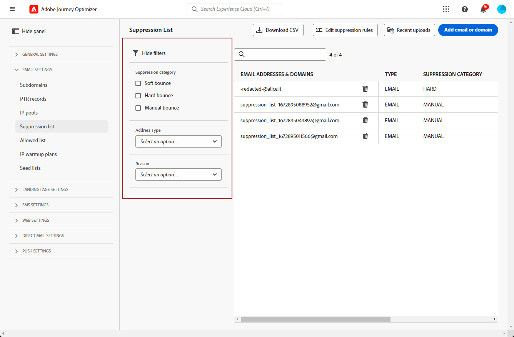
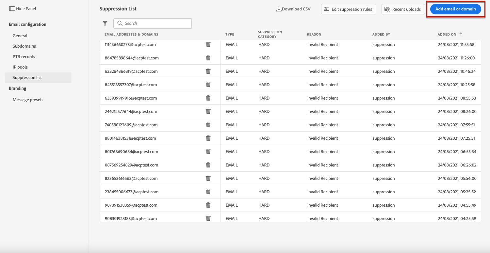
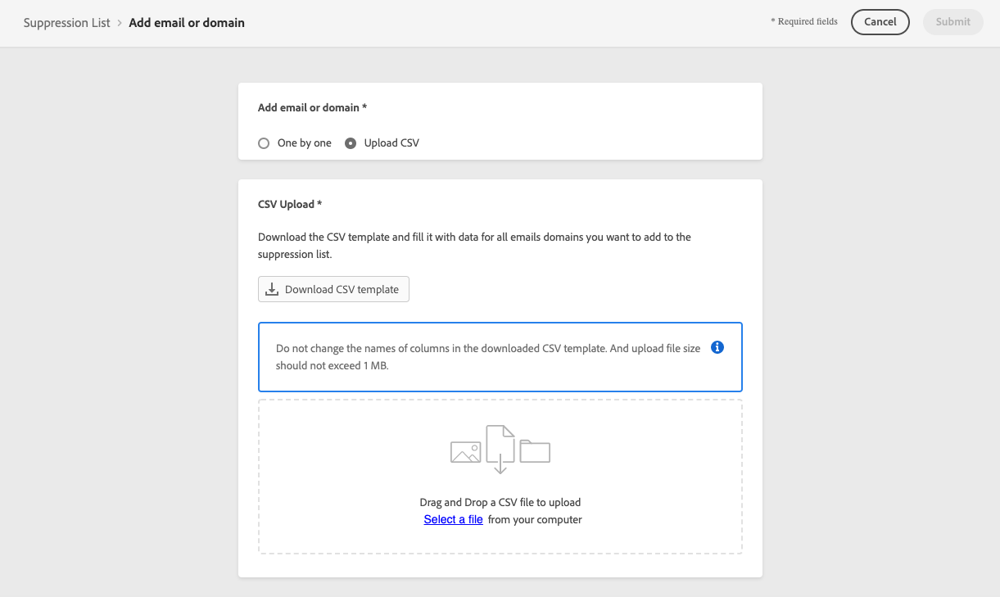
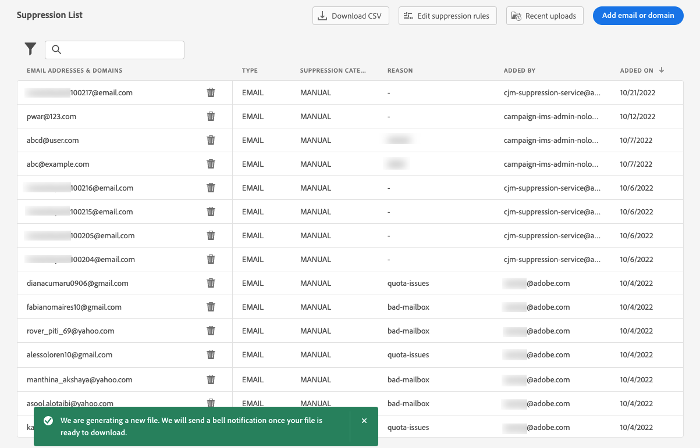

# 제외 목록 관리 {#manage-suppression-list}

포함 [!DNL Journey Optimizer], 하드 바운스, 소프트 바운스 및 스팸 불만 등, 여정 또는 캠페인에서 자동으로 제외되는 모든 이메일 주소를 모니터링할 수 있습니다.

이러한 이메일 주소는 자동으로 Journey Optimizer에 수집됩니다 **비표시 목록**. 제외 목록은 대상에서 제외할 주소 및 도메인으로 구성됩니다. 샌드박스 ID와 연관된 조직 ID와 관련된 것을 의미하는 단일 클라이언트 환경의 모든 메일링에서 억제되는 이메일 주소 및 도메인을 수집합니다.

의 제외 목록 개념 및 사용에 대해 자세히 알아보기 [이 섹션](../reports/suppression-list.md).

>[!NOTE]
>
>Adobe은 참여 및 메일링 평판에 유해한 것으로 입증된 알려진 잘못된 주소의 업데이트된 목록을 보관하고 이메일이 게재되지 않도록 합니다. 이 목록은 모든 Adobe 고객에게 공통으로 적용되는 글로벌 금지 목록에서 관리됩니다. 글로벌 금지 목록에 포함된 주소와 도메인 이름은 숨겨집니다. 게재 보고서에는 제외된 수신자 수만 표시됩니다.

## 제외 목록 액세스 {#access-suppression-list}

제외된 이메일 주소 및 도메인의 세부 목록에 액세스하려면 다음으로 이동하십시오. **[!UICONTROL 관리]** > **[!UICONTROL 채널]** > **[!UICONTROL 이메일 구성]**, 및 선택 **[!UICONTROL 비표시 목록]**.


>[!CAUTION]
>
>제외 목록을 보고, 내보내고, 관리할 수 있는 권한이 다음으로 제한됩니다. [여정 관리자](../administration/ootb-product-profiles.md#journey-administrator). 관리에 대해 자세히 알아보기 [!DNL Journey Optimizer] 의 사용자 액세스 권한 [이 섹션](../administration/permissions-overview.md).


필터를 사용하여 목록을 탐색할 수 있습니다.



다음을 필터링할 수 있습니다. **[!UICONTROL 비표시 범주]**, **[!UICONTROL 주소 유형]**, 또는 **[!UICONTROL 이유]**. 각 기준에 대해 하나 이상의 옵션을 선택합니다. 선택하면 목록 위에 표시된 각 필터 또는 모든 필터를 지울 수 있습니다.


## 실패 이유 이해 {#suppression-categories-and-reasons}

메시지가 이메일 주소로 배달되지 않는 경우 [!DNL Journey Optimizer] 게재 실패 이유를 확인하고 를 와(과) 연결합니다. **[!UICONTROL 비표시 범주]**.

제외 범주는 다음과 같습니다.

* **하드**: 하드 바운스는 잘못된 이메일 주소(즉, 존재하지 않는 이메일 주소)를 나타냅니다. 여기에는 주소가 유효하지 않다는 것을 명시적으로 설명하는 수신 이메일 서버의 바운스 메시지가 포함됩니다. 이메일 주소가 즉시 비표시 목록으로 전송됩니다.

   이 오류가 스팸 불만의 결과인 경우 해당 오류도 **하드** 범주. 컴플레인을 발급한 수신자의 이메일 주소가 즉시 비표시 목록으로 전송됩니다.

* **소프트**: 소프트 바운스는 유효한 이메일 주소에 대해 발생한 임시 이메일 바운스입니다. 이메일 주소는 몇 번 다시 시도한 후 제외 목록에 추가됩니다. 소프트 오류는 오류 카운터가 제한 임계값에 도달하면 주소를 제외 목록으로 보냅니다. [다시 시도에 대해 자세히 알아보기](retries.md)

* **수동**: 수동 오류가 제외 목록에 수동으로 추가되었습니다. [자세히 알아보기](#add-addresses-and-domains)

나열된 각 이메일 주소에 대해 **[!UICONTROL 유형]** (이메일 또는 도메인), **[!UICONTROL 이유]** 제외, 추가 사용자 및 제외 목록에 추가된 날짜/시간.


게재 실패의 가능한 원인은 다음과 같습니다.

| 이유 | 설명 | 카테고리 |
| --- | --- | --- |
| **[!UICONTROL 잘못된 수신자]** | 수신자가 잘못되었거나 존재하지 않습니다. | 하드 |
| **[!UICONTROL 소프트 바운스]** | ISP에서 권장하는 허용 속도를 초과하여 전송하는 경우와 같이 이 표에 나열된 소프트 오류가 아닌 이유로 메시지가 소프트 바운스되었습니다. | 소프트 |
| **[!UICONTROL DNS 실패]** | DNS 오류로 인해 메시지가 반송되었습니다. | 소프트 |
| **[!UICONTROL 사서함 가득 참]** | 받는 사람의 사서함이 가득 차서 더 이상의 메시지를 받을 수 없어 메시지가 반송되었습니다. | 소프트 |
| **[!UICONTROL 릴레이 거부됨]** | 릴레이가 허용되지 않으므로 메시지가 수신자에 의해 차단되었습니다. | 소프트 |
| **[!UICONTROL 질문-응답]** | 메시지는 과제 응답 프로브입니다. | 소프트 |
| **[!UICONTROL 스팸 고객 불만]** | 수신자가 스팸으로 표시했기 때문에 메시지가 차단되었습니다. | 하드 |

>[!NOTE]
>
>구독 취소한 사용자가에서 이메일을 받지 못함 [!DNL Journey Optimizer]따라서 이메일 주소를 제외 목록으로 보낼 수 없습니다. 이러한 선택은 Experience Platform 수준에서 처리됩니다. [옵트아웃에 대해 자세히 알아보기](../privacy/opt-out.md)


### 비표시 규칙  {#suppression-rules}

다음에서 **[!UICONTROL 비표시 목록]** 보기에서 비표시 규칙과 연결된 다시 시도 매개 변수를 편집할 수도 있습니다. **[!UICONTROL 비표시 규칙 편집]** 단추를 클릭합니다. 이 옵션을 사용하여 현재 샌드박스에 대한 재시도 임계값을 업데이트합니다. [다시 시도에 대해 자세히 알아보기](retries.md).


## 비표시 목록에 주소 및 도메인 추가{#add-addresses-and-domains}

>[!CONTEXTUALHELP]
>id="ajo_admin_suppression_list_header"
>title="금지 목록에 이메일 또는 도메인 추가"
>abstract="전송에서 특정 이메일 주소 및/또는 도메인을 제외하는 경우 Journey Optimizer 금지 목록을 수동으로 채울 수 있습니다."

>[!CONTEXTUALHELP]
>id="ajo_admin_suppression_list"
>title="금지 목록에 이메일 또는 도메인 추가"
>abstract="금지 목록을 채우려는 경우 이메일 주소나 도메인을 한 번에 하나씩 추가하거나 CSV 파일 업로드를 통해 일괄 모드로 추가할 수 있습니다. 해당 특정 이메일 주소 및/또는 도메인은 전송에서 제외됩니다."

메시지가 이메일 주소로 배달되지 않으면 이 주소는 정의된 제외 규칙 또는 바운스 수에 따라 제외 목록에 자동으로 추가됩니다.

그러나 를 수동으로 채울 수도 있습니다. [!DNL Journey Optimizer] 전송에서 특정 이메일 주소 및/또는 도메인을 제외하는 제외 목록입니다.

>[!NOTE]
>
>60분 정도 걸릴 수 있습니다 [!DNL Journey Optimizer] 발신 이메일에서 억제된 주소를 고려합니다.

이메일 주소나 도메인을 [한 번에 하나씩](#add-one-address-or-domain) 추가하거나 CSV 파일 업로드를 통해 [일괄 모드](#upload-csv-file)로 추가할 수 있습니다.

### 하나의 주소 또는 도메인 추가 {#add-one-address-or-domain}

>[!CONTEXTUALHELP]
>id="ajo_admin_suppression_list_address"
>title="금지 목록에 하나의 항목 추가"
>abstract="이메일 주소 및/또는 도메인을 하나씩 추가하여 금지 목록을 채울 수 있습니다."

금지 목록에 이메일 주소 또는 도메인을 추가하려면 아래 단계를 수행합니다.

1. 다음 항목 선택 **[!UICONTROL 이메일 또는 도메인 추가]** 단추를 클릭합니다.

   

1. 다음을 선택합니다. **[!UICONTROL 하나씩]** 옵션을 선택합니다.

   

1. 주소 유형 선택: **[!UICONTROL 이메일]** 또는 **[!UICONTROL 도메인]**.

1. 전송에서 제외할 이메일 주소 또는 도메인을 입력합니다.

   >[!NOTE]
   >
   >유효한 이메일 주소(예: abc@company.com) 또는 도메인(예: abc.company.com)을 입력했는지 확인합니다.

1. (선택 사항) 사유를 입력합니다. 이 필드에는 32~126 사이로 구성된 모든 ASCII 인쇄 가능 문자가 허용됩니다.

1. 사용 **[!UICONTROL 제출]** 단추를 클릭하여 확인합니다.

### CSV 파일 업로드 {#upload-csv-file}

>[!CONTEXTUALHELP]
>id="ajo_admin_suppression_list_csv"
>title="CSV를 업로드하여 금지 목록에 항목 추가"
>abstract="제외할 이메일 주소/도메인으로 채워진 CSV 파일을 업로드하여 금지 목록을 채울 수 있습니다."

이메일 주소 또는 도메인 그룹을 제외 목록에 추가하려면 아래 단계를 수행합니다.

1. 다음 항목 선택 **[!UICONTROL 이메일 또는 도메인 추가]** 단추를 클릭합니다.
1. 다음을 선택합니다. **[!UICONTROL CSV 업로드]** 옵션을 선택합니다.

   

1. 아래 열과 형식이 포함된 CSV 템플릿을 다운로드하여 사용할 수 있습니다.

   ```
   TYPE,VALUE,COMMENT
   EMAIL,abc@somedomain.com,Comment
   DOMAIN,somedomain.com,Comment
   ```

1. 비표시 목록에 추가할 이메일 주소 및/또는 도메인으로 CSV 템플릿을 입력합니다. 32에서 126 사이의 모든 ASCII 인쇄 가능 문자는 **댓글** 열.

   >[!CAUTION]
   >
   >CSV 템플릿의 열 이름을 변경하지 마십시오.
   >
   >파일 크기는 1MB를 초과해서는 안 됩니다.

1. 완료되면 CSV 파일을 드래그 앤 드롭한 다음 **[!UICONTROL 제출]** 단추를 클릭하여 확인합니다.

   

업로드가 완료되면 다음에서 상태를 확인할 수 있습니다. [최근 업로드](#recent-uploads) 아래에 자세히 설명되어 있는 단추입니다.

### 업로드 상태 확인 {#recent-uploads}

사용 **[!UICONTROL 최근 업로드]** 최신 업로드된 CSV 파일의 상태를 확인하는 버튼입니다.


가능한 상태는 다음과 같습니다.

* **[!UICONTROL 보류 중]**: 파일 업로드가 진행 중입니다.
* **[!UICONTROL 오류]**: 기술적인 문제 또는 파일 형식 오류로 인해 파일 업로드 프로세스가 실패했습니다.
* **[!UICONTROL 완료]**: 파일 업로드 프로세스가 정상적으로 완료되었습니다.

업로드하는 동안 일부 주소가 올바른 형식이 아닌 경우 [!DNL Journey Optimizer] 비표시 목록.

이 경우 업로드가 완료되면 보고서와 연결됩니다. 다운로드하여 발생한 오류를 확인할 수 있습니다<!-- and understand why they were not added to the suppression list-->.


다음은 오류 보고서에서 찾을 수 있는 항목 유형의 예입니다.

```
type,value,comments,failureReason
Email,examplemail.com,MANUAL,Invalid format for value: examplemail.com
Email,examplemail,MANUAL,Invalid format for value: examplemail
Email,example@mail,MANUAL,Invalid format for value: example@mail
Domain,example,MANUAL,Invalid format for value: example
Domain,example.!com,MANUAL,Invalid format for value: example.!com
Domain,!examplecom,MANUAL,Invalid format for value: !examplecom
```

## 제외 목록에서 주소 제거{#remove-from-suppression-list}

제외 목록을 수동으로 업데이트할 수 있습니다. 격리에서 이메일 주소를 제거하는 것은 중요한 작업이며 IP 신뢰도 및 전달률에 영향을 줄 수 있습니다. 주의해서 진행하도록 하세요.

제외 목록에서 이메일 주소 또는 도메인을 삭제하면 Adobe Journey Optimizer이 이 주소 또는 도메인에 다시 전달하기 시작할 수 있습니다.  에서 전달성에 대해 자세히 알아보기 [이 섹션](../reports/deliverability.md).

제외 목록에서 주소를 제거하려면 **[!UICONTROL 삭제]** 단추를 클릭합니다.


>[!NOTE]
>
>이메일 주소 또는 도메인 삭제를 고려할 때 각별한 주의를 기울여 진행하십시오. 의심이 가는 경우 게재 가능성 전문가에게 문의하십시오.

예를 들어 인터넷 서비스 공급자(ISP) 가동이 중단된 경우 이메일이 수신자에게 성공적으로 전달될 수 없으므로 전자 메일이 하드 바운스로 잘못 표시됩니다. 이러한 이메일 주소는 제외 목록에서 제거해야 합니다.

이러한 주소를 검색하려면 중단의 컨텍스트를 기반으로 사용자 지정 매개 변수로 특정 쿼리를 실행합니다. [이 샘플에서 자세히 알아보기](../data/datasets-query-examples.md#isp-outage-query).

영향을 받는 이메일 주소가 식별되면 제외 목록을 필터링하여 표시합니다. 예를 들어에서 2022년 11월 11일부터 2022년 11월 13일까지 ISP 중단이 발생한 경우 **test.com** 도메인, 해당 일정의 제외 목록에 추가된 주소를 다음과 같이 필터링합니다.


그런 다음 다음을 사용하여 제외 목록에서 격리된 이메일 주소를 제거할 수 있습니다. **[!UICONTROL 삭제]** 단추를 클릭합니다.

## 비표시 목록 다운로드 {#download-suppression-list}

<!--
>[!CONTEXTUALHELP]
>id="ajo_admin_suppression_list_download"
>title="Export the list as a CSV file"
>abstract="To download the suppression list, Qou can either export the current list by generating a new file, or download the file that was previously generated."
-->

제외 목록을 CSV 파일로 내보내려면 아래 단계를 수행합니다.

1. 다음 항목 선택 **[!UICONTROL CSV 다운로드]** 단추를 클릭합니다.

   

1. 파일이 생성될 때까지 기다립니다.

   

   >[!NOTE]
   >
   >다운로드 시간은 파일 크기에 따라 다릅니다. 즉, 제외 목록에 있는 주소 수를 의미합니다.
   >
   >주어진 샌드박스에 대해 한 번에 하나의 다운로드 요청을 처리할 수 있습니다.

1. 파일이 생성되면 알림을 받습니다. 화면 오른쪽 상단에 있는 벨 아이콘을 클릭하여 표시합니다.

1. 알림 자체를 클릭하여 파일을 다운로드합니다.

   

   >[!NOTE]
   >
   >링크는 24시간 동안 유효합니다.

<!--When downloading the CSV file, you can choose to either:

* Download the file that was previously generated by another user or yourself.

* Generate a new file in order to export the current suppression list.-->