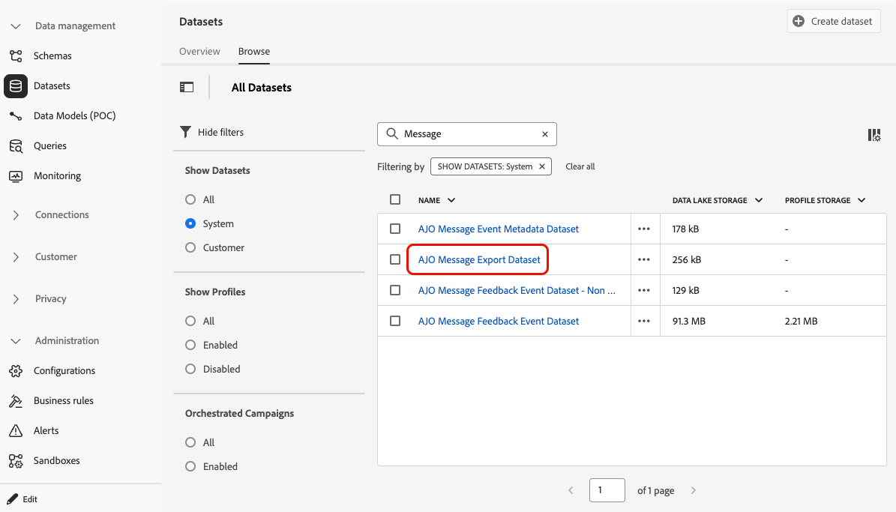

# 메시지 콘텐츠 내보내기 {#message-export}

>[!CONTEXTUALHELP]
>id="ajo_admin_msg_export"
>title="전송된 콘텐츠 보존 및 내보내기"
>abstract="이 옵션을 선택하면 이 구성을 사용하여 보낸 이메일이나 SMS 메시지의 내용을 [!DNL Experience Platform] 데이터 세트에 쓸 수 있습니다. 기록은 수집 후 7일 동안 보관되며, 이 기간 동안 내 스토리지로 내보낼 수 있습니다."

>[!AVAILABILITY]
>
>이 기능은 메시지 내보내기 추가 기능 서비스를 구입한 조직의 이메일 및 SMS 채널에서만 사용할 수 있습니다. 자세한 내용은 Adobe 담당자에게 문의하십시오.

**메시지 내보내기**&#x200B;를 사용하면 보낸 전자 메일 및 SMS 메시지 콘텐츠를 [!DNL Journey Optimizer]에서 [[!DNL Adobe Experience Platform] 대상](https://experienceleague.adobe.com/ko/docs/experience-platform/destinations/home){target="_blank"}을 통해 자신의 저장소로 전송하여 [!DNL Experience Platform]의 데이터를 외부 끝점으로 전달할 수 있습니다.

이 기능을 사용하면 내보내기로 표시된 [!DNL Journey Optimizer]을(를) 통해 보낸 전자 메일 및 SMS 메시지의 콘텐츠가 [!DNL Experience Platform] [AJO 메시지 내보내기 데이터 세트](message-export-schema.md)에 기록됩니다.

그런 다음 기록은 수집 후 7일 동안 데이터 세트에 유지되며, 이 기간 동안 선택한 외부 시스템으로 내보낼 수 있습니다.

➡️ 일반적인 질문과 대답은 [메시지 내보내기 FAQ](#message-export-faq)를 참조하십시오.

## 가드레일

* 이 기능은 **이메일** 및 **SMS** 채널만 지원합니다.
* AJO 메시지 내보내기 데이터 세트의 레코드는 수집에서 **7일 동안** 유지됩니다.
* 아래 설명된 대로 메시지 내보내기를 활성화하기 전에 전송된 메시지에 대해서는 채우기 기능이 지원되지 않습니다.

## 메시지 내보내기 활성화 {#enable-message-export}

메시지 내보내기 기능에 대한 온보딩 프로세스는 다음 두 단계로 구성됩니다.

1. [!DNL Experience Platform]에서 [내보내기 데이터 흐름을 설정](#set-up-export-dataflow);
1. [!DNL Journey Optimizer]의 채널 구성에서 [메시지 내보내기 사용](#config-message-export).

>[!WARNING]
>
>내보내기를 활성화하고 메시지를 보낸 후의 새 레코드만 표시됩니다. 내보내기 프로세스를 설정하고 메시지 내보내기 옵션을 활성화하기 전의 콘텐츠 채우기는 지원되지 않습니다.

### 내보내기 데이터 흐름 설정 {#set-up-export-dataflow}

데이터를 내보내려면 먼저 [!DNL Experience Platform] 대상 및 데이터 집합 내보내기 흐름을 정의하여 내보내기 프로세스를 설정하십시오.

자세한 단계, 지원되는 클라우드 대상, 필요한 권한 및 자세한 내용은 [이 섹션](../data/export-datasets.md#export-datasets)을 참조하세요.

>[!NOTE]
>
>각 샌드박스에 대해 이 설정을 구성해야 합니다.

1. Experience Platform [대상 유형](https://experienceleague.adobe.com/en/docs/experience-platform/destinations/destination-types){target="_blank"}을(를) 선택하십시오. 데이터를 받을 준비가 된 사용 가능한 대상 플랫폼 목록을 [이 페이지](https://experienceleague.adobe.com/en/docs/experience-platform/destinations/catalog/overview){target="_blank"}에서 사용할 수 있습니다.

1. [!DNL Experience Platform]에서 자격 증명, 버킷/컨테이너, 경로 접두사 및 보안 옵션을 정의하여 대상을 구성합니다. [방법 알아보기](https://experienceleague.adobe.com/en/docs/experience-platform/destinations/ui/activate/export-datasets){target="_blank"}

1. 다음 데이터를 사용하여 데이터 세트 내보내기 플로우를 만듭니다.

   * Source 데이터 세트: **AJO 메시지 내보내기 데이터 세트**&#x200B;를 선택합니다.
   * 파일 포맷: JSON 또는 Parquet 을 선택합니다(다운스트림 도구를 기반으로 한 선택).
   * 일정: 7일 보존 기간 내에 실행되는지 확인합니다.

### 채널 구성에서 메시지 내보내기 활성화 {#config-message-export}

캠페인 및 여정에 메시지 내보내기를 적용하려면 채널 구성 수준에서 전용 옵션을 활성화해야 합니다. 아래 단계를 수행합니다.

1. [!DNL Journey Optimizer]에서 원하는 전자 메일 또는 SMS [채널 구성](channel-surfaces.md#create-channel-surface)을 편집하거나 만듭니다.

1. **[!UICONTROL 메시지 내보내기 사용]** 옵션을 선택하십시오.

   

1. 변경 사항을 저장하고 채널 구성을 제출합니다.

이 채널 구성을 사용하여 캠페인이나 여정을 통해 메시지를 보낸 후에는 **AJO 메시지 내보내기 데이터 세트**&#x200B;에 전자 메일 및 SMS 메시지가 기록됩니다. 그런 다음 데이터 집합에 있는 [레코드에 액세스](#access-exported-data)하고 정의한 내보내기 데이터 흐름을 기준으로 선택한 저장소 대상으로 내보낼 수 있습니다.

>[!NOTE]
>
>**[!UICONTROL 메시지 내보내기 사용]** 토글을 사용하지 않도록 설정하면 이 채널 구성에 대한 새 레코드가 데이터 집합에 수집되지 않습니다. 기존 레코드는 보존이 만료될 때까지 유지됩니다.

## 내보낸 메시지 데이터 액세스 {#access-exported-data}

메시지 내보내기가 활성화된 채널 구성을 사용하여 메시지를 보낸 후 **AJO 메시지 내보내기 데이터 세트**&#x200B;에서 내보낸 데이터에 액세스하고 이를 검토할 수 있습니다.

내보낸 메시지 데이터를 보려면 다음을 수행합니다.

1. [!DNL Journey Optimizer]에서 왼쪽 탐색 영역에서 **[!UICONTROL 데이터 관리]** > **[!UICONTROL 데이터 세트]**&#x200B;로 이동합니다. [데이터 세트에 대해 자세히 알아보기](../data/get-started-datasets.md)

1. 시스템에서 생성한 데이터 세트를 표시하는지 확인합니다.

1. 목록에서 **AJO 메시지 내보내기 데이터 세트**&#x200B;를 선택합니다.

   

1. 데이터 집합 세부 정보 페이지에서 **[!UICONTROL 데이터 집합 미리 보기]**&#x200B;를 클릭하여 최신 레코드를 봅니다.

   

데이터 세트에는 메시지 내보내기가 활성화된 채널 구성을 통해 전송되는 각 메시지에 대한 제목 줄, 메시지 본문, 수신자 이메일 주소 또는 전화 번호, 발신자 주소 또는 전화 번호, 전송된 날짜 및 시간, 개인화 데이터 등을 포함한 포괄적인 정보가 포함됩니다.

➡️ 데이터 집합 구조 및 사용 가능한 모든 필드에 대한 전체 보기는 [AJO 메시지 내보내기 스키마](message-export-schema.md)를 참조하십시오.

데이터 집합에 있는 모든 레코드는 수집에서 **7일** 동안 유지됩니다. 이 보존 기간 동안 규정 준수 감사, 법률 조회를 위해 데이터를 액세스하거나 구성된 Experience Platform 대상을 통해 자신의 스토리지 시스템으로 데이터를 내보낼 수 있습니다.

## 샘플 내보낸 JSON {#sample-exported-json}

아래 예는 SMS 및 이메일에 대한 AJO 메시지 내보내기 데이터 세트에 기록된 전체 레코드 모양을 보여줍니다. 식별자, 스키마 참조, 타임스탬프 및 컨텐츠와 같은 값은 예시적인 것입니다. 내보내기는 샌드박스, 스키마 및 전송된 메시지를 반영합니다.

각 섹션을 확장하여 전체 샘플 JSON을 봅니다.

+++ SMS 내보내기 예

```json
{
  "header": {
    "msgId": "f06d2a6d-65c3-472b-9ca7-cc4224af2df4",
    "xactionId": "9ccd6e76-9ee5-4a12-bff3-fea240228121",
    "msgType": "xdmEntityCreate",
    "imsOrgId": "906E3A095DC834230A495FD6@AdobeOrg",
    "sandboxId": "db3adc95-dcf6-49c3-badc-95dcf639c345",
    "sandboxName": "ajo-e2e",
    "createdAt": 1773591102107,
    "datasetId": "689653509dd3432b92f6323f",
    "schemaRef": {
      "id": "https://ns.adobe.com/aemonacpprodcampaign/schemas/64cb5d9d26c2aae6b08bdc9b7882deb90202439ec53836e7",
      "contentType": "application/vnd.adobe.xed-full+json;version=1"
    },
    "source": {
      "name": "message-execution-service"
    },
    "originalTimestamp": 1773591102107,
    "tags": [
      "ups:segmentation=false"
    ]
  },
  "body": {
    "xdmEntity": {
      "_experience": {
        "customerJourneyManagement": {
          "messageExecution": {
            "messageExecutionID": "CSM-09561055",
            "messageID": "15fe77c8-ab73-49e4-abbb-c25b859162ff-0",
            "messageType": "marketing",
            "campaignID": "5638ce57-5264-4a96-995f-5ae34eddafd7",
            "campaignVersionID": "f9019155-3d6a-44a1-9b6f-5f9cd49e7cf5",
            "campaignActionID": "dfa7f59f-477c-42ec-9db2-831d294b5779",
            "batchInstanceID": "5e23a286fb72411f1cdf1443a81ad2eb",
            "messagePublicationID": "15fe77c8-ab73-49e4-abbb-c25b859162ff",
            "audience": {
              "id": "4c339f63-b66e-4e72-8d56-db624b5277f2",
              "type": "targeted"
            }
          },
          "messageProfile": {
            "channel": {
              "_id": "https://ns.adobe.com/xdm/channels/sms",
              "_type": "https://ns.adobe.com/xdm/channel-types/sms"
            },
            "messageProfileID": "7ff5aefb-7583-38c4-8c32-b63cced94aa7",
            "variant": "5c1092da-5ba2-4bcc-b591-713ee7999f7d"
          },
          "messageRenderedContent": {
            "smsContent": {
              "message": "AJO Campaigns - Prod - E2E Test Text VA7"
            }
          },
          "messageDeliveryMetadata": {
            "smsMetadata": {
              "recipient": {
                "number": "+19256260201"
              },
              "sender": {
                "numbers": [
                  "12345678"
                ]
              }
            }
          }
        }
      },
      "identityMap": {
        "email": [
          {
            "id": "rlyajoqa+messageExport1@adobe.com",
            "primary": true
          }
        ]
      },
      "_id": "b0001846-cafa-379a-be96-1d8ee973e047",
      "timestamp": "2026-03-15T16:11:42.184Z"
    }
  }
}
```

+++

+++ 이메일 내보내기 예

```json
{
  "header": {
    "msgId": "1e64d2c4-7887-4f80-8b28-5c20d3da8baf",
    "xactionId": "5yfSV2Gs7VJM5TKo1uEkbiDd4iuakgzQ",
    "msgType": "xdmEntityCreate",
    "imsOrgId": "745F37C35E4B776E0A49421B@AdobeOrg",
    "sandboxId": "068abf40-575e-11ea-8512-9b1bfdb82603",
    "sandboxName": "prod",
    "createdAt": 1754489661211,
    "datasetId": "68912b8881572a2b267380c1",
    "schemaRef": {
      "id": "https://ns.adobe.com/cjmstage/schemas/1684477c0160376b8bb6975a80b5e5bd384696329faa1c42",
      "contentType": "application/vnd.adobe.xed-full+json;version=1"
    },
    "source": {
      "name": "message-execution-service"
    },
    "originalTimestamp": 1754489659000,
    "tags": [
      "ups:segmentation=false"
    ]
  },
  "body": {
    "xdmEntity": {
      "_experience": {
        "customerJourneyManagement": {
          "messageExecution": {
            "messageExecutionID": "HUMA-62208933",
            "messageID": "d0d02f68-afea-42fc-b898-6819cee643e6-0",
            "messageType": "transactional",
            "campaignID": "ce2331c2-c259-47ff-a1dd-f6d1eae08801",
            "campaignVersionID": "4272bb9f-e154-44e9-89f1-6548c77d1455",
            "batchInstanceID": "03587190-72cf-11f0-938b-31e7c9f96d89",
            "messagePublicationID": "d0d02f68-afea-42fc-b898-6819cee643e6",
            "audience": {
              "type": "all"
            }
          },
          "messageProfile": {
            "channel": {
              "_id": "https://ns.adobe.com/xdm/channels/email",
              "_type": "https://ns.adobe.com/xdm/channel-types/email"
            },
            "messageProfileID": "5yfSV2Gs7VJM5TKo1uEkbiDd4iuakgzQ",
            "variant": "11cc5796-8017-4738-aa66-ca5db967dfcc"
          },
          "messageRenderedContent": {
            "emailContent": {
              "subject": "test",
              "html": "xxx"
            }
          },
          "messageDeliveryMetadata": {
            "emailMetadata": {
              "recipient": {
                "email": "himanshig@adobe.com"
              },
              "sender": {
                "email": "cjm-team@e2e-personalisation.test.cjmadobe.com",
                "name": "CJM team",
                "replyToEmail": "replyto@marketing.adobecjm.com",
                "replyToName": "replyto",
                "errorEmail": "replyto@e2e-personalisation.test.cjmadobe.com"
              }
            }
          }
        }
      },
      "identityMap": {
        "email": [
          {
            "id": "chijain@adobe.com",
            "primary": true
          }
        ]
      },
      "_id": "ea48ce1b-80c9-3c6a-b05f-d1c998989e02",
      "timestamp": "2025-08-06T14:14:22.814Z"
    }
  }
}
```

+++

## 메시지 내보내기 FAQ {#message-export-faq}

+++ 메시지 내보내기란?

메시지 내보내기를 사용하면 고객이 최종 사용자에게 전송된 완전히 렌더링된 메시지(이메일 및 SMS)를 내보낼 수 있습니다. 내보낸 데이터는 표준 [!DNL Adobe Experience Platform]&#x200B;(AEP) 내보내기 기능을 사용하여 외부 대상에 전달되고 보관, 규정 준수 검토, 분석 또는 다운스트림 통합과 같은 용도로 사용할 수 있습니다.

+++

+++ 지원되는 채널은 무엇입니까?

메시지 내보내기는 다음을 지원합니다.

* 이메일
* SMS

+++

+++ 메시지 내보내기에서 생성하는 데이터는 무엇입니까?

메시지 내보내기는 전송 시 메시지의 스냅숏을 포함하는 시스템 생성 데이터 집합을 [!DNL Adobe Experience Platform]에 만듭니다. 그런 다음 이 데이터 세트를 지원되는 대상(예: 클라우드 스토리지 또는 서드파티 시스템)으로 내보낼 수 있습니다.

Message Export는 고객이 Adobe 시스템 외부로 메시지 데이터를 이동할 수 있는 지원 메커니즘으로 설계되었습니다. 고객은 자체 보관 또는 규정 준수 솔루션에서 데이터를 변환, 저장 및 관리할 책임이 있습니다.

+++

+++ 메시지 내보내기는 완전히 개인화된 메시지를 캡처합니까?

예. 메시지 내보내기는 전송 시간에 렌더링될 때 개인화 및 다이내믹 콘텐츠를 포함하여 각 수신자에게 전송된 완전히 렌더링된 메시지를 캡처합니다.

+++

+++ 메시지 내보내기를 사용하여 원본 메시지를 재현할 수 있습니까?

예. 내보낸 HTML을 사용하여 브라우저에서 원래 보낸 메시지를 재현할 수 있습니다.

단, 복제는 외부에 호스팅된 에셋(예: 이미지)의 가용성에 따라 다릅니다. 메시지 내보내기는 미디어 파일을 내보내기에 직접 포함하지 않습니다.

+++

+++ 내보내기에 이미지와 미디어가 포함됩니까?

메시지 내보내기에는 이미지 및 기타 미디어에 대한 참조(URL)가 있는 HTML 컨텐츠가 포함됩니다. 미디어 자산이 내보내기에 포함되지 않습니다.

전송 시간 후에 이미지 또는 에셋 URL이 잘못되거나, 제한되거나, 게시가 취소되면 메시지 내보내기에서 해당 에셋을 복구할 수 없습니다.

+++

+++ 메시지 내보내기에서 링크는 어떻게 처리됩니까?

내보낸 메시지에는 암호화된 추적 링크가 포함되어 있으며, 전송 시 링크가 처리되는 방식과 일치합니다. 이러한 암호화된 링크는 내보내기에서 유지되며 플랫폼에서 설계한 대로 해결할 수 있습니다.

+++

+++ PII 및 개인화 데이터는 어떻게 처리됩니까?

데이터는 렌더링된 메시지에 나타나는 그대로 저장됩니다.

* 메시지에 렌더링된 Personalization 값(예: 이름)은 텍스트로 표시됩니다.
* 암호화된 요소(예: 추적된 링크)는 암호화된 상태로 유지됩니다.
* 메시지 내보내기는 렌더링된 메시지 콘텐츠를 자동으로 익명화하거나 축소하지 않습니다.

+++

+++ 메시지 내보내기 데이터의 보존 기간은 얼마입니까?

메시지 내보내기 데이터는 [!DNL Adobe Experience Platform] 내의 7일 보존 기간을 따릅니다.

고객은 이 기간 내에 데이터를 내보내고 더 긴 보존이 필요한 경우 자체 시스템에 저장해야 합니다.

+++

+++ 고객이 구매하기 전에 메시지 내보내기를 테스트할 수 있습니까?

메시지 내보내기에 대한 체험판 또는 &quot;구매 전 시도&quot; 옵션이 없습니다.

메시지 내보내기는 표준 AEP 데이터 세트 및 대상 기능을 사용하므로 고객은 샘플 내보내기 파일을 사용하여 다운스트림 시스템의 유효성을 검사할 수 있습니다.

+++

+++ 구매 전에 메시지 내보내기 스키마를 사용할 수 있습니까?

아니요. 메시지 내보내기 데이터 세트 및 스키마는 메시지 내보내기 추가 기능을 구매하고 활성화한 후에만 제품에서 사용할 수 있습니다.

+++

+++ Message Export 는 완벽한 아카이빙 또는 규정 준수 솔루션입니다.

아니요. Message Export 는 전체 아카이브 또는 규정 준수 제품이 아니라 Enabler 입니다.

고객은 다음과 같은 이점을 누리게 됩니다.

* Adobe에서 메시지 데이터 내보내기
* 필요에 따라 변형 또는 강화
* 아카이빙 또는 규정 준수 시스템에 데이터 저장 및 관리

+++

+++ 일반적인 사용 사례는 무엇입니까?

고객은 일반적으로 다음 용도로 메시지 내보내기를 사용합니다.

* 규정 또는 규정 준수 검토
* 메시지 아카이브
* 서드파티 시스템과의 통합
* 내부 감사 또는 지원 워크플로
* Adobe 애플리케이션을 뛰어넘는 분석

+++

+++ 내보낼 수 없는 메시지

메시지 내보내기에는 다음이 수행되지 않습니다.

* 외부 이미지 또는 미디어 자산 포함
* Adobe 시스템에서 무제한 또는 장기 데이터 보존 제공
* 체험판 환경 제공
* Adobe 외부 메시지 자동 보관

+++

