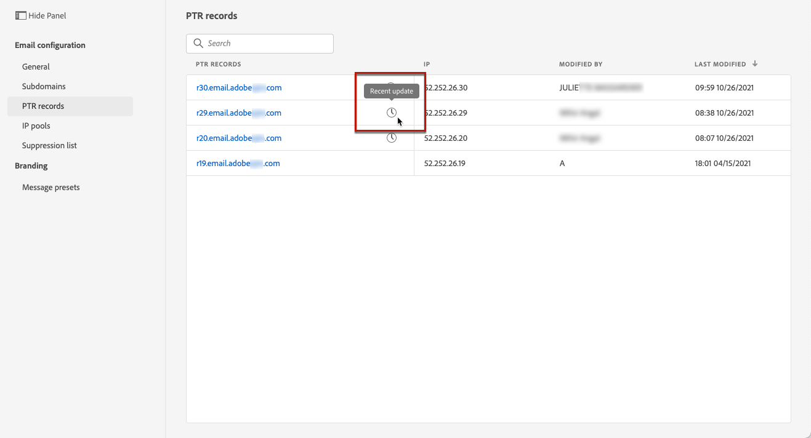

# PTR 레코드

## PTR 레코드 정보

PTR(포인터 레코드)는 IP 주소에 연결된 도메인 이름을 제공하는 DNS(Domain Name System) 레코드의 유형입니다.

PTR 레코드를 사용하면 수신 메일 서버가 해당 IP 주소가 서버가 연결하는 이름과 일치하는지 확인하여 전송 메일 서버의 진위를 확인할 수 있습니다.

## 하위 도메인의 PTR 레코드에 액세스

Adobe Journey Optimizer에서 하위 도메인이 위임되면 PTR 레코드가 자동으로 만들어지고 이 하위 도메인과 연결됩니다. 에서 액세스할 수 있습니다. **[!UICONTROL Channels]** > **[!UICONTROL Email configuration]** > **[!UICONTROL PTR records]** 메뉴 아래의 제품에서 사용할 수 있습니다.

이 목록에는 아래 구문을 사용하여 위임된 각 하위 도메인에 대해 생성된 PTR 레코드가 표시됩니다.

* &quot;r&quot;은 레코드,
* IP 주소의 마지막 두 수치에 대해 &quot;xx&quot;
* 하위 도메인 이름.

목록에서 PTR 레코드를 열어 연결된 하위 도메인 이름과 IP 주소를 표시할 수 있습니다.

## PTR 레코드 편집 {#edit-ptr-record}

PTR 레코드를 수정하여 IP 주소와 연결된 하위 도메인을 편집할 수 있습니다.

1. 목록에서 PTR 레코드 이름을 클릭하여 엽니다.

   

1. 원하는 대로 하위 도메인을 편집합니다.

   

   >[!NOTE]
   >
   >는 수정할 수 없습니다 **[!UICONTROL IP]** 및 **[!UICONTROL PTR record]** 필드.

1. 클릭 **[!UICONTROL Save]** 를 클릭하여 변경 사항을 확인합니다.

An **[!UICONTROL Updating]** 목록의 PTR 레코드 이름 옆에 아이콘이 표시됩니다.

PTR 레코드 업데이트 정보를 확인하려면 **[!UICONTROL Updating]** 또는 **[!UICONTROL Recent updates]** 아이콘.

업데이트 상태 및 요청된 변경 사항과 같은 정보를 볼 수 있습니다.

## 상태 업데이트

PTR 레코드 업데이트에는 다음 상태가 있을 수 있습니다.

* **[!UICONTROL Processing]**: PTR 레코드 업데이트가 제출되었으며 확인 프로세스를 진행 중입니다.
* **[!UICONTROL Success]**: 업데이트된 PTR 레코드가 확인되었으며 새 하위 도메인이 IP 주소와 연결됩니다.
* **[!UICONTROL Failed]**: PTR 레코드 업데이트 확인 중에 하나 또는 여러 개의 검사가 실패했습니다.

### 처리 중

IP 주소와 연결할 새 하위 도메인이 유효한지 확인하기 위해 몇 가지 게재 기능 검사가 수행됩니다. <!--The processing time is around **48h-72h**, and can take up to **7-10 days**. Learn more on the checks performed during the validation cycle in [this section](#create-message-preset).-->

>[!NOTE]
>
>업데이트가 진행 중인 동안에는 PTR 레코드를 수정할 수 없습니다. 여전히 해당 이름을 클릭할 수 있지만, **[!UICONTROL Subdomain]** 필드가 회색으로 표시됩니다. 업데이트가 완료될 때까지 변경 사항이 반영되지 않습니다.

유효성 검사 프로세스 중에 이전 하위 도메인이 IP 주소와 계속 연결됩니다.

### 성공

유효성 검사 프로세스가 성공하면 새 하위 도메인이 IP 주소와 자동으로 연결됩니다.

### 실패

유효성 검사 프로세스가 실패하면 이전 PTR 레코드가 표시됩니다. 이전에 IP 주소와 연결된 유효한 하위 도메인은 변경되지 않고 그대로 유지됩니다.

가능한 업데이트 오류 유형은 다음과 같습니다.
* PTR 레코드에 대한 새 전달 DNS를 만들지 못했습니다.
* 레코드를 업데이트하지 못했습니다.
* 관심 영역 재게재 실패

업데이트가 실패하면 PTR 레코드를 다시 편집할 수 있게 됩니다. 해당 이름을 클릭하고 하위 도메인을 다시 업데이트할 수 있습니다.
