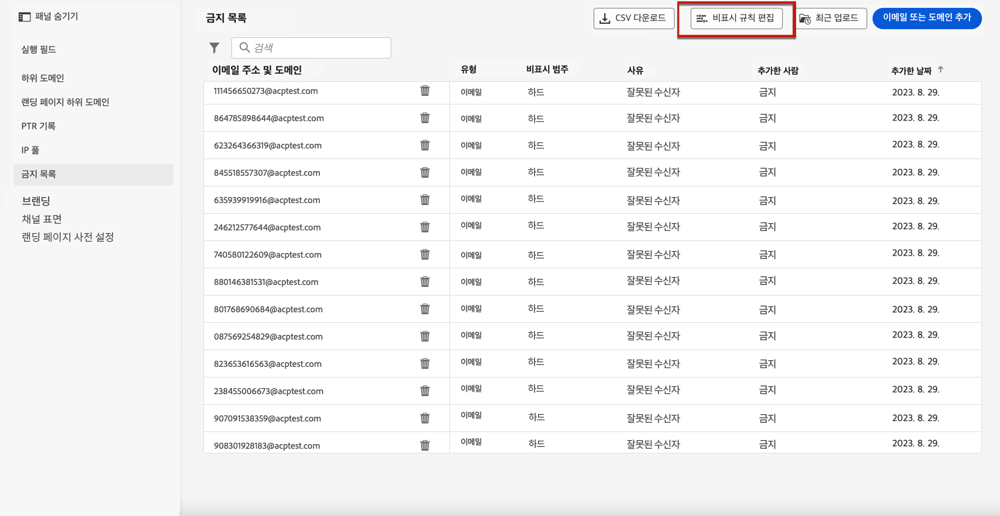

# 다시 시도 {#retries}

일시적인 것으로 인해 이메일 메시지가 실패하는 경우 **소프트 바운스** 오류가 발생하여 여러 번 다시 시도됩니다. 각 오류로 인해 오류 카운터가 증가합니다. 이 카운터가 제한 임계값에 도달하면 주소가 제외 목록에 추가됩니다.

>[!NOTE]
>
>의 오류 유형에 대해 자세히 알아보십시오 [게재 실패 유형](../reports/suppression-list.md#delivery-failures) 섹션을 참조하십시오.

기본 구성에서 오류 임계값은 5로 설정됩니다.

* 동일한 게재의 경우, 5번째 이벤트에서 [재시도 기간](#retry-duration)이면 주소가 무시됩니다.

* 다른 게재가 있고 최소 24시간 간격으로 두 개의 오류가 발생하는 경우 오류 카운터가 각 오류 시 증가하며 다섯 번째 시도에서는 주소도 억제됩니다.

다시 시도하여 게재가 성공하면 주소의 오류 카운터는 다시 초기화됩니다.

## 임계값 편집 다시 시도 {#edit-retry-threshold}

>[!CONTEXTUALHELP]
>id="ajo_admin_suppression_list_bounces"
>title="다시 시도 임계값 업데이트"
>abstract="기본값이 사용자 요구에 맞지 않는 경우 허용된 연속 소프트 바운스 수를 수정할 수 있습니다. 다시 시도 카운터가 특정 전자 메일 주소의 오류 임계값에 도달하면 이 주소가 제외 목록에 추가됩니다."
>additional-url="https://experienceleague.adobe.com/docs/journey-optimizer/using/reporting/deliverability/suppression-list.html" text="지원 목록 이해"

기본값 5가 사용자의 요구 사항에 맞지 않는 경우 아래 단계에 따라 오류 임계값을 수정할 수 있습니다.

1. 이동 **[!UICONTROL 채널]** > **[!UICONTROL 이메일 구성]** > **[!UICONTROL 제외 목록]**.

1. 을(를) 선택합니다 **[!UICONTROL 제외 규칙 편집]** 버튼을 클릭합니다.

   

1. 필요에 따라 허용된 연속 소프트 바운스 수를 편집합니다.

   

   1에서 20 사이의 정수 값을 입력해야 합니다. 즉, 최소 다시 시도 횟수는 1이고 최대 수는 20입니다.

   >[!CAUTION]
   >
   >10보다 큰 값을 지정하면 ISP의 IP 조절 또는 차단 목록에 추가와 함께 전송 가능한 신뢰도 문제가 발생할 수 있습니다. [게재 능력에 대해 자세히 알아보기](../reports/deliverability.md)

## 다시 시도 기간 {#retry-duration}

다음 **재시도 기간** 는 일시적인 오류나 소프트 바운스가 발생한 게재 이메일 메시지가 다시 시도하는 시간대입니다.

기본적으로 다시 시도는에 대해 수행됩니다 **3.5일** 또는 **84시간**) 메시지를 전자 메일 큐에 추가한 시간으로부터

그러나 더 이상 필요하지 않은 경우 다시 시도를 수행하지 않도록 하려면 을 만들거나 편집할 때 필요에 따라 이 설정을 변경할 수 있습니다 [채널 표면](channel-surfaces.md) (즉, 메시지 사전 설정)이 이메일 채널에 적용되는 것입니다.

예를 들어, 암호 재설정과 관련된 트랜잭션 전자 메일에 대해 다시 시도 기간을 24시간으로 설정하고 하루 동안만 유효한 링크를 포함할 수 있습니다. 마찬가지로, 자정 판매에 대해 다시 시도 기간을 6시간으로 정의할 수 있습니다.

>[!NOTE]
>
>다시 시도 기간은 84시간을 초과할 수 없습니다. 최소 다시 시도 기간은 마케팅 이메일의 경우 6시간, 트랜잭션 이메일의 경우 10분입니다.

에서 채널 표면을 만들 때 이메일 다시 시도 매개 변수를 조정하는 방법을 알아봅니다. [이 섹션](../email/email-settings.md#email-retry).

