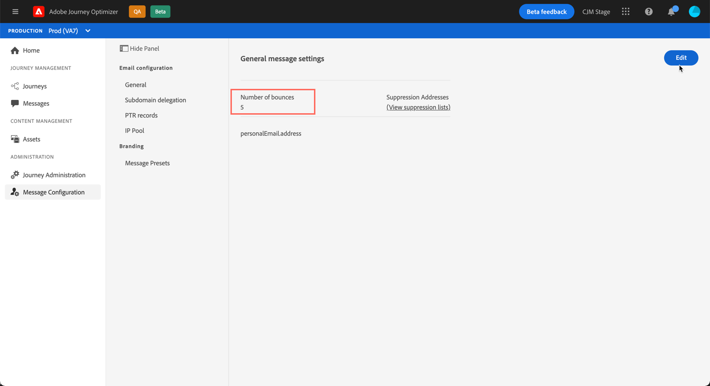

# 다시 시도 {#retries}

일시적인 **소프트 바운스** 또는 **무시됨** 오류로 인해 메시지가 실패하면 여러 번 다시 시도됩니다. 각 오류로 인해 오류 카운터가 증가합니다. 이 카운터가 제한 임계값에 도달하면 주소가 제외 목록에 추가됩니다.

기본 구성<!--so can you edit this setting or not?? contradictory information was given-->에서 임계값은 세 개의 오류로 설정됩니다.

* 동일한 게재의 경우, 세 번째 발생한 오류에서 주소가 무시됩니다.

* 다른 게재가 있고 최소 24시간 간격으로 두 개의 오류가 발생하는 경우 오류 카운터가 오류마다 증가하며 세 번째 시도에서는 주소도 억제됩니다.

다시 시도하여 게재가 성공하면 주소의 오류 카운터는 다시 초기화됩니다.

**[!UICONTROL Channels]** > **[!UICONTROL Email configuration]** > **[!UICONTROL General]** 메뉴에서 **[!UICONTROL Edit]** 버튼을 사용하여 제한 임계값을 수정할 수 있습니다.<!--currently you can edit this in staging // now I see in UI: Suppression rule > Bounce days??? > 4-->

## 메시지 다시 시도 기간 {#retry-duration}

메시지가 이메일 큐에 추가된 후 **3.5일**&#x200B;에 대해 다시 시도가 수행됩니다.

IP가 과거 및 현재 지정된 도메인에서 얼마나 성과가 있는지 기준으로 다시 시도 간격 및 최대 다시 시도 횟수를 나타내는 최소 지연 시간은 <!--managed by the Enhanced MTA,-->입니다.

3.5일 후 다시 시도 큐의 모든 메시지는 대기열에서 제거되고 바운스로 다시 전송됩니다.<!--???-->