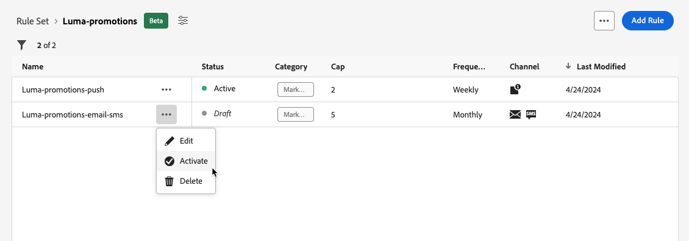

# 규칙 집합 작업 {#rule-sets}

>[!CONTEXTUALHELP]
>id="ajo_business_rules_rule_sets"
>title="규칙 세트"
>abstract="규칙 세트를 사용하여 빈도 제한을 다양한 유형의 마케팅 커뮤니케이션에 적용합니다. 예를 들어 의 수를 제한하는 규칙 세트를 만들 수 있습니다. **프로모션 커뮤니케이션** (으)로 보낸 다음 수를 제한하는 다른 규칙 세트를 만듭니다. **뉴스레터** 보내졌습니다. 규칙 세트는 현재 사용자를 선택하는 데타로만 사용할 수 있습니다."

>[!AVAILABILITY]
>
>규칙 세트는 현재 선택한 사용자만 베타 버전으로 사용할 수 있습니다. Beta에 포함하려면 Adobe 담당자에게 문의하십시오.

## 규칙 세트란 무엇입니까? {#what}

사용자가 하나 또는 여러 채널에서 메시지를 받는 횟수를 제한하는 글로벌 비즈니스 규칙 외에도 규칙 세트를 사용하면 다음을 수행할 수 있습니다. **여러 규칙을 규칙 세트로 그룹화** 원하는 캠페인에 적용할 수 있습니다. 이를 통해 통신 유형에 따라 사용자가 메시지를 받는 빈도를 제어할 수 있는 세부 기간을 개선할 수 있습니다.

예를 들어 의 수를 제한하는 규칙 세트를 만들 수 있습니다. **프로모션 커뮤니케이션** 의 수를 제한하도록 고객 및 다른 규칙에 전송됨 **뉴스레터** 보내졌습니다. 생성 중인 캠페인 유형에 따라 프로모션 커뮤니케이션 또는 뉴스레터 규칙 세트를 적용하도록 선택할 수 있습니다.

## 글로벌 및 사용자 지정 규칙 세트 {#global-custom}

에서 처음으로 규칙 세트에 액세스할 때 **[!UICONTROL 관리]** > **[!UICONTROL 비즈니스 규칙(Beta)]** 메뉴에서 기본 규칙 세트는 미리 만들어지고 활성화됩니다. **전역 기본 규칙 집합**.

이 규칙 세트에는 현재 비즈니스 규칙이 작동하는 방식과 유사하게 사용자가 하나 또는 여러 채널에서 메시지를 받는 빈도를 제어하기 위해 적용할 수 있는 전역 규칙이 포함되어 있습니다. 이 규칙 세트에 정의된 모든 규칙은 커뮤니케이션이 여정에서 전송되는지 아니면 캠페인에서 전송되는지 여부에 관계없이 선택한 모든 채널에 적용됩니다. [비즈니스 규칙을 사용하여 작업하는 방법에 대해 알아봅니다](frequency-rules.md)

이 &quot;전역 기본 규칙 세트&quot; 규칙 세트 외에 **사용자 정의 규칙** 캠페인에 적용하여 해당 캠페인 내에서 전송되는 메시지 수를 제한할 수 있는 를 설정합니다. [사용자 지정 규칙 세트를 만드는 방법을 알아봅니다.](#create)

>[!IMPORTANT]
>
>현재, 사용자 정의 규칙 세트를 다음에 적용할 수 있습니다. **캠페인** 만 해당. &quot;전역 기본 규칙 세트&quot; 규칙 세트에 정의된 규칙만 여정 및 캠페인 커뮤니케이션 모두에 적용됩니다.

## 첫 번째 사용자 지정 규칙 세트 만들기 {#create-rule-set}

### 규칙 세트 만들기 {#create}

규칙 세트를 만들려면 아래 단계를 수행합니다.

>[!NOTE]
>
>최대 3개의 사용자 지정 규칙 세트를 만들 수 있습니다.

1. 액세스 **[!UICONTROL 규칙 세트]** 목록을 작성한 다음 **[!UICONTROL 규칙 집합 만들기]**.

   

1. 규칙 세트 이름을 정의하고 필요한 경우 설명을 추가한 다음 을 클릭합니다. **[!UICONTROL 저장]**.

   

   >[!NOTE]
   >
   >규칙 세트 이름은 고유해야 합니다.

1. 이제 다음을 수행할 수 있습니다 [규칙 정의](#create-new-rule) 이 규칙 세트에 추가하려는 경우

### 규칙 세트에 규칙 추가 {#create-new-rule}

>[!CONTEXTUALHELP]
>id="ajo_rule_sets_category"
>title="메시지 규칙 범주 선택"
>abstract="활성화되어 메시지에 적용되면 선택한 범주와 일치하는 모든 빈도 규칙은 이 메시지에 자동으로 적용됩니다. 현재 마케팅 범주만 사용할 수 있습니다."

>[!CONTEXTUALHELP]
>id="ajo_rule_sets_capping"
>title="규칙의 상한 설정"
>abstract="선택한 시간대 내에 고객 프로필로 전송되는 최대 메시지 수를 지정합니다. 빈도 캡은 선택된 캘린더 기간에 기반하고 대응하는 시간대가 시작될 때 재설정됩니다."

>[!CONTEXTUALHELP]
>id="ajo_rule_sets_channel"
>title="규칙이 적용되는 채널 정의"
>abstract="하나 이상의 채널을 선택합니다. 상한 설정은 채널에서 총 횟수로 적용됩니다."

>[!CONTEXTUALHELP]
>id="ajo_rule_sets_duration"
>title="메시지 규칙 범주 선택"
>abstract="활성화되어 메시지에 적용되면 선택한 범주와 일치하는 모든 빈도 규칙은 이 메시지에 자동으로 적용됩니다. 현재 마케팅 범주만 사용할 수 있습니다."

규칙 세트에 규칙을 추가하려면 아래 단계를 수행합니다.

1. 방금 만든 규칙 세트에서 **[!UICONTROL 규칙 추가]**.

   

1. 고유 정의 **규칙 이름**.

1. 다음 **범주** 필드는 규칙이 적용되는 메시지의 범주를 지정합니다. 현재 이 필드는 읽기 전용이며 **[!UICONTROL 마케팅]** 카테고리를 사용할 수 있습니다.

1. 다음에서 **[!UICONTROL 기간]** 월별, 주별 또는 일별로 상한을 적용하려면 드롭다운 목록을 선택합니다. 빈도 상한은 선택한 달력 기간을 기반으로 합니다. 해당 시간대의 시작 부분에서 재설정됩니다.

   

   기간별 사용기간 종료일은 다음 각 호와 같다.

   * **[!UICONTROL 월별]**: 빈도 상한은 월 마지막 날인 23일까지 유효합니다.:59:59 UTC입니다. 예를 들어 1월의 월별 만료일은 01-31 23입니다:59:59 UTC입니다.

   * **[!UICONTROL 매주]**: 빈도 상한은 토요일 23일까지 유효합니다:59:캘린더 주가 일요일에 시작됨에 따라 해당 주의 59 UTC입니다. 만료는 규칙 생성과 무관합니다. 예를 들어, 규칙이 목요일에 만들어지면 이 규칙은 토요일 23까지 유효합니다:59:59.

   * **[!UICONTROL 매일]**: 일별 빈도 상한은 23일까지 일에 대해 유효합니다.:59:59 UTC이고 다음 날 시작 시 0으로 재설정됩니다.

     >[!CAUTION]
     >
     >일별 빈도 제한 규칙의 정확도를 보장하기 위해 [스트리밍 세분화](https://experienceleague.adobe.com/docs/experience-platform/segmentation/ui/streaming-segmentation.html){target="_blank"} 은(는) 필수입니다. 에서 대상 평가 방법에 대해 자세히 알아보기 [이 섹션](../audience/about-audiences.md#evaluation-method-in-journey-optimizer).

   통신이 전달되면 프로필 카운터 값이 업데이트됩니다. 대량의 통신을 전송하는 경우 처리량으로 인해 수신자는 통신을 시작한 후 몇 분 또는 몇 시간 만에 이메일을 받을 수 있으므로(수백만 개의 통신을 동시에 전송하는 경우) 이 사실을 알고 있어야 합니다.

   이는 수신자가 두 개의 커뮤니케이션을 밀접하게 함께 받는 경우에 중요합니다. 수신자가 통신을 수신할 충분한 시간을 주고 그에 따라 카운터 값을 업데이트할 수 있는 경우 최소 2시간 간격으로 통신을 구분하는 것이 좋습니다.

1. 규칙의 상한을 설정합니다. 즉, 위의 선택에 따라 매월, 주 또는 일별로 개별 사용자 프로필에 보낼 수 있는 최대 메시지 수를 의미합니다.

1. 이 규칙에 사용할 채널 선택: **[!UICONTROL 이메일]**, **[!UICONTROL SMS]**, **[!UICONTROL 푸시 알림]** 또는 **[!UICONTROL 다이렉트 메일]**.

   

   >[!NOTE]
   >
   >규칙을 만들려면 채널을 하나 이상 선택해야 합니다.

1. 선택한 모든 채널에 캡핑을 총 카운트로 적용하려면 여러 채널을 선택하십시오.

   예를 들어 최대 가용량 을 5로 설정하고 이메일 채널과 sms 채널을 모두 선택합니다. 프로필이 선택한 기간 동안 이미 3개의 마케팅 이메일과 2개의 마케팅 SMS를 받은 경우, 이 프로필은 다음 마케팅 이메일 또는 SMS 게재에서 제외됩니다.

1. 클릭 **[!UICONTROL 저장]** 규칙 만들기를 확인합니다. 메시지가 규칙 세트에 추가되고 **[!UICONTROL 초안]** 상태.

   

1. 위의 단계를 반복하여 규칙 세트에 필요한 만큼 규칙을 추가합니다.

이제 모든 메시지에 적용하려면 먼저 각 규칙을 활성화해야 합니다. [자세히 알아보기](#activate-rule)

### 규칙 및 규칙 세트 활성화 {#activate-rule}

규칙이 만들어지면 **[!UICONTROL 초안]** 은(는) 상태이며 아직 메시지에 영향을 주지 않습니다. 활성화하려면 **[!UICONTROL 추가 작업]** 규칙 옆에 있는 버튼을 클릭하고 다음을 선택합니다. **[!UICONTROL 활성화]**.

캠페인/여정에서 규칙 세트에 액세스하고 메시지에 적용하려면 규칙 세트를 활성화해야 합니다.

>[!NOTE]
>
>규칙 또는 규칙 세트가 완전히 활성화되려면 최대 10분이 걸릴 수 있습니다. 규칙을 적용하려면 메시지를 수정하거나 여정을 다시 게시할 필요가 없습니다.

<!--Currently, once a rule set is activated, no more rules can be added to that rule set.-->

규칙 또는 규칙 세트를 비활성화하려면 **[!UICONTROL 추가 작업]** 원하는 항목 옆에 있는 버튼을 선택하고 **[!UICONTROL 비활성화]**.

상태가 (으)로 변경됩니다. **[!UICONTROL 비활성]** 및 규칙은 향후 메시지 실행에 적용되지 않습니다. 현재 실행 중인 모든 메시지는 영향을 받지 않습니다.

>[!NOTE]
>
>규칙 또는 규칙 세트를 비활성화하는 것은 개별 프로필의 카운트에 영향을 주거나 재설정되지 않습니다.

## 규칙 집합 액세스 및 관리 {#access-rule-sets}

생성된 모든 규칙 세트는 **[!UICONTROL 관리]** > **[!UICONTROL 비즈니스 규칙(Beta)]** 메뉴 아래의 제품에서 사용할 수 있습니다. 마지막 수정 날짜별로 정렬됩니다.

규칙 세트 이름을 클릭하여 해당 콘텐츠를 보고 편집합니다. 해당 규칙 세트에 포함된 모든 규칙이 나열됩니다. 오른쪽 상단의 상황별 메뉴를 사용하면 다음 작업을 수행할 수 있습니다.

* 규칙 세트의 이름 및 설명 편집
* 규칙 세트 활성화 - [자세히 알아보기](#activate-rule)
* 규칙 세트 삭제

규칙 세트의 각 규칙에 대해 **[!UICONTROL 추가 작업]** 버튼을 사용하면 다음 작업을 수행할 수 있습니다.

* 규칙 편집
* 규칙 활성화 [자세히 알아보기](#activate-rule)
* 규칙 삭제

<!--### Permissions{#permissions-frequency-rules}

To access, create, edit or delete message frequency rules, you must have the **[!UICONTROL Manage frequency rules]** permission. 

Users with the **[!UICONTROL View frequency rules]** permission are able to view rules, but not to modify or delete them.

Learn more about permissions in [this section](../administration/high-low-permissions.md).-->

## 메시지에 규칙 세트 적용 {#apply-frequency-rule}

메시지에 비즈니스 규칙을 적용하려면 아래 단계를 수행합니다.

1. 를 만들 때 [campaign](../campaigns/create-campaign.md)규칙 세트에 대해 정의한 채널 중 하나를 선택하고 메시지 콘텐츠를 편집합니다.

1. 콘텐츠 편집 화면에서 다음을 클릭합니다. **[!UICONTROL 비즈니스 규칙 추가]** 단추를 클릭합니다.

1. 다음 항목 선택 [생성한 규칙 세트](#create-rule-set).

   

   >[!NOTE]
   >
   >전용 [활성화됨](#activate-rule) 규칙 세트가 목록에 표시됩니다.

   <!--Messages where the category selected is **[!UICONTROL Transactional]** will not be evaluated against business rules.-->

1. 캠페인을 활성화하기 전에 적어도 10분 후 실행을 예약하십시오.

   이렇게 하면 선택한 비즈니스 규칙에 대한 프로필의 카운터 값을 채울 수 있습니다. 캠페인을 즉시 활성화하면 규칙 세트 카운터 값이 수신자의 프로필에 채워지지 않고 메시지가 사용자 지정 규칙 세트의 빈도 제한 규칙에 계산되지 않습니다.

   

1. 게재에서 제외된 프로필 수를 볼 수 있습니다. [글로벌 보고서](../reports/global-report.md), 및 [라이브 보고서](../reports/live-report.md): 사용자가 게재에서 제외되는 가능한 이유로 빈도 규칙이 나열됩니다.

>[!NOTE]
>
>동일한 채널에 여러 규칙을 적용할 수 있지만 하위 상한에 도달하면 프로필이 다음 게재에서 제외됩니다.

<!--
## Example: combine several rules {#frequency-rule-example}

You can combine several message frequency rules, such as described in the example below.

1. [Create a rule](#create-new-rule) called *Overall Marketing Capping*:

   * Select all channels.
   * Set capping to 12 monthly.

   

1. To further restrict the number of marketing-based push notifications that a user is sent, create a second rule called *Push Marketing Cap*:

   * Select Push channel.
   * Set capping to 4 monthly.

   

1. Save and [activate](#activate-rule) the rule.

1. [Create a message](../building-journeys/journeys-message.md) for every channel you want to communicate through and select the **[!UICONTROL Marketing]** category for each message. [Learn how to apply a frequency rule](#apply-frequency-rule)

   

In this scenario, an individual profile:
* can receive up to 12 marketing messages per month;
* but will be excluded from marketing push notifications after they have received 4 push notifications.-->

빈도 규칙을 테스트할 때에는 새로 만든 를 사용하는 것이 좋습니다 [테스트 프로필](../audience/creating-test-profiles.md), 프로필의 빈도 상한에 도달하면 다음 기간까지 카운터를 재설정할 방법이 없기 때문입니다. 규칙을 비활성화하면 캡핑된 프로필에서 메시지를 받을 수 있지만 카운터 증분은 제거되거나 삭제되지 않습니다.
