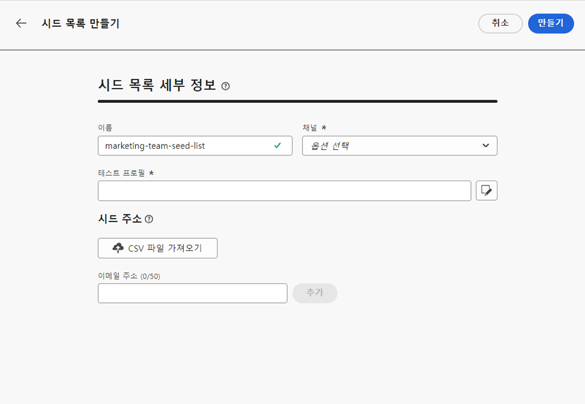

# 시드 목록 사용 {#seed-lists}

[!DNL Journey Optimizer]의 시드 목록을 사용하면 게재에 특정 시드 주소를 자동으로 포함할 수 있습니다.

>[!CAUTION]
>
>현재 이 기능은 이메일 채널에만 적용됩니다.

시드 주소는 정의된 대상 기준과 일치하지 않는 수신자를 타겟팅 하는 데 사용됩니다. 이렇게 하면 게재 범위를 벗어난 수신자는 다른 대상 수신자와 마찬가지로 게재를 받을 수 있습니다.

시드 주소는 프로필 세부 정보를 포함하지 않으므로 실제 프로필이 아니며 테스트 프로필도 아닙니다. 이들은 시스템에 저장된 내부 이해 관계자에 속하는 수신자일 뿐입니다. 특정 캠페인이나 여정에서 선택한 경우 게재 실행 시간에 포함됩니다. 즉, 보증 목적으로 게재 사본을 받게 됩니다.

* 시드 목록을 사용하면 고객과 동일한 시간 및 조건으로 게재를 수신함으로써 발송된 이메일 사본을 모니터링하여 모든 표시 형식, 이미지 및 링크가 올바른지 확인하고 수신자에게 발송된 실제 메시지를 추적할 수 있습니다.

  예:

+++ 마케팅 관리자인 경우:

  모든 팀원이 고객과 동시에 보낸 메시지의 사본을 받도록 할 수 있습니다. 이렇게 하면 팀이 예상 레이아웃, 활성 URL, 올바른 텍스트 및 이미지를 사용하여 메시지를 전송할 수 있습니다. 이러한 모든 작업은 실행 전에 계획대로 수행됩니다.

+++

+++ 제품 소유자인 경우:

  고객에게 전송된 실제 메시지를 추적해야 합니다. 실제로 팀과 지도부는 일부 캠페인에 관심이 있을 수 있으며 게재 시간에 메시지 사본을 받기 위해 임시로 추가해야 할 수 있습니다.

+++

* 시드 목록을 사용하는 또 다른 이유는 메일링 목록 보호 때문입니다. 메일링 목록에 시드 주소를 삽입하면 포함된 시드 주소가 메일링 목록으로 전송된 게재를 수신하므로 타사에서 시드 주소를 사용하고 있는지 여부를 알 수 있습니다.

>[!NOTE]
>
>다국어 및 실험 변형을 포함하여 변형이 지원됩니다. 각 시드 주소는 동일한 메시지의 모든 변형에 대해 하나의 복사본을 받습니다(예: [콘텐츠 실험](../content-management/get-started-experiment.md)의 다른 버전). 조건부 콘텐츠에 대해서는 별도의 시드 이메일이 전송되지 않습니다.

## 시드 목록 액세스 {#access-seed-lists}

이미 만들어진 시드 목록에 액세스하려면 **[!UICONTROL 관리]** > **[!UICONTROL 채널]** > **[!UICONTROL 전자 메일 구성]**&#x200B;으로 이동한 다음 **[!UICONTROL 시드 목록]**&#x200B;을 선택하십시오.

<!--
>[!CAUTION]
>
>Permissions to view, export and manage the seed lists are restricted to [Journey Administrators](../administration/ootb-product-profiles.md#journey-administrator). Learn more on managing [!DNL Journey Optimizer] users' access rights in [this section](../administration/permissions-overview.md).-->

>[!CAUTION]
>
>시드 목록을 보고 편집하고 관리하려면 **[!UICONTROL 시드 목록 관리]** 권한이 있어야 합니다.

이름별로 시드 목록을 검색하거나 목록을 만든 사용자 또는 만든 날짜에 필터링할 수 있습니다. 선택하면 목록 위에 표시된 필터를 지울 수 있습니다.

**[!UICONTROL 삭제]** 단추를 사용하여 항목을 영구적으로 제거하십시오.

>[!CAUTION]
>
>활성 [여정](../campaigns/review-activate-campaign.md) 또는 [캠페인](../building-journeys/publishing-the-journey.md)에서 사용되는 시드 목록을 삭제할 수 없습니다. 캠페인/여정을 비활성화하거나, 시드 목록이 선택되지 않은 다른 표면을 사용하도록 편집해야 합니다. [시드 목록 사용에 대해 자세히 알아보기](#use-seed-list)

시드 목록 이름을 클릭하여 편집할 수 있습니다. <!--Use the **[!UICONTROL Edit]** button to edit a seed list.-->

## 시드 목록 만들기 {#create-seed-list}

>[!CONTEXTUALHELP]
>id="ajo_seed_list_details"
>title="시드 목록 정의"
>abstract="보증 목적으로 특정 내부 주소를 게재 대상자에게 자동으로 추가하려면 시드 목록을 사용하십시오. 시드 목록을 사용하면 발송된 메시지 사본을 모니터링하여 모든 표시 요소가 올바른지 확인하고 메일링 목록을 보호할 수 있습니다. 현재 이 기능은 이메일 채널에만 적용됩니다."
>additional-url="https://experienceleague.adobe.com/docs/journey-optimizer/using/configuration/seed-lists.html?lang=ko-KR#use-seed-list" text="시드 목록이란 무엇입니까?"

>[!CONTEXTUALHELP]
>id="ajo_seed_addresses"
>title="시드 목록 작성"
>abstract="게재 실행 시간에 포함되어 메시지의 정확한 사본을 받을 주소를 선택하십시오. CSV 파일을 가져오거나 이메일 주소를 수동으로 입력할 수 있습니다."

시드 목록을 만들려면 아래 단계를 수행합니다.

1. **[!UICONTROL 관리]** > **[!UICONTROL 채널]** > **[!UICONTROL 전자 메일 구성]** > **[!UICONTROL 시드 목록]** 메뉴에 액세스합니다.

1. **[!UICONTROL 시드 목록 만들기]** 단추를 선택하십시오.

   

1. 세부 사항을 입력합니다. 이름을 추가하여 시작합니다.

   

   >[!NOTE]
   >
   >이름은 문자(A-Z)로 시작하고, 이름에는 영숫자나 특수문자( _, ., -)만 포함되어야 합니다.

1. 채널을 선택합니다. 현재는 이메일 채널만 사용할 수 있습니다.

1. 테스트 프로필을 선택합니다. 시드 주소에는 프로필 세부 정보가 포함되어 있지 않으므로 이 테스트 프로필은 시드 주소로 전송된 메시지에 개인화 데이터를 표시하는 데만 사용됩니다.

   >[!NOTE]
   >
   >한 번에 하나의 테스트 프로필만 선택할 수 있습니다.

1. 게재를 보낼 시드 주소를 추가합니다. CSV 파일을 가져오거나 이메일 주소를 수동으로 입력할 수 있습니다.

   

   >[!NOTE]
   >
   >두 옵션을 모두 결합할 수 있지만 시드 목록의 총 주소 수는 50개를 초과할 수 없습니다.

1. 확인하려면 **[!UICONTROL 만들기]**&#x200B;를 클릭하세요. 새로 만든 시드 목록이 [시드 목록 화면](#access-seed-lists)에 표시됩니다.

## 캠페인 또는 여정에서 시드 목록 사용 {#use-seed-list}

이제 시드 목록이 생성되었으므로 캠페인이나 여정에서 이 목록을 사용하여 게재에 해당 시드 주소를 포함할 수 있습니다. 그 방법은 다음과 같습니다.

>[!CAUTION]
>
>시드 주소로 전송된 메시지는 여정 또는 캠페인 보고서에 포함되지 않습니다.

1. 표면을 만들고 **[!UICONTROL 전자 메일]** 채널을 선택하십시오. [자세히 알아보기](../email/email-settings.md)

1. [해당 섹션](../email/email-settings.md#seed-list)에서 선택한 시드 목록을 선택하십시오.

   >[!NOTE]
   >
   >시드 목록은 한 번에 하나만 선택할 수 있습니다.

   

1. 표면을 제출합니다.

1. [여정](../campaigns/create-campaign.md) 또는 [캠페인](../building-journeys/journey-gs.md)을 만듭니다.

1. **[!UICONTROL 전자 메일]** 작업을 선택하고 관련된 시드 목록을 포함하는 [표면](channel-surfaces.md)을(를) 선택하십시오.

   

1. [campaign](../campaigns/review-activate-campaign.md)을(를) 활성화하거나 [여정](../building-journeys/publishing-the-journey.md)을(를) 게시하세요.

이제 해당 캠페인이나 여정을 통해 고객에게 이메일 메시지를 보낼 때마다 선택한 시드 목록의 이메일 주소도 타겟팅된 수신자와 동일한 조건으로 동시에 동일한 콘텐츠로 수신됩니다.

>[!NOTE]
>
>반복 여정의 경우 하나 이상의 프로필이 이메일 노드에 도달하면 여정 실행 시 시드 주소로 이메일 게재가 전송됩니다.
