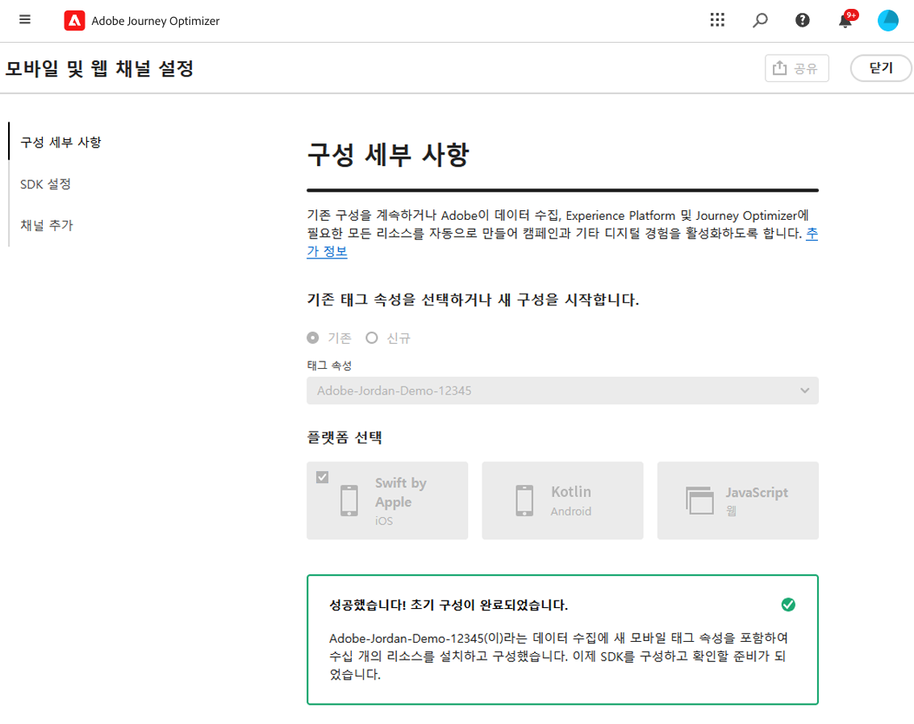

# iOS 모바일 구성 설정 {#set-mobile-ios}

>[!IMPORTANT]
>
>호환성과 최적의 성능을 보장하려면 다음 SDK 버전을 사용하십시오.
>
> * Core SDK: 5.2.0 이상
> * 메시징 SDK: 5.1.1 이상

이 iOS 설정은 마케팅 채널의 빠른 구성을 단순화하여 Experience Platform, Journey Optimizer 및 데이터 수집 앱에서 모든 필수 리소스를 쉽게 사용할 수 있도록 합니다. 이렇게 하면 마케팅 팀이 캠페인 및 여정 만들기를 빠르게 시작할 수 있습니다.

## 새 iOS 설정 만들기 {#new-setup-ios}

>[!CONTEXTUALHELP]
>id="ajo_mobile_web_setup_swift_dependencies_add"
>title="종속성 추가"
>abstract="Xcode에서 앱의 데이터 수집 및 경험을 검사, 증명, 시뮬레이션 및 검증하기 위한 Assurance 패키지를 추가합니다. 또한 AEP Messaging을 추가하여 푸시 알림 토큰 및 클릭스루 피드백을 Adobe Experience Platform으로 전송합니다."
>additional-url="https://experienceleague.adobe.com/en/docs/platform-learn/implement-mobile-sdk/app-implementation/install-sdks#swift-package-manager" text="데이터 수집 설명서 참조"

>[!CONTEXTUALHELP]
>id="ajo_mobile_web_setup_swift_initialization_code"
>title="초기화 코드 추가"
>abstract="앱을 제대로 초기화하려면 제공된 초기화 코드를 AppDelegate 파일의 **didFinishLaunchWithOptions** 메서드에 삽입하십시오. 이렇게 하면 앱이 시작되는 동안 적절한 시간에 실행되도록 합니다."

>[!CONTEXTUALHELP]
>id="ajo_mobile_web_setup_swift_dependencies_import"
>title="종속성 가져오기"
>abstract="응용 프로그램의 **AppDelegate** 클래스에서 AEPCore, AEPAssurance, AEPEdge, AEPEdgeIdentity 및 AEPMessaging 종속성을 가져옵니다."
>additional-url="https://experienceleague.adobe.com/en/docs/platform-learn/implement-mobile-sdk/app-implementation/install-sdks#import-extensions" text="데이터 수집 설명서 참조"

1. Journey Optimizer 홈페이지에서 **[!UICONTROL 모바일 및 웹 채널 설정]** 카드에서 **[!UICONTROL 시작]**&#x200B;을 클릭합니다.

   

1. **[!UICONTROL 새]** 구성을 만듭니다.

   기존 구성이 있는 경우 하나를 선택하거나 새 구성을 만들 수 있습니다.

   

1. 새 구성에 대한 **[!UICONTROL 이름]**&#x200B;을(를) 입력하고 **[!UICONTROL 데이터 스트림]**&#x200B;을(를) 선택하거나 만드세요. 이 **[!UICONTROL 이름]**&#x200B;은(는) 자동으로 만든 모든 리소스에 사용됩니다.

1. 조직에 여러 데이터 스트림이 있는 경우 기존 옵션 중에서 하나를 선택하십시오. 데이터 스트림이 없는 경우 자동으로 만들어집니다.

1. iOS 플랫폼을 선택하고 **[!UICONTROL 리소스 자동 만들기]**&#x200B;를 클릭합니다.

   

1. 설치 프로세스를 간소화하기 위해 시작하는 데 도움이 되는 필수 리소스가 자동으로 생성됩니다. 여기에는 새 **[!UICONTROL Mobile 태그 속성]**&#x200B;을 만들고 확장을 설치하는 작업이 포함됩니다.

   다음은 자동 생성되는 모든 리소스의 전체 목록입니다.

+++ 생성된 리소스

   <table>
    <thead>
    <tr>
    <th><strong>솔루션</strong></th>
    <th><strong>자동 생성된 리소스</strong></th>
    </tr>
    </thead>
    <tbody>
    <tr>
    <td>
    <p>Journey Optimizer</p>
    </td>
    <td>
    <ul>
    <li>채널 구성</li>
    <li>푸시 자격 증명(모바일 푸시 메시지만 해당)</li>
    </ul>
    </td>
    </tr>
    <tr>
    <td>
    <p>태그</p>
    </td>
    <td>
    <ul>
    <li>모바일 태그 속성</li>
    <li>규칙</li>
    <li>데이터 요소</li>
    <li>라이브러리</li>
    <li>환경(스테이징, 프로덕션, 개발)</li>
    </ul>
    </td>
    </tr>
    <tr>
    <td>
    <p>태그 확장</p>
    </td>
    <td>
    <ul>
    <li>Adobe Experience Platform Edge Network</li>
    <li>Adobe Journey Optimizer</li>
    <li>AEP 보증</li>
    <li>동의(기본 동의 정책이 활성화됨)</li>
    <li>ID(기본 ECID 사용, 기본 결합 규칙 사용)</li>
    <li>모바일 코어</li>
    </ul>
    </td>
    </tr>
    <tr>
    <td>
    <p>보증</p>
    </td>
    <td>
    <p>보증 세션</p>
    </td>
    </tr>
    <tr>
    <td>
    <p>데이터스트림</p>
    </td>
    <td>
    <p>서비스가 포함된 데이터 스트림</p>
    </td>
    </tr>
    <tr>
    <td>
    <p>Experience Platform</p>
    </td>
    <td>
    <ul>
    <li>데이터 세트</li>
    <li>스키마</li>
    </ul>
    </td>
    </tr>
    </tbody>
    </table>

+++

1. 리소스 생성이 완료되면 **[!UICONTROL 설정]**&#x200B;을 클릭하여 SDK 구성을 시작합니다.

   

1. 먼저 사용자 인터페이스에 설명된 대로 종속성을 추가하고 가져와야 합니다. [자세히 알아보기](https://experienceleague.adobe.com/en/docs/platform-learn/implement-mobile-sdk/app-implementation/install-sdks).

1. 응용 프로그램의 `onCreate()` 메서드에 초기화 코드를 삽입합니다. 이 테스트 코드를 사용하면 프로덕션으로 이동하기 전에 Assurance에 연결하고 앱 설정을 확인할 수 있습니다.

   {zoomable="yes"}

1. 모바일 응용 프로그램에서 직접 SDK의 유효성을 검사하려면 모바일 응용 프로그램을 열고 [Adobe 보증](https://experienceleague.adobe.com/en/docs/experience-platform/assurance/home)에 대한 액세스를 허용하면 됩니다. Assurance는 구현을 철저히 테스트하고 검증하여 모든 것이 올바르게 작동하는지 확인할 수 있는 강력한 도구입니다.

   연결되면 장치가 자동으로 검색되어 **[!UICONTROL 사용 가능한 장치]** 드롭다운 메뉴에 나열되므로 실시간으로 설정을 원활하게 모니터링하고 문제를 해결할 수 있습니다.

   {zoomable="yes"}

1. **[!UICONTROL 연결]**&#x200B;을 클릭합니다.

   {zoomable="yes"}

1. 이제 [인앱](#inapp-channel) 및/또는 [푸시](#push-channel) 채널을 구성할 수 있습니다.

1. 구성을 완료한 후 자동 생성된 **[!UICONTROL 채널 구성]**&#x200B;을(를) 여정 및 캠페인 생성을 담당하는 팀원과 공유합니다.

   캠페인 또는 여정 인터페이스에서 **[!UICONTROL 채널 구성]**&#x200B;을(를) 참조해야 대상자에 대한 타깃팅된 여정 및 캠페인의 실행과 설정 간의 원활한 연결이 가능합니다.

   {zoomable="yes"}

## 기존 구성 수정 {#reconnect}

구성을 만든 후 언제든지 쉽게 다시 방문하여 채널을 추가하거나 필요에 따라 추가 조정할 수 있습니다

1. Journey Optimizer 홈페이지에서 **[!UICONTROL 모바일 및 웹 채널 설정]** 카드에서 **[!UICONTROL 시작]**&#x200B;을 클릭합니다.

   

1. **[!UICONTROL 기존]**&#x200B;을(를) 선택하고 드롭다운에서 기존 **[!UICONTROL Tag 속성]**&#x200B;을(를) 선택합니다.

   

1. 기존 구성에 액세스할 때는 Adobe 보증을 사용하여 다시 연결해야 합니다. SDK 설정 메뉴에서 **[!UICONTROL 다시 연결]**&#x200B;을 클릭합니다.

   

1. **[!UICONTROL 사용 가능한 장치]** 드롭다운에서 장치를 선택하고 **[!UICONTROL 연결]**&#x200B;을 클릭합니다.

   {zoomable="yes"}

1. 이제 필요에 따라 구성을 업데이트할 수 있습니다.

## 인앱 채널 설정 {#inapp-channel}

인앱 채널을 사용하려면 추가 설정이 필요하지 않습니다. 구성이 정확한지 확인하기 위해 Assurance 기능을 사용하여 테스트 메시지를 쉽게 보낼 수 있습니다. 이렇게 하면 인앱 메시지를 효과적으로 전달할 수 있는 시스템의 준비 상태에 대한 즉각적인 피드백을 제공합니다.

이렇게 하려면 **[!UICONTROL 인앱 메시지 표시]**&#x200B;를 클릭하면 됩니다.

{zoomable="yes"}

설치 프로세스를 간소화하기 위해 시작하는 데 도움이 되는 필수 리소스가 자동으로 생성됩니다. 여기에는 채널 구성 만들기가 포함됩니다.

이제 이전에 구성한 **[!UICONTROL 채널 구성]**&#x200B;을 사용하여 인앱 메시지를 보낼 수 있습니다. [인앱 메시지를 만드는 방법 알아보기](../in-app/create-in-app.md)

## 푸시 채널 설정 {#push-channel}

>[!CONTEXTUALHELP]
>id="ajo_mobile_web_setup_push_certificate"
>title="푸시 인증서 입력"
>abstract=".p8 키 파일에는 보안 푸시 알림을 위해 Apple 서버를 사용하여 앱을 인증하는 데 사용되는 개인 키가 포함되어 있습니다. 개발자 계정의 인증서, 식별자 및 프로필 페이지에서 이 키를 가져올 수 있습니다."

>[!CONTEXTUALHELP]
>id="ajo_mobile_web_setup_push_key_id"
>title="키 ID"
>abstract="키 ID는 p8 인증 키를 만드는 동안 할당된 10자 문자열로서, 개발자 계정의 인증서, 식별자 및 프로필 페이지의 **키** 탭에서 찾을 수 있습니다."

>[!CONTEXTUALHELP]
>id="ajo_mobile_web_setup_push_team_id"
>title="팀 ID"
>abstract="팀을 식별하는 데 사용되는 문자열 값인 팀 ID는 개발자 계정의 **구성원** 탭에서 찾을 수 있습니다."

1. 모바일 SDK가 구성되면 푸시 알림 카드에서 **[!UICONTROL 추가]**&#x200B;를 클릭합니다.

1. 먼저 `AppDelegate`의 `didRegisterForRemoteNotificationsWithDeviceToken` 메서드 내에서 다음 코드를 추가하여 장치의 푸시 토큰을 Adobe Experience Platform 프로필과 동기화합니다.

   ```
   MobileCore.setPushIdentifier(deviceToken)
   ```

1. .p8 Apple 푸시 알림 인증 키 파일을 끌어서 놓습니다. 이 키는 인증서, 식별자 및 프로필 페이지에서 가져올 수 있습니다.

1. 다음 정보를 제공합니다.

   * 키 ID: p8 인증 키를 만드는 동안 할당된 10자 문자열입니다. 인증서, 식별자 및 프로필 페이지의 키 탭에서 찾을 수 있습니다.

   * 팀 ID: 멤버십 탭에서 찾을 수 있는 문자열 값.

   {zoomable="yes"}

1. 구성이 정확한지 확인하기 위해 Assurance 기능을 사용하여 테스트 메시지를 쉽게 보낼 수 있습니다. 이를 통해 푸시 알림을 효과적으로 전달할 수 있는 시스템의 준비 상태에 대한 즉각적인 피드백을 제공할 수 있습니다.

   이렇게 하려면 **[!UICONTROL 푸시 메시지 보내기]**&#x200B;를 클릭하면 됩니다.

   {zoomable="yes"}

설치 프로세스를 간소화하기 위해 시작하는 데 도움이 되는 필수 리소스가 자동으로 생성됩니다. 여기에는 **[!UICONTROL 채널 구성]** 및 **[!UICONTROL 푸시 자격 증명]** 만들기가 포함됩니다.

이제 이전에 구성한 **[!UICONTROL 채널 구성]**&#x200B;을 사용하여 푸시 알림을 보낼 수 있습니다. [푸시 알림을 만드는 방법을 알아봅니다](../push/create-push.md)
