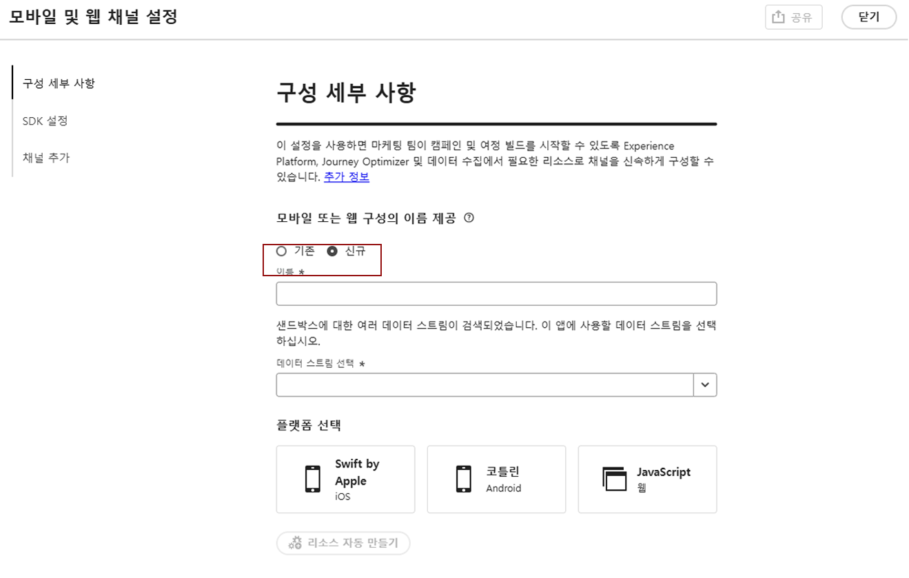

# 웹 구성 설정 {#set-mobile-web}

>[!CONTEXTUALHELP]
>id="ajo_mobile_web_setup_javascript_code"
>title="Javascript 코드"
>abstract="`<head>` 태그에는 웹 페이지의 기본 콘텐츠 앞에 로드되는 필수 메타데이터와 리소스가 포함되어 있습니다. 이 섹션에 코드를 삽입하면 조기에 제대로 초기화되고 실행되므로 웹 페이지를 효율적으로 로드하고 사용할 수 있습니다. `<head>` 섹션에 코드를 추가하면 사이트의 구조, 성능 및 전반적인 사용자 경험을 향상시킬 수 있습니다."

>[!CONTEXTUALHELP]
>id="ajo_mobile_web_setup_javascript_site"
>title="사이트 시작 및 유효성 검사"
>abstract="코드가 성공적으로 구현되고 웹 사이트에서 라이브가 되면 기본 URL을 제공합니다. 필요한 경우 나중에 이 페이지로 돌아와 설정이 예상대로 작동하는지 다시 확인하고 확인할 수 있습니다."

이 설정을 사용하면 마케팅 채널을 신속하게 구성할 수 있으므로 필요한 모든 리소스를 Experience Platform, Journey Optimizer 및 데이터 수집 내에서 쉽게 사용할 수 있습니다. 이렇게 하면 마케팅 팀이 캠페인 및 여정 생성을 즉시 시작할 수 있습니다.

## 새 웹 설정 만들기 {#new-setup}

1. Journey Optimizer 홈페이지에서 **[!UICONTROL 모바일 및 웹 채널 설정]** 카드에서 **[!UICONTROL 시작]**&#x200B;을 클릭합니다.

   

1. **[!UICONTROL 새]** 구성을 만듭니다.

   기존 구성이 있는 경우 하나를 선택하거나 새 구성을 만들 수 있습니다.

   

1. 새 구성에 대한 **[!UICONTROL 이름]**&#x200B;을(를) 입력하고 **[!UICONTROL 데이터 스트림]**&#x200B;을(를) 선택하거나 만드세요. 이 **[!UICONTROL 이름]**&#x200B;은(는) 자동으로 만든 모든 리소스에 사용됩니다.

1. 조직에 여러 데이터 스트림이 있는 경우 기존 옵션 중에서 하나를 선택하십시오. 데이터 스트림이 없는 경우 자동으로 만들어집니다.

1. 웹 플랫폼을 선택하고 **[!UICONTROL 리소스 자동 만들기]**&#x200B;를 클릭합니다.

   

1. 설치 프로세스를 간소화하기 위해 시작하는 데 도움이 되는 필수 리소스가 자동으로 생성됩니다.

   다음은 자동 생성되는 모든 리소스의 전체 목록입니다.

+++ 생성된 리소스

   <table>
    <thead>
    <tr>
    <th><strong>솔루션</strong></th>
    <th><strong>자동 생성된 리소스</strong></th>
    </tr>
    </thead>
    <tbody>
    <tr>
    </tr>
    <tr>
    <td>
    
태그

    </td>
    <td>
    <ul>
    <li>모바일 태그 속성</li>
    <li>규칙</li>
    <li>데이터 요소</li>
    <li>라이브러리</li>
    <li>환경(스테이징, 프로덕션, 개발)</li>
    </ul>
    </td>
    </tr>
    <tr>
    <td>
    
태그 확장

    </td>
    <td>
    <ul>
    <li>Adobe Experience Platform Edge Network</li>
    <li>Adobe Journey Optimizer</li>
    <li>AEP 보증</li>
    <li>동의(기본 동의 정책이 활성화됨)</li>
    <li>ID(기본 ECID 사용, 기본 결합 규칙 사용)</li>
    <li>모바일 코어</li>
    </ul>
    </td>
    </tr>
    <tr>
    <td>
    
보증

    </td>
    <td>
    
보증 세션

    </td>
    </tr>
    <tr>
    <td>
    
데이터스트림

    </td>
    <td>
    
서비스가 포함된 데이터 스트림

    </td>
    </tr>
    <tr>
    <td>
    
Experience Platform

    </td>
    <td>
    <ul>
    <li>데이터 세트</li>
    <li>스키마</li>
    </ul>
    </td>
    </tr>
    </tbody>
    </table>

+++

1. 리소스 생성이 완료되면 **[!UICONTROL 설정]**&#x200B;을 클릭하여 SDK 구성을 시작합니다.

   

1. 화면에 표시된 코드를 문서의 `<head>` 태그에 붙여넣습니다.

   {zoomable="yes"}

1. 모바일 애플리케이션에서 직접 SDK의 유효성을 검사하려면 기본 URL을 붙여넣기만 하면 됩니다.

   {zoomable="yes"}

1. 사이트에 연결하려면 **[!UICONTROL 사이트 시작 및 유효성 검사]**&#x200B;를 선택하십시오.

   {zoomable="yes"}

1. 구성을 완료한 후 자동 생성된 **[!UICONTROL 모바일 웹 속성]**&#x200B;을(를) 여정 및 캠페인 생성을 담당하는 팀원과 공유합니다.

   **[!UICONTROL 모바일 웹 속성]**&#x200B;은(는) 캠페인 또는 여정 인터페이스에서 참조되어야 하며, 이를 통해 설정과 대상의 타깃팅된 여정 및 캠페인 실행 간에 원활한 연결이 가능합니다.

   

이제 이전에 구성한 **[!UICONTROL 모바일 웹 속성]**&#x200B;을 사용하여 웹 페이지를 만들 수 있습니다. [웹 페이지를 만드는 방법을 알아봅니다](../web/create-web.md)

## 기존 구성 수정 {#reconnect}

구성을 만든 후 언제든지 쉽게 다시 방문하여 채널을 추가하거나 필요에 따라 추가 조정할 수 있습니다

1. Journey Optimizer 홈페이지에서 **[!UICONTROL 모바일 및 웹 채널 설정]** 카드에서 **[!UICONTROL 시작]**&#x200B;을 클릭합니다.

   

1. **[!UICONTROL 기존]**&#x200B;을(를) 선택하고 드롭다운에서 기존 **[!UICONTROL Tag 속성]**&#x200B;을(를) 선택합니다.

   

1. 이제 필요에 따라 구성을 업데이트할 수 있습니다.
