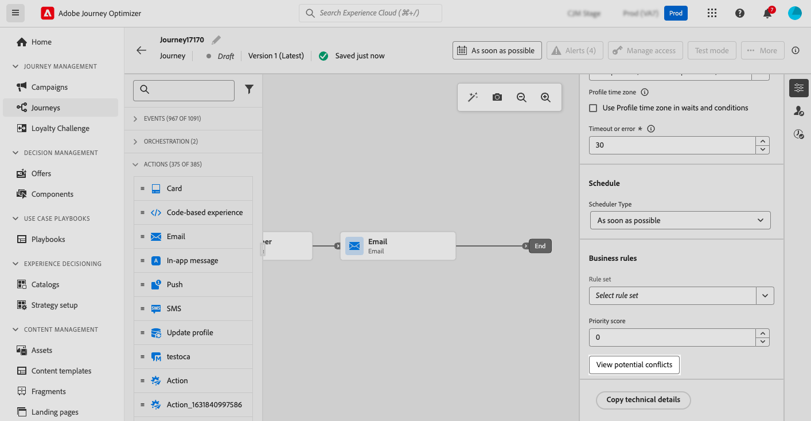

# 여정 및 캠페인에서 발생할 수 있는 충돌 감지 {#conflict}

>[!AVAILABILITY]
>
>충돌 및 우선 순위 지정 기능은 현재 선택한 고객 그룹에 대해 제한된 가용성으로 사용할 수 있습니다. 이 기능은 향후 더 많은 사용자에게 점진적으로 배포될 예정입니다. 이 기능에 대한 대기자 명단에 등록하려면 계정 팀에 문의하십시오.

마케터가 Journey Optimizer에서 캠페인 및 여정의 볼륨을 증가시키면 마케터가 고객에게 너무 많은 마케팅 상호 작용을 하는지 여부를 알기가 점점 어려워집니다. 따라서 캠페인과 여정이 겹치는 시점을 쉽게 파악하여 고객 피로감의 위험을 완화하면서 마케팅 커뮤니케이션의 적절한 균형을 달성하고 있는지 확인하는 것이 중요합니다.

잠재적 중복을 모니터링하는 주요 영역은 다음과 같습니다.

* **타임라인**(시작 및 종료 날짜): 동시에 실행되는 여정이 너무 많습니까?
* **대상**: 내 여정 대상의 비율도 다른 여정의 일부입니까?
* **채널**: 같은 일정에 예약된 다른 통신이 있으며, 예약된 경우 몇 개나 됩니까?
* **최대 가용량 여정 집합**: 최대 가용량 규칙 유형은 무엇이며 해당 규칙 내에서 겹칩니까?
* **채널 구성**: 동일한 여정 또는 캠페인에서 사용 중인 채널 구성을 사용하여 여정 또는 캠페인이 최종 사용자에게 표시되지 않도록 하는 다른 여정 또는 캠페인이 있습니까?

➡️ [비디오에서 이 기능 살펴보기](#video)

## Journey Optimizer에서 충돌을 감지하는 방법 {#detection}

다음은 Journey Optimizer이 여정 및 캠페인에 대한 잠재적 충돌을 식별하는 방법에 대한 요약입니다.

* **충돌 식별 범위**: 충돌은 실시간 또는 예약된 캠페인 및 여정에 대해서만 표시됩니다.
* **단일 여정**: 선택한 여정이 단일 이벤트인 경우 이 이벤트가 모든 여정을 트리거하므로 동일한 이벤트로 시작하는 다른 여정이 표시됩니다.
* **대상 자격 및 대상/비즈니스 이벤트 읽기** 여정: 선택한 여정이 대상 자격 또는 대상/비즈니스 이벤트 읽기 여정인 경우 대상 간에 겹칠 수 있으므로 올바른 대상이 있는 동일한 유형의 다른 모든 여정이 표시됩니다.
* **캠페인**: 모든 캠페인이 대상을 타겟팅하고 있으며 여정 개념이 없으므로 모든 캠페인은 대상 읽기 활동으로 시작하여 세그먼트에서 트리거된 이벤트와 잠재적으로 충돌합니다.
* **실시간/예약된 캠페인**: 실시간 캠페인과 예약된 캠페인이 겹칠 수 있으므로 서로 충돌할 수 있습니다. 지정된 캠페인의 경우 모든 라이브 또는 예약된 캠페인이 충돌 뷰어에 나열됩니다.

## 주어진 여정 또는 캠페인에 대해 식별된 충돌 보기 {#view}

>[!CONTEXTUALHELP]
>id="ajo_campaigns_campaign_conflict"
>title="잠재적 충돌 보기"
>abstract="다른 캠페인과 겹칠 수 있을 때마다 확인하십시오. 충돌은 실시간 및 예약된 캠페인에 대해서만 표시됩니다. **[!UICONTROL 시작/종료 날짜]**, **[!UICONTROL 대상자]**, **[!UICONTROL 채널]**, **[!UICONTROL 채널 구성]** 및 **[!UICONTROL 규칙 집합]** 설정을 할당하면 바로 단추를 사용할 수 있습니다."

>[!CONTEXTUALHELP]
>id="ajo_journey_conflict"
>title="잠재적 충돌 보기"
>abstract="다른 여정과 겹칠 가능성이 있으면 언제든지 확인하십시오. 충돌은 라이브 및 예약된 여정에 대해서만 표시됩니다. **[!UICONTROL 시작/종료 날짜]**, **[!UICONTROL 대상자]**, **[!UICONTROL 채널]**, **[!UICONTROL 채널 구성]** 및 **[!UICONTROL 규칙 집합]** 설정을 할당하면 바로 단추를 사용할 수 있습니다."

Journey Optimizer을 사용하면 여정 또는 캠페인을 작성할 때 다른 여정 또는 캠페인과 겹칠 가능성이 있을 때마다 확인할 수 있습니다. 이렇게 하려면 다음 단계를 수행합니다.

1. 여정 또는 캠페인을 작성할 때 여정 또는 캠페인 속성에서 **[!UICONTROL 잠재적 충돌 보기]** 단추를 클릭합니다.

   

   >[!NOTE]
   >
   >**[!UICONTROL 시작/종료 날짜]**, **[!UICONTROL 대상자]**, **[!UICONTROL 채널]**, **[!UICONTROL 채널 구성]** 및 **[!UICONTROL 규칙 집합]** 설정을 할당하면 **[!UICONTROL 잠재적 충돌 보기]** 단추를 선택할 수 있습니다. 변경 내용이 저장될 때까지 단추를 선택할 수 없으므로 이러한 설정을 할당한 후 **[!UICONTROL 저장]**&#x200B;을 선택하십시오.

1. **[!UICONTROL 잠재적 충돌]** 창이 열리고 현재 여정/캠페인과 겹치는 모든 요소를 시각화할 수 있습니다.

   이 화면에서 이름을 선택하여 겹치는 여정 또는 캠페인을 직접 열 수 있습니다.

   

   >[!NOTE]
   >
   >새로 게시된 캠페인은 캐싱이 구현되어 충돌 뷰어에 표시되는 데 최대 5분이 걸릴 수 있습니다

잠재적인 겹침 검색에 대한 검색을 세분화하기 위해 관련된 필드를 기준으로 캠페인 및 여정 목록을 필터링할 수 있습니다. 이렇게 하려면 인벤토리 보기에서 필터 아이콘을 선택합니다. [필터 작업 방법 알아보기](../start/search-filter-categorize.md#filter-lists)

## 충돌 해결 {#resolve}

잠재적인 충돌이 식별되면 이를 줄이기 위한 몇 가지 팁이 있습니다.

* 캠페인 또는 여정이 겹치지 않도록 **시작/종료 날짜**&#x200B;를 조정하세요.
* **대상 타깃팅**&#x200B;을 세분화하여 여정 간 겹침을 최소화합니다.
* 고객이 너무 많은 커뮤니케이션을 받지 않도록 **주파수 상한**&#x200B;을 구현하십시오.
* 고객 경험을 보다 효과적으로 관리하려면 **활성 여정**&#x200B;의 수를 줄이십시오.
* 가장 중요한 작업이 고객에게 표시되도록 하려면 인바운드 작업에 대해 **우선 순위**&#x200B;를 설정하십시오.

이러한 기능을 활용하면 마케팅 활동을 적절히 조정하고 커뮤니케이션 전략의 균형을 유지할 수 있습니다.

## 방법 비디오 {#video}

>[!VIDEO](https://video.tv.adobe.com/v/3435528?quality=12)
