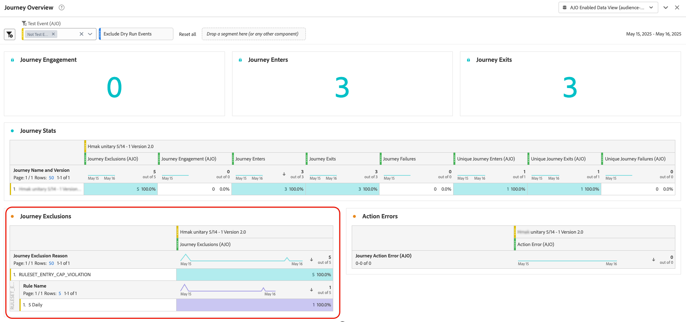

# 여정 캡핑 및 중재 {#journey-capping}

>[!AVAILABILITY]
>
>충돌 및 우선 순위 지정 기능은 현재 선택한 고객 그룹에 대해 제한된 가용성으로 사용할 수 있습니다. 이 기능은 향후 더 많은 사용자에게 점진적으로 배포될 예정입니다. 이 기능에 대한 대기자 명단에 등록하려면 계정 팀에 문의하십시오.

여정 캡핑은 프로필이 등록할 수 있는 여정 수를 제한하는 데 도움이 되며, 이를 통해 통신 과부하를 방지할 수 있습니다. Journey Optimizer에서는 두 가지 유형의 가용량 규칙을 설정할 수 있습니다.

* **항목 제한**&#x200B;은(는) 프로필에 지정된 기간 동안 여정 항목 수를 제한합니다.
* **동시성 한도**&#x200B;는 프로필을 동시에 등록할 수 있는 여정 수를 제한합니다.

두 가지 유형의 여정 제한 모두 우선 순위 점수를 활용하여 항목을 중재합니다.

>[!AVAILABILITY]
>
>**여정** 도메인 규칙 집합은 제한된 사용자 집합에만 사용할 수 있습니다(제한된 가용성). 액세스 권한을 받으려면 Adobe 담당자에게 문의하십시오.

➡️ [비디오에서 이 기능 살펴보기](#video)

## 여정 캡핑 규칙 만들기 {#create-rule}

>[!CONTEXTUALHELP]
>id="ajo_rule_set_concurrency_prioritization"
>title="우선 순위 지정 미리 보기"
>abstract=" 여기에서 지정한 기간 내에 우선순위가 더 높은 여정이 예약되어 있는 경우 고객은 이 여정에 참여할 수 없습니다. 여정 입장을 선착순으로 진행하려는 경우 먼저 일 단위로 예상 기간을 선택하고 해당 날짜에 있는 다른 여정의 우선 순위 점수가 설정 중인 여정의 우선 순위 점수보다 낮은지 확인하는 것이 좋습니다. 여정에 우선 순위 점수 100을 입력하는 방법으로 해당 여정에 반드시 입장하도록 할 수도 있습니다."

>[!CONTEXTUALHELP]
>id="ajo_rule_set_rule_type"
>title="규칙 유형"
>abstract="규칙의 캡핑 유형을 지정합니다. **[!UICONTROL 여정 입력 캡]**&#x200B;은 프로필의 특정 기간 동안 여정에 대한 입력 횟수를 제한하는 반면 **[!UICONTROL 여정 동시성 캡]**&#x200B;은 프로필이 동시에 등록할 수 있는 여정의 수를 제한합니다."

여정 최대 가용량 규칙을 만들려면 다음 단계를 수행합니다.

1. **[!UICONTROL 비즈니스 규칙]** 메뉴로 이동하여 규칙 집합 인벤토리에 액세스합니다.

1. 최대 가용량 규칙을 추가할 규칙 세트를 선택하거나 새 규칙 세트를 만듭니다.

   * 기존 규칙 세트를 사용하려면 목록에서 선택합니다. 여정 한도 규칙은 &quot;여정&quot; 도메인이 있는 규칙 세트에만 추가할 수 있습니다. **[!UICONTROL 도메인]** 열의 규칙 집합 목록에서 이 정보를 확인할 수 있습니다.

     

   * 새 규칙 집합 내에 최대 가용량 규칙을 만들려면 **[!UICONTROL 규칙 집합 만들기]**&#x200B;를 클릭하고 규칙 집합에 고유한 이름을 지정한 다음 **[!UICONTROL 여정 집합 도메인]** 드롭다운에서 &quot;도메인&quot;을 선택한 다음 **[!UICONTROL 저장]**&#x200B;을 클릭합니다.

     

1. 규칙 집합 화면에서 **[!UICONTROL 규칙 추가]** 단추를 클릭한 다음 필요에 맞게 규칙을 구성합니다.

   

   * 규칙의 고유한 이름을 제공합니다.

   * **[!UICONTROL 규칙 유형]** 드롭다운 목록에서 규칙의 최대 가용량 유형을 지정합니다.

      * **[!UICONTROL 여정 시작 상한]**: 프로필에 지정된 기간 동안 여정에 들어오는 항목 수를 제한합니다.
      * **[!UICONTROL 여정 동시성 상한]**: 프로필을 동시에 등록할 수 있는 여정 수를 제한합니다.

   * 아래 섹션을 확장하여 각 유형의 캡핑을 구성하는 방법을 알아봅니다.

     +++여정 항목 한도 규칙 구성

      1. **[!UICONTROL 최대]** 필드에서 프로필이 입력할 수 있는 최대 여정 수를 설정합니다.
      1. **[!UICONTROL 기간]** 필드에서 고려할 기간을 정의합니다. 기간은 UTC 시간대를 기반으로 합니다. 예를 들어 일별 상한은 자정(UTC)에 재설정됩니다.

     >[!AVAILABILITY]
     >
     >일별 기간은 조직 집합(제한된 가용성)에만 사용할 수 있습니다. 액세스 권한을 받으려면 Adobe 담당자에게 문의하십시오.

     이 예제에서는 프로필이 한 달에 &quot;5&quot;개가 넘는 여정을 입력할 수 없도록 제한하려고 합니다.

     

     >[!NOTE]
     >
     >시스템에서는 이 규칙이 적용되는 향후 예약된 여정의 우선 순위를 고려합니다.
     >
     >이 예에서 마케터가 이미 4개의 여정을 입력했고 더 높은 우선 순위를 가진 이번 달에 예정된 다른 예약 여정이 있는 경우 고객은 더 낮은 우선 순위 여정에 들어가지 않습니다.

     +++

     +++여정 동시성 최대 가용량 규칙 구성

      1. **[!UICONTROL 최대]** 필드에서 프로필을 동시에 등록할 수 있는 최대 여정 수를 설정합니다.

      1. **[!UICONTROL 우선 순위 미리 보기]** 필드를 사용하여 선택한 기간(예: 1일, 7일, 30일)에 대한 우선 순위 점수를 기반으로 여정 항목을 중재합니다. 이렇게 하면 프로필이 여러 여정에 적합한 경우 더 높은 가치의 여정에 우선 순위를 지정하는 데 도움이 됩니다.

     이 예제에서는 프로필이 동일한 여정 세트를 포함하는 다른 여정에 이미 등록되어 있는 경우 해당 프로필로 들어가지 못하도록 제한하려고 합니다. 앞으로 7일 이내에 다른 여정에 더 높은 우선 순위 점수가 있는 경우 프로필이 이 여정을 입력하지 않습니다.

     {width="50%" zommable="yes"}

     +++

1. 최대 가용량 규칙을 여정에 적용할 준비가 되면 이름 옆에 있는 줄임표 버튼을 클릭하여 활성화합니다.

   

1. 화면 오른쪽 상단에 있는 규칙 추가 버튼 옆에 있는 줄임표 버튼을 클릭하여 전체 규칙 세트를 활성화합니다.

   

## 여정에 캡핑 규칙 적용 {#apply-capping}

>[!CONTEXTUALHELP]
>id="ajo_journey_capping_rule"
>title="여정에 규칙 세트 적용"
>abstract="규칙 세트를 적용하여 빈도 상한 설정 규칙에 따라 대상자의 일부에서 이 여정을 제외합니다."

여정에 최대 가용량 규칙을 적용하려면 여정에 액세스하여 해당 속성을 엽니다. **[!UICONTROL 최대 가용량 규칙]** 드롭다운에서 관련 규칙 집합을 선택합니다. 규칙이 활성화되면 여정 세트에 정의된 최대 가용량 규칙이 적용됩니다.

>[!IMPORTANT]
>
>여정이 즉시 활성화되면 시스템에서 고객 억제를 시작하는 데 최대 20분이 걸릴 수 있습니다. 이러한 가능성을 방지하기 위해 적어도 20분 후에 여정을 시작하도록 예약할 수 있습니다.

여정이 라이브되면 여정 보고서에서 **[!UICONTROL 여정 제외]** 테이블의 여정 집합에서 제외된 항목이 있는지 확인할 수 있습니다. [여정 보고서 작업 방법 알아보기](../reports/journey-global-report-cja.md)

## 사용 방법 비디오 {#video}

>[!VIDEO](https://video.tv.adobe.com/v/3435530?quality=12)
