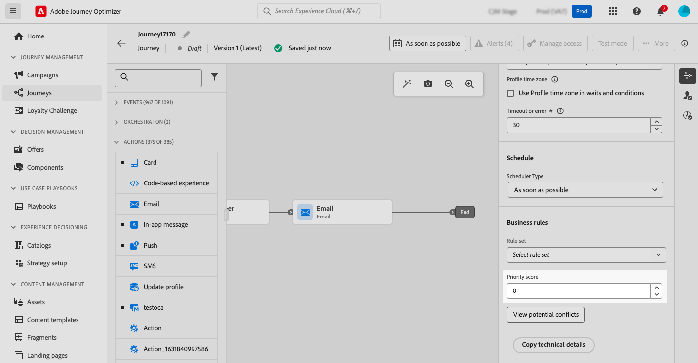

# 여정 및 캠페인에 우선 순위 점수 할당 {#priority}

>[!CONTEXTUALHELP]
>id="ajo_campaigns_campaign_priority"
>title="우선 순위"
>abstract="캠페인에 우선 순위 점수를 할당합니다. 우선 순위는 빈도 상한과 같은 부과된 제약 조건이 있을 때 캠페인의 우선 순위를 지정하는 데 필수적입니다.숫자 값(0-100)을 입력합니다. 숫자가 높을수록 우선순위가 높은 것을 알려드립니다. 두 캠페인의 우선 순위 점수가 동일한 상황의 경우 먼저 활성화된 캠페인이 표시됩니다."

>[!CONTEXTUALHELP]
>id="ajo_journey_priority"
>title="우선 순위"
>abstract="우선 순위 점수를 여정에 할당합니다. 우선 순위는 빈도 상한과 같은 지정된 제약 조건이 있을 때 여정의 우선 순위를 지정하는 데 필수적입니다.숫자 값(0-100)을 입력합니다. 숫자가 높을수록 우선순위가 높은 것을 알려드립니다. 두 여정의 우선 순위 점수가 동일한 상황의 경우 먼저 활성화된 여정이 표시됩니다."

>[!AVAILABILITY]
>
>충돌 및 우선 순위 지정 기능은 현재 선택한 고객 그룹에 대해 제한된 가용성으로 사용할 수 있습니다. 이 기능은 향후 더 많은 사용자에게 점진적으로 배포될 예정입니다. 이 기능에 대한 대기자 명단에 등록하려면 계정 팀에 문의하십시오.

Journey Optimizer을 사용하면 여정 또는 캠페인에 우선 순위 점수를 할당할 수 있습니다. 우선 순위는 부과된 제한(예: 빈도 제한)이 있는 경우 여정, 캠페인 또는 작업의 우선 순위를 지정하는 데 필수적입니다. 고객이 많은 여정, 캠페인 또는 커뮤니케이션에 대한 자격을 얻고 고객이 입력 및 수신해야 하는 대상을 선택하려는 경우 이 필드를 활용해야 합니다.

>[!NOTE]
>
>캠페인에서는 웹, 인앱 및 코드 기반 인바운드 채널에 대해서만 우선순위 점수를 사용할 수 있습니다.

➡️ [비디오에서 이 기능 살펴보기](#video)

웹, 모바일 및 인앱과 같은 인바운드 커뮤니케이션에는 우선순위 점수를 할당하는 것이 중요합니다. 동일한 채널 구성을 사용하는 캠페인이 여러 개 있는 경우(예: 웹 페이지의 상단에 있는 배너), 한 캠페인의 콘텐츠만 표시할 수 있으므로 문제가 될 수 있습니다. 우선 순위 점수는 수신자가 둘 이상의 캠페인에 대한 자격이 있을 때 표시되어야 하는 캠페인에 대한 환경 설정을 삽입하는 것입니다.

여정 또는 캠페인에 우선 순위 점수를 할당하려면 여정 또는 캠페인 속성에 있는 **[!UICONTROL 우선 순위 점수]** 필드에 숫자 값(0-100)을 입력하십시오. 숫자가 높을수록 우선순위가 높은 것을 알려드립니다. 이 캠페인을 작성 중이고 이 캠페인 콘텐츠가 표시되도록 하려면 100점을 부여해야 합니다.

두 캠페인의 우선 순위 점수가 동일한 상황의 경우 먼저 활성화된 캠페인이 표시됩니다.

## 방법 비디오 {#video}

>[!VIDEO](https://video.tv.adobe.com/v/3435529?quality=12)
