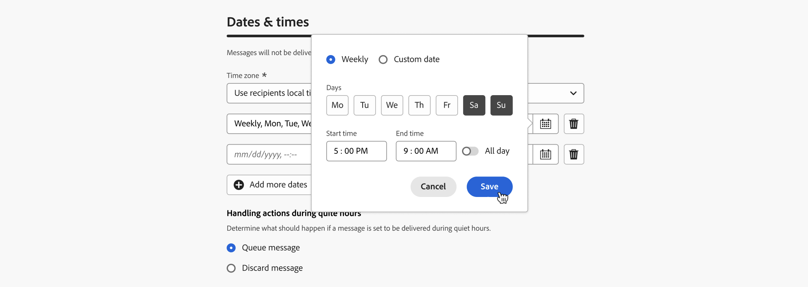
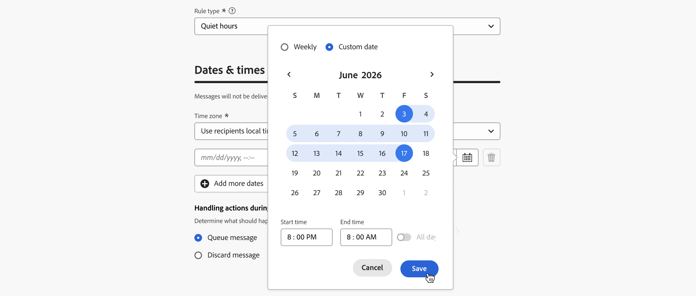
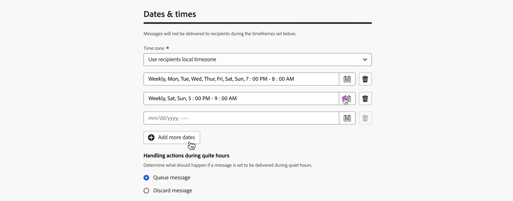

# 방해 금지 시간 설정 {#quiet-hours}

## 조용한 시간은 언제입니까

**방해 금지 시간**&#x200B;을(를) 사용하면 **이메일**, **SMS**, **푸시** 및 **WhatsApp** 채널에 대한 시간 기반 제외를 정의할 수 있습니다. 특정 시간 동안 메시지가 전송되지 않도록 하여 고객 환경 설정과 및 규정 요건을 준수할 수 있습니다.

정확한 제어를 위해 캠페인 또는 여정의 개별 작업에 할당할 수 있는 **규칙 집합**&#x200B;을 통해 방해 금지 시간을 적용할 수 있습니다.

이러한 프로세스를 간소화함으로써 고객 경험을 향상시키고, 시간을 절약하며, 커뮤니케이션 규칙을 준수할 수 있습니다.

* **고객을 깨우지 마세요** - *올바른 고객, 올바른 채널, 올바른 시간*&#x200B;은(는) 많은 마케터들의 주문이므로, 타이밍이 고객 여정의 중요한 부분이라는 것은 당연합니다. 자동 시간 규칙을 설정하여 브랜드는 연락처가 메시지를 받는 시기를 더 잘 제어할 수 있고, 사용자가 메시지에 대해 조치를 취할 가능성이 높을 때 메시지를 받을 수 있도록 합니다.
* **편의** - 전체 여정 또는 캠페인을 중지할 필요 없이 대상자가 메시지를 받지 못하도록 해야 할 때 캠페인 및 여정 간 통신을 쉽게 가로채십시오.
* **시간 절약** - 사용자 지정 식을 사용하여 여러 조건 노드를 추가하는 대신 **시간 기반 규칙**&#x200B;을 만들어 한 곳에서 제외를 관리합니다.\
  <!--* **Extra Safeguard** - Benefit from an extra safeguard in case audience criteria or time-window configurations were incorrectly set, ensuring individuals are still excluded when they should be.-->

>[!AVAILABILITY]
>
>방해 금지 시간대 규칙은 현재 일부 조직에서만 사용할 수 있습니다(제한된 가용성).  향후 릴리스에서 점진적으로 사용 범위를 확대하여 모든 고객에게 제공할 예정입니다.

➡️ [비디오에서 이 기능 살펴보기](#video)

## 가드레일 및 제한 사항

* **지원되는 채널** - 전자 메일, SMS, 푸시 및 WhatsApp.
  <!--* **Custom actions** – For custom actions, only quiet hours rules are enforced. If a rule set also includes other rules (e.g., frequency capping), those rules are ignored.-->
* **전파 지연** - 자동 시간 규칙에 대한 업데이트는 해당 규칙을 이미 사용하는 채널 작업에 적용되는 데 최대 12시간이 걸릴 수 있습니다.
  <!--* **Pre-suppression window** – The system begins suppressing communications 30 minutes before quiet hours start, ensuring that no messages are delivered once the quiet period begins.-->
* **대량 대기 시간** - 대량 통신의 경우 시스템에서 자동 시간 제한을 성공적으로 적용하는 데 시간이 더 걸릴 수 있습니다.

## 자동 중지 시간 규칙 만들기

방해 금지 시간을 설정하려면 사용자 지정 규칙 세트 내에 규칙을 만듭니다. 다음 단계를 수행하십시오.

1. 규칙 집합 인벤토리에 액세스하려면 **[!UICONTROL 비즈니스 규칙]**(으)로 이동하십시오.

1. 기존 사용자 지정 규칙 세트를 선택하거나 새 규칙 세트를 만듭니다.

   +++기존 규칙 집합에 자동 시간 규칙 만들기

   인벤토리에서 규칙 세트를 선택합니다. 방해 금지 모드 규칙은 &quot;채널&quot; 도메인이 있는 규칙 세트에만 추가할 수 있습니다. **[!UICONTROL 도메인]** 열에서 이 정보를 확인할 수 있습니다.

   

   +++

   +++새 규칙 집합에 자동 시간 규칙 만들기

   **[!UICONTROL 규칙 집합 만들기]**&#x200B;를 클릭하고 고유한 이름을 입력한 다음 **[!UICONTROL 규칙 집합 도메인]** 드롭다운에서 &quot;채널&quot;을 선택합니다.

   

   +++

   >[!NOTE]
   >
   >자동 시간은 **사용자 지정 규칙 집합**&#x200B;에서만 정의할 수 있습니다. 전역 규칙 집합은 자동 시간 구성을 지원하지 않습니다.

1. 규칙 집합 화면에서 **[!UICONTROL 규칙 추가]**&#x200B;를 클릭하고 규칙의 고유한 이름을 제공합니다.

1. **범주** 필드는 규칙이 적용되는 메시지의 범주를 지정합니다. 현재 이 필드는 읽기 전용이며 기본값은 **[!UICONTROL Marketing]**&#x200B;입니다.

1. **[!UICONTROL 규칙 유형]** 드롭다운에서 **[!UICONTROL 방해 금지 시간]**&#x200B;을 선택합니다.

   

1. **[!UICONTROL 날짜 및 시간]** 섹션에서 방해 금지 시간을 적용할 시기를 정의합니다.

   1. 사용할 **[!UICONTROL 시간대]**&#x200B;를 선택하십시오.

      * **[!UICONTROL UTC/GMT]** - 개별 시간대에 관계없이 대상의 모든 수신자에게 표준 GMT 시간대를 적용합니다.
      * **[!UICONTROL 수신자의 현지 표준 시간대 사용]** - 각 프로필의 표준 시간대 필드를 사용합니다. [여정의 시간대 관리에 대해 자세히 알아보기](../building-journeys/timezone-management.md#timezone-from-profiles)

        >[!IMPORTANT]
        >
        >프로필에 시간대 값이 없는 경우 해당 프로필에 자동 시간이 적용되지 않습니다.

   1. 자동 체류 시간이 적용되는 기간을 지정합니다.

      * **[!UICONTROL 주별]** - 특정 요일 및 시간 슬롯을 선택합니다. **[!UICONTROL 하루 종일]** 규칙을 적용할 수도 있습니다(이 옵션은 최대 3일 연속 사용 가능).

        

      * **[!UICONTROL 사용자 지정 날짜]** - 일정 및 타임슬롯에서 특정 날짜를 선택합니다. **[!UICONTROL 하루 종일]** 규칙을 적용할 수도 있습니다(이 옵션은 최대 3일 연속 사용 가능).

        

   1. **[!UICONTROL 날짜 추가]** 단추를 클릭하여 최대 5개의 개별 기간을 추가합니다.

      

1. **[!UICONTROL 방해 금지 모드 동안 작업 처리]** 섹션에서 선택한 기간 동안 메시지를 처리하는 방법을 선택하십시오.

   

   * **[!UICONTROL 큐 메시지]** - 메시지가 일시 중지됨 상태가 아닌 경우 방해 금지 기간 완료 시 전송됩니다.

     >[!NOTE]
     >
     >이 옵션은 여정 작업에만 사용할 수 있습니다. 캠페인 작업에 적용되는 경우 **[!UICONTROL 메시지 버리기]** 옵션을 선택하는 것과 동일하게 동작합니다.

   * **[!UICONTROL 메시지 버리기]** - 메시지가 전송되지 않습니다. 메시지가 포함된 여정 또는 캠페인이 전송 취소로 끝나도록 하려면 **[!UICONTROL 여정 또는 캠페인 삭제 및 종료]**&#x200B;를 선택하세요.

## 여정 및 캠페인에 방해 금지 시간 적용 {#apply}

규칙이 저장되고 규칙 세트가 활성화되면 여정 및 캠페인의 작업에 적용할 수 있습니다. 지원되는 채널: **이메일, SMS, 푸시, WhatsApp**. 자세한 내용은 아래 탭을 참조하십시오.

>[!BEGINTABS]

>[!TAB 여정에서 자동 시간 채널 동작 적용]

1. 여정을 열고 [채널 작업](../building-journeys/journeys-message.md)을(를) 선택하고 메시지 내용을 편집합니다.
1. **[!UICONTROL 비즈니스 규칙 추가]** 단추를 클릭하고 자동 시간 규칙이 포함된 규칙 집합을 선택합니다.

   

   >[!NOTE]
   >
   >[활성화됨](#activate-rule) 규칙 집합만 목록에 표시됩니다.

1. 여정 활성화

>[!TAB 캠페인 작업에 자동 시간 적용]

1. 캠페인을 편집하고 **[!UICONTROL 작업]** 탭에 액세스합니다.
1. **[!UICONTROL 비즈니스 규칙]** 섹션에서 방해 금지 시간 규칙이 포함된 규칙 집합을 선택합니다.

   

   >[!NOTE]
   >
   >[활성화됨](#activate-rule) 규칙 집합만 목록에 표시됩니다.

1. 캠페인을 활성화합니다.

>[!ENDTABS]

## 다음 단계

여정 또는 캠페인이 활성화 및 실행되면 [Customer Journey Analytics 보고서](../reports/report-gs-cja.md) 및 [라이브 보고서](../reports/live-report.md)에서 통신에서 제외된 프로필 수를 볼 수 있습니다. 여기에서 배달 대상에서 제외된 사용자에 대한 가능한 이유로 방해 금지 시간 규칙이 나열됩니다.

<!--

>[!TAB Apply Quiet hours to custom actions]

1. Open your journey and add or select a custom action in the canvas.

1. In the **[!UICONTROL Business rules]** section, select the rule set containing the Quiet hours rule.

   

   >[!NOTE]
   >
   >Only [activated](#activate-rule) rule sets display in the list.

1. Activate your journey.

-->

## 사용 방법 비디오 {#video}

Adobe Journey Optimizer에서 방해 금지 모드 해제 시간 기능을 사용하는 방법에 대해 알아봅니다.

>[!VIDEO](https://video.tv.adobe.com/v/3475859?captions=kor&quality=12)
