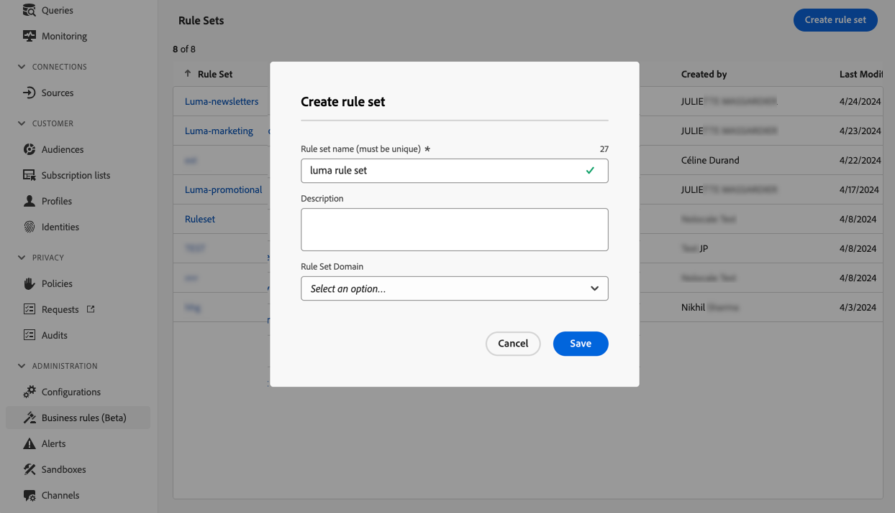

# 규칙 세트 작업 {#rule-sets}

>[!CONTEXTUALHELP]
>id="ajo_business_rules_rule_sets"
>title="규칙 세트"
>abstract="규칙 세트를 사용하여 빈도 제한 또는 자동 시간 규칙을 다양한 유형의 마케팅 커뮤니케이션에 적용합니다. 빈도 캡핑 설정 규칙에 따라 대상자의 일부로 향하는 여정을 제외하는 규칙 세트를 만들 수도 있습니다."

## 규칙 세트 시작 {#gs}

### 규칙 세트란 무엇입니까? {#what}

규칙 세트를 사용하면 **여러 규칙을 규칙 세트로 그룹화**&#x200B;하여 선택한 여정 및 캠페인에 적용할 수 있습니다. 이를 통해 특정 시간대 내에 고객이 입장할 수 있는 여정 수와 빈도를 제한하거나 커뮤니케이션 유형에 따라 사용자가 메시지를 수신하는 빈도를 제어할 때의 세밀함이 개선됩니다.

다음 두 가지 유형의 규칙 세트를 만들 수 있습니다.

* **채널** 규칙 집합은 통신 채널에 규칙을 적용합니다. 이를 통해 다음을 설정할 수 있습니다.

   * **빈도 제한 규칙** - *하루에 1개 이상의 전자 메일 또는 SMS 메시지를 보내지 마십시오.*
   * **방해 금지 시간 규칙**(제한된 가용성) - *오전 8시~오후 9시 타임슬롯 외부에서 전자 메일 메시지를 보내지 마십시오.*

* **여정** 규칙 집합은 시작 및 동시성 최대 가용량 규칙을 여정에 적용합니다. 예를 들어 두 개 이상의 여정에 동시에 프로필을 입력하지 마십시오.

➡️ [비디오에서 이 기능 살펴보기](#video)

### 권한 {#permissions-frequency-rules}

비즈니스 규칙을 사용하여 작업하려면 다음 권한이 필요합니다.

* **[!UICONTROL 빈도 규칙 보기]**: 비즈니스 규칙에 액세스하고 봅니다.
* **[!UICONTROL 빈도 규칙 관리]**: 비즈니스 규칙을 만들거나 편집하거나 삭제합니다.

[이 섹션](../administration/high-low-permissions.md)에서 권한에 대해 자세히 알아보십시오.

### 글로벌 및 사용자 지정 규칙 세트 {#global-custom}

**[!UICONTROL 관리]** > **[!UICONTROL 비즈니스 규칙]** 메뉴에서 처음으로 규칙 집합에 액세스할 때 기본 규칙 집합이 미리 만들어지고 활성 상태입니다. **전역 기본 규칙 집합**.

이 규칙 세트에는 사용자가 하나 또는 여러 채널에서 메시지를 받는 빈도를 제어하기 위해 적용할 수 있는 전역 규칙이 포함되어 있습니다. 이 규칙 세트에 정의된 모든 규칙은 커뮤니케이션이 여정에서 전송되는지 아니면 캠페인에서 전송되는지 여부에 관계없이 선택한 모든 채널에 적용됩니다.

이 &quot;전역 기본 규칙 집합&quot; 규칙 집합 외에, 모든 여정 또는 캠페인에 적용하여 특정 최대 가용량 규칙을 적용할 수 있는 **규칙 집합**&#x200B;을 만들 수 있습니다. [사용자 지정 규칙 집합을 만드는 방법을 알아봅니다](#create)

## 규칙 세트 만들기 및 활성화 {#Create}

>[!CONTEXTUALHELP]
>id="ajo_rule_set_domain"
>title="규칙 세트 도메인"
>abstract="규칙 세트를 만들 때는 규칙 세트 내의 규칙이 통신 채널 또는 여정에 특정한 캡핑 규칙을 적용할지 지정해야 합니다."

>[!CONTEXTUALHELP]
>id="ajo_rule_sets_category"
>title="메시지 규칙 카테고리 선택"
>abstract="활성화되어 메시지에 적용되면 선택한 카테고리와 일치하는 모든 빈도 규칙은 이 메시지에 자동으로 적용됩니다. 현재 마케팅 카테고리만 사용할 수 있습니다."

<!--NOT USED?
[!CONTEXTUALHELP]
>id="ajo_rule_sets_capping"
>title="Set the capping for your rule"
>abstract="Specify the maximum number of messages sent to a customer profile within the chosen time frame. The frequency cap will be based on the selected calendar period and will be reset at the beginning of the corresponding time frame."-->

>[!CONTEXTUALHELP]
>id="ajo_rule_type"
>title="규칙 유형"
>abstract="채널 규칙 집합에 대해 원하는 규칙 유형을 선택하십시오. **빈도 제한** 유형을 사용하여 통신 채널에 제한 규칙을 적용하십시오. 예를 들어 하루에 1개 이상의 이메일 또는 SMS 커뮤니케이션을 보내지 마십시오. 특정 기간 동안 메시지가 전송되지 않도록 시간 기반 제외를 정의하려면 **조용한 시간**(제한된 가용성으로 사용 가능)을 선택하십시오."

>[!CONTEXTUALHELP]
>id="ajo_rule_sets_duration"
>title="메시지 규칙 카테고리 선택"
>abstract="활성화되어 메시지에 적용되면 선택한 카테고리와 일치하는 모든 빈도 규칙은 이 메시지에 자동으로 적용됩니다. 현재 마케팅 카테고리만 사용할 수 있습니다."

>[!CONTEXTUALHELP]
>id="ajo_rule_set_rule_capping"
>title="규칙 캡핑"
>abstract="규칙에 대한 상한을 설정하십시오. 규칙 세트 도메인과 규칙 유형 필드에서의 선택에 따라 이 필드는 프로필로 보낼 수 있는 최대 메시지 수 또는 프로필이 동시에 입력되거나 등록될 수 있는 최대 여정 수를 정의할 수 있습니다."

>[!CONTEXTUALHELP]
>id="ajo_journey_business_rules"
>title="규칙 세트"
>abstract="사용자 지정 작업에 적용할 규칙 세트를 선택합니다."

규칙 세트를 만들려면 아래 단계를 수행합니다.

>[!NOTE]
>
>각 채널 도메인 및 여정 도메인에 대해 최대 10개의 활성 로컬 규칙 세트를 만들 수 있습니다.

1. **[!UICONTROL 규칙 집합]** 목록에 액세스한 다음 **[!UICONTROL 규칙 집합 만들기]**&#x200B;를 클릭합니다.

   

1. 규칙 세트의 고유한 이름을 정의하고 설명을 추가합니다.

1. 규칙 집합의 도메인을 선택하고 **[!UICONTROL 저장]**&#x200B;을 클릭합니다.

   * **채널** 도메인: 최대 가용량 규칙 또는 자동 시간 규칙을 통신 채널에 적용합니다.
   * **여정** 여정: 시작 및 동시성 제한 규칙을 도메인에 적용합니다.

   

1. 이 규칙 세트에 추가할 규칙을 정의합니다. 이렇게 하려면 규칙 집합에 액세스하고 **[!UICONTROL 규칙 추가]**&#x200B;를 클릭합니다.

1. 필요에 맞게 규칙 매개 변수를 구성합니다. 규칙에 사용할 수 있는 매개 변수는 만들 때 선택한 규칙 세트 도메인에 따라 다릅니다.

   여정 및 채널 규칙을 구성하는 방법에 대한 자세한 내용은 다음 섹션에서 확인할 수 있습니다.

   * [여정 한도](../conflict-prioritization/journey-capping.md)
   * [채널 및 커뮤니케이션 유형별 빈도 캡핑](../conflict-prioritization/channel-capping.md)
   * [조용한 시간](../conflict-prioritization/quiet-hours.md)(제한된 가용성으로 사용 가능)

1. **[!UICONTROL 저장]**&#x200B;을 클릭하여 규칙 만들기를 확인합니다. 메시지가 **[!UICONTROL 초안]** 상태로 규칙 집합에 추가됩니다.

   

1. 위의 단계를 반복하여 규칙 세트에 필요한 만큼 규칙을 추가합니다.

1. 규칙을 만들 때 **[!UICONTROL 초안]** 상태가 되며 아직 메시지에 영향을 주지 않습니다. 활성화하려면 규칙 옆에 있는 **[!UICONTROL 추가 작업]** 단추를 클릭하고 **[!UICONTROL 활성화]**&#x200B;를 선택합니다.

   

1. 여정 및 메시지에 적용할 수 있도록 규칙 세트를 활성화합니다.

   

   >[!NOTE]
   >
   >규칙 또는 규칙 세트가 완전히 활성화되려면 최대 10분이 걸릴 수 있습니다. 규칙을 적용하려면 메시지를 수정하거나 여정을 다시 게시할 필요가 없습니다.

<!--Currently, once a rule set is activated, no more rules can be added to that rule set.-->

1. 규칙 세트를 만들 때 선택한 도메인에 따라 메시지 또는 여정에 규칙 세트를 적용할 수 있습니다.

   규칙 세트를 적용하는 방법에 대한 자세한 내용은 다음 섹션에서 확인할 수 있습니다.

   * [여정에 규칙 세트 적용](../conflict-prioritization/journey-capping.md#apply-capping)
   * [여정 및 캠페인 작업에 최대 가용량 규칙 적용](../conflict-prioritization/channel-capping.md#apply)
   * [여정 및 캠페인에 자동 시간 규칙 적용](../conflict-prioritization/quiet-hours.md#apply)

## 규칙 집합 액세스 및 관리 {#access-rule-sets}

만든 모든 규칙 집합은 **[!UICONTROL 관리]** > **[!UICONTROL 비즈니스 규칙]** 메뉴에 표시됩니다. 마지막 수정 날짜별로 정렬됩니다.

규칙 세트 이름을 클릭하여 해당 콘텐츠를 보고 편집합니다. 해당 규칙 세트에 포함된 모든 규칙이 나열됩니다. 오른쪽 상단의 상황별 메뉴를 사용하면 규칙 세트의 이름과 설명을 편집하고 활성화하고 삭제할 수 있습니다.

규칙 세트의 각 규칙에 대해 **[!UICONTROL 추가 작업]** 버튼을 사용하면 규칙을 편집하고 활성화하고 삭제할 수 있습니다.

규칙 또는 규칙 집합을 비활성화하려면 원하는 항목 옆에 있는 **[!UICONTROL 추가 작업]** 단추를 클릭하고 **[!UICONTROL 비활성화]**&#x200B;를 선택합니다.

상태가 **[!UICONTROL 비활성]**(으)로 변경되며 향후 메시지 실행에 규칙이 적용되지 않습니다. 현재 실행 중인 모든 메시지는 영향을 받지 않습니다.

>[!NOTE]
>
>규칙 또는 규칙 세트를 비활성화하는 것은 개별 프로필의 카운트에 영향을 주거나 재설정되지 않습니다.

## 사용 방법 비디오 {#video}

>[!VIDEO](https://video.tv.adobe.com/v/3444733?captions=kor&quality=12)
