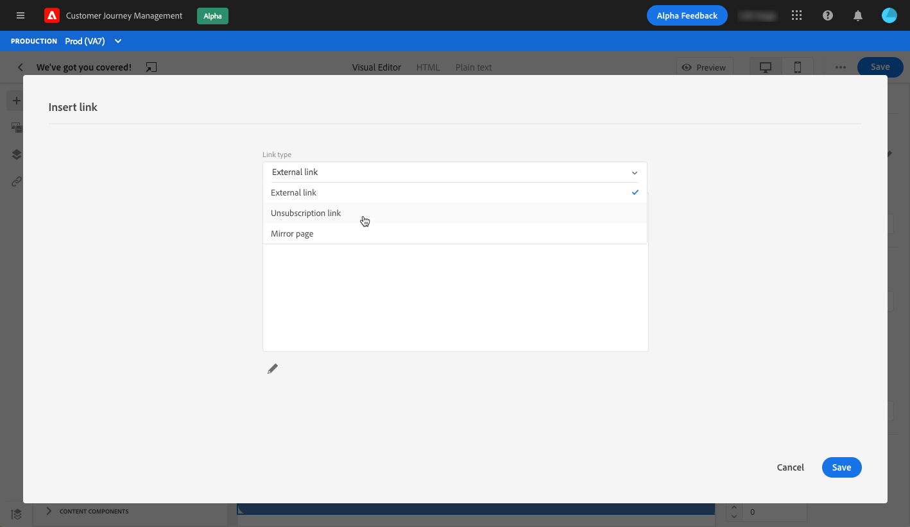

# 옵트아웃 관리 {#consent}


[!DNL Journey Optimizer] 을 사용하여 수신자의 커뮤니케이션 동의를 추적하고 수신자의 환경 설정 및 구독을 관리하여 자신이 브랜드에 참여하려는 방식을 파악합니다.<!--Their preferences and subscriptions are handled through Consent management.-->

데이터 주체의 정보를 사용하기 전에 특정 요구 사항을 준수해야 하는 GDPR 과 같은 규정입니다. 또한 데이터 주체는 언제든지 동의를 수정할 수 있어야 합니다.

**중요한 이유는 무엇입니까?**

* 이러한 규정을 준수하지 않으면 브랜드에 대한 규정 법적 위험이 발생합니다.
* 요청하지 않은 커뮤니케이션을 수신자에게 보내지 않도록 하는 데 도움이 되며, 수신자는 메시지를 스팸으로 표시하고 자신의 명성을 손상시킬 수 있습니다.

[Experience Platform 설명서](https://experienceleague.adobe.com/docs/experience-platform/privacy/home.html?lang=ko)에서 개인 정보 보호 및 해당 규정 관리에 대해 자세히 알아보십시오.

<!--* Recipients should be able to opt-in/opt-out from receiving electronic communication through one or more channel
* Recipients expect the brand to offer preference centre capability that controls how brand should engage with them (example: channel of communication, invasive and non-invasive tracking etc). This helps to fulfil regulatory obligations and also facilitates quality engagement with recipient. 
* The third category is the capability to offer subscription to recipients (newsletter, etc)-->

## 옵트아웃 관리 {#opt-out-management}

수신자가 브랜드로부터 커뮤니케이션 수신을 취소할 수 있는 기능을 제공하는 것은 법적 요구 사항입니다. [Experience Platform 설명서](https://experienceleague.adobe.com/docs/experience-platform/privacy/regulations/overview.html?lang=en#regulations)에서 해당 법률에 대해 자세히 알아보십시오.

따라서 수신자에게 보내는 모든 이메일에 항상 **가입 해지 링크**&#x200B;를 포함해야 합니다.
* 이 링크를 클릭하면 수신자가 옵트아웃을 확인하는 버튼이 포함된 랜딩 페이지로 이동됩니다.
* 옵트아웃 단추를 클릭하면 프로필 데이터를 이 정보로 업데이트하기 위한 Adobe I/O 호출이 수행됩니다. [](#consent-service-api)에 대해 자세히 알아보십시오 .

가입 해지 링크를 추가하려면 아래 단계를 따르십시오.

1. 구독 취소 랜딩 페이지를 작성합니다.
1. 선택한 타사 시스템에서 랜딩 페이지를 호스팅합니다.
1. [메시지를 ](../../help/using/create-message.md) 만듭니다  [!DNL Journey Optimizer].

   <!--The link to your landing page should contain a static URL and the profile ID.-->

1. 컨텐츠에서 텍스트를 선택하고 상황별 도구 모음을 사용하여 링크를 삽입합니다.

   

1. **[!UICONTROL Link type]** 드롭다운 목록에서 **[!UICONTROL Unsubscription link]** 을 선택합니다.

   

1. **[!UICONTROL Unsubscription page URL]** 프레임에서 링크를 랜딩 페이지에 복사합니다.

   

1. **[!UICONTROL Save]**&#x200B;을 클릭합니다.

1. 콘텐츠를 저장하고 [메시지를 게시합니다](../../help/using/publish-manage-message.md).

   >[!NOTE]
   >
   >타사 랜딩 페이지 URL에는 Adobe I/O 호출을 통해 프로필의 환경 설정을 업데이트하는 데 사용되는 3개의 매개 변수가 포함되어 &#x200B; 있습니다. [자세한 내용은 이 섹션](#consent-service-api)을 참조하십시오.

1. [여정](building-journeys/journey.md)를 통해 랜딩 페이지에 대한 링크가 포함된 메시지를 보냅니다.

1. 메시지가 수신되면 수신자가 가입 해지 링크를 클릭하면 랜딩 페이지가 표시됩니다.

   

1. 수신자가 랜딩 페이지(여기서는 **가입 해지** 단추)에서 옵트아웃 단추를 클릭하면 프로필 데이터가 [Adobe I/O 호출](#opt-out-api)을 통해 업데이트됩니다.

   그런 다음 옵트아웃 수신자는 옵트아웃이 성공했음을 나타내는 확인 메시지 화면으로 리디렉션됩니다.

   

   따라서 이 사용자는 다시 구독하지 않으면 브랜드로부터 커뮤니케이션을 받지 않습니다.

해당 프로필의 선택 사항이 업데이트되었는지 확인하려면 Experience Platform 로 이동하여 ID 네임스페이스와 해당 ID 값을 선택하여 프로필에 액세스합니다. 자세한 내용은 [Experience Platform 설명서](https://experienceleague.adobe.com/docs/experience-platform/profile/ui/user-guide.html?lang=en#getting-started)를 참조하십시오.


**[!UICONTROL Attributes]** 탭에서 **[!UICONTROL choice]**&#x200B;에 대한 값이 **[!UICONTROL no]**(으)로 변경되었음을 확인할 수 있습니다.

<!--The opt-out URL is resolved upon each recipient receiving the message. It is then personalized with the relevant encrypted parameters (profile ID, profile name, journey ID, sandbox ID, and message execution ID).-->

## 옵트아웃 API 호출 {#opt-out-api}

수신자가 가입 해지 링크를 클릭하여 옵트아웃하면, Adobe I/O API <!--Consent service API to capture the encrypted data and-->가 호출되어 해당 프로필의 기본 설정을 업데이트합니다.

이 Adobe I/O POST 호출은 다음과 같습니다.

끝점:cjm.adobe.io/imp/consent/preferences

쿼리 매개 변수:
* **매개 변수**:암호화된 페이로드를 포함합니다.
* **sig**:서명  <!--which signature?-->
* **pid**:암호화된 프로필 ID

이러한 매개 변수는 수신자에게 전송된 구독 취소 링크(예: 지정된 수신자에 대한 타사 랜딩 페이지를 여는 URL에서 사용할 수 있습니다.


<!--QUESTION: How do you get the URL built for each recipient? Do you have to wait until each targeted recipient receives the unsubscribe link or can you deduce it in advance? Is it done automatically upon the API call or do you have to do something manually for each profile? In other words will the LP automatically include the 3 parameters or do you have to insert something manually? Still not completely clear-->

헤더 요구 사항:
* x-api-key
* x-gw-ims-org-id
* x-sandbox-name
* 인증(기술 계정의 사용자 토큰) <!--How do you find this information? And other header elements?-->

요청 본문:

```
{
   "marketing": [
       {
            "type": "email",           
            "choice": "no",          
            "scope": "channel"       
        }
    ],
 
}
```

<!--The Consent service /-->[!DNL Journey Optimizer] will <!--decrypt and-->use these parameters to update the corresponding profile's choice. <!--and provide an answer back to the landing page.-->

## 푸시 옵트아웃 관리 {#push-opt-out-management}

푸시 수신자는 자체 장치를 통해 구독을 취소할 수 있습니다.

예를 들어 앱을 다운로드하거나 사용할 때 알림을 중지하도록 선택할 수 있습니다. 마찬가지로 모바일 운영 체제를 통해 알림 설정을 변경할 수 있습니다.
