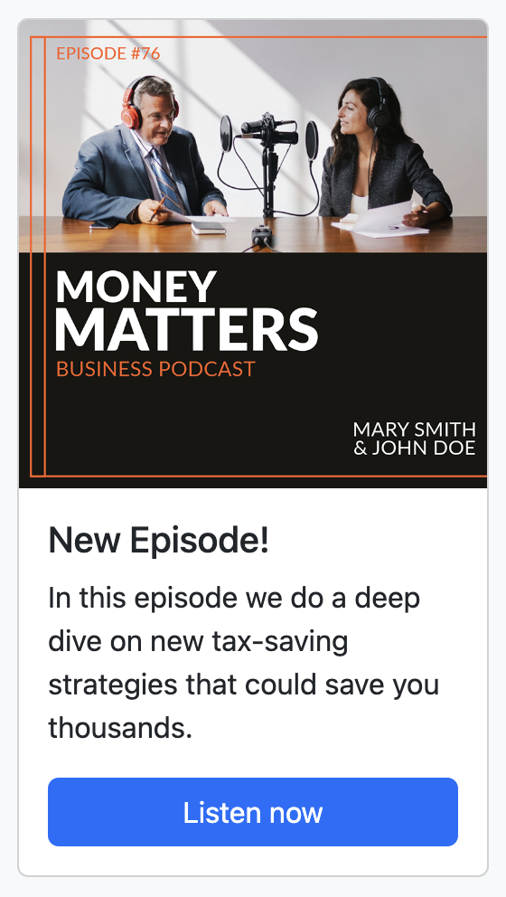

# Web SDK에서 콘텐츠 카드 지원 구성 {#content-card-configuration-sdk}

>[!AVAILABILITY]
>
>콘텐츠 카드는 현재 조직 집합(제한된 가용성)에만 사용할 수 있습니다. 자세한 내용은 Adobe 담당자에게 문의하십시오.

이 샘플은 Adobe Experience Platform을 사용하여 Adobe Journey Optimizer(AJO)에서 컨텐츠 카드를 검색하는 방법을 보여 줍니다. [Adobe Experience Platform Web SDK](https://experienceleague.adobe.com/en/docs/experience-platform/web-sdk/home)를 활용하여 개인화 콘텐츠를 가져와서 전적으로 클라이언트측에서 렌더링합니다.

초기 페이지 로드 시 페이지에 기본 상태가 표시됩니다. 그러나 **예금** 또는 **소셜 미디어에서 공유** 단추와 상호 작용하는 경우 추가 콘텐츠 카드가 나타납니다. 이러한 카드는 클라이언트측 조건에 의해 트리거되므로 특정 작업을 수행할 때만 표시됩니다.


## 샘플 실행 {#run-sample}

전제 조건: 노드 및 npm을 설치해야 합니다. [이 설명서를 참조하세요](https://docs.npmjs.com/downloading-and-installing-node-js-and-npm)

1. HTTPS에 대한 로컬 SSL 인증서를 설정합니다. 다음 샘플은 HTTPS를 통해 콘텐츠를 제공하기 위해 로컬로 서명된 SSL 인증서가 필요합니다.

   1. 컴퓨터에 `mkcert`을(를) 설치합니다.

   1. 설치 후 `mkcert -install`을(를) 실행하여 `mkcert root` 인증서를 설치합니다.

1. 로컬 컴퓨터에 저장소를 복제합니다.

1. 터미널을 열고 샘플 폴더로 이동합니다.

1. `npm install`을(를) 실행하여 필요한 종속성을 설치하십시오.

1. `npm start`을(를) 실행하여 응용 프로그램을 시작합니다.

1. 웹 브라우저를 열고 `https://localhost`(으)로 이동합니다.

## 작동 방식 {#setup}

1. 샘플 폴더에 있는 `.env` 파일의 설정을 사용하여 페이지에서 [Web SDK](https://experienceleague.adobe.com/en/docs/experience-platform/web-sdk/home)를 포함하고 구성하십시오.

   ```
   <script src="https://cdn1.adoberesources.net/alloy/2.18.0/alloy.min.js" async></script>
   alloy("configure", {
       defaultConsent: "in",
       edgeDomain: "{{edgeDomain}}",
       edgeConfigId: "{{edgeConfigId}}",
       orgId:"{{orgId}}",
       debugEnabled: false,
       personalizationStorageEnabled: true,
       thirdPartyCookiesEnabled: false
   });
   ```

1. `sendEvent` 명령을 사용하여 개인화된 콘텐츠를 가져옵니다.

   ```
   alloy("sendEvent", {
       renderDecisions: true,
       personalization: {
           surfaces: ["web://alloy-samples.adobe.com/#content-cards-sample"],
       },
   });
   ```

1. `subscribeRulesetItems` 명령을 사용하여 특정 표면에 대한 콘텐츠 카드를 구독합니다. 규칙 세트를 평가할 때마다 콘텐츠 카드 데이터가 있는 `propositions`을(를) 포함하는 콜백의 결과 개체를 처리합니다.

   ```
   const contentCardManager = createContentCardManager("content-cards");
   
   alloy("subscribeRulesetItems", {
       surfaces: ["web://alloy-samples.adobe.com/#content-cards-sample"],
       schemas: ["https://ns.adobe.com/personalization/message/content-card"],
       callback: (result, collectEvent) => {
           const { propositions = [] } = result;
           contentCardManager.refresh(propositions, collectEvent);
       },
   });
   ```

1. 콘텐츠 카드 렌더링을 관리하고 `script.js`에 있는 `contentCardsManager` 개체를 사용하여 `interact` 및 `display` 이벤트를 보냅니다. 수신된 제안에서 콘텐츠 카드를 추출, 정렬 및 처리합니다.

   ```
   const createContentCard = (proposition, item) => {
       const { data = {}, id } = item;
       const {
           content = {},
           meta = {},
           publishedDate,
           qualifiedDate,
           displayedDate,
       } = data;
   
       return {
           id,
           ...content,
           meta,
           qualifiedDate,
           displayedDate,
           publishedDate,
           getProposition: () => proposition,
       };
   };
   
   const extractContentCards = (propositions) =>
       propositions
           .reduce((allItems, proposition) => {
           const { items = [] } = proposition;
   
           return [
               ...allItems,
               ...items.map((item) => createContentCard(proposition, item)),
           ];
       }, [])
       .sort(
           (a, b) =>
               b.qualifiedDate - a.qualifiedDate || b.publishedDate - a.publishedDate
       );
   
   const contentCards = extractContentCards(propositions);
   ```

1. 각 캠페인에 대해 정의된 세부 사항을 기반으로 콘텐츠 카드를 렌더링합니다. 각 카드에는 `title`, `body`, `imageUrl` 및 기타 사용자 지정 데이터 값이 포함되어 있습니다.

   ```
   const renderContentCards = () => {
       const contentCardsContainer = document.getElementById(containerElementId);
       contentCardsContainer.addEventListener("click", handleContentCardClick);
   
       let contents = "";
   
       contentCards.forEach((card) => {
           const { id, title, body, imageUrl, meta = {} } = card;
           const { buttonLabel = "" } = meta;
   
           contents += `
               <div class="col">
                   <div data-id="${id}" class="card h-100">
                       
                       <div class="card-body d-flex flex-column">
                           <h5 class="card-title">${title}</h5>
                           <p class="card-text">${body}</p>
                           <a href="#" class="mt-auto btn btn-primary">${buttonLabel}</a>
                       </div>
                   </div>
                </div>
            `;
       });
   
       contentCardsContainer.innerHTML = contents;
       collectEvent(
           "display",
           contentCards.map((card) => card.getProposition())
        );
   };
   ```

1. `subscribeRulesetItems` 콜백이 호출되면 `collectEvent`(이)라는 편의 함수도 제공됩니다. 이 함수는 상호 작용, 디스플레이 및 기타 사용자 작업을 추적하기 위해 Experience Edge 이벤트를 전송하는 데 사용합니다. 이 샘플에서 collectEvent 는 콘텐츠 카드를 클릭할 때 추적합니다. 또한 콘텐츠 카드의 단추를 클릭하면 브라우저가 캠페인에서 지정한 `actionUrl`(으)로 이동합니다.

   ```
   const handleContentCardClick = (evt) => {
       const cardEl = evt.target.closest(".card");
   
       if (!cardEl) {
           return;
       }
   
       const isAnchor = evt.target.nodeName === "A";
       const card = contentCards.find((card) => card.id === cardEl.dataset.id);
   
       if (!card) {
           return;
       }
   
       collectEvent("interact", [card.getProposition()]);
   
       if (isAnchor) {
           evt.preventDefault();
           evt.stopImmediatePropagation();
           const { actionUrl } = card;
           if (actionUrl && actionUrl.length > 0) {
               window.location.href = actionUrl;
           }
       }
   };
   ```

## 주요 관찰 {#key-observations}

### personalizationStorageEnabled

`configure` 명령에서 `personalizationStorageEnabled` 옵션이 `true`(으)로 설정되어 있습니다. 이렇게 하면 이전 자격을 갖춘 콘텐츠 카드가 저장되고 사용자 세션 간에 계속 표시됩니다.

### 트리거

콘텐츠 카드는 클라이언트측에서 평가되는 사용자 지정 트리거를 지원합니다. 트리거 규칙이 충족되면 추가 콘텐츠 카드가 표시됩니다. 이 샘플은 각 콘텐츠 카드에 대해 하나씩, 동일한 표면을 공유하는 네 개의 서로 다른 캠페인을 사용합니다. `web://alloy-samples.adobe.com/#content-cards-sample`. 아래 표는 각 캠페인에 대한 트리거 규칙과 이를 충족하는 방법을 간략하게 설명합니다.

<table>
    <tr>
        <th>트리거 규칙</th>
        <th>카드</th>
        <th>트리거 규칙을 충족하는 방법</th>
    </tr>
    <tr>
        <td>None</td>
        <td></td>
        <td>sendEvent 명령. 충족시킬 클라이언트측 규칙이 없습니다.</td>
    </tr>
    <tr>
        <td>None</td>
        <td></td>
        <td>sendEvent 명령. 충족시킬 클라이언트측 규칙이 없습니다.</td>
    </tr>
    <tr>
        <td></td>
        <td></td>
        <td></td>
    </tr>
    <tr>
        <td></td>
        <td></td>
        <td></td>
    </tr>
</table>

`evaluateRulesets` 명령은 &quot;기금 예금&quot; 및 &quot;소셜 미디어에서 공유&quot; 단추를 클릭할 때 트리거됩니다. 각 단추는 각 캠페인에 대해 정의된 규칙을 충족하도록 관련 `decisionContext`을(를) 지정합니다.

```
document.getElementById("action-button-1").addEventListener("click", () => {
    alloy("evaluateRulesets", {
        renderDecisions: true,
        personalization: {
            decisionContext: {
                action: "deposit-funds",
            },
        },
    });
});

document.getElementById("action-button-2").addEventListener("click", () => {
    alloy("evaluateRulesets", {
        renderDecisions: true,
        personalization: {
            decisionContext: {
                action: "social-media",
            },
        },
    });
});
```
