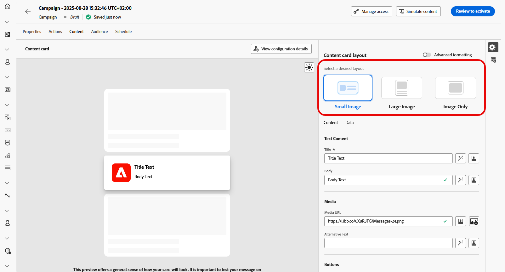
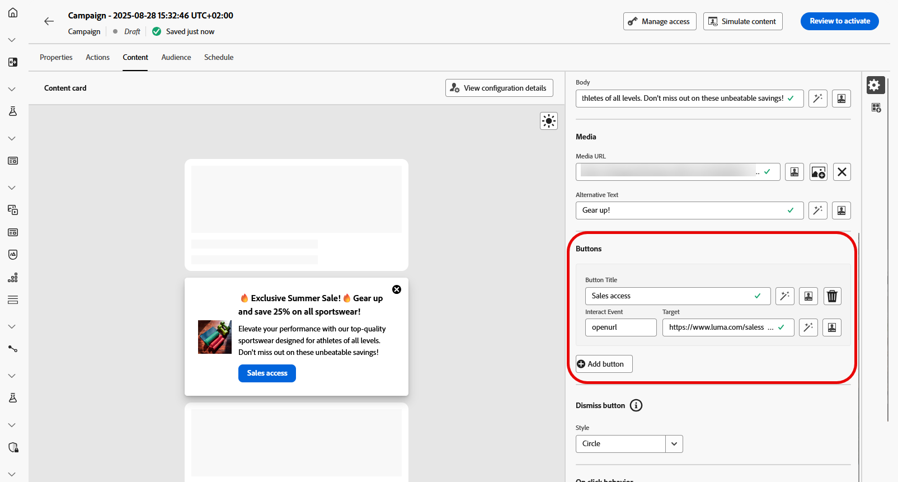

# 콘텐츠 카드 콘텐츠 디자인 {#design-content-card}

카드용 작성 구문은 개발자가 렌더링할 수 있는 기본 입력을 마케터에게 제공하는 양식 기반 작성 경험을 제공합니다.

콘텐츠를 정의하고 개인화하면 검토하고 활성화할 수 있습니다. 캠페인은 정해진 일정에 따라 전송됩니다. [이 페이지에서 자세히 알아보기](../campaigns/review-activate-campaign.md).

## 컨텐츠 카드 레이아웃

**[!UICONTROL 콘텐츠 카드 레이아웃]** 섹션에서 메시징 요구 사항에 따라 세 가지 이미지 레이아웃 옵션 중 하나를 선택합니다.

* **[!UICONTROL 작은 이미지]**: 텍스트와 함께 컴팩트한 이미지를 표시하며 시각 이미지보다 콘텐츠가 우선시되는 메시지에 적합합니다.

  자세한 내용은 Adobe Developer 설명서 [iOS용](https://developer.adobe.com/client-sdks/edge/adobe-journey-optimizer/content-card-ui/iOS/templates/smallimage-template/) 및 [Android용](https://developer.adobe.com/client-sdks/edge/adobe-journey-optimizer/content-card-ui/Android/public-classes/state/smallimagecarduistate/)을 참조하세요.

* **[!UICONTROL 큰 이미지]**: 텍스트 위나 옆에 눈에 띄는 이미지를 사용하여 시각적 개체를 메시지의 주요 초점으로 만듭니다.

  자세한 내용은 Adobe Developer 설명서 [iOS용](https://developer.adobe.com/client-sdks/edge/adobe-journey-optimizer/content-card-ui/iOS/templates/largeimage-template/) 및 [Android용](https://developer.adobe.com/client-sdks/edge/adobe-journey-optimizer/content-card-ui/Android/public-classes/state/largeimagecarduistate/)을 참조하세요.

* **[!UICONTROL 이미지만]**: 텍스트 없이 이미지를 표시하며, 비주얼 기반 메시지나 독립 실행형 이미지에 적합합니다.

  자세한 내용은 Adobe Developer 설명서 [iOS용](https://developer.adobe.com/client-sdks/edge/adobe-journey-optimizer/content-card-ui/iOS/templates/imageonly-template/) 및 [Android용](https://developer.adobe.com/client-sdks/edge/adobe-journey-optimizer/content-card-ui/Android/public-classes/state/imageonlycarduistate/)을 참조하세요.

## 컨텐츠 탭 {#content-tab}

**[!UICONTROL 콘텐츠]** 탭에서 콘텐츠를 정의하고 이 탭에서 직접 미디어 및 작업 단추를 추가하여 콘텐츠 카드를 사용자 지정할 수 있습니다.

### 텍스트 컨텐츠 {#title-body}

메시지를 작성하려면 **[!UICONTROL 제목]** 및 **[!UICONTROL 본문]** 필드에 텍스트를 입력하십시오.

메시지를 추가로 맞춤화하려면 **[!UICONTROL Personalization]** 아이콘을 사용하여 개인화된 요소를 추가하십시오. 개인화 기능을 사용하는 방법에 대한 자세한 지침은 [이 섹션](../personalization/personalize.md)을 참조하세요.

### 미디어 {#add-media}

**[!UICONTROL 미디어]** 필드를 사용하면 미디어를 추가하여 콘텐츠 카드를 향상시킬 수 있습니다. 이렇게 하면 최종 사용자의 프레젠테이션 참여도가 높아집니다.

미디어를 포함하려면 사용할 미디어의 URL을 입력하거나 **[!UICONTROL Assets 선택]** 아이콘을 클릭하여 Assets 라이브러리에 저장된 에셋 중에서 선택합니다. [자산 관리에 대해 자세히 알아보세요](../integrations/assets.md).

+++고급 서식의 추가 옵션

**[!UICONTROL 고급 서식 모드]**&#x200B;가 켜져 있으면 **[!UICONTROL 어두운 모드 미디어 URL]** 필드에 화면 읽기 응용 프로그램 및 다른 에셋에 대해 **[!UICONTROL 대체 텍스트]**&#x200B;를 추가할 수 있습니다.

+++

### 버튼 {#add-buttons}

사용자가 콘텐츠 카드와 상호 작용할 수 있는 단추를 추가합니다.

1. 새 작업 단추를 만들려면 **[!UICONTROL 추가 단추]**&#x200B;를 클릭하십시오.

1. 단추에 표시할 레이블을 지정하려면 단추 **[!UICONTROL 제목]** 필드를 편집하십시오.

1. **[!UICONTROL Interact 이벤트]**&#x200B;를 선택하여 사용자가 단추를 클릭하거나 단추와 상호 작용할 때 트리거될 작업을 정의합니다.

1. 버튼과 상호 작용한 후 사용자가 이동할 웹 URL 또는 딥 링크를 **[!UICONTROL Target]** 필드에 입력합니다.

<!--
+++More options with advanced formatting

If the **[!UICONTROL Advanced formatting mode]** is switched on, you can choose for your **[!UICONTROL Buttons]**:

* the **[!UICONTROL Font]**
* the **[!UICONTROL Pt size]**
* the **[!UICONTROL Font Color]**
* the **[!UICONTROL Alignment]**

+++
-->

### 닫기 단추 {#close-button}

**[!UICONTROL 취소 단추]**&#x200B;의 **[!UICONTROL 스타일]**&#x200B;을(를) 선택하여 모양을 사용자 지정합니다.

다음 스타일 중에서 선택할 수 있습니다.

* **[!UICONTROL 없음]**
* **[!UICONTROL 단순]**
* **[!UICONTROL 원]**

<!--
+++More options with advanced formatting

If the **[!UICONTROL Advanced formatting mode]** is switched on, you can choose for your **[!UICONTROL Header]** and **[!UICONTROL Body]**:

* the **[!UICONTROL Font]**
* the **[!UICONTROL Pt size]**
* the **[!UICONTROL Font Color]**
* the **[!UICONTROL Alignment]**
+++
-->

### 클릭 시 비헤이비어

**[!UICONTROL 대상 URL]** 필드에 사용자가 콘텐츠 카드와 상호 작용한 후 원하는 대상으로 안내하는 웹 URL 또는 딥 링크를 입력합니다. 외부 웹 사이트, 앱 내의 특정 페이지 또는 상호 작용에 따라 사용자를 이동시키고자 하는 기타 모든 위치일 수 있습니다.

## 데이터 탭

## 사용자 정의 데이터 {#custom-data}

**[!UICONTROL 사용자 지정 데이터]** 섹션에서 **[!UICONTROL 키/값 쌍 추가]**&#x200B;를 클릭하여 페이로드에 사용자 지정 변수를 포함하십시오. 이러한 키/값 쌍을 사용하면 특정 구성에 따라 추가 데이터를 전달할 수 있습니다. 이렇게 하면 개인화된 콘텐츠 또는 다이내믹 콘텐츠, 추적 정보 또는 설정과 관련된 기타 데이터를 추가할 수 있습니다.
