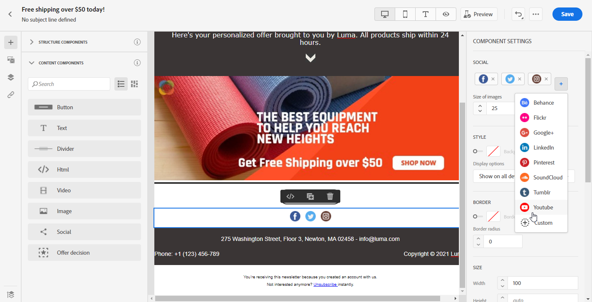

# 이메일 디자이너 콘텐츠 구성 요소 {#content-components} 사용

>[!CONTEXTUALHELP]
>id="ac_content_components"
>title="컨텐츠 구성 요소 정보"
>abstract="컨텐츠 구성 요소는 전자 메일의 레이아웃을 만드는 데 사용할 수 있는 빈 컨텐츠 자리 표시자입니다."

이메일 컨텐츠를 처음부터 만들 때, **[!UICONTROL Content components]**을 사용하면 이메일에 한 번 게시된 후 사용할 수 있는 빈 원시 구성 요소를 사용하여 이메일을 더 개인화할 수 있습니다.
이메일의 레이아웃을 정의하는 **[!UICONTROL Structure component]** 내에 필요한 만큼 **[!UICONTROL Content components]**&#x200B;을 추가할 수 있습니다.

## 단추 {#buttons}

**[!UICONTROL Button]** 구성 요소를 사용하여 이메일에 여러 개의 단추를 삽입하고 이메일 대상을 다른 페이지로 리디렉션합니다.

1. **[!UICONTROL Content components]**&#x200B;에서 **[!UICONTROL Structure component]**&#x200B;에 **[!UICONTROL Button]**&#x200B;을(를) 드래그하여 놓습니다.

   

1. 새로 추가한 단추를 클릭하여 텍스트를 개인화하고 이메일 디자이너의 오른쪽 창에 있는 **[!UICONTROL Components Settings]**&#x200B;에 액세스할 수 있습니다.

   

1. **[!UICONTROL Components Settings]**&#x200B;의 **[!UICONTROL Link]** 필드에서 단추를 클릭할 때 대상을 리디렉션할 URL을 추가합니다.

1. **[!UICONTROL Target]** 드롭다운으로 대상을 리디렉션하는 방법을 선택합니다.

   * **[!UICONTROL None]**:클릭한 것과 동일한 프레임에 있는 링크를 엽니다(기본값).
   * **[!UICONTROL Blank]**:새 창 또는 탭에서 링크를 엽니다.
   * **[!UICONTROL Self]**:클릭한 프레임과 동일한 프레임에 있는 링크를 엽니다.
   * **[!UICONTROL Parent]**:부모 프레임에 링크를 엽니다.
   * **[!UICONTROL Top]**:창의 전체 본문에 링크를 엽니다.

   

1. 예를 들어 **[!UICONTROL Style]**, **[!UICONTROL Margin]** 및 **[!UICONTROL Border]**&#x200B;를 변경하여 버튼을 추가로 개인화할 수 있습니다.

## 텍스트 {#text}

**[!UICONTROL Text]** 구성 요소를 사용하여 이메일에 텍스트를 삽입합니다. **[!UICONTROL Component Settings]**&#x200B;에서 텍스트의 색상, 스타일 및 크기를 조정할 수 있습니다.

1. **[!UICONTROL Content Components]**&#x200B;에서 **[!UICONTROL Structure component]**&#x200B;에 **[!UICONTROL Text]**&#x200B;을(를) 드래그하여 놓습니다.

   

1. 새로 추가된 구성 요소를 클릭하여 텍스트를 개인화하고 이메일 디자이너의 오른쪽 창에 있는 **[!UICONTROL Components Settings]**&#x200B;에 액세스할 수 있습니다.

1. 도구 모음에서 사용할 수 있는 다음 옵션을 사용하여 텍스트를 변경합니다.

   

   * **[!UICONTROL Change text style]**:텍스트에 굵게, 기울임체, 밑줄 또는 취소선을 적용합니다.
   * **정렬 변경**:텍스트의 왼쪽, 오른쪽, 가운데 또는 양쪽 정렬 중에서 선택할 수 있습니다.
   * **[!UICONTROL Create list]**:텍스트에 글머리 기호 또는 번호 목록을 추가합니다.
   * **[!UICONTROL Set heading]**:텍스트에 최대 6개의 머리글 레벨을 추가할 수 있습니다.
   * **글꼴 크기**:텍스트의 글꼴 크기를 픽셀 단위로 선택합니다.
   * **[!UICONTROL Edit image]**:텍스트 구성 요소에 이미지나 자산을 추가합니다. [자산 관리에 대한 자세한 내용을 살펴보십시오](assets-essentials.md).
   * **[!UICONTROL Show the source code]**:텍스트의 소스 코드를 표시합니다. 수정할 수 없습니다.
   * **[!UICONTROL Duplicate]**:텍스트 구성 요소의 사본을 추가합니다.
   * **[!UICONTROL Delete]**:이메일에서 선택한 텍스트 구성 요소를 삭제합니다.
   * **[!UICONTROL Add personalization]**:개인화 필드를 추가하여 프로필 데이터의 컨텐츠를 사용자 정의합니다. [콘텐츠 개인화에 대한 자세한 내용을 살펴보십시오](personalization/personalize.md).

1. 더 나은 사용자 경험을 위해 개인화 필드를 추가하여 고객을 타겟팅할 수 있습니다. 자세한 정보는 이 [섹션](personalization/personalize.md)을 참조하십시오.

1. **[!UICONTROL Components Settings]**&#x200B;에서 **[!UICONTROL Text color]**, **[!UICONTROL Font family]** 및 **[!UICONTROL Size]**&#x200B;를 조정합니다.

   

## 분할선 {#divider}

**[!UICONTROL Divider]** 구성 요소를 사용하여 이메일의 레이아웃과 컨텐츠를 구성할 나누기 행을 삽입합니다.
**[!UICONTROL Component Settings]**&#x200B;에서 줄바꿈 줄의 색상, 스타일 및 크기를 선택할 수 있습니다.

## HTML {#HTML}

기존 HTML의 다른 부분을 복사하여 붙여넣으려면 **[!UICONTROL HTML]**&#x200B;을 사용합니다. 이렇게 하면 무료로 모듈화된 HTML 구성 요소를 만들 수 있습니다.

간단하게 이메일 디자이너와 호환되는 외부 컨텐츠를 만들려면 Adobe은 메시지를 처음부터 만들고 기존 이메일의 내용을 구성 요소로 복사하는 것이 좋습니다.

1. **[!UICONTROL Content Components]**&#x200B;에서 **[!UICONTROL Structure component]**&#x200B;에 **[!UICONTROL HTML]**&#x200B;을(를) 드래그하여 놓습니다.

   

1. 새로 추가한 구성 요소를 클릭한 다음 **[!UICONTROL Show the source code]**&#x200B;을 클릭하여 HTML을 추가합니다.

   

1. 이메일에 추가할 HTML 코드를 복사하여 붙여 넣고 **[!UICONTROL Save]**&#x200B;을 클릭합니다.

   

1. 예를 들어 **[!UICONTROL Style]**, **[!UICONTROL Margin]** 및 **[!UICONTROL Border]**&#x200B;를 변경하거나 다른 컨텐츠로 고객을 리디렉션할 링크를 추가하여 HTML을 더욱 개인화할 수 있습니다.

## 이미지 {#image}

**[!UICONTROL Image]** 구성 요소를 사용하여 컴퓨터의 이미지 파일을 이메일에 삽입합니다.

1. **[!UICONTROL Content Components]**&#x200B;에서 **[!UICONTROL Structure component]**&#x200B;에 **[!UICONTROL Image]**&#x200B;을(를) 드래그하여 놓습니다.

   

1. **[!UICONTROL Browse]**&#x200B;을 클릭하여 컴퓨터에서 이미지 파일을 선택합니다.

   **[!UICONTROL Asset Picker]**&#x200B;을 클릭하여 이메일에 자산을 추가할 수도 있습니다. 자산에 대한 자세한 내용은 이 [섹션](assets-essentials.md)을 참조하십시오.

1. 새로 추가된 구성 요소를 클릭하여 **[!UICONTROL Content Components]** 구성을 시작하고 이메일 디자이너의 오른쪽 창에서 **[!UICONTROL Components Settings]**&#x200B;에 액세스할 수 있습니다.

1. 이미지 속성을 설정합니다.

   * **[!UICONTROL Image Title]** 이미지에 제목을 정의할 수 있습니다.
   * **[!UICONTROL Alt text]** 이미지에 연결된 캡션을 정의할 수 있습니다. 이것은 대체 HTML 속성에 해당합니다.

   

1. 예를 들어 **[!UICONTROL Style]**, **[!UICONTROL Margin]** 및 **[!UICONTROL Border]**&#x200B;를 변경하거나 다른 컨텐츠로 고객을 리디렉션할 링크를 추가하여 이미지를 더욱 개인화할 수 있습니다.

## 비디오 {#Video}

>[!CONTEXTUALHELP]
>id="ac_edition_video"
>title="비디오 설정"
>abstract="이 구성 요소를 사용하여 이메일에 비디오를 삽입합니다. 일부 이메일 클라이언트에서 비디오가 작동하지 않습니다. 대체 이미지를 설정하는 것이 좋습니다."
>additional-url="https://www.emailonacid.com/blog/article/email-development/a_how_to_guide_to_embedding_html5_video_in_email/" text="추가 정보"

**[!UICONTROL Video]** 구성 요소를 사용하여 URL 링크를 통해 이메일에 비디오를 삽입합니다.

1. **[!UICONTROL Content Components]**&#x200B;에서 **[!UICONTROL Structure component]**&#x200B;에 **[!UICONTROL Video]**&#x200B;을(를) 드래그하여 놓습니다.

   

1. 새로 추가된 구성 요소를 클릭하여 **[!UICONTROL Content Components]** 구성을 시작하고 이메일 디자이너의 오른쪽 창에서 **[!UICONTROL Components Settings]**&#x200B;에 액세스할 수 있습니다.

1. **[!UICONTROL Components Settings]**&#x200B;의 **[!UICONTROL Video link]** 필드에서 비디오 URL을 추가합니다.

   

1. 사용자가 재생 단추를 클릭할 때까지 비디오에 **[!UICONTROL Poster image]**&#x200B;을 추가하여 표시할 이미지를 지정할 수 있습니다.

1. 이제 예를 들어 **[!UICONTROL Style]**, **[!UICONTROL Margin]** 및 **[!UICONTROL Border]**&#x200B;를 변경하여 이미지를 추가로 개인화할 수 있습니다.

## Social {#social}

**[!UICONTROL Social]** 구성 요소를 사용하여 이메일에 소셜 미디어 페이지에 대한 링크를 삽입합니다.

1. **[!UICONTROL Content Components]**&#x200B;에서 **[!UICONTROL Structure component]**&#x200B;에 **[!UICONTROL Social]**&#x200B;을(를) 드래그하여 놓습니다.

   

1. 새로 추가된 구성 요소를 클릭하여 **[!UICONTROL Content Components]** 구성을 시작하고 이메일 디자이너의 오른쪽 창에서 **[!UICONTROL Components Settings]**&#x200B;에 액세스할 수 있습니다.

1. **[!UICONTROL Components Settings]**&#x200B;의 **[!UICONTROL Social]** 필드에서 추가하거나 제거할 소셜 미디어를 선택합니다.

   

1. **[!UICONTROL Size of images]** 필드에서 아이콘 크기를 선택합니다.

1. 각 소셜 미디어 아이콘을 클릭하여 대상이 리디렉션될 **[!UICONTROL URL]**&#x200B;을 구성합니다.

   

1. **[!UICONTROL Image]** 필드에 필요한 경우 각 소셜 미디어의 아이콘을 변경할 수도 있습니다.

1. 이제 **[!UICONTROL Style]**, **[!UICONTROL Margin]** 및 **[!UICONTROL Border]**&#x200B;을(를) 변경하여 소셜 미디어 아이콘을 더 개인화할 수 있습니다.

## 오퍼 결정 {#offer-decision}

**[!UICONTROL Offer decision]** 구성 요소를 사용하여 의사 결정(이전의 오퍼 활동이라고 함)을 메시지에 삽입합니다. 의사 결정 관리 솔루션을 활용하여 고객에게 최적의 제안을 제안합니다.

관련 항목:

* [의사 결정 관리를 시작합니다](offers/get-started/starting-offer-decisioning.md).
* [메시지에 개인화된 제안](deliver-personalized-offers.md) 추가

