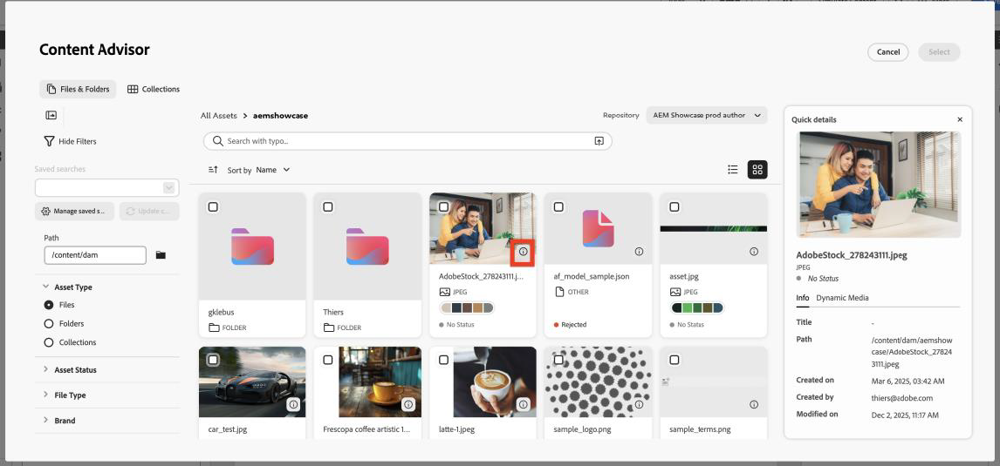
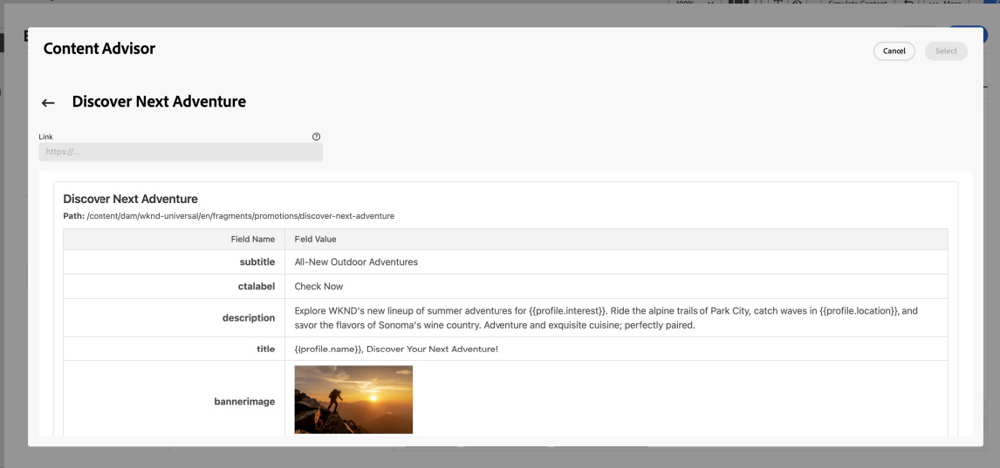
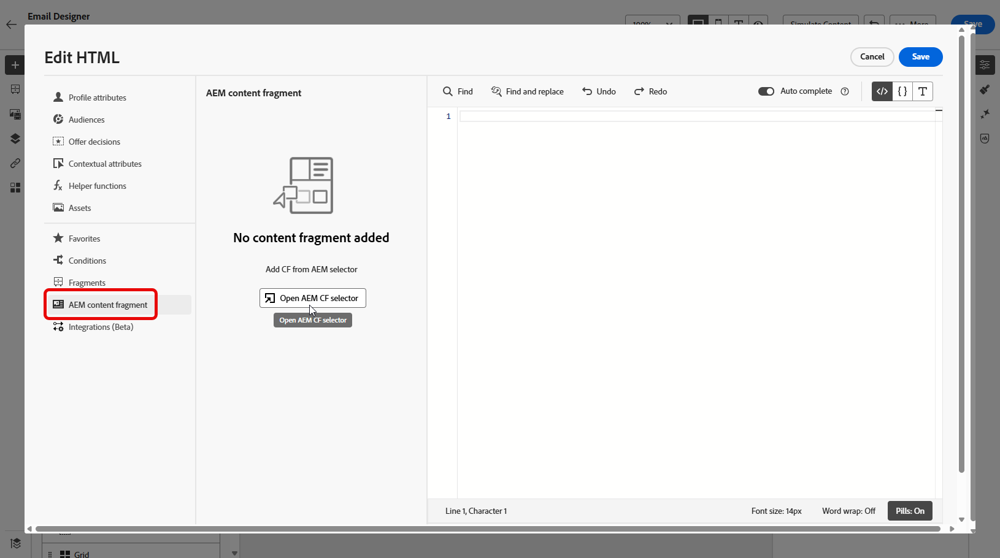

# Adobe Experience Manager Content Advisor 작업 {#aem-content-advisor}

>[!AVAILABILITY]
>
>Adobe Experience Manager 컨텐츠 관리자는 채널 작성 워크플로우에서만 사용할 수 있습니다.

Adobe Experience Manager Content Advisor는 결정론적 검색을 통합 환경에서 표준화된 의도 중심의 검색으로 대체합니다. Journey Optimizer 작성 워크플로 내에서 Assets 및 콘텐츠 조각을 AI가 지원하는 통합 검색으로 바로 검색할 수 있어 마케터의 생산성과 캠페인 효율성이 향상됩니다.

## 사용 가능한 기능

### Assets용 {#asset-features}

Adobe Experience Manager Content Advisor는 다음과 같은 에셋 기능을 제공합니다.

+++ AI 의미 체계 검색

정확한 키워드나 파일 이름 대신 자연어를 사용하여 에셋을 검색합니다. &quot;산속의 커피&quot;와 같이 평이한 언어로 필요한 것을 기술하면 AI가 텍스트만 일치하는 것이 아니라 의미와 콘텐츠를 기반으로 맥락적으로 관련 있는 에셋을 찾아낸다.

{zoomable="yes"}

+++

+++ 최근 검색 기록

최근 검색에 액세스하여 키워드 및 컨텍스트를 신속하게 재사용할 수 있습니다. 이렇게 하면 유사한 캠페인을 작업할 때 또는 이전 검색을 세분화해야 할 때 시간을 절약할 수 있습니다.

{zoomable="yes"}

+++ 

+++ 개요 업로드

마케팅 개요 문서를 업로드하여 캠페인 컨텍스트에 맞는 에셋을 자동으로 표시합니다. AI가 귀하의 개요를 분석하고 문서에 설명된 내용과 요구 사항을 기반으로 관련 에셋을 제안합니다.

{zoomable="yes"}

+++

+++ 자산 정보 패널

**정보** 아이콘을 사용하여 에셋에 대한 자세한 메타데이터 및 속성을 봅니다. 여기에는 정보에 입각한 결정을 내리는 데 도움이 되는 에셋 차원, 파일 크기, 생성일, 태그 및 기타 관련 정보가 포함됩니다.

{zoomable="yes"}

+++

+++ Dynamic Media 패널

저장소 구성을 기반으로 동적 렌디션, 스마트 자르기 및 즉시 수정 사항에 액세스할 수 있습니다.

{zoomable="yes"}

Dynamic Media 패널은 동적 렌디션, 스마트 자르기 및 즉시 수정 사항에 대한 액세스를 제공합니다. 패널에 직접 수정자를 입력하여 사용자 지정 변환을 만들 수 있습니다.

**가용성**

Dynamic Media 사용 가능 여부는 저장소 구성에 따라 다릅니다.

* **Scene7**: 게시된 자산에 사용할 수 있습니다(비디오 및 PDF 제외). [Dynamic Media Scene7 수정자에 대해 자세히 알아보기](https://experienceleague.adobe.com/docs/dynamic-media-developer-resources/image-serving-api/image-serving-api/http-protocol-reference/command-reference/r-is-http-modifiers.html){target="_blank"}

* **OpenAPI**: 승인된 자산에 사용할 수 있습니다(비디오 제외). [OpenAPI 수정자가 있는 Dynamic Media에 대해 자세히 알아보기](https://experienceleague.adobe.com/docs/experience-manager-cloud-service/content/assets/dynamicmedia/image-profiles.html){target="_blank"}

* **Scene7 및 OpenAPI**: 구성이 모두 있고 자산이 조건을 충족하면 사용할 수 있습니다.

**스택 선택**

표시되는 단추는 저장소 구성에 따라 다릅니다.

* **Scene7 단추만**: 저장소에 Scene7 구성이 있으며 자산이 Dynamic Media에 게시되었습니다.
* **OpenAPI 단추만**: 저장소에 OpenAPI 구성이 있으며 자산이 승인되었습니다.
* **두 단추**: 저장소에 구성이 있고 자산이 게시되고 승인되었습니다.
+++

### 컨텐츠 조각용 {#content-fragment-features}

Adobe Experience Manager Content Advisor는 다음과 같은 콘텐츠 조각 기능을 제공합니다.

+++ 템플릿 보기 목록 

썸네일 및 테이블 보기 간에 전환하여 워크플로에 가장 적합한 형식의 콘텐츠 조각을 찾아봅니다. 축소판 보기는 시각적 컨텍스트를 제공하는 반면 표 보기는 구조화된 형식으로 자세한 정보를 표시합니다.

{zoomable="yes"}

+++

+++ 정보 패널 

조각 변형, 속성 및 **[!UICONTROL 참조자]**&#x200B;의 세부 정보를 표시하는 오른쪽 패널을 열려면 **[!UICONTROL 정보]** 아이콘을 클릭하십시오. **[!UICONTROL 참조자]** 섹션에는 조각이 사용되는 모든 Adobe Experience Manager 엔터티가 표시되며, Adobe Experience Manager에서 직접 이러한 참조를 볼 수 있는 링크도 있습니다.

{zoomable="yes"}

+++

+++ Adobe Experience Manager에서 열기

제목 옆에 있는 아이콘을 사용하여 편집할 컨텐츠 조각을 Adobe Experience Manager에서 바로 열 수 있습니다. 이 매끄러운 통합을 통해 컨텍스트를 손실하지 않고 Journey Optimizer과 Adobe Experience Manager 간을 전환할 수 있습니다.

{zoomable="yes"}

+++

+++ JSON 미리보기

깔끔하고 정리된 표 형식으로 콘텐츠 조각의 JSON 구조를 미리 봅니다. 이렇게 하면 캠페인에서 사용하기 전에 조각의 데이터 구조를 이해하고 콘텐츠를 확인하는 데 도움이 됩니다.

{zoomable="yes"}

+++

## Adobe Experience Manager Content Advisor 액세스 {#access}

Journey Optimizer에서 Adobe Experience Manager Content Advisor에 액세스하려면 다음 단계를 수행하십시오.

1. Adobe Journey Optimizer에서 캠페인을 만들고 채널 작업(예: 이메일)을 추가합니다.

1. **[!UICONTROL 콘텐츠 편집]**&#x200B;을 클릭한 다음 **[!UICONTROL 전자 메일 본문 편집]**&#x200B;을 클릭하여 콘텐츠 편집기를 엽니다.

1. HTML 또는 텍스트 구성 요소를 이메일 콘텐츠로 드래그하여 놓습니다.

1. 구성 요소 위로 마우스를 가져간 후 **[!UICONTROL 소스 코드 표시]**(HTML 구성 요소의 경우) 또는 **[!UICONTROL Personalization 추가]**(텍스트 구성 요소의 경우)를 클릭합니다.

1. Personalization 편집기에서 컨텐츠 진입점을 선택합니다.

   * 에셋을 추가하려면 **[!UICONTROL Assets]**&#x200B;을 클릭한 다음 **[!UICONTROL AEM Content Advisor 열기]**&#x200B;를 클릭합니다.

     {zoomable="yes"}

   * Adobe Experience Manager 컨텐츠 조각을 추가하려면 **[!UICONTROL AEM 컨텐츠 조각]**&#x200B;을 클릭한 다음 **[!UICONTROL AEM 컨텐츠 관리자 열기]**&#x200B;를 클릭합니다.

     {zoomable="yes"}

1. Adobe Experience Manager 저장소를 선택합니다.

   {zoomable="yes"}

1. 사용할 에셋 또는 콘텐츠 조각을 찾아 선택한 다음 콘텐츠에 삽입합니다.
