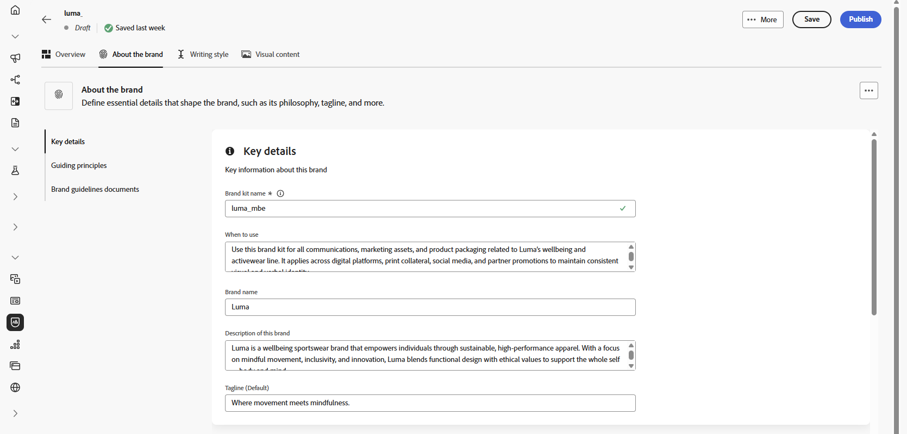

# 브랜드 개인화 {#brands-personalize}

## 브랜드 정보 {#about-brand}

**[!UICONTROL 브랜드 정보]** 탭을 사용하여 브랜드의 목적, 성격, 태그 및 기타 정의 특성에 대한 개요를 포함하여 브랜드의 핵심 정체성을 설정하십시오.

1. 먼저 **[!UICONTROL 주요 세부 정보]** 카테고리에 브랜드의 기본 정보를 입력하십시오.

   * **[!UICONTROL 브랜드 키트 이름]**: 브랜드 키트 이름을 입력하십시오.

   * **[!UICONTROL 사용 시기]**: 이 브랜드 키트를 적용해야 하는 시나리오 또는 컨텍스트를 지정합니다.

   * **[!UICONTROL 브랜드 이름]**: 공식 브랜드 이름을 입력하십시오.

   * **[!UICONTROL 브랜드 설명]**: 이 브랜드가 나타내는 내용에 대한 개요를 제공합니다.

   * **[!UICONTROL 기본 태그 지정]**: 브랜드와 연결된 기본 태그 지정을 추가합니다.

     

1. **[!UICONTROL 지침 원칙]** 범주에서 브랜드의 핵심 방향과 철학을 명확히 합니다.

   * **[!UICONTROL 작업]**: 브랜드 용도를 자세히 설명합니다.

   * **[!UICONTROL 비전]**: 장기 목표 또는 원하는 미래 상태에 대해 설명합니다.

   * **[!UICONTROL 시장 포지셔닝]**: 브랜드가 시장에서 어떻게 포지셔닝되고 있는지 설명합니다.

     

1. **[!UICONTROL 핵심 브랜드 값]** 카테고리에서 를 클릭하여 브랜드의 핵심 값을 추가하고 세부 정보를 입력합니다.

   * **[!UICONTROL 값]**: 핵심 브랜드 값에 이름을 지정합니다.

   * **[!UICONTROL 설명]**: 이 값이 브랜드에 어떤 의미가 있는지 설명합니다.

   * **[!UICONTROL 동작]**: 실제로 이 값을 반영하는 동작 또는 태도에 대해 대략적으로 설명합니다.

   * **[!UICONTROL 매니페스트]**: 이 값이 실제 브랜딩에서 표현되는 방식에 대한 예제를 제공하세요.

     

1. 필요한 경우 아이콘을 클릭하여 핵심 브랜드 가치 중 하나를 업데이트하거나 삭제합니다.

   

이제 브랜드를 추가로 개인화하거나 [브랜드를 게시](brands.md#create-brand-kit)할 수 있습니다.

## 작성 스타일 {#writing-style}

>[!CONTEXTUALHELP]
>id="ajo_brand_writing_style"
>title="작성 스타일 정렬 점수"
>abstract="작성 스타일 섹션에서는 명확하고 일관된 콘텐츠를 보장하기 위해 언어, 형식 및 구조에 대한 표준을 정의합니다. 정렬 점수는 높은 순위에서 낮은 순위로 평가되고, 콘텐츠가 이러한 지침을 얼마나 잘 따르고 있는지를 보여 주며, 개선이 필요한 영역을 강조 표시합니다."

**[!UICONTROL 작성 스타일]** 섹션에서는 모든 자료의 명확성, 일관성 및 일관성을 유지하기 위해 언어, 서식 및 구조를 사용해야 하는 방법에 대해 자세히 설명하는 내용 작성의 표준을 간략하게 설명합니다.

+++ 사용 가능한 범주 및 예

<table>
  <thead>
    <tr>
      <th>카테고리</th>
      <th>하위 범주</th>
      <th>지침 예</th>
      <th>제외 예</th>
    </tr>
  </thead>
  <tbody>
    <tr>
      <td rowspan="4">콘텐츠 제작 표준</td>
      <td>브랜드 메시징 표준</td>
      <td>혁신과 고객 중심의 메시지를 강조하십시오.</td>
      <td>제품 기능을 너무 많이 약속하지 마십시오.</td>
    </tr>
    <tr>
      <td>태그 사용</td>
      <td>모든 디지털 마케팅 에셋의 로고 아래에 타깃을 놓습니다.</td>
      <td>타깃줄을 수정하거나 번역하지 마십시오.</td>
    </tr>
    <tr>
      <td>핵심 메시징</td>
      <td>생산성 향상과 같은 주요 이점 설명 강조</td>
      <td>관련 없는 값 제안을 사용하지 마십시오.</td>
    </tr>
    <tr>
      <td>이름 지정 표준</td>
      <td>"ProScheduler"와 같이 간단한 수사적 이름을 사용합니다.</td>
      <td>복잡한 용어나 특수 문자를 사용하지 마십시오.</td>
    </tr>
    <tr>
      <td rowspan="5">브랜드 커뮤니케이션 스타일</td>
      <td>브랜드 성격 트레이트</td>
      <td>친숙하고 접근하기 쉬워.</td>
      <td>패배주의자가 되지 마라.</td>
    </tr>
    <tr>
      <td>필기학</td>
      <td>문장을 짧고 굵게 유지하세요.</td>
      <td>과도한 전문 용어를 사용하지 마십시오.</td>
    </tr>
    <tr>
      <td>상황적 어조</td>
      <td>위기 커뮤니케이션에서 전문적 태도를 유지하십시오.</td>
      <td>지원 커뮤니케이션을 무시하지 마십시오.</td>
    </tr>
    <tr>
      <td>단어 선택 지침</td>
      <td>"혁신적", "현명한" 등의 단어를 사용하십시오.</td>
      <td>"싸다" 또는 "해킹"과 같은 단어를 피하십시오.</td>
    </tr>
    <tr>
      <td>언어 표준</td>
      <td>미국 영어 규칙을 따르십시오.</td>
      <td>영국 철자와 미국 철자를 혼합하지 마십시오.</td>
    </tr>
    <tr>
      <td rowspan="3">법적 규정 준수 표준</td>
      <td>상표 기준</td>
      <td>항상 ™ 또는 ® 기호를 사용하십시오.</td>
      <td>필요한 경우 법적 기호를 생략하지 마십시오.</td>
    </tr>
    <tr>
      <td>저작권 표준</td>
      <td>마케팅 자료에 대한 저작권 고지를 포함합니다.</td>
      <td>권한 없이 서드파티 콘텐츠를 사용하지 마십시오.</td>
    </tr>
    <tr>
      <td>면책조항 표준</td>
      <td>디지털 에셋에 고지 사항을 눈에 띄게 표시합니다.</td>
      <td>보이지 않는 영역에 면책조항을 숨기지 마십시오.</td>
    </tr>
</table>

+++

 

**[!UICONTROL 작성 스타일]**&#x200B;을 개인화하려면:

1. **[!UICONTROL 작성 스타일]** 탭에서 을(를) 클릭하여 지침, 예외 또는 제외를 추가합니다.

1. 지침, 예외 또는 제외를 입력합니다. 적용 방법을 더 잘 설명하기 위해 **[!UICONTROL 예]**&#x200B;를 포함할 수도 있습니다.

   

1. 지침, 예외 또는 제외에 대한 **사용 컨텍스트**&#x200B;를 지정하십시오.

   * **[!UICONTROL 채널 유형]**: 이 지침, 예외 또는 제외를 적용할 위치를 선택하십시오. 예를 들어 특정 쓰기 스타일이 이메일, 모바일, 인쇄 또는 기타 통신 채널에만 표시되도록 할 수 있습니다.

   * **[!UICONTROL 요소 형식]**: 규칙이 적용되는 콘텐츠 요소를 지정합니다. 여기에는 제목, 단추, 링크 또는 콘텐츠 내의 기타 구성 요소와 같은 요소가 포함될 수 있습니다.

     

1. 지침, 예외 또는 제외가 설정되면 **[!UICONTROL 추가]**&#x200B;를 클릭합니다.

1. 필요한 경우 가이드라인 또는 제외 중 하나를 선택하여 업데이트하거나 삭제합니다.

1. 예제를 편집하려면 을 클릭하고 삭제하려면 아이콘을 클릭하십시오.

   

이제 브랜드를 추가로 개인화하거나 [브랜드를 게시](#create-brand-kit)할 수 있습니다.

## 시각적 콘텐츠 {#visual-content}

>[!CONTEXTUALHELP]
>id="ajo_brand_imagery"
>title="시각적 콘텐츠 정렬 점수"
>abstract="시각적 콘텐츠 정렬 점수는 콘텐츠가 구성된 브랜드 가이드라인과 얼마나 잘 일치하는지를 나타냅니다. 높은 점수부터 낮은 점수까지 매겨져 있어 한눈에 정렬 상태를 평가하는 데 도움이 됩니다. 다양한 카테고리를 탐색하여 개선이 필요한 영역을 파악하고 브랜드 이미지에 어긋나는 요소를 정확히 파악하십시오."

**[!UICONTROL 시각적 콘텐츠]** 섹션은 이미지 및 디자인에 대한 표준을 정의하며, 통일되고 일관된 브랜드 디자인을 유지하는 데 필요한 사양을 자세히 설명합니다.

+++ 사용 가능한 범주 및 예

<table>
  <thead>
    <tr>
      <th>카테고리</th>
      <th>지침 예</th>
      <th>제외 예</th>
    </tr>
  </thead>
  <tbody>
    <tr>
      <td>사진 표준</td>
      <td>야외 촬영에는 자연 채광을 사용하십시오.</td>
      <td>지나치게 편집되거나 픽셀화된 이미지는 피하십시오.</td>
    </tr>
    <tr>
      <td>일러스트레이션 표준</td>
      <td>깔끔하고 미니멀한 스타일을 사용하세요.</td>
      <td>지나치게 복잡하지 않도록 합니다.</td>
    </tr>
    <tr>
      <td>아이콘 표준</td>
      <td>일관된 24px 격자 시스템을 사용합니다.</td>
      <td>아이콘 차원을 혼합하지 않거나, 일관성이 없는 획 가중치를 사용하거나, 격자 규칙을 벗어나지 않습니다.</td>
    </tr>
    <tr>
      <td>사용 지침</td>
      <td>전문 환경에서 제품을 사용하는 실제 고객을 반영하는 라이프스타일 이미지를 선택하십시오.</td>
      <td>브랜드 톤과 모순되거나 문맥에서 벗어난 이미지를 사용하지 마십시오.</td>
    </tr>
</table>

+++

 

**[!UICONTROL 시각적 컨텐츠]**&#x200B;를 개인화하려면 다음을 수행하십시오.

1. **[!UICONTROL 시각적 콘텐츠]** 탭에서 을(를) 클릭하여 지침, 제외 또는 예제를 추가합니다.

1. 지침, 제외 또는 예를 입력합니다.

   

1. 지침 또는 제외에 대한 **사용 컨텍스트**&#x200B;를 지정하십시오.

   * **[!UICONTROL 채널 유형]**: 이 지침, 예외 또는 제외를 적용할 위치를 선택하십시오. 예를 들어 특정 쓰기 스타일이 이메일, 모바일, 인쇄 또는 기타 통신 채널에만 표시되도록 할 수 있습니다.

   * **[!UICONTROL 요소 형식]**: 규칙이 적용되는 콘텐츠 요소를 지정합니다. 여기에는 제목, 단추, 링크 또는 콘텐츠 내의 기타 구성 요소와 같은 요소가 포함될 수 있습니다.

     

1. 지침, 예외 또는 제외가 설정되면 **[!UICONTROL 추가]**&#x200B;를 클릭합니다.

1. 올바른 사용을 표시하는 이미지를 추가하려면 **[!UICONTROL 예제]**&#x200B;를 선택하고 **[!UICONTROL 이미지 선택]**&#x200B;을 클릭합니다. 제외 예로서 잘못된 사용을 보여주는 이미지를 추가할 수도 있습니다.

   

1. 필요한 경우 가이드라인 또는 제외 중 하나를 선택하여 업데이트하거나 삭제합니다.

1. 예 중 하나를 선택하여 업데이트하거나, 이미지를 바꾸거나, 아이콘을 클릭하여 삭제합니다.

   

이제 브랜드를 추가로 개인화하거나 [브랜드를 게시](brands.md#create-brand-kit)할 수 있습니다.

<!--
## Colors {#colors}

The **[!UICONTROL Colors]** section the standards for your brand's color system, outlining how colors are selected, organized, and applied across experiences. It ensures consistent use of primary, secondary, accent, and neutral colors to maintain a cohesive, accessible, and recognizable brand identity.

+++ Available categories and examples

<table>
  <thead>
    <tr>
      <th>Category</th>
      <th>Guidelines Example</th>
      <th>Exclusions Example</th>
    </tr>
  </thead>
  <tbody>
    <tr>
      <td>Primary colors</td>
      <td>Use primary brand colors for logos, headers, and main call-to-action elements.</td>
      <td>Do not substitute or modify primary brand colors.</td>
    </tr>
    <tr>
      <td>Secondary colors</td>
      <td>Use secondary colors to support layouts, illustrations, and UI components.</td>
      <td>Do not let secondary colors overpower primary brand colors.</td>
    </tr>
    <tr>
      <td>Accent colors</td>
      <td>Use accent colors sparingly for buttons, links, and alerts.</td>
      <td>Do not use accent colors for large background areas.</td>
    </tr>
    <tr>
      <td>Neutral colors</td>
      <td>Use neutral colors for text, dividers, borders, and subtle UI elements.</td>
      <td>Avoid using neutrals with poor contrast or heavy color casts.</td>
    </tr>
    <tr>
      <td>Background colors</td>
      <td>Use light or neutral backgrounds to ensure readability and visual clarity.</td>
      <td>Do not place text or logos on low-contrast backgrounds.</td>
    </tr>
    <tr>
      <td>Additional colors</td>
      <td>Use additional colors only for data visualization or approved campaigns.</td>
      <td>Do not introduce unapproved or off-brand colors.</td>
    </tr>
    <tr>
      <td>Color scales</td>
      <td>Use approved tints and shades for UI states such as hover, active, and disabled.</td>
      <td>Do not create unofficial shades or gradients.</td>
    </tr>
    <tr>
      <td>Usage guidelines</td>
      <td>Maintain consistent color usage and accessible contrast across all assets.</td>
      <td>Do not mix conflicting palettes or apply colors inconsistently.</td>
    </tr>
</table>

+++

 

To personalize your **[!UICONTROL Colors]**:

1. From the **[!UICONTROL Colors]** tab, click  to add a color, guideline or exclusion. 

1. Enter your color information to define it accurately:

    * **Color name**: Provide a clear, descriptive name to identify the color within your brand system.

    * **Color value**: Choose your color using the hue picker or enter precise values using RGB, HEX, or Pantone name/code to ensure consistency across digital and print assets.

    

1. Review your selection to confirm accuracy and visual consistency and click **[!UICONTROL Add]** to save your color.

1. Then, enter your guideline or exclusion.

1. Specify the Usage context for your guideline or exclusion:

    * **[!UICONTROL Channel type]**: Choose where this guideline, exception, or exclusion should apply. For example, you may want a specific writing style to appear only in Email, Mobile, Prints, or other communication channels.

    * **[!UICONTROL Element type]**: Specify which content element the rule applies to. This could include elements such as Headings, Buttons, Links, or other components within your content.

      
  
1. Once your guideline, exception, or exclusion is set up, click **[!UICONTROL Add]**. 

1. If needed, select one of your guideline or exclusion to update or delete.

1. Select one your guideline or exclusion to update it. Click the icon to delete it. 

    

1. Click **[!UICONTROL Add group]** to define additional colors for your brand or to add a color scale group.

You can now further personalize your brand or [publish your brand](brands.md#create-brand-kit).

-->