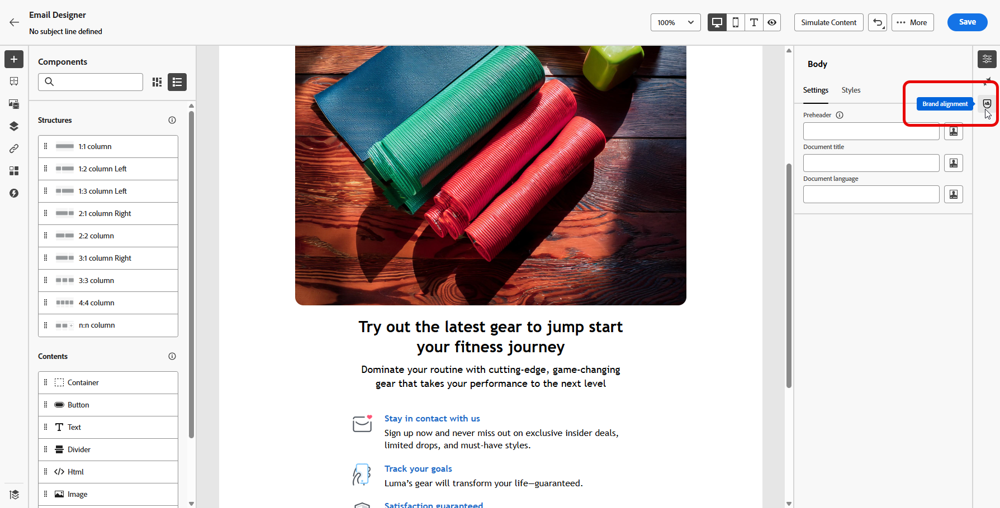

# 브랜드 정렬(Beta){#brands-score}

>[!CONTEXTUALHELP]
>id="ajo_brand_score"
>title="브랜드 정렬 점수"
>abstract="브랜드 정렬 점수는 색상, 글꼴, 로고, 이미지 및 작성 스타일의 일관성을 보장하면서 콘텐츠가 브랜드 지침을 얼마나 준수하는지 측정합니다."

>[!CONTEXTUALHELP]
>id="ajo_brand_colors"
>title="색상 점수"
>abstract="색상 점수"

>[!CONTEXTUALHELP]
>id="ajo_brand_fonts"
>title="글꼴 점수"
>abstract="글꼴 점수"

>[!CONTEXTUALHELP]
>id="ajo_brand_logos"
>title="로고 점수"
>abstract="로고 점수"

>[!AVAILABILITY]
>
>이 기능은 비공개 베타로 출시됩니다. 향후 릴리스에서 점진적으로 사용 범위를 확대하여 모든 고객에게 제공할 예정입니다.
>Adobe Journey Optimizer에서 AI 도우미를 사용하려면 먼저 [사용자 동의](https://www.adobe.com/legal/licenses-terms/adobe-dx-gen-ai-user-guidelines.html){target="_blank"}에 동의해야 합니다. 자세한 내용은 Adobe 담당자에게 문의하십시오.

브랜드 정렬 기능은 브랜드 지침에 따라 유지되는 콘텐츠를 만들고, 검토하고, 관리하는 데 도움이 되도록 빌드되었습니다. 이메일 캠페인 전반에 걸쳐 톤, 메시징 및 시각적 ID의 일관성을 보장하는 동시에 콘텐츠가 라이브로 전환되기 전에 품질을 확인하는 역할을 합니다.

## 브랜드 정렬을 사용하여 콘텐츠 유효성 검사 {#validate-content}

[브랜드를 설정하고 게시하면](brands.md), 이메일 캠페인 내에서 직접 브랜드 정렬 점수를 평가하여 콘텐츠가 브랜드 지침에 맞게 조정되도록 합니다.

1. [전자 메일 캠페인](../campaigns/create-campaign.md)을 만듭니다.

1. 이메일 디자이너에서 **[!UICONTROL 브랜드 정렬]** 메뉴를 엽니다.

   기본 브랜드에 대해 콘텐츠가 자동으로 평가됩니다. [기본 브랜드를 할당하는 방법을 알아보세요](brands.md).

   

1. 다른 브랜드를 사용하여 평가하려면 **[!UICONTROL 브랜드]** 드롭다운 메뉴에서 브랜드를 선택하고 **[!UICONTROL 점수 다시 평가]**&#x200B;를 클릭하십시오.

   

1. **브랜드 정렬 점수**(높음, Medium, 낮음)를 살펴보고 자세한 피드백을 검토하십시오.

1. 점수에 대한 더 많은 통찰력을 보려면  아이콘을 클릭하십시오.

   

1. 특정 피드백 및 제안을 보려면 플래그가 지정된 지침을 선택하십시오.

   

1. 권장 사항을 기반으로 콘텐츠를 편집하여 브랜드 정렬을 개선합니다.

1. 정렬 점수를 새로 고치기 위해 변경 후 콘텐츠를 수동으로 다시 평가합니다.
