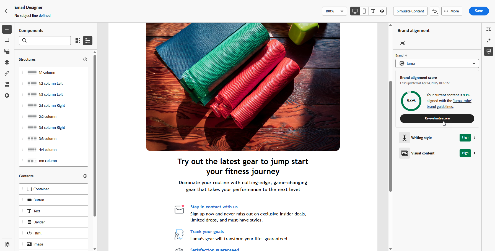

# 브랜드 정렬 {#brands-score}

>[!CONTEXTUALHELP]
>id="ajo_brand_score"
>title="브랜드 정렬 점수"
>abstract="브랜드 정렬 점수는 콘텐츠가 브랜드의 지침을 얼마나 잘 준수하는지 측정하여 색상, 글꼴, 로고, 이미지 및 작성 스타일에서의 일관성을 보장합니다."

>[!CONTEXTUALHELP]
>id="ajo_brand_colors"
>title="색상 점수"
>abstract="색상 점수"

>[!CONTEXTUALHELP]
>id="ajo_brand_fonts"
>title="글꼴 점수"
>abstract="글꼴 점수"

>[!CONTEXTUALHELP]
>id="ajo_brand_logos"
>title="로고 점수"
>abstract="로고 점수"

>[!AVAILABILITY]
>
>Adobe Journey Optimizer에서 AI 도우미를 사용하려면 먼저 [사용자 동의](https://www.adobe.com/kr/legal/licenses-terms/adobe-dx-gen-ai-user-guidelines.html){target="_blank"}에 동의해야 합니다. 자세한 내용은 Adobe 담당자에게 문의하십시오.

브랜드 정렬 기능은 브랜드 지침을 준수하는 콘텐츠를 만들고, 검토하고, 관리하는 데 도움이 됩니다. 이메일 캠페인 전반에 걸쳐 톤, 메시징 및 시각적 ID의 일관성을 보장하는 동시에 콘텐츠가 라이브로 전환되기 전에 품질을 확인하는 역할을 합니다.

## 브랜드 정렬을 사용하여 콘텐츠 유효성 검사 {#validate-content}

[브랜드를 설정하고 게시하면](brands.md), 이메일 캠페인 내에서 직접 브랜드 정렬 점수를 평가하여 콘텐츠가 브랜드 지침에 맞게 조정되도록 합니다.

1. [전자 메일 캠페인](../campaigns/create-campaign.md)을 만듭니다.

1. 이메일 Designer에서 **[!UICONTROL 브랜드 정렬]** 메뉴를 엽니다.

   콘텐츠는 기본 브랜드에 대해 자동으로 평가됩니다. [기본 브랜드를 할당하는 방법을 알아보세요](brands.md).

   

1. 다른 브랜드를 사용하여 평가하려면 **[!UICONTROL 브랜드]** 드롭다운 메뉴에서 브랜드를 선택하고 **[!UICONTROL 점수 평가]**&#x200B;를 클릭하십시오.

   

1. **[!UICONTROL 작성 스타일]** 또는 **[!UICONTROL 시각적 콘텐츠]**&#x200B;를 탐색하여 점수에 대한 더 많은 통찰력을 확인합니다.

   

1. 점수에 대한 자세한 인사이트를 보려면 .

   

1. 특정 피드백 및 제안을 보려면 플래그가 지정된 지침을 선택하십시오. 브랜드 정렬은 다음 범주를 평가합니다.

   * **[!UICONTROL 작성 스타일]**:
      * **[!UICONTROL 브랜드 커뮤니케이션 스타일]**: 모든 채널에서 일관된 브랜드 음성을 제공하기 위해 개성과 감정적인 톤을 정의합니다.
      * **[!UICONTROL 브랜드 메시지 표준]**: 효과적인 마케팅 및 홍보 텍스트에 대한 구조적 및 서식 규칙입니다.
      * **[!UICONTROL 법적 준수 표준]**: 모든 커뮤니케이션이 텍스트 배치 및 준수 확인 목록을 비롯한 법적 요구 사항을 준수하도록 합니다.

   * **[!UICONTROL 시각적 콘텐츠]**:
      * **[!UICONTROL 사진 표준]**: 해상도, 컴포지션, 조명 및 파일 형식을 포함한 사진 콘텐츠에 대한 요구 사항.
      * **[!UICONTROL 일러스트레이션 표준]**: 일러스트레이션의 스타일 매개 변수, 선 두께, 색상 사용 및 파일 형식 요구 사항입니다.
      * **[!UICONTROL 아이콘 표준]**: 격자 시스템, 획 두께 및 균일성을 위한 크기 조정을 포함한 아이콘 디자인을 위한 사양입니다.
      * **[!UICONTROL 사용 지침]**: 브랜드 정체성을 유지하기 위한 이미지 선택, 배치 및 컨텍스트에 대한 모범 사례입니다.

   

1. 권장 사항을 기반으로 콘텐츠를 편집하여 브랜드 정렬을 개선합니다.

1. 정렬 점수를 새로 고치기 위해 변경 후 콘텐츠를 수동으로 다시 평가합니다.

## 콘텐츠 품질 유효성 검사 {#validate-quality}

>[!NOTE]
>
>콘텐츠 품질 평가는 브랜드 지침과 독립적입니다. 드롭다운 메뉴에서 브랜드를 선택하더라도 해당 지침은 품질 검사에 적용되지 않습니다. 브랜드 선택은 브랜드 정렬 점수에만 관련이 있습니다.

브랜드 정렬 외에도 브랜드 지침과 관계없이 가독성, 콘텐츠 응집성 및 효과성과 관련된 잠재적 문제를 식별하기 위해 일반적인 콘텐츠 품질을 평가할 수 있습니다.

콘텐츠 품질을 평가하려면 다음을 수행하십시오.

1. [전자 메일 캠페인](../campaigns/create-campaign.md)을 만듭니다.

1. 이메일 Designer에서 **[!UICONTROL 브랜드 정렬]** 메뉴를 엽니다.

   

1. 브랜드 맞춤 점수와 콘텐츠 품질 점수를 모두 생성하려면 **[!UICONTROL 점수 평가]**&#x200B;를 클릭하십시오.

   

1. 콘텐츠 품질 인사이트 및 권장 사항을 검토하려면 **[!UICONTROL 전체 품질]** 탭으로 이동하십시오.

   

1. 품질 점수에 대한 자세한 보기를 보려면  아이콘을 클릭하십시오.

   

1. 특정 피드백 및 개선을 위해 실행 가능한 제안을 보려면 플래그가 지정된 항목을 선택하십시오. 점수는 다음 카테고리를 기반으로 합니다.

   * **[!UICONTROL CTA 효율성]**: call-to-action이 독자에게 원하는 행동을 취하도록 동기를 부여하는 정도를 평가합니다.
   * **[!UICONTROL 제목 줄]**: 명확성, 관련성 및 주의를 끄는 품질을 평가하여 이메일 열기를 유도합니다.
   * **[!UICONTROL 가독성]**: 독자가 이해할 수 있는 컨텐츠의 용이성과 참여도를 측정합니다.
   * **[!UICONTROL 스팸 확인]**: 전달성에 영향을 줄 수 있는 일반적인 스팸 트리거를 식별합니다.
   * **[!UICONTROL 컨텐츠 응집력]**: 컨텐츠가 원활하게 흐르고 주제를 벗어나지 않도록 합니다.
   * **[!UICONTROL 교정]**: 맞춤법, 문법 및 명확성 문제가 있는지 확인합니다.

   

1. 권장 사항을 기반으로 콘텐츠를 편집하여 가독성, 콘텐츠 응집성 및 전체 품질을 향상시킵니다.

1. 품질 점수를 새로 고치려면 변경한 후 **[!UICONTROL 점수 다시 평가]**&#x200B;를 클릭하십시오.

## 사용 방법 비디오 {#video}

아래 비디오에서는 고유한 브랜드를 만들고 사용자 정의하여 커뮤니케이션 전반에 걸쳐 시각적 및 언어적 정체성을 명확하게 정의하는 방법을 보여줍니다.

+++ 비디오 보기

>[!VIDEO](https://video.tv.adobe.com/v/3470553/?captions=kor&learn=on)

+++
