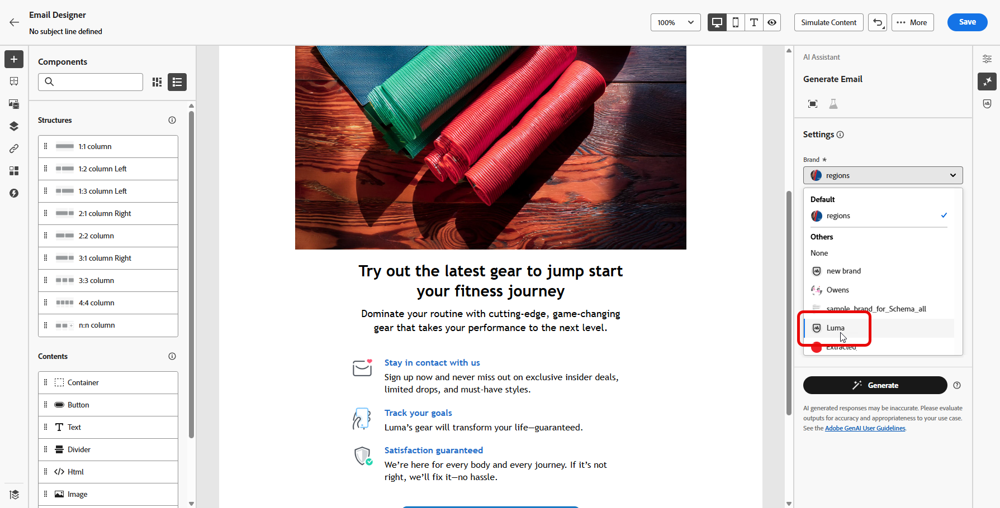

# 브랜드 만들기 및 관리 {#brands}

>[!CONTEXTUALHELP]
>id="ajo_brand_overview"
>title="브랜드 시작하기"
>abstract="고유한 시각적 및 언어적 정체성을 정의하고, 브랜드 스타일과 표현에 맞는 콘텐츠를 손쉽게 생성할 수 있도록 자체 브랜드를 만들고 맞춤화합니다."

>[!CONTEXTUALHELP]
>id="ajo_brand_ai_menu"
>title="브랜드 선택"
>abstract="브랜드를 선택하여 모든 AI 생성 콘텐츠가 브랜드의 사양과 지침에 맞게 조정되도록 합니다."

>[!CONTEXTUALHELP]
>id="ajo_brand_score_overview"
>title="브랜드 선택"
>abstract="브랜드를 선택하여 콘텐츠가 브랜드의 특정 지침, 기준 및 정체성에 맞게 제작되도록 하여 일관성과 브랜드 무결성을 유지합니다."

>[!CONTEXTUALHELP]
>id="ajo_brand_score"
>title="브랜드 정렬 점수"
>abstract="브랜드 정렬 점수는 콘텐츠가 브랜드의 지침을 얼마나 잘 준수하는지 측정하여 색상, 글꼴, 로고, 이미지 및 작성 스타일에서의 일관성을 보장합니다."

>[!CONTEXTUALHELP]
>id="ajo_brand_colors"
>title="색상 점수"
>abstract="색상 점수"

>[!CONTEXTUALHELP]
>id="ajo_brand_fonts"
>title="글꼴 점수"
>abstract="글꼴 점수"

>[!CONTEXTUALHELP]
>id="ajo_brand_logos"
>title="로고 점수"
>abstract="로고 점수"

>[!CONTEXTUALHELP]
>id="ajo_brand_imagery"
>title="이미지 점수"
>abstract="이미지 점수"

>[!CONTEXTUALHELP]
>id="ajo_brand_writing_style"
>title="쓰기 스타일 점수"
>abstract="쓰기 스타일 점수"

>[!AVAILABILITY]
>
>이 기능은 비공개 베타로 출시됩니다. 향후 릴리스에서 점진적으로 사용 범위를 확대하여 모든 고객에게 제공할 예정입니다.

브랜드 지침은 브랜드의 시각적 및 언어적 정체성을 확립하는 상세한 규칙 및 표준 세트입니다. 모든 마케팅 및 커뮤니케이션 플랫폼에서 일관된 브랜드 표현을 유지하는 참조 역할을 합니다.

이제 [!DNL Journey Optimizer]에서 브랜드 세부 정보를 수동으로 입력 및 구성하거나 자동 정보 추출을 위해 브랜드 지침 문서를 업로드할 수 있습니다.

## 브랜드 액세스 {#generative-access}

[!DNL Adobe Journey Optimizer]에서 **[!UICONTROL 브랜드]** 메뉴에 액세스하려면 사용자에게 **[!UICONTROL 관리 브랜드 키트]** 또는 **[!UICONTROL AI 도우미 사용]** 권한을 부여해야 합니다. [자세히 알아보기](../administration/permissions.md)

+++  브랜드 관련 권한을 할당하는 방법을 알아봅니다.

1. **권한** 제품에서 **역할** 탭으로 이동하여 원하는 **역할**&#x200B;을 선택하십시오.

1. 권한을 수정하려면 **편집**&#x200B;을 클릭하십시오.

1. **AI Assistant** 리소스를 추가한 다음 드롭다운 메뉴에서 **관리 브랜드 키트** 또는 **[!UICONTROL Ai Assistant 사용]**&#x200B;을 선택합니다.

   **[!UICONTROL Ai Assistant 사용]** 권한은 **[!UICONTROL 브랜드]** 메뉴에 대한 읽기 전용 액세스를 제공합니다.

   {zoomable="yes"}

1. 변경 내용을 적용하려면 **저장**&#x200B;을 클릭하십시오.

   이 역할에 이미 할당된 모든 사용자의 권한은 자동으로 업데이트됩니다.

1. 새 사용자에게 이 역할을 할당하려면 **역할** 대시보드의 **사용자** 탭으로 이동하여 **사용자 추가**&#x200B;를 클릭하십시오.

1. 사용자 이름, 이메일 주소를 입력하거나 목록에서 선택한 다음 **저장**&#x200B;을 클릭합니다.

1. 이전에 사용자를 생성하지 않은 경우 [이 설명서](https://experienceleague.adobe.com/ko/docs/experience-platform/access-control/abac/permissions-ui/users)를 참조하십시오.

+++

## 브랜드 만들기 {#create-brand-kit}

>[!CONTEXTUALHELP]
>id="ajo_brands_create"
>title="브랜드 만들기"
>abstract="브랜드 이름을 입력하고 브랜드 지침 파일을 업로드합니다. 이 도구는 주요 세부 정보를 자동으로 추출하여 브랜드의 정체성을 유지하기 쉽게 만듭니다."

브랜드 지침을 만들고 관리하기 위해 직접 세부 정보를 입력하거나 브랜드 지침 문서를 업로드하여 정보를 자동으로 추출할 수 있습니다.

1. **[!UICONTROL 브랜드]** 메뉴에서 **[!UICONTROL 브랜드 만들기]**&#x200B;를 클릭합니다.

   

1. 브랜드의 **[!UICONTROL 이름]**&#x200B;을(를) 입력하십시오.

1. 파일을 드래그 앤 드롭하거나 선택하여 브랜드 지침을 업로드하고 자동으로 관련 브랜드 정보를 추출합니다. **[!UICONTROL 브랜드 만들기]**&#x200B;를 클릭합니다.

   이제 정보 추출 프로세스가 시작됩니다. 완료하는 데 몇 분 정도 걸릴 수 있습니다.

   

1. 이제 콘텐츠 및 시각적 만들기 표준이 자동으로 채워집니다. 다양한 탭을 탐색하여 필요에 따라 정보를 조정합니다.

1. **[!UICONTROL 작성 스타일]** 탭에서 을(를) 클릭하여 예제를 포함한 지침 또는 제외를 추가합니다.

   

1. **[!UICONTROL 시각적 콘텐츠]** 탭에서 을(를) 클릭하여 다른 지침이나 제외를 추가합니다.

1. 올바른 사용을 표시하는 이미지를 추가하려면 **[!UICONTROL 예제]**&#x200B;를 선택하고 **[!UICONTROL 이미지 선택]**&#x200B;을 클릭합니다. 제외 예로서 잘못된 사용을 보여주는 이미지를 추가할 수도 있습니다.

   

1. 구성이 완료되면 **[!UICONTROL 저장]**&#x200B;을 클릭한 다음 **[!UICONTROL 게시]**&#x200B;을 클릭하여 브랜드 지침을 AI 도우미에서 사용할 수 있도록 합니다.

1. 게시된 브랜드를 수정하려면 **[!UICONTROL 브랜드 편집]**&#x200B;을 클릭하세요.

   >[!NOTE]
   >
   >이렇게 하면 편집 모드에 임시 복사본이 만들어지고 게시 후 라이브 버전이 대체됩니다.

   

1. **[!UICONTROL 브랜드]** 대시보드에서  아이콘을 클릭하여 고급 메뉴를 열어 다음 작업을 수행합니다.

   * 브랜드 보기
   * 편집
   * 복제
   * 게시
   * 게시 취소
   * 삭제

   

이제 AI 도우미 메뉴의 **[!UICONTROL Brand]** 드롭다운에서 브랜드 지침에 액세스할 수 있으므로 사양에 맞게 콘텐츠 및 에셋을 생성할 수 있습니다. [AI Assistant에 대해 자세히 알아보기](gs-generative.md)

