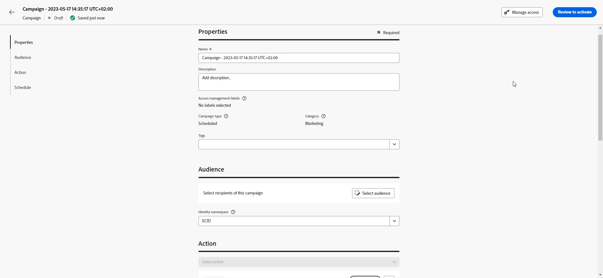
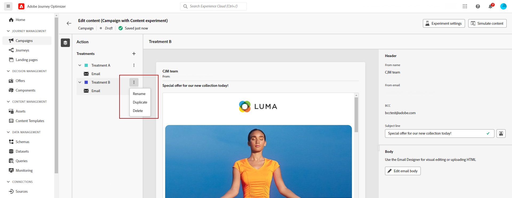

# 콘텐츠 실험 만들기 {#content-experiment}

>[!CONTEXTUALHELP]
>id="ajo_campaigns_content_experiment"
>title="콘텐츠 실험"
>abstract="메시지 콘텐츠, 제목 또는 보낸 사람을 다양하게 선택하여 여러 가지 처리 방식을 정의하고 대상자에게 가장 적합한 조합을 결정할 수 있습니다."

>[!NOTE]
>
>콘텐츠 실험으로 시작하기 전에 보고 구성이 사용자 지정 데이터 세트에 대해 설정되어 있는지 확인하십시오. 자세한 내용은 [이 섹션](../reports/reporting-configuration.md)을 참조하십시오.

Journey Optimizer 컨텐츠 실험 을 사용하면 타겟 대상자에게 가장 적합한 성과를 측정하기 위해 여러 게재 처리를 정의할 수 있습니다. 게재 콘텐츠, 제목 또는 발신자를 변경하도록 선택할 수 있습니다. 관심 대상은 각 처리에 임의로 할당되어 지정된 지표 측면에서 가장 적합한 대상을 결정합니다.

아래 예에서 게재 대상은 두 그룹으로 분할되었으며, 각 그룹은 대상 모집단의 45%를 나타내고 홀드아웃 그룹은 10%로 게재를 받지 않습니다.

타겟팅된 대상의 각 사용자는 한 버전의 이메일을 받게 되며, 제목 줄은 다음 두 가지 중 하나입니다.

* 새 컬렉션과 이미지에 대한 10% 오퍼를 직접 홍보합니다.
* 나머지 한 곳은 이미지 없이 10% 할인을 명시하지 않고 스페셜 오퍼만 광고하고 있습니다.

여기의 목표는 받은 실험에 따라 수신자가 이메일과 상호 작용하는지 확인하는 것입니다. 따라서 이 콘텐츠 실험의 기본 목표 지표로 **[!UICONTROL 이메일 열기]**&#x200B;를 선택합니다.

## 콘텐츠 만들기 {#campaign-experiment}

1. 먼저 요구 사항에 따라 [campaign](../campaigns/create-campaign.md) 또는 [여정](../building-journeys/journeys-message.md)을(를) 만들고 구성합니다.

1. **[!UICONTROL 콘텐츠 편집]** 창에서 치료 A 개인화를 시작하십시오.

   이 처리를 위해 제목 줄에 직접 특별 오퍼를 지정하고 개인화를 추가합니다.

   

1. 원래 콘텐츠를 만들거나 가져온 후 필요에 따라 개인화합니다.

## 콘텐츠 실험 구성 {#configure-experiment}

>[!CONTEXTUALHELP]
>id="ajo_campaigns_content_experiment_dimension"
>title="차원"
>abstract="특정 클릭 수 또는 특정 페이지 조회수와 같이 실험에 대해 추적할 특정 차원을 선택합니다."

>[!CONTEXTUALHELP]
>id="ajo_campaigns_content_experiment_success_metric"
>title="성공 지표"
>abstract="성공 지표는 실험에서 최상의 성능 처리를 추적하고 평가하는 데 사용됩니다. 데이터 세트를 사용하기 전에 특정 지표에 대해 해당 데이터 세트를 설정해야 합니다."

1. 메시지가 개인화되면 캠페인 요약 페이지에서 **[!UICONTROL 실험 만들기]**&#x200B;를 클릭하여 콘텐츠 실험 구성을 시작합니다.

   

1. 실험에 대해 설정할 **[!UICONTROL 성공 지표]**&#x200B;를 선택하십시오.

   이 예제에서는 **[!UICONTROL 이메일 열기]**&#x200B;를 선택하여 프로모션 코드가 제목 줄에 있는 경우 프로필이 이메일을 열는지 테스트합니다.

   

1. 인앱 또는 웹 채널을 사용하여 실험을 설정하고 **[!UICONTROL 인바운드 클릭수]**, **[!UICONTROL 고유 인바운드 클릭수]**, **[!UICONTROL 페이지 보기 수]** 또는 **[!UICONTROL 고유 페이지 보기 수 지표]**&#x200B;를 선택할 때 **[!UICONTROL 클릭 동작]** 드롭다운을 사용하면 특정 페이지에서 클릭수 및 보기를 정확하게 추적하고 모니터링할 수 있습니다.

   

1. **[!UICONTROL 치료 추가]**&#x200B;를 클릭하여 필요한 수만큼 새 치료를 만듭니다.

   

1. 구분을 더 잘 하려면 치료의 **[!UICONTROL 제목]**&#x200B;을 변경하십시오.

1. **[!UICONTROL 보류 중]** 그룹을 게재에 추가하도록 선택하십시오. 이 그룹은 이 캠페인으로부터 어떤 콘텐트도 받지 않습니다.

   토글 막대를 켜면 인구의 10%가 자동으로 사용됩니다. 필요한 경우 이 비율을 조정할 수 있습니다.

   >[!IMPORTANT]
   >
   >홀드아웃 그룹을 콘텐츠 실험을 위한 작업에 사용하는 경우 홀드아웃 할당은 해당 특정 작업에만 적용됩니다. 작업이 완료되면 홀드아웃 그룹의 프로필은 여정 경로를 계속 사용하며 다른 작업에서 메시지를 받을 수 있습니다. 따라서 후속 메시지가 홀드아웃 그룹에 있을 수 있는 프로필의 메시지 수신에 의존하지 않도록 하십시오. 보류 중인 할당을 제거해야 할 수도 있습니다.

   

1. 그런 다음 각 **[!UICONTROL 처리]**&#x200B;에 정확한 백분율을 할당하거나 **[!UICONTROL 균등 분포]** 토글 막대를 전환하도록 선택할 수 있습니다.

   

1. 구성이 설정되면 **[!UICONTROL 만들기]**&#x200B;를 클릭합니다.

## 트리트먼트 디자인 {#treatment-experiment}

1. **[!UICONTROL 콘텐츠 편집]** 창에서 치료 B를 선택하여 콘텐츠를 변경합니다.

   여기서는 **[!UICONTROL 제목 줄]**&#x200B;에 오퍼를 지정하지 않도록 선택합니다.

   

1. **[!UICONTROL 전자 메일 본문 편집]**&#x200B;을 클릭하여 치료 B를 추가로 개인화합니다.

   

1. 치료를 디자인한 후 **[!UICONTROL 추가 작업]**&#x200B;을(를) 클릭하여 치료와 관련된 옵션에 액세스합니다. **[!UICONTROL 이름 바꾸기]**, **[!UICONTROL 복제]** 및 **[!UICONTROL 삭제]**.

   

1. 필요한 경우 **[!UICONTROL 실험 설정]** 메뉴에 액세스하여 처리 구성을 변경합니다.

   

1. 메시지 콘텐츠가 정의되면 **[!UICONTROL 콘텐츠 시뮬레이션]** 단추를 클릭하여 게재 렌더링을 제어하고 테스트 프로필로 개인화 설정을 확인합니다. [자세히 알아보기](../content-management/preview-test.md)

실험을 구성한 다음에는 보고서를 통해 게재의 성공을 추적할 수 있습니다. [자세히 알아보기](../reports/campaign-global-report-cja-experimentation.md)
