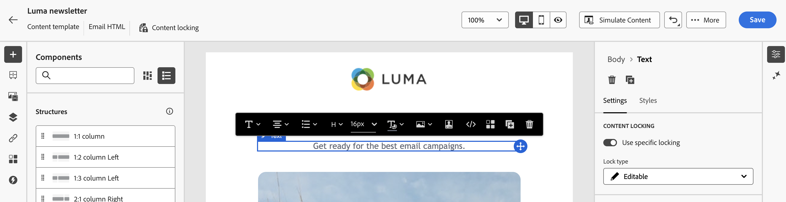

# 전자 메일 템플릿의 콘텐츠 잠금 {#lock-content-email-templates}

>[!CONTEXTUALHELP]
>id="ajo_locking_governance"
>title="거버넌스"
>abstract="전체 템플릿 또는 특정 구조 및 구성 요소를 잠그는 방식으로 템플릿의 콘텐츠를 잠그도록 거버넌스를 전환합니다. 이를 통해 의도하지 않은 편집 또는 삭제를 방지할 수 있으므로 템플릿의 사용자 정의 기능을 더욱 강력하게 제어하고 이메일 캠페인의 효율성과 안정성을 향상시킬 수 있습니다."

>[!CONTEXTUALHELP]
>id="ajo_locking_mode"
>title="모드"
>abstract="템플릿에 대해 원하는 잠금 모드를 선택합니다. **콘텐츠 잠금**&#x200B;을 사용하면 템플릿 내의 특정 콘텐츠 섹션을 잠글 수 있습니다. **읽기 전용**&#x200B;을(를) 사용하면 템플릿의 전체 콘텐츠를 잠가서 수정할 수 없습니다."

>[!CONTEXTUALHELP]
>id="ajo_locking_content_addition"
>title="콘텐츠 추가 활성화"
>abstract="이 옵션을 켜서 사용자가 템플릿과 상호 작용하는 방법을 추가로 정의합니다. 사용자가 기존 구조 사이에 구조를 추가하고 콘텐츠 구성 요소 또는 조각을 편집 가능한 구조 내에 추가할 수 있도록 하려면 **구조 및 콘텐츠 추가 허용**&#x200B;을 선택하십시오. **콘텐츠 추가만 허용**&#x200B;을 통해 사용자는 구조를 추가하거나 복제하지 않고도 편집 가능한 구조 내에 콘텐츠 구성 요소 또는 조각을 추가할 수 있습니다."

>[!CONTEXTUALHELP]
>id="ajo_email_locking_activated"
>title="거버넌스 활성화됨"
>abstract="콘텐츠 잠금이 활성화되어 수정이 불가할 수 있습니다."

>[!CONTEXTUALHELP]
>id="ajo_email_locking_read_only"
>title="읽기 전용"
>abstract="이 콘텐츠는 읽기 전용이며 수정할 수 없습니다."

Journey Optimizer을 사용하면 전체 템플릿 또는 특정 구조 및 구성 요소를 잠궈 이메일 템플릿의 콘텐츠를 잠글 수 있습니다. 이를 통해 의도하지 않은 편집 또는 삭제를 방지할 수 있으므로 템플릿의 사용자 정의 기능을 더욱 강력하게 제어하고 이메일 캠페인의 효율성과 안정성을 향상시킬 수 있습니다.

>[!IMPORTANT]
>
>컨텐츠 잠금은 작성자를 위한 편집기 수준의 기능이며, API를 통해 가져오거나 만들 때 컨텐츠가 편집되지 않을 것임을 보장하지는 않습니다.

콘텐츠 잠금은 **구조** 수준 또는 **구성 요소** 수준에서 적용할 수 있습니다. 다음은 템플릿에서 콘텐츠를 잠글 때 구조 및 구성 요소 수준에서 적용되는 기본 원칙입니다.

* 구조가 잠긴 경우:

   * 해당 구조 내의 모든 콘텐츠도 기본적으로 잠깁니다.
   * 구조에 컨텐츠를 추가할 수 없습니다.
   * 기본적으로 구조를 삭제할 수 없습니다. &quot;삭제 허용&quot; 옵션을 활성화하여 이 제한을 재정의할 수 있습니다.
   * 잠긴 구조 내의 개별 콘텐츠 구성 요소를 편집 가능한 것으로 설정할 수 있습니다.

* 구조를 편집할 수 있을 때(구조가 잠기지 않음):

   * 개별 콘텐츠 구성 요소를 해당 구조 내에서 잠글 수 있습니다.
   * 기본적으로 구성 요소가 잠겨 있거나 &quot;편집 가능한 컨텐츠 잠금만&quot;이 선택되어 있으면 삭제할 수 없습니다. &quot;삭제 허용&quot; 옵션을 활성화하여 이 제한을 재정의할 수 있습니다.

>[!AVAILABILITY]
>
>콘텐츠 템플릿을 만들 수 있는 권한이 있는 사용자가 콘텐츠 잠금을 활성화할 수 있습니다.

## 이메일 템플릿 잠금 {#define}

### 컨텐츠 잠금 활성화 {#enable}

새 템플릿을 만들거나 기존 템플릿을 편집하든 상관없이 이메일 Designer에서 직접 이메일 템플릿에 대한 컨텐츠 잠금을 활성화할 수 있습니다. 다음 단계를 수행하십시오.

1. 이메일 템플릿을 열거나 만들고 이메일 Designer의 콘텐츠 편집 화면에 액세스합니다.

1. 오른쪽의 **[!UICONTROL 본문]** 창에서 **[!UICONTROL 거버넌스]** 옵션을 전환합니다.

1. **[!UICONTROL 모드]** 드롭다운 목록에서 템플릿에 대해 원하는 잠금 모드를 선택합니다.

   * **[!UICONTROL 콘텐츠 잠금]**: 템플릿 내의 특정 콘텐츠 섹션을 잠급니다. 기본적으로 모든 구조 및 구성 요소를 편집할 수 있습니다. 그런 다음 개별 요소를 선택적으로 잠글 수 있습니다.
   * **[!UICONTROL 읽기 전용]**: 템플릿의 전체 콘텐츠를 잠그고 수정할 수 없도록 합니다.

   

1. **[!UICONTROL 콘텐츠 잠금]** 모드를 선택한 경우 사용자가 템플릿과 상호 작용하는 방법을 추가로 정의할 수 있습니다. **[!UICONTROL 콘텐츠 편집 사용]** 옵션을 전환하고 다음 중 하나를 선택하십시오.

   * **[!UICONTROL 구조 및 콘텐츠 추가 허용]**: 사용자는 기존 구조 사이에 구조를 추가하고 편집 가능한 구조 내에 콘텐츠 구성 요소 또는 조각을 추가할 수 있습니다.

   * **[!UICONTROL 콘텐츠 추가만 허용]**: 사용자는 편집 가능한 구조 내에 콘텐츠 구성 요소 또는 조각을 추가할 수 있지만 구조를 추가하거나 복제할 수는 없습니다.

1. 잠금 모드를 선택한 후 **[!UICONTROL 콘텐츠 잠금]** 모드를 선택한 경우 잠글 구조 및/또는 구성 요소를 정의할 수 있습니다.

   * [구조를 잠그는 방법에 대해 알아보기](#lock-structures)
   * [구성 요소 잠금 방법 알아보기](#lock-components)

   **[!UICONTROL 읽기 전용]** 모드를 선택한 경우 평소대로 템플릿을 완성하고 저장할 수 있습니다.

템플릿 본문을 선택하여 템플릿을 디자인할 때 언제든지 **[!UICONTROL 거버넌스]** 설정을 조정할 수 있습니다. 이렇게 하려면 오른쪽 창 위쪽에 있는 탐색 레일에서 **[!UICONTROL 본문]** 링크를 클릭합니다.

### 구조 잠금 {#lock-structures}

>[!CONTEXTUALHELP]
>id="ajo_locking_structure"
>title="콘텐츠 고정 구조"
>abstract="템플릿의 구조를 잠그려면 **잠금 유형** 드롭다운에서 **잠김**&#x200B;을(를) 선택합니다. 기본적으로 사용자는 잠긴 구조를 삭제할 수 없습니다. **[!UICONTROL 삭제 허용]** 옵션을 활성화하여 이 제한을 재정의할 수 있습니다."

템플릿 내의 구조를 잠그려면 다음을 수행합니다.

1. 잠글 구조를 선택합니다.

1. **[!UICONTROL 잠금 유형]** 드롭다운 목록에서 **[!UICONTROL 잠김]**&#x200B;을 선택합니다.

   

   >[!NOTE]
   >
   >기본적으로 사용자는 잠긴 구조를 삭제할 수 없습니다. **[!UICONTROL 삭제 허용]** 옵션을 활성화하여 이 제한을 재정의할 수 있습니다.

구조를 잠근 후에는 추가적인 콘텐츠 구성 요소 또는 조각을 복제하거나 그 내부에 추가할 수 없습니다. 잠긴 구조 내의 모든 구성 요소도 기본적으로 잠깁니다. 잠긴 구조 내에서 구성 요소를 편집할 수 있게 하려면 다음 작업을 수행하십시오.

1. 잠금을 해제할 구성 요소를 선택합니다.

1. **[!UICONTROL 특정 잠금 사용]** 옵션을 켜십시오.

1. **[!UICONTROL 잠금 유형]** 드롭다운 목록에서 **[!UICONTROL 편집 가능]**&#x200B;을 선택합니다. 스타일을 잠그는 동안 콘텐츠를 편집하려면 **[!UICONTROL 편집 가능한 콘텐츠만]**&#x200B;을 선택하세요. [구성 요소를 잠그는 방법을 알아봅니다](#lock-components)

   

### 구성 요소 잠금 {#lock-components}

>[!CONTEXTUALHELP]
>id="ajo_locking_component"
>title="특정 고정 구성 요소 사용"
>abstract="템플릿의 구성 요소를 잠그려면 **특정 잠금 사용** 옵션을 켜십시오. **[!UICONTROL 잠금 유형]** 드롭다운 목록에서 원하는 잠금 옵션을 선택합니다. **편집 가능한 콘텐츠 잠금 전용**&#x200B;을(를) 사용하면 구성 요소의 스타일을 잠글 수 있지만 콘텐츠 편집은 허용하지만 **잠김**&#x200B;은(는) 구성 요소의 콘텐츠와 스타일을 모두 완전히 잠급니다."

구조 내의 특정 구성 요소를 잠그려면 다음을 수행합니다.

1. 구성 요소를 선택하고 오른쪽 창에서 **[!UICONTROL 특정 잠금 사용]** 옵션을 활성화하십시오.

1. **[!UICONTROL 잠금 유형]** 드롭다운 목록에서 원하는 잠금 옵션을 선택합니다.

   

   * **[!UICONTROL 편집 가능한 콘텐츠 잠금 전용]**: 구성 요소의 스타일을 잠그지만 콘텐츠를 편집할 수 있도록 허용합니다.
   * **[!UICONTROL 잠김]**: 구성 요소의 콘텐츠와 스타일을 모두 완전히 잠급니다.

   >[!NOTE]
   >
   >**[!UICONTROL 편집 가능]** 잠금 형식을 사용하면 잠긴 구조 내에서도 구성 요소를 편집할 수 있습니다. [구조를 잠그는 방법을 알아보세요](#lock-structures)

1. 기본적으로 사용자는 잠긴 구성 요소를 삭제할 수 없습니다. **[!UICONTROL 삭제 허용]** 옵션을 활성화하여 삭제를 활성화할 수 있습니다.

### 잠긴 콘텐츠 식별 {#identify}

템플릿 내에서 잠긴 구조와 구성 요소를 쉽게 식별하려면 왼쪽 메뉴에 있는 **[!UICONTROL 탐색 트리]**&#x200B;를 사용하십시오. 이 메뉴는 모든 템플릿 요소에 대한 시각적 개요를 제공하며, 잠금 아이콘으로 잠긴 항목과 연필 아이콘으로 편집 가능한 항목을 강조 표시합니다.

아래 예에서는 템플릿 본문에 대해 거버넌스를 활성화합니다. *구조 2*&#x200B;이(가) 편집 가능한 *구성 요소 1*(으)로 잠겨 있지만 *구조 3*&#x200B;은(는) 완전히 잠겨 있습니다.

## 잠긴 컨텐츠가 있는 템플릿 사용 {#use}

>[!CONTEXTUALHELP]
>id="ajo_email_editable_areas"
>title="편집 가능한 영역 강조 표시"
>abstract="템플릿에 적용된 잠금 유형에 따라 템플릿의 구조 및 구성 요소에 대해 다양한 작업을 수행할 수 있습니다. 템플릿 내의 모든 편집 가능한 영역을 빠르게 식별하려면 **[!UICONTROL 편집 가능한 영역 강조 표시]** 옵션을 켜십시오."

잠긴 컨텐츠가 있는 템플릿을 사용할 때 **[!UICONTROL 거버넌스 사용]** 메시지가 오른쪽 창에 표시됩니다.

템플릿에 적용된 잠금 유형에 따라 템플릿의 구조 및 구성 요소에 대해 다양한 작업을 수행할 수 있습니다. 템플릿 내의 모든 편집 가능한 영역을 빠르게 식별하려면 **[!UICONTROL 편집 가능한 영역 강조 표시]** 옵션을 켜십시오.

예를 들어 아래 템플릿에서는 잠겨진 상위 이미지를 제외한 모든 영역을 편집할 수 있습니다. 즉, 편집하거나 제거할 수 없습니다.

적용할 수 있는 다양한 잠금 유형에 대한 자세한 내용은 다음 섹션을 참조하십시오.

* [구조 잠금](#lock-structures)
* [구성 요소 잠금](#lock-components)

다음은 설정된 이메일 편집 및 관련 컨텐츠 잠금 구성의 몇 가지 예입니다.

| 컨텐츠 잠금 유형 | 템플릿 구성 | 이메일 에디션 |
| ------- | ------- | ------- |
| 읽기 전용 콘텐츠 템플릿 | {zoomable="yes"} | {zoomable="yes"} |
| 전체 콘텐츠를 편집할 수 있지만 구조나 구성 요소를 추가할 수는 없습니다. | {zoomable="yes"} | {zoomable="yes"} |
| 삭제할 수 없는 잠긴 구조 | {zoomable="yes"} | {zoomable="yes"} |
| 스타일이 잠겨 있으며 삭제할 수 없는 구성 요소입니다. 사용자는 콘텐츠만 수정할 수 있습니다. | {zoomable="yes"} | {zoomable="yes"} |
| 잠긴 구조 내에서 구성 요소를 편집할 수 있습니다. | {zoomable="yes"} | {zoomable="yes"} |
