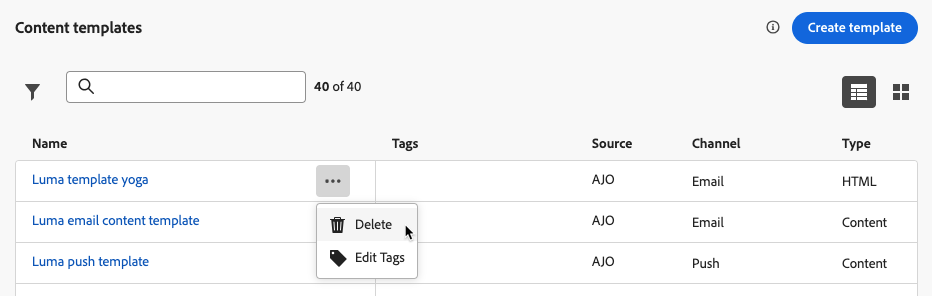

# 콘텐츠 템플릿 작업 {#content-templates}

디자인 프로세스를 가속화하고 개선하기 위해 독립 실행형 템플릿을 만들어 사용자 지정 콘텐츠를 여러 곳에서 쉽게 재사용할 수 있습니다 [!DNL Journey Optimizer] 캠페인 및 여정.

이 기능을 사용하면 콘텐츠 중심의 사용자가 캠페인이나 여정 외부의 템플릿에서 작업할 수 있습니다. 그런 다음 마케팅 사용자는 이러한 독립 실행형 콘텐츠 템플릿을 자체 여정 또는 캠페인 내에서 재사용하고 조정할 수 있습니다.

<!---->

>[!NOTE]
>
>현재 웹 채널에는 콘텐츠 템플릿을 사용할 수 없습니다.

예를 들어 회사 내의 사용자는 콘텐츠만 담당하므로 캠페인이나 여정에 액세스할 수 없습니다. 그러나 이 사용자는 조직의 마케터가 모든 이메일에서 시작점으로 사용하기 위해 선택할 수 있는 이메일 템플릿을 만들 수 있습니다.

API를 사용하여 콘텐츠 템플릿을 만들고 관리할 수도 있습니다. 자세한 내용은 [Journey Optimizer API 설명서](https://developer.adobe.com/journey-optimizer-apis/references/content/){target="_blank"}.

➡️ [이 비디오에서 템플릿을 만들고 사용하는 방법을 알아봅니다.](#video-templates)

>[!CAUTION]
>
>콘텐츠 템플릿을 작성, 편집 및 삭제하려면 **[!DNL Manage library items]** 에 포함된 권한 **[!DNL Content Library Manager]** 제품 프로필. [자세히 알아보기](../administration/ootb-product-profiles.md#content-library-manager)

## 템플릿 액세스 및 관리 {#access-manage-templates}

콘텐츠 템플릿 목록에 액세스하려면 다음을 선택합니다. **[!UICONTROL 콘텐츠 관리]** > **[!UICONTROL 콘텐츠 템플릿]** 왼쪽 메뉴에서

현재 샌드박스에서 만든 모든 템플릿(여정 또는 을 사용하는 캠페인) **[!UICONTROL 템플릿으로 저장]** 다음 중 하나의 선택 사항: **[!UICONTROL 콘텐츠 템플릿]** 메뉴 - 가 표시됩니다. [템플릿을 만드는 방법 알아보기](#create-content-templates)

다음과 같은 방법으로 콘텐츠 템플릿을 정렬할 수 있습니다.
* 유형
* 채널
* 생성 또는 수정 날짜
* 태그 - [태그에 대해 자세히 알아보기](../start/search-filter-categorize.md#tags)

직접 만들거나 수정한 항목만 표시하도록 선택할 수도 있습니다.

* 템플릿 컨텐츠를 편집하려면 목록에서 원하는 항목을 클릭하고 다음을 선택합니다 **[!UICONTROL 콘텐츠 편집]**.

  

* 템플릿을 삭제하려면 **[!UICONTROL 추가 작업]** 원하는 템플릿 옆에 있는 버튼을 선택하고 **[!UICONTROL 삭제]**.

  

>[!NOTE]
>
>템플릿을 편집하거나 삭제할 때 이 템플릿을 사용하여 만든 콘텐츠가 포함된 캠페인 또는 여정은 영향을 받지 않습니다.

### 템플릿을 썸네일로 표시 {#template-thumbnails}

다음 항목 선택 **[!UICONTROL 격자 보기]** 각 템플릿을 썸네일로 표시하는 모드.

>[!AVAILABILITY]
>
>이 기능은 소규모 고객을 위해 LA(Limited Availability)에서 출시됩니다.

>[!NOTE]
>
>현재 HTML 유형 이메일 콘텐츠 템플릿에 대해서만 적절한 썸네일을 생성할 수 있습니다.

콘텐츠를 업데이트할 때 변경 사항이 썸네일에 반영되기 전에 몇 초 정도 기다려야 할 수 있습니다.

## 콘텐츠 템플릿 만들기 {#create-content-templates}

>[!CONTEXTUALHELP]
>id="ajo_create_template"
>title="자신만의 콘텐츠 템플릿 정의"
>abstract="여러 여정과 캠페인 전반에서 콘텐츠를 재사용할 수 있도록 처음부터 독립형 사용자 정의 템플릿을 만듭니다."

다음 두 가지 방법으로 콘텐츠 템플릿을 만들 수 있습니다.

* 왼쪽 레일을 사용하여 처음부터 콘텐츠 템플릿 만들기 **[!UICONTROL 콘텐츠 템플릿]** 메뉴 아래의 제품에서 사용할 수 있습니다. [방법 알아보기](#create-template-from-scratch)

* 캠페인 또는 여정 내에서 콘텐츠를 디자인할 때 템플릿으로 저장합니다. [방법 알아보기](#save-as-template)

저장되면 콘텐츠 템플릿을 캠페인이나 여정에서 사용할 수 있습니다. 처음부터 만들거나 이전 콘텐츠에서 만들었든 이제 내에서 콘텐츠를 작성할 때 이 템플릿을 사용할 수 있습니다. [!DNL Journey Optimizer]. [방법 알아보기](#use-content-templates)

>[!NOTE]
>
>* 컨텐츠 템플릿에 대한 변경 사항은 라이브 또는 초안 여부에 관계없이 캠페인이나 여정에 전파되지 않습니다.
>
>* 마찬가지로 캠페인이나 여정에서 템플릿을 사용하는 경우 캠페인 및 여정 컨텐츠에 대한 편집 내용은 이전에 사용한 컨텐츠 템플릿에 영향을 주지 않습니다.

### 처음부터 템플릿 만들기 {#create-template-from-scratch}

처음부터 콘텐츠 템플릿을 만들려면 아래 단계를 수행하십시오.

1. 다음을 통해 콘텐츠 템플릿 목록에 액세스 **[!UICONTROL 콘텐츠 관리]** > **[!UICONTROL 콘텐츠 템플릿]** 왼쪽 메뉴.

1. 선택 **[!UICONTROL 템플릿 만들기]**.

1. 템플릿 세부 정보를 입력하고 원하는 채널을 선택합니다.

   

   >[!NOTE]
   >
   >현재 웹을 제외한 모든 채널을 사용할 수 있습니다.

1. 선택 **[!UICONTROL 유형]** 선택한 채널용입니다.

   

   * 대상 **[!UICONTROL 이메일]**&#x200B;을 선택하는 경우 **[!UICONTROL 콘텐츠]**, 다음을 정의할 수 있습니다. [제목 줄](../email/create-email.md#define-email-content) 을 템플릿의 일부로 사용하십시오. 다음을 선택하는 경우 **[!UICONTROL HTML]**, 이메일 본문의 콘텐츠만 정의할 수 있습니다.

   * 대상 **[!UICONTROL SMS]**, **[!UICONTROL 푸시]**, **[!UICONTROL 인앱]** 및 **[!UICONTROL 다이렉트 메일]**&#x200B;현재 채널에는 기본 유형만 사용할 수 있습니다. 그래도 선택해야 합니다.

1. 에서 Adobe Experience Platform 태그를 선택하거나 만듭니다. **[!UICONTROL 태그]** 검색을 개선하기 위해 템플릿을 분류하는 필드입니다. [자세히 알아보기](../start/search-filter-categorize.md#tags)

1. 사용자 지정 또는 핵심 데이터 사용 레이블을 템플릿에 할당하려면 다음을 선택할 수 있습니다. **[!UICONTROL 액세스 관리]**. [OLAC(Object Level Access Control)에 대해 자세히 알아보기](../administration/object-based-access.md).

1. 클릭 **[!UICONTROL 만들기]** 선택한 채널에 따라 여정 또는 캠페인 내의 모든 콘텐츠에 대해 수행하는 것과 동일한 방식으로 콘텐츠를 디자인할 수 있습니다.

   

   다음 섹션에서 다양한 채널에 대한 콘텐츠를 만드는 방법을 알아봅니다.
   * [이메일 콘텐츠 정의](../email/get-started-email-design.md)
   * [푸시 콘텐츠 정의](../push/design-push.md)
   * [SMS 콘텐츠 정의](../sms/create-sms.md#sms-content)
   * [DM 콘텐츠 정의](../direct-mail/create-direct-mail.md)
   * [인앱 콘텐츠 정의](../in-app/design-in-app.md)

1. 다음을 만드는 경우 **[!UICONTROL 이메일]** 이 있는 템플릿 **[!UICONTROL HTML]** 을 입력하면 콘텐츠를 테스트할 수 있습니다. [방법 알아보기](#test-template)

1. 템플릿이 준비되면 **[!UICONTROL 저장]**.

1. 템플릿 이름 옆에 있는 화살표를 클릭하여 로 돌아갑니다. **[!UICONTROL 세부 사항]** 화면.

   

이제 이 템플릿을 사용하여 내에서 콘텐츠를 작성할 수 있습니다. [!DNL Journey Optimizer]. [방법 알아보기](#use-content-templates)

### 템플릿으로 저장 {#save-as-template}

>[!CONTEXTUALHELP]
>id="ajo_messages_depecrated_inventory"
>title="메시지를 마이그레이션하는 방법에 대해 알아보기"
>abstract="2022년 7월 25일 메시지 메뉴가 사라졌고 이제 여정에서 직접 메시지를 작성합니다. 여정에서 기존 메시지를 재사용하려면 템플릿으로 저장해야 합니다."

캠페인이나 여정에서 콘텐츠를 디자인할 때 나중에 다시 사용할 수 있도록 저장할 수 있습니다. 이렇게 하려면 아래 단계를 수행합니다.

1. 메시지에서 **[!UICONTROL 콘텐츠 편집]** 화면에서 **[!UICONTROL 콘텐츠 템플릿]** 단추를 클릭합니다.

1. 선택 **[!UICONTROL 콘텐츠 템플릿으로 저장]** 드롭다운 메뉴에서 을(를) 선택합니다.

   

   다음에 있는 경우 [이메일 디자이너](../email/get-started-email-design.md)에서 이 옵션을 선택할 수도 있습니다. **[!UICONTROL 자세히]** 화면 오른쪽 위의 드롭다운 목록입니다.

   

1. 이 템플릿의 이름과 설명을 추가합니다.

   

   >[!NOTE]
   >
   >현재 채널 및 유형은 자동으로 채워지며 편집할 수 없습니다. 에서 만든 이메일 템플릿 [이메일 디자이너](../email/get-started-email-design.md), **[!UICONTROL HTML]** 유형이 자동으로 선택됩니다.

1. 에서 Adobe Experience Platform 태그를 선택하거나 만듭니다. **태그** 템플릿을 분류할 필드입니다. [자세히 알아보기](../start/search-filter-categorize.md#tags)

1. 사용자 지정 또는 핵심 데이터 사용 레이블을 템플릿에 할당하려면 다음을 선택할 수 있습니다. **[!UICONTROL 액세스 관리]**. [자세히 알아보기](../administration/object-based-access.md).

1. **[!UICONTROL 저장]**&#x200B;을 클릭합니다.

1. 템플릿이 **[!UICONTROL 콘텐츠 템플릿]** 목록, 액세스 가능 [!DNL Journey Optimizer] 전용 메뉴. 이 템플릿은 목록에 있는 다른 항목으로 액세스, 편집 및 삭제할 수 있는 독립 실행형 콘텐츠 템플릿이 됩니다. [자세히 알아보기](#access-manage-templates)

이제 내에서 콘텐츠를 작성할 때 이 템플릿을 사용할 수 있습니다. [!DNL Journey Optimizer]. [방법 알아보기](#use-content-templates)

>[!NOTE]
>
>새 템플릿에 대한 변경 사항은 원래 콘텐츠에는 전파되지 않습니다. 마찬가지로 원본 컨텐츠가 해당 컨텐츠 내에서 편집되는 경우 새 템플릿은 수정되지 않습니다.

## 이메일 콘텐츠 템플릿 테스트 {#test-template}

처음부터 만들거나 기존 콘텐츠에서 만든 일부 이메일 템플릿의 렌더링을 테스트할 수 있습니다. 그 방법은 다음과 같습니다.

1. 다음을 통해 콘텐츠 템플릿 목록에 액세스 **[!UICONTROL 콘텐츠 관리]** > **[!UICONTROL 콘텐츠 템플릿]** 을(를) 메뉴에서 선택하고 이메일 템플릿을 선택합니다.

1. 클릭 **[!UICONTROL 콘텐츠 편집]** 다음에서 **[!UICONTROL 템플릿 속성]**.

1. 클릭 **[!UICONTROL 콘텐츠 시뮬레이션]** 그리고 테스트 프로필을 선택하여 렌더링을 확인합니다. [자세히 알아보기](../content-management/preview-test.md)

   

1. 여정 또는 캠페인에서 사용하기 전에 증명을 전송하여 콘텐츠를 테스트하고 일부 내부 사용자에 의해 승인받을 수 있습니다.

   * 이렇게 하려면 **[!UICONTROL 증명 보내기]** 버튼을 누르고 다음에 설명된 단계를 따릅니다. [이 섹션](../content-management/proofs.md).

   * 증명을 보내기 전에 [이메일 표면](../configuration/channel-surfaces.md) 콘텐츠를 테스트하는 데 사용됩니다.

     

>[!CAUTION]
>
>현재 추적은 이메일 콘텐츠 템플릿을 테스트할 때 지원되지 않습니다. 즉, 이벤트, UTM 매개 변수 및 랜딩 페이지 링크를 추적하는 것은 템플릿에서 전송되는 증명에서 효과적이지 않습니다. 추적을 테스트하려면 [콘텐츠 템플릿 사용](../email/use-email-templates.md) 이메일 및 [증명 보내기](../content-management/preview-test.md#send-proofs).

## 콘텐츠 템플릿 사용 {#use-content-templates}

에서 모든 채널(웹 제외)에 대한 콘텐츠를 만들 때 [!DNL Journey Optimizer], 다음 중 하나의 사용자 지정 템플릿을 사용할 수 있습니다.

* 을 사용하여 처음부터 제작 **[!UICONTROL 콘텐츠 템플릿]** 메뉴 아래의 제품에서 사용할 수 있습니다. [자세히 알아보기](#create-template-from-scratch)

* 를 사용하여 여정 또는 캠페인의 기존 콘텐츠에서 저장됨 **[!UICONTROL 콘텐츠 템플릿으로 저장]** 옵션을 선택합니다. [자세히 알아보기](#save-as-template)

이러한 템플릿 중 하나를 사용하여 콘텐츠 작성을 시작하려면 아래 단계를 따르십시오.

1. 캠페인 또는 여정 중 선택 후 **[!UICONTROL 콘텐츠 편집]**&#x200B;를 클릭하고 **[!UICONTROL 콘텐츠 템플릿]** 단추를 클릭합니다.

1. 선택 **[!UICONTROL 콘텐츠 템플릿 적용]**.

   

1. 목록에서 원하는 템플릿을 선택합니다. 선택한 채널 및/또는 유형과 호환되는 템플릿만 표시됩니다.

   

   >[!NOTE]
   >
   >이 화면에서 새 탭을 여는 전용 버튼을 사용하여 새 템플릿을 만들 수도 있습니다.

1. 클릭 **[!UICONTROL 확인]**. 템플릿이 콘텐츠에 적용됩니다.

1. 원하는 대로 콘텐츠를 계속 편집합니다.

>[!NOTE]
>
>을(를) 사용하여 콘텐츠 템플릿에서 이메일 디자인을 시작하려면 [이메일 디자이너](../email/get-started-email-design.md)에 설명된 단계를 따릅니다 [이 섹션](../email/use-email-templates.md).

## 방법 비디오 {#video-templates}

에서 콘텐츠 템플릿을 만들고 편집하고 사용하는 방법에 대해 알아봅니다. [!DNL Journey Optimizer].

>[!VIDEO](https://video.tv.adobe.com/v/3413743/?quality=12)
