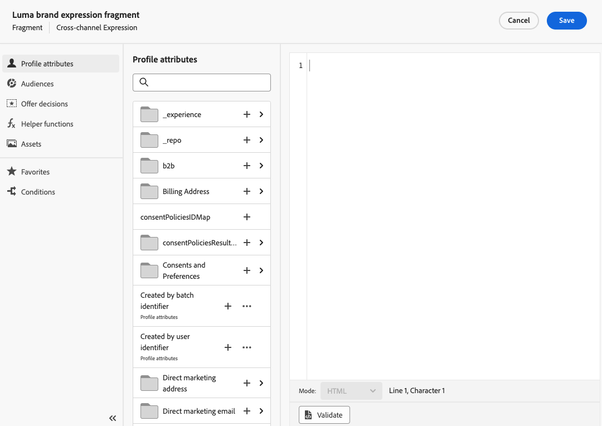

# 처음부터 조각 만들기 {#create-fragments}

>[!CONTEXTUALHELP]
>id="ajo_create_visual_fragment"
>title="시각적 유형 선택"
>abstract="독립 실행형 시각적 조각을 만들어 여정 또는 캠페인 내의 이메일이나 콘텐츠 템플릿에서 콘텐츠를 재사용할 수 있도록 합니다."
>additional-url="https://experienceleague.adobe.com/docs/journey-optimizer/using/email/design-email/add-content/use-visual-fragments.html" text="이메일에 시각적 조각 추가"

>[!CONTEXTUALHELP]
>id="ajo_create_expression_fragment"
>title="표현식 유형 선택"
>abstract="독립 실행형 표현식 조각을 만들어 여러 여정 및 캠페인에서 콘텐츠를 재사용할 수 있도록 합니다. 개인화 편집기를 사용할 때 현재 샌드박스에서 만든 모든 표현식 조각을 활용할 수 있습니다."
>additional-url="https://experienceleague.adobe.com/docs/journey-optimizer/using/content-management/personalization/expression-editor/use-expression-fragments.html" text="표현식 조각 활용"

조각은 **[!UICONTROL 조각]** 왼쪽 메뉴. 또한 콘텐츠를 디자인할 때 기존 콘텐츠의 일부를 조각으로 저장할 수도 있습니다. [방법 알아보기](#save-as-fragment)

저장되면 여정, 캠페인 또는 템플릿에서 조각을 사용할 수 있습니다. 이제 내에서 콘텐츠를 작성할 때 이 조각을 사용할 수 있습니다. [!DNL Journey Optimizer]. 다음을 참조하십시오 [시각적 조각 추가](../email/use-visual-fragments.md) 및 [표현식 조각 활용](../personalization/use-expression-fragments.md)

조각을 처음부터 만들려면 아래 단계를 수행합니다.

1. [조각 목록 액세스](#access-manage-fragments) 다음을 통해 **[!UICONTROL 콘텐츠 관리]** > **[!UICONTROL 조각]** 왼쪽 메뉴.

1. 선택 **[!UICONTROL 조각 만들기]**.

1. 조각 세부 사항, 즉 이름 및 설명(필요한 경우)을 입력합니다.

   

1. 에서 Adobe Experience Platform 태그를 선택하거나 만듭니다. **[!UICONTROL 태그]** 개선된 검색을 위해 조각을 분류할 필드입니다. [자세히 알아보기](../start/search-filter-categorize.md#tags)

1. 조각 유형을 선택합니다. [시각적 조각](#create-visual-fragment) 또는 [표현식 조각](#create-expression-fragment).

   >[!NOTE]
   >
   >현재 시각적 조각에만 해당 **이메일** 채널이 지원됩니다.

1. 표현식 조각을 만드는 경우 사용할 코드 유형을 선택합니다. **[!UICONTROL HTML]**, **[!UICONTROL JSON]** 또는 **[!UICONTROL 텍스트]**.

   

1. 조각에 사용자 지정 또는 핵심 데이터 사용 레이블을 할당하려면 다음을 선택합니다. **[!UICONTROL 액세스 관리]**. [OLAC(Object Level Access Control)에 대해 자세히 알아보기](../administration/object-based-access.md).

1. **[!UICONTROL 만들기]**&#x200B;를 클릭합니다.

1. 다음 [이메일 디자이너](../email/get-started-email-design.md) 또는 만들고 있는 조각 유형에 따라 개인화 편집기가 열립니다.

   * 시각적 조각의 경우 여정 또는 캠페인 내의 이메일에 대해 수행하는 것과 동일한 방식으로 콘텐츠를 필요에 따라 편집합니다.

     >[!NOTE]
     >
     >개인화 필드 및 다이내믹 콘텐츠를 추가할 수 있지만 컨텍스트 속성은 조각에서 지원되지 않습니다.

     

   * 표현식 조각의 경우 [!DNL Journey Optimizer] 조각 콘텐츠를 작성할 수 있는 모든 개인화 및 작성 기능이 있는 개인화 편집기. [자세히 알아보기](../personalization/personalization-build-expressions.md)

     

1. 조각이 준비되면 **[!UICONTROL 저장]**.

조각이에 추가됩니다. [조각 목록](#access-manage-fragments). 이제 내에서 콘텐츠를 작성할 때 사용할 준비가 되었습니다. [!DNL Journey Optimizer] 이메일 디자이너 또는 개인화 편집기.

* [시각적 조각 사용 방법 알아보기](../email/use-visual-fragments.md)
* [표현식 조각 사용 방법 알아보기](../personalization/use-expression-fragments.md)
